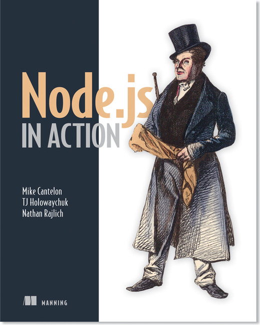

<!-- {"layout": "title"} -->
# Laboratório de **Programação** Web
## Plano de Ensino por **Flávio Coutinho** e **Daniel Hasan**

---
<!-- {"layout": "section-header"} -->
# Plano de Ensino

## Sumário do conteúdo

[Slides](#slides)
  ~ Conteúdo das aulas em _slides_

[Ementa](#ementa)
  ~ Objetivo e a descrição da matéria

[Bibliografia](#bibliografia)
  ~ Livros e materiais básicos e complementares

[Avaliação](#avaliacao)
  ~ O formato e os itens de distribuição dos pontos
  
<!-- {dl:.content} -->

---
<!-- {"slideHash": "slides"} -->
# Aulas (página 1)

- [História da Web](classes/intro/) (25/02/2016)
- [HTML 1 - Linguagem](classes/html1/) (01/03/2016)
- [HTML 2 - Imagens e Plantas Carnívoras (Prática)](classes/html2/) (03/03/2016)
- [HTML 3 - Multimídia](classes/html3/) (08/03/2016)
- [CSS 1 - Seletores e Ninjas (Prática)](classes/css1/) (10/03/2016)
- [CSS 2 - Especificidade](classes/css2/) (15/03/2016)
- [HTML 4 - Box Model e Unicórnios (Prática)](classes/html4/) (20/03/2016)
- [Javascript 1 - Linguagem](classes/js1/) (22/03/2016)

---
# Aulas (página 2)

- [CSS 3 - _Layout_](classes/css3/) (29/03/2016)
- [CSS 4 - _Layout_ e o Coral 55 (Prática)](classes/css4/) (31/03/2016)
- [Javascript 5 - APIs do HTML5](classes/js5/) (05/05/2016)
- [Javascript 2 - DOM, Eventos e RPG (Prática)](classes/js2/) (07/04/2016)
- [Javascript 3 - Padrões de Projeto](classes/js3/) (12/04/2016)
- [Javascript 4 - JSON e AJAX (Prática)](classes/js4/) (14/05/2016)
- Palestra do ~~Profissional da Indústria~~ Pedro Colen: Git (19/04/2016)
- [HTML 5 - Formulários e Monstros (Prática)](classes/html5/) (26/04/2016)

---
# Aulas (página 3)

- [Node.js 1 - Servidores Web](classes/ssn1/) (03/05/2016)
- [Node.js 2 - NPM, arquivos e _learnyounode_ (Prática)](classes/ssn2/)
  (05/05/2016)
- [Node.js 3 - Express](classes/ssn3/) (10/05/2016)
- [Node.js 4 - HTML Dinâmico e o Geiser (Prática)](classes/ssn4/) (12/05/2016)
- [Node.js 5 - Sessão e Biscoitos](classes/ssn5/) (17/05/2016)
- [Node.js 6 - Bancos de Dados e Zumbis (Prática)](classes/ssn6/) (19/05/2016)
- [Node.js 7 - REST APIs](classes/ssn7/) (24/05/2016)
- [CSS 6 - _Responsive Design_](classes/css6/) (31/05/2016)
- [CSS 5 - Animações e _Edukids Animals_ (Prática)](classes/css5/) (02/06/2015)
- [Javascript 7 - EcmaScript 6](classes/js7/) (07/06/2016)

---
# Aulas (página 4)

- [Server-side Node.js - Parte 8 (Prática WebSockets)](classes/ssn8/) (18/06/2015)

---
<!--
{
  "slideHash": "ementa",
  "layout": "section-header"
}
-->
# Ementa

## Objetivos

1. Criar páginas **HTML com uso de CSS e Javascript**
1. Desenvolver **sistemas web dinâmicos** com banco de dados e Node.js
1. Fazer trabalhos práticos legais
1. Tornar-se um **ninja** Javascript

<!-- {ol:.content} -->

---
<!--
{
  "slideHash": "bibliografia",
  "layout": "section-header"
}
-->
# Bibliografia

## Os textos e materiais que vamos usar

Veja a bibliografia básica e a complementar.

<!-- {p:.content} -->
---
<!-- { "styles": ["../styles/classes/books.min.css"] } -->
## **Livro texto** da parte 1

::: figure .book
-  <!-- {.full-width.full-height} -->
- .
<!-- {ul:.hardcover_front} -->
- .
- [Sobre](http://headfirstlabs.com/books/hfhtml/) <!-- {a:.book-btn target="_blank"} -->
- .
- .
- .
<!-- {ul:.page} -->
- .
- .
<!-- {ul:.hardcover_back} -->
- .
- .
<!-- {ul:.book_spine} -->
:::

**Título**
	 ~ Head First HTML and CSS, Second Edition

**Autores**
	 ~ Elisabeth Robson, ~~Gordon~~ Eric Freeman

**Editora**
   ~ O'Reilly Media, 2012

---
## **Livro texto** da parte 2

::: figure .book
-  <!-- {.full-width.full-height} -->
- .
<!-- {ul:.hardcover_front} -->
- .
- [Sobre](https://www.manning.com/books/node-js-in-action) <!-- {a:.book-btn target="_blank"} -->
- .
- .
- .
<!-- {ul:.page} -->
- .
- .
<!-- {ul:.hardcover_back} -->
- .
- .
<!-- {ul:.book_spine} -->
:::

**Título**
  ~ Node.js in Action, First Edition

**Autores**
  ~ Mike Cantelon, Marc Harter, T.J. Holowaychuk, Nathan Rajlich

**Editora**
  ~ Manning

---
# Bibliografia Complementar

---
## Dive into HTML5

  
  

- [Online](http://diveintohtml5.com.br/), gratuito

---
## JavaScript: The Good Parts

  
  

- **Título**	JavaScript, the Good Parts, First Edition
- **Autor**	Douglas Crockford
- **Editora** O'Reilly Media, 2008

---
## Head First HTML5 Programming

  
  

- **Título**	Head First HTML5 Programming
- **Autores**	~~Gordon~~ Eric Freeman, Elisabeth Robson
- **Editora** O'Reilly Media, 2011

---
<!--
{
  "slideHash": "avaliacao",
  "layout": "section-header"
}
-->
# Avaliação

## Esta é a distribuição de pontos por bimestre

- ~10 Atividades práticas: **20** pontos
- Questionários marotos: **10** pontos
- 1 Prova Final: **15** pontos
- 1 Seminário: **15** pontos
- Projeto Prático: **15** pontos

<!-- {ul:.content} -->

---
# Prova (15 pontos)

- Prova (15 pontos) - data: <abbr title="To be defined">TBD</abbr> (ao final)
- Exame especial (100 pontos) - data: <abbr title="To be defined">TBD</abbr>

---
# Trabalhos (55 pontos)

- [TP0: Git][tp0] (3 pontos, data: 01/03/2015 10:40)
- Seminário: APIs HTML5  (15 pontos, data: TBD)
- Projeto: (40 pontos em 2 entregas, data TBD)

[tp0]: assignments/tp0
