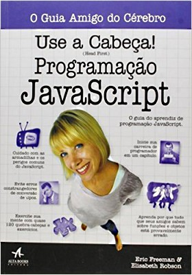

<!-- {"layout": "title"} -->
# Laboratório de **Programação** Web
## Plano de Ensino por **Flávio Coutinho** e **Daniel Hasan**

---
<!-- {"layout": "section-header"} -->
# Plano de Ensino

## Sumário do conteúdo

[Slides](#slides)
  ~ Conteúdo das aulas em _slides_

[Ementa](#ementa)
  ~ Objetivo e a descrição da matéria

[Bibliografia](#bibliografia)
  ~ Livros e materiais básicos e complementares

[Avaliação](#avaliacao)
  ~ O formato e os itens de distribuição dos pontos

<!-- {dl:.content} -->

---
<!-- {"slideHash": "slides", "layout": "regular"} -->
# Aulas

- [Introdução à Programação Web](classes/intro/)
- [HTML parte 1](classes/html1/) - Plantas Carnívoras, Ingredientes do HTML
  (_tags_) e Temperando com CSS
- [HTML parte 2](classes/html2/) - Coding Dojo :japanese_castle:, Mais _tags_
  HTML e Entendendo regras CSS
- [HTML parte 3](classes/html3/) - Tabelas, Tesouros :crown: e Piratas
- [CSS parte 1](classes/css1/) - Seletores de classe, Flutuação e
  Abelhas :honeybee:
- [CSS parte 2](classes/css2/) - História, a Cascata e outros Seletores,
  Ferramentas e Ninjas :dash:

---
<!-- {"layout": "regular"} -->
# Aulas (página 2)

- [HTML parte 4](classes/html4/) - Div/Span, Box Model, Float e Desafios
- [CSS parte 3](classes/css3/) - Layout, Fontes, Multimídia e Unicórnios 🦄
- [HTML parte 5](classes/html5/) - Divitite e as _Tags_ Semânticas, display,
  pseudo-coisas e Assombrações :ghost:
- [CSS parte 4](classes/css4/) - Posicionamento e mais
  Assombrações :heavy_plus_sign::ghost:

<!--
- [HTML 4 - Box Model e Unicórnios (Prática)](classes/html4/) (20/03/2016)
- [Javascript 1 - Linguagem](classes/js1/) (22/03/2016)
- [Javascript 5 - APIs do HTML5](classes/js5/) (05/05/2016)
- [Javascript 2 - DOM, Eventos e RPG (Prática)](classes/js2/) (07/04/2016)
- [Javascript 3 - Padrões de Projeto](classes/js3/) (12/04/2016)
- [Javascript 4 - JSON e AJAX (Prática)](classes/js4/) (14/05/2016)
- Palestra do ~~Profissional da Indústria~~ Pedro Colen: Git (19/04/2016)

# Aulas (página 3)

- [CSS 6 - _Responsive Design_](classes/css6/) (31/05/2016)
- [CSS 5 - Animações e _Edukids Animals_ (Prática)](classes/css5/) (02/06/2015)
- [Javascript 7 - EcmaScript 6](classes/js7/) (07/06/2016)

-->

---
<!--
{
  "slideHash": "ementa",
  "layout": "section-header"
}
-->
# Ementa

## Objetivos

1. **Criar páginas web** _estáticas_ com HTML, CSS e JavaScript
1. Criar páginas seguindo **requisitos de *layout*** diversos
1. Criar **páginas web interativas** usando JavaScript
1. **Integrar páginas** web estáticas com servidores **via AJAX**
1. Tornar-se um **ninja** Javascript

<!-- {ol:.content} -->

---
<!--
{
  "slideHash": "bibliografia",
  "layout": "section-header"
}
-->
# Bibliografia

## Os textos e materiais que vamos usar

Veja a bibliografia básica e a complementar.

<!-- {p:.content} -->
---
<!-- { "styles": ["styles/classes/books.min.css"] } -->
## **Livro texto** sobre HTML e CSS

::: figure .book
-  <!-- {.full-width.full-height} -->
- .
<!-- {ul:.hardcover_front} -->
- .
- [Sobre](http://www.altabooks.com.br/use-a-cabeca-html-e-css.html) <!-- {a:.book-btn target="_blank"} -->
- .
- .
- .
<!-- {ul:.page} -->
- .
- .
<!-- {ul:.hardcover_back} -->
- .
- .
<!-- {ul:.book_spine} -->
:::

**Título**
	 ~ Use a Cabeça HTML e CSS, 2ª edição (traduzida)

**Autores**
	 ~ Elisabeth Robson, Eric Freeman

**Editora**
   ~ O'Reilly Media, 2015 (tradução)

---
## **Livro texto** sobre JavaScript

::: figure .book
-  <!-- {.full-width.full-height} -->
- .
<!-- {ul:.hardcover_front} -->
- .
- [Sobre](http://www.altabooks.com.br/use-a-cabeca-programacao-javascript.html) <!-- {a:.book-btn target="_blank"} -->
- .
- .
- .
<!-- {ul:.page} -->
- .
- .
<!-- {ul:.hardcover_back} -->
- .
- .
<!-- {ul:.book_spine} -->
:::

**Título**
  ~ Use a Cabeça: Programação JavaScript, 1ª edição

**Autor**
  ~ Eric Freeman

**Editora**
  ~ O'Reilly Media, 2016 (tradução)

---
## **Livro texto** sobre APIs do HTML5

::: figure .book
-  <!-- {.full-width.full-height} -->
- .
<!-- {ul:.hardcover_front} -->
- .
- [Sobre](http://www.altabooks.com.br/use-a-cabeca-programacao-em-html5.html) <!-- {a:.book-btn target="_blank"} -->
- .
- .
- .
<!-- {ul:.page} -->
- .
- .
<!-- {ul:.hardcover_back} -->
- .
- .
<!-- {ul:.book_spine} -->
:::

**Título**
  ~ Use a Cabeça: Programação em HTML5, 1ª edição

**Autor**
  ~ Eric Freeman

**Editora**
  ~ O'Reilly Media, 2014 (tradução)

---
# Bibliografia Complementar

---
## Mergulhe no HTML5

  
  

- [Online](http://diveintohtml5.com.br/), gratuito

---
## JavaScript: The Good Parts

  
  

- **Título**	JavaScript, the Good Parts, First Edition
- **Autor**	Douglas Crockford
- **Editora** O'Reilly Media, 2008

---
<!--
{
  "slideHash": "avaliacao",
  "layout": "section-header"
}
-->
# Avaliação

## Distribuição de pontos (aproximada) por bimestre

- ~08 Atividades práticas: **80%** da nota
- 01 Prova: **20%** pontos

<!-- {ul:.content} -->
