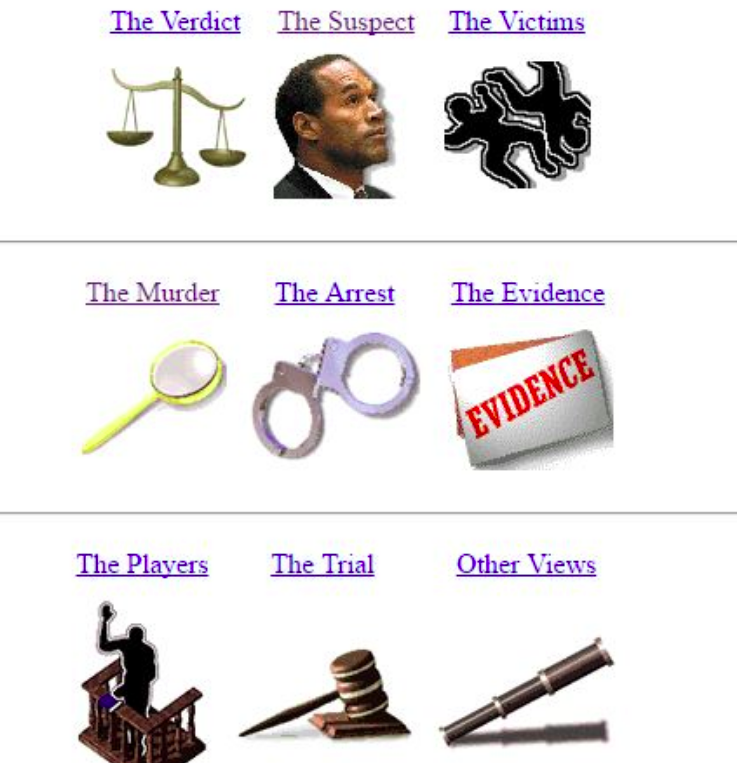
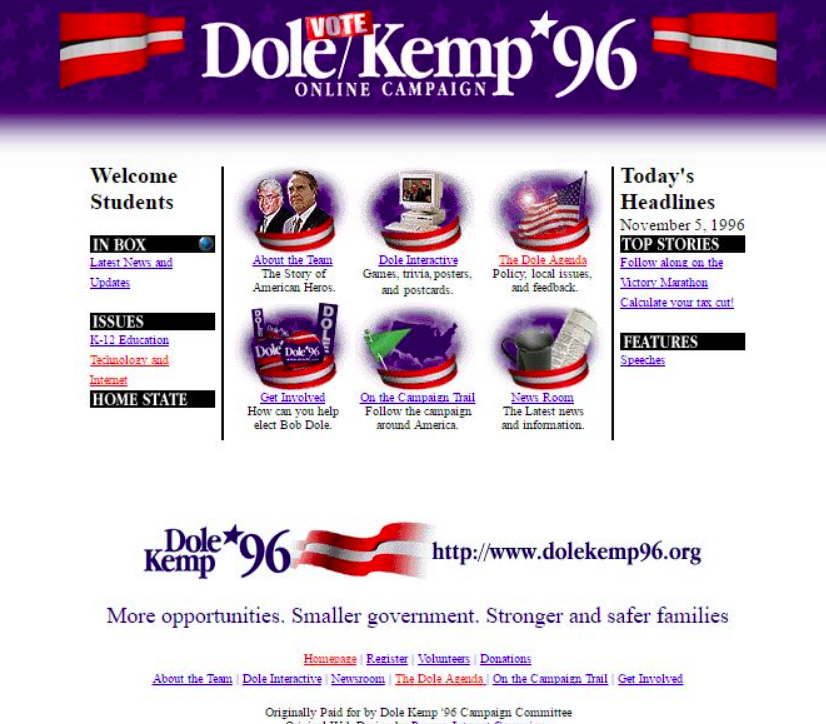

Nos primórdios da Web, os designs eram bem ruins:

O que faziam "de errado"? Bom, hoje evitamos:

- Usar cores demais.
- Usar imagens de fundo indiscriminadamente. Hoje devemos usar com parcimônia (de preferência sem repetição).
- Usar as fontes padrão (ex: Arial, Times New Roman etc.). Hoje se elas aparecem o usuário sente que houve desleixo do programador.
- A estilização padrão dos hiperlinks (sublinhado com cor azul ou roxo, depois de visitado). O sublinhado pode ficar charmoso apenas em :hover.
- Usar degradês muito extravagentes.
- Usar layouts simples de 1 única coluna.
- Não separar visualmente os "ambientes" (cabeçalho, miolo, rodapé etc.). - - Hoje em dia é bom que sejam bem distintos.
- Usar bordas muito grossas. Elas devem ser sutis (1px? Máximo 2px em geral).
- Arredondar demais as bordas, especialmente se o elemento for retangular. Isso distorce. Se quiser arrendondar, que seja circular ou que seja apenas os cantinhos (ex: máximo 5-10px).
- Não usar imagens. Hoje elas são essenciais para compor o design de sites. Tanto imagens de conteúdo (isto é, ), quanto de fundo.
- Não pensar sobre o "espaço vazio". É muito importante planejarmos os espaços que possuem coisas e aqueles que não possuem. Não pode ter tudo "agarrado". Devemos pensar bem nas distâncias entre as coisas.

Alguns exemplos de bons designs de hoje em dia:
- [Batoka Safaris](https://www.batokasafaris.com/)
- [Revista Woven](https://wovenmagazine.com/)
- [A List Apart](https://alistapart.com/)
- [ArtStation](https://www.artstation.com/)
- [Loja Nowness](https://www.nowness.com/)
- [Steam](https://store.steampowered.com/)

## Layout ou Design? 
São coisas diferentes. Layout envolve mais a posição e tamanho das coisas que aparecem em uma página. Design já envolve aspectos estéticos como cores, fontes, imagens, degradês.

Mas a linha entre layout e design não é sempre fácil de traçar.

## Layouts simples vs bacanas...
Exemplos de layouts simples (famigerados layouts de 1 coluna apenas):

- Página das ovelhas (só repete título + imagem flutuando + parágrafo descrevendo)
- Página das plantas carnívoras (idem)
- Página dos ninjas (idem)
- Página das abelhas (idem)

Exemplos de médios:

- Página dos unicórnios (tem um cabeçalho, barra lateral)

Exemplos de bons layouts:

- Página do assombrado (cabeçalho, rodapé, miolo e barra lateral)
- Página do coral (idem)
- Site do CEFET-MG
- [Algumas ideias de layout](https://colibriwp.com/blog/website-layout-design-ideas/)
- Independente da escolha, em telas um pouco maiores ou menores não podem surgir barras de rolagem horizontal (péssima experiência de usuário)