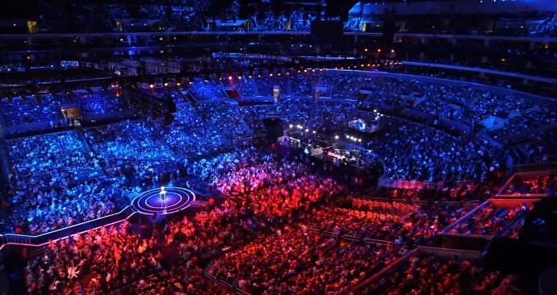
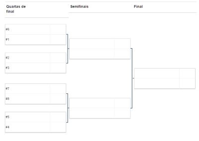

# Projeto - _e-Sports Championship Manager_

Como um religioso consumidor de jogos digitais multijogador _online_
competitivos, você se cansou de usar planilhinhas eletrônicas para
inscrever os participantes em campeonatos, sortear as partidas e
registrar os resultados.

Você acordou um dia extremamente empolgado e decidiu unir essa demanda
dos jogadores de _e-sports_ aos seus conhecimentos _web_, que adquiriu em um
curso por correspondência, para criar um sistemão para gerenciar campeonatos.

Reunindo um grupo de amigos jogadores de Dota/LoL, foi possível reunir o
seguinte conjunto de requisitos mínimos:

1. **Usuários** organizadores de campeonatos podem se registrar e logar
  - Pede-se ao menos os campos "nome de usuário" e "senha"/"confirmação"
1. Cada usuário pode criar um ou mais **campeonatos**
  - Campeonatos são criados com um nome e um conjunto de nomes de participantes
  - Campeonatos possuem partidas e funcionam como "mata-mata"
  - Apenas o usuário criador do campeonato pode alterá-lo
  - Qualquer usuário, mesmo sem estar logado, pode acessar um campeonato mas
    não pode editá-lo
1. As **partidas** são sorteadas aleatoriamente quando o campeonato é criado
  - Com as partidas montadas, passa a ser possível registrar a pontuação
    dos times
  - Quando uma partida tem sua pontuação registrada, o campeonato evolui:
    perdedores são eliminados e vencedores passam a integrar as partidas
    da fase seguinte
1. Campeonatos podem ser criados com número de participantes igual a
    uma potência de 2. Por exemplo:

| Participantes | Níveis de Partida | Qtde de Jogos |
|:-------------:|:-----------------:|:-------------:|
| 2             | 1                 | 1             |
| 4             | 2                 | 3             |
| 8             | 3                 | 7             |
| ...           | ...               | ...           |
| `n`           | `log_2(n)`        | `n - 1`       |

O sistema deve ter pelo menos algumas páginas listadas a seguir:
- **Inicial**, contendo:
  - descrição do sistema,
  - botão para registrar/logar,
  - imagem(ns) de eventos de e-sports,
  - logomarca,
  - lista com uma visão resumida dos 3 campeonatos mais recentes,
- De **registro/login** de usuário, com:
  - fluxo de sucesso (registro/login),
  - fluxos alternativos de senha incorreta e usuário inexistente,
  - redirecionamento para a lista de campeonatos do usuário,
- **Lista de campeonatos** do usuário, mostrando:
  - forma resumida dos campeonatos do usuário (nome, # de participantes,
    % concluído, vencedor, se houver)
  - botão para criar um novo campeonato.
- **Novo campeonato**, com:
  - campos com as propriedades do novo campeonato.
- **Um campeonato**, mostrando:
  - todos os participantes (pode ser uma lista),
  - todas as partidas (pode ser uma tabela com colunas: "time 1", "time 2",
    "fase", "pontuação time 1", "pontuação time 2"),
  - as pontuações das partidas, caso já tenham ocorrido,
  - o estado do campeonato (e.g., uma barra com a porcentagem de conclusão
    das partidas),
  - caso seja um campeonato do usuário logado, formas para editá-lo.
- Página de **erro do servidor** (erros com códigos 4xx e 5xx)
  - uma mensagem bem humorada de desculpa.

Além dos requisitos funcionais descritos, os seguintes requisitos
não-funcionais também fazem parte da especificação:

1. Bom tempo de resposta com o **uso de AJAX** para pelo menos 1 chamada a dados
  do banco
1. Persistência em **banco de dados**
1. **_Layout_ e _design_ agradáveis** - não precisa ser profissional, mas
  também não pode ter carinha de site da década de 90
  - Você deve ser o autor dos estilos usados no site - não é permitido
    o reaproveitamento de estilos de outros sites como temas, _templates_ etc.
1. A tecnologia de _back-end_ usada deve ser a mesma vista na matéria
1. Alguma funcionalidade do HTML5 deve ser implementada, e ela deve ser a mesma
  funcionalidade escolhida apra o seminário

## Funcionalidades Opcionais

O que foi descrito anteriormente do trabalho equivale a uma pontuação de 70%.
Para chegar a 100% (ou a mais e ganhar uns pontinhos extras, até o limite de
120%), você deve implementar também um conjunto de outras funcionalidades,
a saber:

- Página do campeonato com **partidas no "formato de chaves"** no estilo
  copa do mundo **(até 8%)**. Ideias:
  - Posicionar elementos das partidas com `position: relative/absolute;`
  - Usar uma biblioteca para desenhos como `d3.js`, `raphael.js` etc.
    
- Atribuir **imagens aos participantes** dos campeonatos (_e.g._, as logos
  dos times) **(6%)**
- Usar um **_favicon_** **(3%)**
- Fazer as **páginas "responsivas"** **(até 5%)**
- **Animações e/ou transições** CSS **(até 4%)**
- **Remover a restrição** de número de participantes igual a uma
  potência de 2 **(7%)**
- Desenvolver no formato de **_Single Page Application_** usando **(até 12%)**
  algo como:
  - [Angular](http://angularjs.org/),
  - [React](https://facebook.github.io/react/),
  - [Backbone](http://backbone.org),
  - [Knockout](http://knockoutjs.com/), etc.
- Usar um **preprocessador CSS** **(até 5%)**
- Usar **_sprites_ CSS** para imagens pequenas **(até 4%)**
- Usar um serviço de **autenticação de terceiros** como Google, Facebook,
  Twitter, Github etc. **(até 8%)**
- Usar um **_task runner_** como Gulp, GruntJS, Broccoli etc. para:
  - "Minificar" os arquivos JS **(até 3%)**
  - "Minificar" os arquivos CSS **(até 3%)**
  - Reduzir tamanho de imagens **(até 3%)**
  - Outras coisas
- Usar um **carregador de módulos Javascript** AMD (RequireJS, YUI3),
  CommonJS (Browserify) ou ES6 **(até 8%)**
- Acesso aos dados do servidor exclusivamente por meio de um _web service_
  usando **arquitetura RESTful** **(até 7%)**

Você pode usar bibliotecas/_frameworks_ Javascript e CSS. Contudo, para usar as
listadas abaixo, você precisa pagar uns pontinhos:

- **jQuery** (-8%)
  - Plugin jQuery de terceiros (-2% cada)
- **Bootstrap/Foundation/Materialize** (e similares) (-8%)

## Entregas

O projeto será entregue em duas etapas, a saber:

1. Primeira entrega: _front-end_
  - Entregar: Páginas navegáveis, usando dados _mocked_
  - Data: daqui 16 dias (vide Moodle)
  - Pontuação: 15 pontos
1. Segunda entrega: _back-end_ + _front-end_
  - Entregar: código fonte final e _link_ para sistema publicado em
    servidor gratuito
  - Data: final do semestre (vide Moodle)
    - [Apresentação oral e demonstração](#apresentação)
  - Pontuação: 25 pontos (+extras)

## Apresentação

Devem ser entregues via Moodle:

- Link para o repositório com o código fonte da aplicação
- Link para o servidor onde a aplicação está hospedada
- Link para a apresentação de slides, se optar por ter uma
- Lista de itens opcionais implementados

**A apresentação** do trabalho deve ter, no máximo, 10 minutos e seguir este **roteiro**:

1. "Capa" com o nome do seu aplicativo e o grupo
1. Mostrar um diagrama com a arquitetura geral, contendo elementos como (1 min):
  - banco(s) de dados usados
  - como o banco de dados foi acessado (Mongoose? _driver do Mongo_?
    _web service_?)
  - tecnologias de _back-end_ usadas
  - tecnologias de _front-end_ usadas
1. Mostrar o arquivo `package.json` e comentar sobre os pacotes NPM usados (2 min)
1. Demonstrar a aplicação usando o servidor de hospedagem (7 min):
  - mostrar todos os itens obrigatórios implementados
  - mostrar os opcionais
1. Mostrar a lista de itens opcionais implementados

## Critérios de avaliação

O código do serviço Web será avaliado, dentre outros fatores, segundo:

1. **Esforço de implementação**
1. **Aderência** da implementação dos elementos obrigatórios **à especificação**
1. **Separação de responsabilidades** (HTML -> estrutura, CSS -> apresentação,
    JS -> comportamento)
1. **Boas práticas de programação** tanto no cliente quanto no servidor
1. Utilização de **HTML5 e CSS3 válidos** e de compatibilidade entre os
  principais navegadores

## Instruções gerais

O trabalho deve ser produzido integralmente pelo grupo. **Trabalhos muito
semelhantes receberão nota 0**, independente de quem copiou de quem.
Trabalhos semelhantes aos de outras pessoas (ex-alunos, pessoas na Internet)
também receberão nota 0.

## O que faz perder nota

Alguns descuidos podem fazer com que sua nota fique muito abaixo do esperado:
- Cópia de trabalho de outrem: nota 0
- Ausência de qualquer item obrigatório da entrega
- Ausência de itens da especificação obrigatória
- Baixa legibilidade do código
- Baixa qualidade da implementação
- Atraso na entrega. Cada dia de atraso reduz o valor máximo de nota da
 maneira abaixo. Considere `x` como dias de atraso e `y` a penalidade
 percentual na nota:

 
 - Isso implica que 1 ou 2 dias de atraso são pouco penalizados
 - E após 5 dias de atraso, o trabalho vale 0
 - _Seeing is believing_: https://www.google.com.br/search?q=y%3D(2%5E(x-2)%2F0.16)%2Cy%3D100

## O que deve ser **entregue**

O trabalho deve ser entregue via GitHub ou BitBucket, em um
repositório com o nome `web-projeto`. Não se esqueça de fazer vários e
pequenos _commits_, que é uma importante boa prática em `git` e também é
interessante para demonstrar seu progresso. Todos os integrantes do grupo
devem participar (vou procurar a carinha de cada um nos _commits_ :).

Além do código do seu serviço Web, seu repositório deve conter também
um arquivo README.md em sua pasta raiz que descreva brevemente o que ele é
e contenha a lista de itens extras (ou penalidades) as quais está pleiteando.

Você deve usar um serviço de hospedagem gratuito para a avaliação do seu
trabalho. Abaixo, uma lista desses serviços que possuem um plano gratuito:

- [Heroku](https://www.heroku.com/) (Java, Grails, Node, Ruby)
- [Appfog](https://www.appfog.com/) (Java, Grails, Node, Ruby)
- [cloudno.de](http://cloudno.de/) (Node)

Se você não conhecer serviços gratuitos que atendam às necessidades do seu
projeto, converse com o professor.

Ao final do seu trabalho, você deve submeter pelo Moodle o link do seu
repositório e o link do seu site hospedado.
