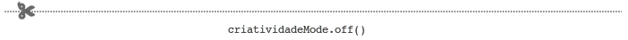

# Seminário - APIs do HTML5

> Já tenho a melodia, agora só falta compor a letra!! ([Melodia da música tema deste trabalho][lenda-do-heroi])
> -- _Sir_ Fegemo

Era uma vez um reino encantado chamado **Weblot** :european_castle:.
Lá viviam bravos cavaleiras
e cavaleiros :crossed_flags:, magos tinhosos :sparkles:, um rei com sua
espada :crown: e menestréis fanfarrões :beers:.

[lenda-do-heroi]: https://soundcloud.com/fegemo/tema-de-a-lenda-do-heroi

_Sir_ Fegemo, um representante excelente desses últimos, costumava
acompanhar aventureiros pelo reino e era conhecido por cantar belas
músicas contando suas histórias. Em sua última aventura ele foi para a
temida região de **“JavasCripta”** :skull:, juntamente com seu grande amigo e lenda
weblotiana, o bárbaro chamado **“Agáte Êmi-Éli, o Quinto”**
. Lá eles encontraram o mago mais conhecido
como **“Cascatas Estilosas, o Terceiro”** 
(por causa de seu cabelo em “ondinhas”) e conseguiram o feito épico de
erradicar todo o mal que assombrava o lugar.

Finda a aventura, chegou a hora de Sir Fegemo contar a prosa vivida com seus
amiguinhos em forma de música e tocá-la na taverna “<u>O Olho</u>
do Beholder”. Desta vez, ele decidiu compor um conto para enaltecer as
peripécias de **“Agáte Êmi-Éli, o Quinto”**  que,
tudo que tem de forte, tem de atrapalhado.

O nome da música é **“Os Ataques Potencialmente Irresponsáveis do
Agáte Êmi-Éli, o Quinto”**, mas a taverna achou muito grande e
escreveu apenas **APIs do HTML5** em seu mural.

Para que a canção seja uma obra prima da acústica, sem que seu amigo
saiba, _Sir_ Fegemo propôs **comprar mais informações :money_with_wings:
sobre outras histórias de atrapalhadas do bárbaro** - muito fácil depois
da grande quantidade de peças de _Webdollars_ (PW$) :moneybag: acumulada com
sua parte do espólio em **“JavasCripta”**.

Quem quiser ajudar e ainda angariar umas ricas peças de W$ (~~que se traduzem
em **15 pontos** na matéria~~), deve:

1. Apresentar ~~o conceito~~a história de ~~uma~~um
  <abbr title="Ataque Potencialmente Irresponsável">API</abbr> do HTML5
  para a turma
  - Cada API tem um valor diferente e pode ser que em vez de
    escolher ~~uma~~um com um valor alto, você escolha 2 ou mais
    com valores mais baixos
    - O importante é conseguir **pelo menos 100 peças de W$**, até um
      limite de 120 peças
  - ~~A~~O API pode ser ~~apresentada~~apresentado com _slides_, que
    podem ser criados em ~~HTML/CSS/JS~~JavasCripta **(até +10% PW$)**
    - Veja [bespoke.js][bespoke], [reveal.js][reveal],
      [slides.com][slides.com] etc.
1. ~~Um código ilustrativo~~Uma ilustração ~~da~~do API que mostre, de
  forma simples e preferencialmente burlesca, como ~~ela funciona~~foi a atrapalhada do bárbaro
  - Deve haver 1 para cada API ~~escolhida~~escolhido

[bespoke]: http://markdalgleish.com/projects/bespoke.js/
[reveal]: http://lab.hakim.se/reveal-js/
[slides.com]: https://slides.com/

Dentre os feitos de HTML5, _Sir_ Fegemo já ouviu falar e está disposto a
comprar informações sobre:

- Acesso a Dispositivo
  - _Gamepad API_ (valor: <abbr title="Peças de Webdollars">PW$</abbr> 70)
  - _Vibration API_ (valor: <abbr title="Peças de Webdollars">PW$</abbr> 50)
  - _Proximity API_ (valor: <abbr title="Peças de Webdollars">PW$</abbr> 50)
  - _Ambient Light API_ (valor: <abbr title="Peças de Webdollars">PW$</abbr> 30)
  - _Geolocation API_ (valor: <abbr title="Peças de Webdollars">PW$</abbr> 30)
  - _Device Orientation API_ (valor:
    <abbr title="Peças de Webdollars">PW$</abbr> 20)
  - _Battery Status API_ (valor: <abbr title="Peças de Webdollars">PW$</abbr>
    20)
- Multimídia e Gráficos
  - _Canvas API_ (valor: <abbr title="Peças de Webdollars">PW$</abbr> 100)
  - _WebGL_ (valor: <abbr title="Peças de Webdollars">PW$</abbr> 100)
  - _Web Audio API_ (valor: <abbr title="Peças de Webdollars">PW$</abbr> 70)
  - _Web MIDI API_ (valor: <abbr title="Peças de Webdollars">PW$</abbr> 50)
  - _Pointer Lock API_ (valor: <abbr title="Peças de Webdollars">PW$</abbr> 30)
  - _Fullscreen API_ (valor: <abbr title="Peças de Webdollars">PW$</abbr> 30)
  - _Accessible Rich Internet Applications_ (valor:
    <abbr title="Peças de Webdollars">PW$</abbr> 100)
  - _Speech Synthesis API_ (valor: <abbr title="Peças de Webdollars">PW$</abbr>
    80)
  - _Speech Recognition API_ (valor:
    <abbr title="Peças de Webdollars">PW$</abbr> 80)
  - _Presentation API_ (valor: <abbr title="Peças de Webdollars">PW$</abbr> 70)
  - _Media Capture and Streams API_ (valor:
    <abbr title="Peças de Webdollars">PW$</abbr> 70)
  - _Page Visibility API_ (valor: <abbr title="Peças de Webdollars">PW$</abbr>
    20)
- Conectividade
  - _WebSockets_ (valor: <abbr title="Peças de Webdollars">PW$</abbr> 100)
  - _WebRTC_ (valor: <abbr title="Peças de Webdollars">PW$</abbr> 100)
  - _Beacon API_ (valor: <abbr title="Peças de Webdollars">PW$</abbr> 30)
- Armazenamento e _Offline_
  - _Offline Resources: application cache_ (valor:
    <abbr title="Peças de Webdollars">PW$</abbr> 80)
  - _Web Application SDK_ (valor: <abbr title="Peças de Webdollars">PW$</abbr>
    50)
  - _IndexedDB_ (valor: <abbr title="Peças de Webdollars">PW$</abbr> 80)
  - _Web Storage_ (valor: <abbr title="Peças de Webdollars">PW$</abbr> 20)
  - _File API_ (valor: <abbr title="Peças de Webdollars">PW$</abbr> 30)
- Desempenho e Segurança
  - _User Timing API_ (valor: <abbr title="Peças de Webdollars">PW$</abbr> 50)
  - _Web Cryptography_ (valor: <abbr title="Peças de Webdollars">PW$</abbr> 50)

## O Formato

 :one: Primeiramente, o grupo deve comunicar à turma e ao ~~_Sir_ Fegemo~~professor qual(is) foi(ram) a(s) API(s) escolhida(s). O grupo deve escolher **apenas APIs que são suportadas por pelo menos 1 navegador**, porque o grupo deve implementar um código demonstrando a funcionalidade  (veja [caniuse.com][caniuse]). Além disso, **cada API pode ser escolhida por apenas 1 grupo**.

:two: Uma **breve** apresentação de slides deve ser criada e, em data combinada, apresentada pelo grupo para a turma. A apresentação terá no máximo **10 minutos** e deve conter, pelo menos:

- Uma descrição da(s) API(s), contendo códigos de exemplo
- Uma demonstração da(s) API(s) em ação (usando seu próprio código)
- A compatibilidade dos navegadores com a(s) API(s) (veja [caniuse.com][caniuse])

:three: Um código de um exemplo simples de uso da(s) API(s), publicado, de forma que todos possam acessar. O código deve ser exibido durante a apresentação e deve ser entregue no repositório [cefet-web-weblot][repo-weblot] do professor, conforme descrito em seu [README.md][readme-weblot].

[caniuse]: http://caniuse.com
[repo-weblot]: https://github.com/fegemo/cefet-web-weblot
[readme-weblot]: https://github.com/fegemo/cefet-web-weblot/blob/master/README.md#cefet-web-weblot

## Referências Úteis

Como pontos iniciais de busca, você pode usar:

- [Artigo na MDN sobre HTML5][mdn-html5]
- Busca por APIs no [Can I Use][caniuse-pesquisa]
- [Índice de APIs do HTML5][html5-api-index]

[mdn-html5]: https://developer.mozilla.org/en-US/docs/Web/Guide/HTML/HTML5
[caniuse-pesquisa]: http://caniuse.com/#search=api
[html5-api-index]: http://html5index.org/

## Instruções gerais

O trabalho deve ser produzido integralmente pela dupla. **Trabalhos muito
semelhantes receberão nota 0**, independente de quem copiou de quem.
Trabalhos semelhantes aos de outras pessoas (ex-alunos, pessoas na Internet)
também receberão nota 0.

## Critérios de avaliação

O grupo será avaliado conforme a qualidade da apresentação e do código com
exemplo de uso da(s) API(s), e também pela abrangência de conteúdo no seminário
e contemplada no código fonte.
