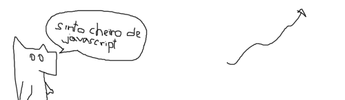

# Trabalho Prático 1 - Seu site pessoal

Ao sair de sua aula sobre Marketing Pessoal ontem, você sentiu um desejo
profundo de fazer parte da Internet e possibilitar que outras pessoas conheçam
o "codificador arte" dentro de você.

Na manhã seguinte, você entende que precisa criar seu site pessoal para que
possa fazer dele seu portfolio de trabalhos pessoais, do curso de Engenharia da
Computação e/ou profissionais.

## Funcionalidade Básica

Seu site deve conter:

1. Pelo menos estas páginas (ou seções¹)
   - **Inicial**
   - **Projetos**
   - **Curriculum Vitae**
   - **Contato**
1. Um _menu_ de navegação para outras páginas (ou seções¹)
1. Um logotipo, que pode ser
   - um logotipo propriamente dito ou
   - seu nome escrito com uma fonte diferente ou
   - uma foto sua ou
   - uma pseudo-foto sua
1. As páginas devem ser "responsivas"
1. _Layout_ e _design_ agradáveis - não precisa ser profissional, mas também não
  pode ter carinha de site da década de 90

A página **Inicial** deve conter informações gerais sobre você, links para sites
 de interesse, frases de impacto, citações de livros legais etc.

A página **Projetos** deve conter
- No mínimo 5 projetos
- Imagens e descrição dos projetos
- Deve ser possível ver as imagens em tamanho maior **sem sair da página**
  

A página **Curriculum Vitae** deve conter um breve currículo com suas
habilidades e conhecimentos e um link para _download_ da versão completa.

A página **Contato** deve conter
- Suas informações de contato
- Um mapa de
  - Onde você mora, ou
  - Onde você nasceu/cresceu, ou
  - Onde você trabalha, ou
  - Onde você estuda, ou
  - Um lugar que alguém possa encontrá-lo - um _shopping_? o pé de goiaba da casa
    da sua avó?
- O mapa deve mostrar também a distância e o caminho entre o usuário do site
  e o local que você escolheu (casa, trabalho, escola etc.) de forma que a
  pessoa consiga encontrar você para tomar um café. Você vai precisar
  - [API do Google Maps Direction](https://developers.google.com/maps/documentation/directions/#Introduction) (ou Bing Maps, ou outro qualquer)
  - [HTML5 Geolocation API](https://developer.mozilla.org/pt-BR/docs/Using_geolocation)

¹ Uma tendência atual é de criar sites em apenas uma página, em vez de várias.
Você pode optar por esse estilo de site pessoal, mas se assim o fizer, também
fará parte também da funcionalidade básica a implementação de imagens de fundo
com a [técnica de rolagem Parallax](https://ihatetomatoes.net/simple-parallax-scrolling-tutorial/).

## Funcionalidade Extra

O que foi descrito anteriormente do trabalho equivale a uma pontuação de 80%.
Para chegar a 100% (ou a mais e ganhar uns pontinhos extras), você deve
implementar também um conjunto de outras funcionalidades, a saber:

- Incorporar botões para perfis de mídias sociais ou botões de promoção
  (curtir, +1 etc.) **(2-7%)**
- Animações e/ou transições CSS3 de forma agradável para a experiência de
  usuário **(5%)**
- Fazer com que o mapa mostre locais diferentes ao longo do dia (e.g., local
  de trabalho de dia, casa de noite e clube nos finais de semana) **(10%)**
- Ter uma versão do site "amigável" para impressão **(5%)**
- Usar uma (ou mais) fontes personalizadas (_web fonts_) **(3%)**
- Usar _CSS Sprites_ para as imagens pequenas **(5%)**
- Na sua página de currículo, apresentar algumas informações na forma de
  gráficos (usando imagens (2%) ou gráficos interativos em html, css e js (7%) - [raphaeljs](http://raphaeljs.com/), [amcharts](http://www.amcharts.com/), [highcharts](http://www.highcharts.com/)) **(2-7%)**
- Incorporar uma chamada a um serviço de previsão do tempo para avisar ao
  usuário a condição do tempo de onde ele está quando ele entrar na página
  **Contato**. Você deve mostrar na tela algo como: "Pode vir tomar um cafezinho
  comigo, mas traga um guarda-chuva (16º C)" **(15%)**
- Utilizar um _task runner_ (e.g., [Grunt](http://gruntjs.com/), [Gulp](http://gulpjs.com/), [Brunch](http://brunch.io/), [Broccoli](https://github.com/broccolijs/broccoli)) **(10%)**
- Utilizar um preprocessador CSS (e.g., SASS, LESS, Stylus) **(7%)**

Você pode usar bibliotecas/frameworks Javascript e CSS. Contudo, para usar as
listadas abaixo, você precisa pagar uns pontinhos:

- jQuery (-8%)
  - Plugin jQuery de terceiros (-2% cada)
- Bootstrap/Foundation/Nib/MaterializeCSS (-8%)

## Política da Privacidade

Se você não quiser usar informações sobre você mesmo, peço que utilize
informação fictícia ou uma pessoa pessoa inteiramente fictícia (e.g.,
"Fulano de Tal", "Boizinho Verde") e coloque as informações relativas a ela.

## Instruções gerais

O trabalho é individual e deve ser produzido integralmente pelo aluno. Podem discutir
idéias entre os colegas, mas cada aluno deve ter a sua implementação independente dos
demais. **Trabalhos muito semelhantes receberão nota 0**, independente de quem copiou
de quem. Trabalhos semelhantes aos de outras pessoas (ex-alunos, pessoas na Internet)
também receberão nota 0.

## O que faz perder nota

Alguns descuidos podem fazer com que sua nota fique muito abaixo do esperado:
- Cópia de trabalho de outrem: nota 0
- Ausência de qualquer item obrigatório da entrega (descrito na próxima seção)
- Ausência de itens da especificação obrigatória
- Baixa legibilidade do código
- Baixa qualidade da implementação
- Atraso na entrega. Cada dia de atraso reduz o valor máximo de nota da
  maneira abaixo. Considere `x` como dias de atraso e `y` a penalidade
  percentual na nota:

  
  - Isso implica que 1 ou 2 dias de atraso são pouco penalizados
  - E após 5 dias de atraso, o trabalho vale 0
  - _Seeing is believing_: https://www.google.com.br/search?q=y%3D(2%5E(x-2)%2F0.16-1.5625)%2Cy%3D100

## O que deve ser **entregue**

O trabalho deve ser entregue via GitHub, BitBucket ou outro serviço gratuito, 
de hospedagem de repositórios git. Não se esqueça de fazer vários e
pequenos _commits_, que é uma importante boa prática em git e também é
interessante para demonstrar seu progresso. Além do repositório, você também 
deve publicar seu site **usando algum serviço de hospedagem gratuito**.

O GitHub oferece esse serviço para hospedagem de sites estáticos.
Você deve pode utilizar esse serviço para publicar seu trabalho pessoal. Uma
descrição completa dos passos para se fazer isso pode ser encontrada em
https://pages.github.com/.

Além disso, você deve submeter um arquivo README {.pdf, .md, .txt, .html} que 
contenha a lista de itens extras (ou penalidades) as quais está pleiteando.

Ao final do seu trabalho, você deve submeter pelo Moodle o link do seu repositório 
e o link do seu site hospedado.
