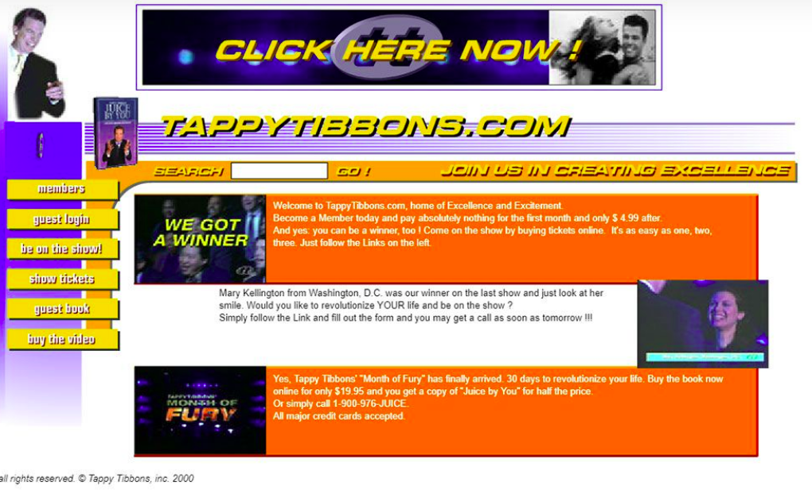
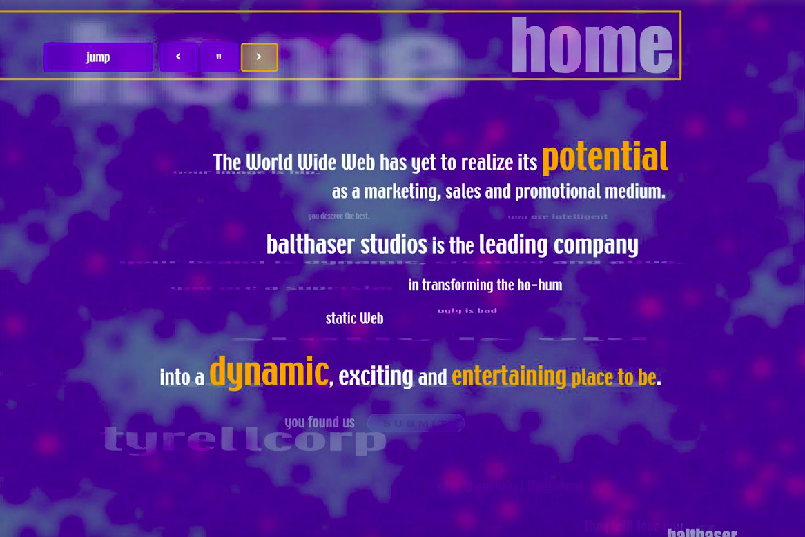
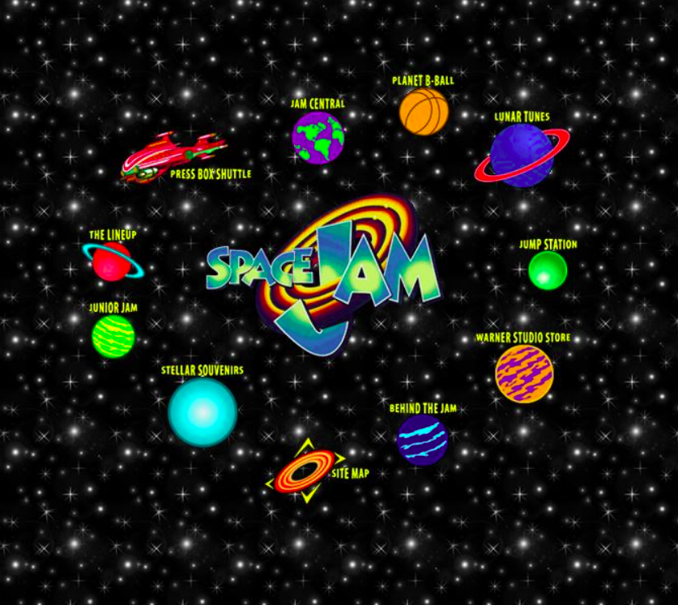

# Trabalho Prático 1 - O Assunto X

Ao sair do banho, você e mais 2 ou 3 amiguinh@s decidiram **fazer um site
sobre um determinado assunto - o Assunto X -**, para motivar os amigos a
gostarem da mesma coisa que vocês, além de ensinar um pouquinho sobre alguma matéria.

Esse assunto deve ser algo de interesse em comum dos integrantes do grupo e deve ser escolhido dentre as matérias que estão sendo vistas ao longo do primeiro ano, das matérias de biologia, geografia, português, matemática etc. A ideia é **pegar algum trabalho de outra matéria** e, em vez de apresentá-lo como um relatório ou PowerPoint, **criar um site** para isso.

## Funcionalidades do Site

O site deve conter:

1. Um **nome**, que não deve ser simplesmente o nome do assunto, mas algo que
   o envolva.
   

      
Por exemplo...

      
Um site sobre Botânica não deveria se chamar genericamente "Plantas", mas poderia ser algo como "Gimnojovens", ou "Fotossintéticos" (sei lá, inventem aí!!)

   

 1. Um **logotipo**, que pode ser:
    - um logotipo propriamente dito, preferencialmente criado pela turma, ou
    - o nome do site, escrito em uma fonte diferentona
1. Um **layout bacana**, mais rebuscado do que simplesmente uma coluna única (seu site tem que "ter um certo ritmo visual").
   

      
Layout ou design???

      
São coisas diferentes. <strong>Layout</strong> envolve mais a posição e tamanho
      das coisas que aparecem em uma página.
      <strong>Design</strong> já envolve aspectos
      estéticos como cores, fontes, imagens, degradês.

      
Mas a linha entre layout e design não é sempre fácil de traçar.

   

   

      
Layouts simples vs bacanas...

      
Exemplos de layouts simples (famigerados layouts de 1 coluna apenas):

      <ul>
         <li>Página das ovelhas (só repete título + imagem flutuando + parágrafo descrevendo)</li>
         <li>Página das plantas carnívoras (idem)</li>
         <li>Página dos ninjas (idem)</li>
         <li>Página das abelhas (idem)</li>
      </ul>
      
Exemplos de médios:

      <ul>
         <li>Página dos unicórnios (tem um cabeçalho, barra lateral)</li>
      </ul>
      
Exemplos de bons layouts:

      <ul>
         <li>Página do assombrado (cabeçalho, rodapé, miolo e barra lateral)
         <li>Página do coral (idem)</li>
         <li>Site do CEFET-MG</li>
         <li>Algumas <a href="https://colibriwp.com/blog/website-layout-design-ideas/" target="_blank">ideias de layout</a></li>
      </ul>
   

   <ul>
      <li>Independente da escolha, em telas um pouco maiores ou menores não podem surgir barras de rolagem horizontal (péssima experiência de usuário)</li>
   </ul>
1. Um **_menu_ principal** com links para navegar entre as páginas
   

      
O que é um menu principal...

      
Um menu principal contém links para as principais (ou todas) páginas
      de um site e deve aparecer em todas as páginas, conferindo uma
      identidade visual ao site.

      
Além disso, se a página atual representar algum dos links
      do menu, é importante que seu link esteja diferente indicando que
      ela é a atual. Por exemplo:

      
      
Também é muito importante que os links sejam estilizados de 
      forma a terem um efeito de <code>:hover</code> indicando que
      podem ser clicados.

   

1. Pelo menos **três páginas**
1. Uma das páginas deve conter **informações sobre o site**, contendo:
   - Informação sobre os **autores do site** (o grupo)
   - Informação sobre **colaboradores** (se tiver, por exemplo, pessoas além do professor que
     ajudaram)
   - Atribuição de **créditos**:
     - Se estiver usando recursos de terceiros (_e.g._, vídeos, sons, imagens
       etc.), a página deve mostrar quem é o autor de cada um, possivelmente
       com o link apontando onde esse recurso foi encontrado
1. Inclusão de **estilos em arquivo** _CSS_ externo
   

      
Instruções ao estilizar...

      
Para criar regras CSS, tem várias formas de criar os seletores.
      As mais comuns são: de <em>tag</em>, <code>id</code> e 
      <code>class</code>.
      
Ao fazer um site (várias páginas em vez de 1) e criar regras, sempre reflita:

      <ul>
         <li>a regra deve se aplicar a apenas 1 elemento? Mesmo que o
         site cresça depois? Se sim, <code>id</code> deve ser uma boa opção.</li>
         <li>a regra deve se aplicar a todos os elementos daquela tag ou
         apenas a um subconjunto? No primeiro caso, use seletor de <em>tag</em> e, no segundo, uma <code>class</code>.</li>
      </ul>
      
Como um exemplo, podemos ficar tentado a criar a seguinte
      regra para definir o tamanho das imagens de plantas briófitas:

            <pre><code>img {
      width: 400px;
   }</code></pre>
      
...contudo, há poutras imagens (e podemos incluir mais no futuro)
      no site que não sejam as plantas briófitas (por ex: a logomarca).
      Sendo assim, seria melhor criar uma <code>.briofitas</code> e usuá-la em vez de estilizar todas as imagens.

   

1. Uso de **_tags_ semânticas** sempre que aplicável
   ([ver slides][tags-semanticas])
1. Usar apenas fontes não instaladas (**_webfonts_**) em das "fontes padrão" ([ver slides][webfonts])
   

      
Dicas sobre fontes...

      <ul>
         <li>As fontes padrão (Arial, Times New Roman etc.) são super batidas</li>
         <li>Tipicamente, usamos 1 para os títulos da página, outra para o restante (atribuída ao &lt;body&gt; e herdada pelos descendentes)</li>
         <li>Usar fontes demais (4+) acaba virando uma "farofa" visual e não é recomendado</li>
      </ul>
   

1. Ter uma dentre as seguintes 4 opções:
   - **Tabela** com uma célula ocupando mais de uma coluna ou linha; ou
   - Uma **lista de definição** (`<dl>...</dl>` - pesquisar); ou
   - **Código fonte** dentro da página (`<pre></pre>` e `<code></code>` -
     pesquisar); ou
   - **Campos de entrada** de dados (`<input>`s)
1. Utilizar, em algum momento, **_pseudo-elements_ ou _pseudo-classes_**
   ([ver slides][pseudo-coisas])
1. **_Layout_ e _design_ agradáveis** - não pode ter carinha de site da década
   de 90
   

      
Carinha dos anos 90???

      
Nos primórdios da Web, os designs eram bem ruins:
      

      

         
         
         
         
         
         
      

      
O que faziam "de errado"? Bom, hoje evitamos:

      <ul>
         <li>Usar cores demais.</li>
         <li>Usar imagens de fundo indiscriminadamente. Hoje devemos usar com parcimônia (de preferência sem repetição).</li>
         <li>Usar as fontes padrão (ex: Arial, Times New Roman etc.). Hoje se elas aparecem o usuário sente que houve desleixo do programador.</li>
         <li>A estilização padrão dos hiperlinks (sublinhado com cor azul ou roxo, depois de visitado). O sublinhado pode ficar charmoso apenas em <code>:hover</code>.</li>
         <li>Usar degradês muito extravagentes.</li>
         <li>Usar layouts simples de 1 única coluna.</li>
         <li>Não separar visualmente os "ambientes" (cabeçalho, miolo, rodapé etc.). Hoje em dia é bom que sejam bem distintos.</li>
         <li>Usar bordas muito grossas. Elas devem ser sutis (1px? Máximo 2px em geral).</li>
         <li>Arredondar demais as bordas, especialmente se o elemento for retangular. Isso distorce. Se quiser arrendondar, que seja circular ou que seja apenas os cantinhos (ex: máximo 5-10px).</li>
         <li>Não usar imagens. Hoje elas são essenciais para compor o design de sites. Tanto imagens de conteúdo (isto é, <code>&lt;img&gt;</code>), quanto de fundo.</li>
         <li>Não pensar sobre o "espaço vazio". É muito importante planejarmos os espaços que possuem coisas e aqueles que não possuem. Não pode ter tudo "agarrado". Devemos pensar bem nas distâncias entre as coisas.</li>
      </ul>
      
Alguns exemplos de bons designs de hoje em dia:

      <ul>
         <li><a href="https://www.batokasafaris.com/">Batoka Safaris</a></li>
         <li><a href="https://wovenmagazine.com/">Revista Woven</a></li>
         <li><a href="https://alistapart.com/">A List Apart</a></li>
         <li><a href="https://www.artstation.com/">ArtStation</a></li>
         <li><a href="https://www.nowness.com/">Loja Nowness</a></li>
         <li><a href="https://store.steampowered.com/">Steam</a></li>
      </ul>
   

Fazendo tudo isso certinho, da melhor forma possível, o grupo adquire 80% da pontuação do trabalho. Se quiser mais pontinhos, até um limite de 120%, o grupo também pode implementar:

1. (5-8%) Criar um **_comprehensive layout_** em algum editor de imagem (paint não vale =) antes do desenvolvimento
1. (3-10%) Criar **algo interativo na página usando JavaScript**.    
   

      
Exemplos de coisinhas com JavaScript...

      <ul>
         <li>Uma galeria de imagens</li>
         <li>Efeitos sonoros durante a interação</li>
         <li>Coisinhas se movimentando (ex: tipo as abelhinhas, bolhas de ar do coral, ovelhita)</li>
         <li>Possibilidade do usuário alterar coisas na página (cores, tamanhos)</li>
         <li>Uma janelinha modal com alguma informação</li>
         <li>Fazer alguns cálculos de equações como báscara, equações da física etc.</li>
      </ul>
   

1. (5-10%) Colocar **animações, transições e transformações** (mas sem exageros, onde ficar bom e fizer sentido)
1. (2-5%) **Easter eggs** usando CSS ou JavaScript (mais pontos)
1. (5%) Alguns **elementos com posicionamento** não estático
   ([ver slides][posicionamento])
1. (3%) Exibição de um **vídeo sobre o tema** ([ver slides][video])
   - Pode ser um vídeo do Youtube (eg, `<iframe ...>`), ou um vídeo hospedado
     no próprio site (`<video ...>`)
1. (5%) Usar o **Git ao longo do** trabalho (hospedado no Github, Gitlab, Bitbucket ou outro)
   - Não vale como item extra se usar apenas nos últimos dias para publicar
1. (5%) Fazer o site todo **completamente responsive**  ([ver slides][responsive])
1. (3-6%) Usar **flexbox e grid**

[responsive]: https://fegemo.github.io/cefet-front-end/classes/css7/
[pseudo-coisas]: https://fegemo.github.io/cefet-front-end/classes/html5/#pseudo-classes-e-pseudo-elements
[tags-semanticas]: https://fegemo.github.io/cefet-front-end/classes/html5/#divitite-e-tags-semanticas
[posicionamento]: https://fegemo.github.io/cefet-front-end/classes/css4
[video]: https://fegemo.github.io/cefet-front-end/classes/css3/#video-e-audio
[webfonts]: https://fegemo.github.io/cefet-front-end/classes/css3/#web-fonts

### O que faz **perder nota**

Alguns descuidos podem fazer com que sua nota fique muito abaixo do esperado:
- Plágio do trabalho de outrem
- Ausência de itens obrigatórios
- Falta de originalidade: utilização de códigos prontos (de práticas anteriores, por exemplo)
- Uso de elementos antigos dentro do HTML (e.g., _tags_ `
`, `<b>`,
  ``)
- Ignorar boas práticas de programação:
  - Código pouco legível,
  - Muita repetição de código,
  - Criação de variáveis desnecessárias
  - Código CSS ou JavaScript _inline_ etc.

## O que deve ser **entregue**

Apenas a URL apontando para o site hospedado na Internet. É isso mesmo. Na Internet :3!!

<iframe src="https://www.youtube.com/embed/vKJkxsgzMl4" width="800" height="450" frameborder="0" allowfullscreen="1"></iframe>

Para tanto, o grupo deve publicar o site
**usando algum serviço de hospedagem gratuito**. Ouvi dizer que o
[Neocities][neocities] é uma boa. Ouvi ainda, que para quem conhece um pouco
sobre [Git][git] e [GitHub][github], o [Github Pages][gh-pages] **é
uma opção bem melhor** (vide vídeo).

Apenas 01 integrante do grupo deve enviar a URL e pelo Moodle. E deve **seguir o formato** usado no exemplo de entrega a seguir:

**Título do tópico**

Grupo 05 - BioHazard

**Conteúdo do tópico**

_URL do site:_ https://usuario.github.io/biohazard/
_Integrantes:_
1. Arzimar da Silva Costa
1. Frederico Aleixo Alencar
1. Genézio Oliveira Pontes
1. Custódio Armando Gato

_Itens opcionais implementados (conforme enunciado):_
- (5-8%) Comprehensive layout (vide anexo 1 ao tópico)
- (3-10%) Criar algo interativo na página (criamos um joguinho de plantar e regar árvores em JavaScript)
- (3%) Exibição de um vídeo (usamos iframe para incluir vídeo do YouTube)
- (3-6%) Usar flexbox/grid (usamos grid para layout da página e flexbox para o menu principal)

**Anexos da postagem**

_(colocar evidências que comprovem os itens opcionais implementados... por exemplo, a imagem do Comprehensive Layout, se tiver feito esse item)_

## O que deve ser **apresentado**

Na última aula do bimestre, o trabalho deve ser apresentado em sala de aula. Não é necessário fazer uma apresentação, mas apenas mostrar o site e falar sobre como foi seu desenvolvimento.

[neocities]: https://neocities.org/
[git]: https://git-scm.com/
[github]: https://github.com/
[gh-pages]: https://pages.github.com/
