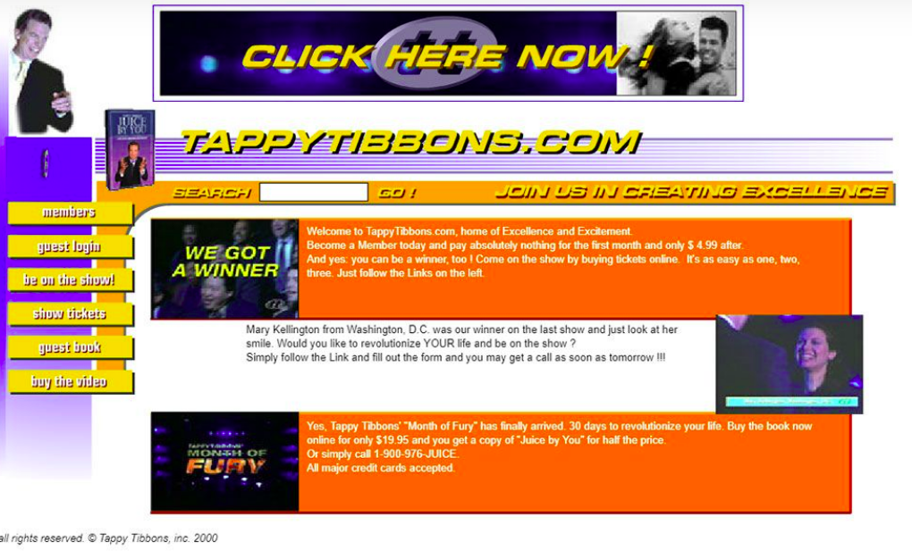
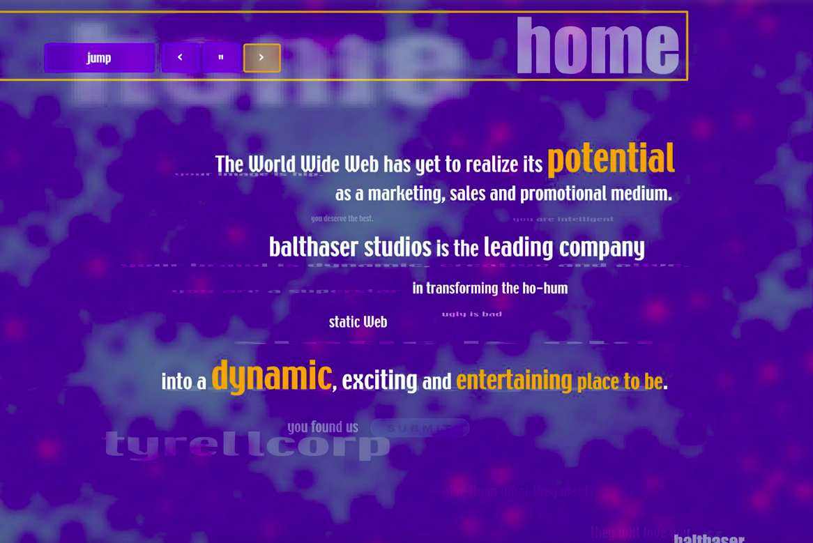
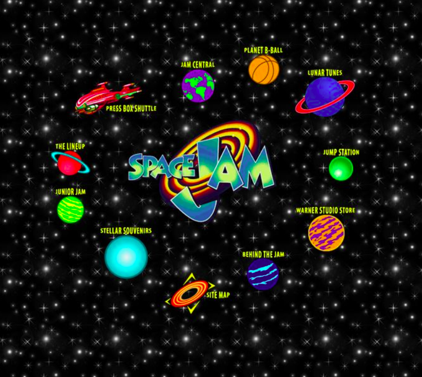
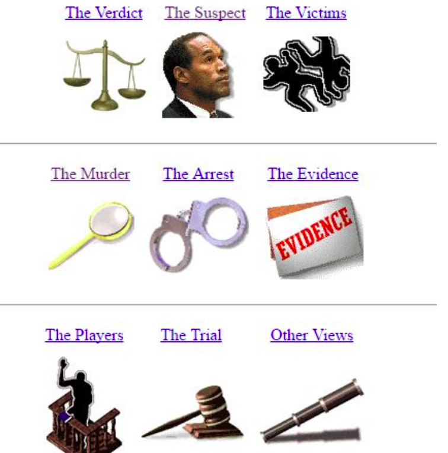
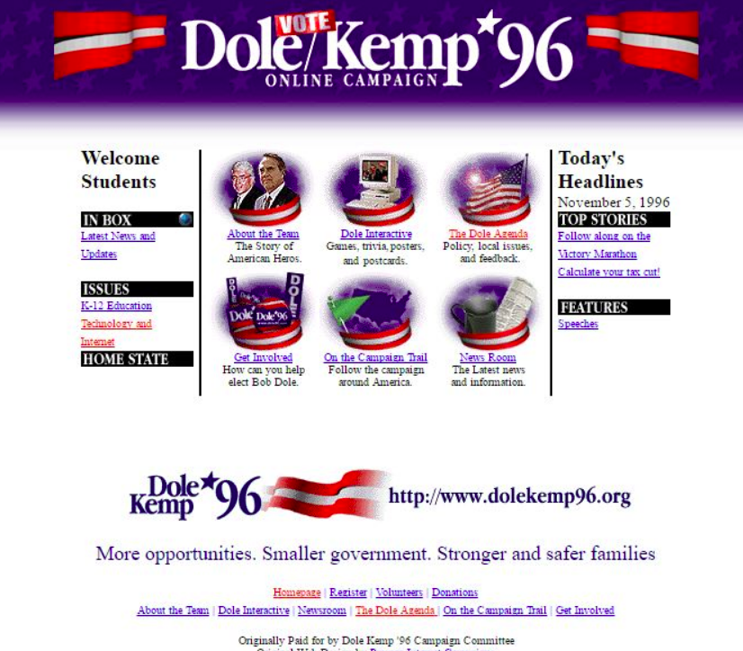
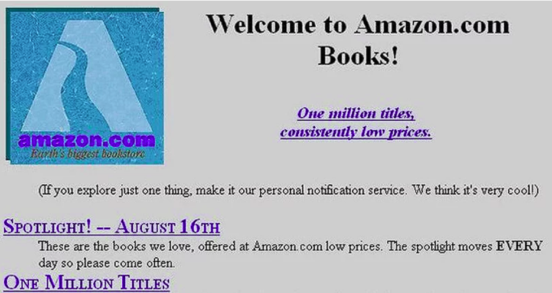

# Trabalho Prático 2 - Aplicação Web

Cansado de todo dia criar um novo sitezinho para seu pai, tio, prima,
cachorro e até para o professor de Web, você e mais um ou dois amig@s decidem
inovar. Em vez de criar um site estático, que simplesmente apresenta
informações, vocês querem agora criar uma **aplicação web interativa**, 
gastando todo o JavaScript do universo.

A diferença de um site estático para uma aplicação está em seu uso:

- Um **site estático** simplesmente expõe informações e não possui
  muita interatividade. Por exemplo, as páginas do Coral 55, dos Tesouros
  do Barba Ruiva, da Exploração Espacial. Normalmente não precisa de JavaScript,
  ou usa muito pouco.
- Uma **aplicação web** envolve <u>muita interação com o usuário</u>,
  salva algum tipo de informação e geralmente permite ao usuário se
  identificar (e.g., fazendo _login_)¹. A ideia é criar algo que
  permita que **o usuário crie algum conteúdo**, e não apenas o programador.
  Na atividade "Lista de Tarefas" (ainda vamos fazer), a aplicação web
  permite ao usuário cadastrar suas próprias atividades.

Neste trabalho prático, vocês irão fazer uma dentre as seguintes aplicações:

(a) um sistema que gerencia uma lista de jogos/livros/músicas/filmes que
você quer ou já jogou/leu/ouviu/assistiu. Nesse sistema, o usuário poderá 
categorizar os itens e filtrar por categoria. Cada categoria deverá
ser definida junto com sua cor. Pelo menos a lista e as categorias
devem ser salvos usando _web storage_;

(b) um jogo de cartas (alguém disse truco?), de navinha, de perguntas 
e respostas, [tamagotchi][tama] (bichinho virtual), dentre outros. Nesses jogos, 
deverá haver um _ranking_ dos jogadores, alguma forma do usuário personalizar
o jogo (por exemplo, seu avatar). Pelo menos o _ranking_ e o avatar 
devem ser salvos usando _web storage_;

(c) um sistema de enquetes que permite o usuário criar enquetes, 
enviá-las para outras pessoas e visualizar os resultados em um gráfico².
As enquetes devem ser categorizadas ao serem listadas e o usuario
poderá filtrar por categoria. A categoria deverá ter pelo menos
um nome e uma cor. As enquetes devem ser salvas usando _web storage_;

**Nota:** neste trabalho, você vai precisar 
<u>buscar por bem mais informações</u> do que aquelas que foram 
abordadas em sala de aula durante o ano! O trabalho será avaliado
pela capacidade do grupo de **extrapolar o que vimos em sala de aula**

¹ _Login_: permitir que usuários se cadastrem na aplicação requer o uso de
um banco de dados e um _back-end_, que são assuntos que não foram cobertos
nesta matéria. Nesse caso, podemos usar _web storage_ para salvar informações
localmente no navegador.

² O envio de enquetes para outra pessoa também requer um _back-end_, mas pode
ser "simulado" por meio da geração de uma URL única que codifique o seu conteúdo
e seus resultados.

<details>
<summary>Como usar a URL para transmitir dados...</summary>
Lembre-se do formato de uma URL completa:

```
  https://github.com:443/fegemo/enquete/index.html?conteudo=3MS43h1khjtmnw#top
  \___/   \________/\__/\________________________/\______________________/\__/
protocolo          porta          caminho                querystring   fragmento
            domínio
```

Podemos usar a _querystring_ (string de "consulta") ou o fragmento para 
conter os dados da enquete atual, com seu enunciado, opções e votos atuais.

Para isso, é necessário:
- (a) representar esses dados com um objeto JavaScript
- (b) serializar esse objeto usando JSON (por exemplo, mas há outras formas)
- (c) opcionalmente compactar² (comprimir) essa string serializada
- (d) concatenar os dados serializados (e opc. comprimidos) na URL do site
- (e) enviar a URL para outro usuário

Daí, quando a página carrega, deve haver um JavaScript para verificar se
existe algum dado de enquete na URL. Se houver:
- (a) descompacta (se tiver sido compactado)
- (b) desserializa de JSON para objeto em JavaScript
- (c) preenche os elementos HTML da página (título, opções, votos etc.) com
  os dados que estavam na URL

No caso de enquetes, o usuário que recebeu a URL agora pode votar. Se ele
quiser, pode gerar uma URL com os dados atuais e enviar para outra pessoa,
que vai poder responder a enquete, por sua vez.

² Comprimir: podemos querer comprimir os dados para que eles fiquem mais 
difíceis de alterar manualmente e também para caber na URL, que tem um limite
de tamanho. Existe uma biblioteca JavaScript chamada 
[lz-string][lz-string] que pode ser usada para compactar e descompactar um
texto.

[lz-string]: https://pieroxy.net/blog/pages/lz-string/guide.html
</details>

**O aluno será pontuado individulamente** de acordo com suas 
**contibuições enviadas no Github**. Ou seja, o aluno deverá enviar a sua
parte no repossitório para sabermos o que foi feito por cada integrante. 


## Análise da participação e pontuação individual

Cada integrante do grupo deverá usar o GitHub e a participação (e nota) do aluno será avaliado individualmente pelo GitHub por meio da tela de contribuições - [veja aqui um exemplo](https://github.com/daniel-hasan/ri-crawler/graphs/contributors). Por exemplo, caso o grupo tenha 3 alunos e for verificado que apenas 2 alunos participaram ativamente do projeto, o aluno que participou menos terá a nota mais reduzida em relação aos demais.


## Funcionalidade da Aplicação

Como itens obrigatórios, sua aplicação web deve conter o seguinte:

1. Permitir que **o usuário crie conteúdo** (e.g., tarefas, playlists,
   avatares, enquetes etc.) durante sua interação com a aplicação
   - A criação de conteúdo deve envolver a criação/atualização/remoção de
     elementos HTML da página (manipulação do DOM)
1. Armazenamento de dados usando _web storage_. Por exemplo:
   - O nome de usuário/senha que a pessoa criou
   - As playlists/músicas que a pessoa criou e curtiu
   - A pontuação, nome e em qual fase a pessoa está em um joguinho
1. **_Layout_ e _design_ agradáveis** - não pode ter carinha de site da década
   de 90, nem dos anos 2000. E deve ser consistente entre as páginas
   <details>
     <summary>Carinha dos anos 90???</summary>
     <p>Nos primórdios da Web, os designs eram bem ruins:</p>
     <p>
       
       
       
       
       
       
     </p>
     <p>O que faziam "de errado"? Bom, hoje evitamos:</p>
     <ul>
       <li>Usar cores demais.</li>
       <li>Usar imagens de fundo indiscriminadamente. Hoje devemos usar com parcimônia (de preferência sem repetição).</li>
       <li>Usar as fontes padrão (ex: Arial, Times New Roman etc.). Hoje se elas aparecem o usuário sente que houve desleixo do programador.</li>
       <li>A estilização padrão dos hiperlinks (sublinhado com cor azul ou roxo, depois de visitado). O sublinhado pode ficar charmoso apenas em <code>:hover</code>.</li>
       <li>Usar degradês muito extravagentes.</li>
       <li>Usar layouts simples de 1 única coluna.</li>
       <li>Não separar visualmente os "ambientes" (cabeçalho, miolo, rodapé etc.). Hoje em dia é bom que sejam bem distintos.</li>
       <li>Usar bordas muito grossas. Elas devem ser sutis (1px? Máximo 2px em geral).</li>
       <li>Arredondar demais as bordas, especialmente se o elemento for retangular. Isso distorce. Se quiser arrendondar, que seja circular ou que seja apenas os cantinhos (ex: máximo 5-10px).</li>
       <li>Não usar imagens. Hoje elas são essenciais para compor o design de sites. Tanto imagens de conteúdo (isto é, <code>&lt;img&gt;</code>), quanto de fundo.</li>
       <li>Não pensar sobre o "espaço vazio". É muito importante planejarmos os espaços que possuem coisas e aqueles que não possuem. Não pode ter tudo "agarrado". Devemos pensar bem nas distâncias entre as coisas.</li>
     </ul>
     <p>Alguns exemplos de bons designs de hoje em dia:</p>
     <ul>
       <li><a href="https://www.batokasafaris.com/">Batoka Safaris</a></li>
       <li><a href="https://wovenmagazine.com/">Revista Woven</a></li>
       <li><a href="https://alistapart.com/">A List Apart</a></li>
       <li><a href="https://www.artstation.com/">ArtStation</a></li>
       <li><a href="https://www.nowness.com/">Loja Nowness</a></li>
       <li><a href="https://store.steampowered.com/">Steam</a></li>
     </ul>
   </details>
1. Uma janela modal contendo **informações sobre a aplicação**, informando
   quem são os **autores do site** (o grupo)
   - Hoje em dia é possível fazer isto sem JavaScript (pesquisar)

Além dos itens obrigatórios, como você é um aluno 
[qualidade super premium][superpremium] e quer uma nota de 100% ou mais, você 
deve escolher **pelo menos 4** dos seguintes **itens opcionais**:

- Relativas **à aparência** (escolha pelo menos 1):
  1. Toda a aplicação ser _**responsive**_
  1. Ter um **modo claro e modo escuro**
  1. Usar um **_framework_ CSS** para agilizar o desenvolvimento, como o
    [Tailwind CSS][tailwind],
    [Bulma CSS][bulma]
    [Chota][chota] (proibido rir, segure essa 5ª série dentro de você!!),
    [Pico.css][picocss],
    📜 [Bootstrap][bootstrap]
  1. Fazer _**view transitions**_ entre diferentes telas da aplicação
     (pesquisar, envolve JavaScript e CSS)
- Relativas a **JavaScript**: 
  1. Usar uma **API do HTML5**:
     - [Geolocation API][geolocation], para pegar latitude/longitude do usuário
       - Usar a biblioteca do Google Maps para mostrar no mapa
     - Desenhar coisas com [Canvas API][canvas] usando JavaScript
     - Fazer o navegador falar com a [Speech Synthesis API][synthesis]
     - Fazer o navegador entender o que você fala no microfone com a 
      [Speech Recognition API][recognition]
     - Fazer o telefone vibrar com a [Vibration API][vibration]
  1. Usar alguma **biblioteca JavaScript** para auxiliar no desenvolvimento. 
     Por exemplo:
     - cheet.js pra fazer Easter Eggs
     (mas tem que ser bem mais legal que um `window.alert` hein!!)
     - 📜 jQuery
     - Three.js para criar gráficos 3D
     - Dragula para arrastar e soltar
     - Google Charts, ou NVD3.js, ou HighCharts (para exibir gráficos)
     - 💣 Angular, React, Svelte, Vue (para criar SPAs - 
       _single page applications_)
     - 💣 Phaser (para jogos que usam o &lt;canvas&gt;&lt;/canvas&gt;)
- Relativas a **conectividade**:
  1. Consultar APIs públicas usando Ajax (`fetch`), como por exemplo:
     - Consultar a previsão do tempo no local onde o usuário está 
       (usando por ex., a API do [OpenWeather][openweather])
     - Consultar dados sobre Pokémon usando a [pokeapi.co][pokeapi]
     - Consultar dados sobre Star Wars usando a [swapi.info][swapi]
     - Consultar dados sobre países com a [Rest Countries][rest-countries]
  1. 💣💣 Criar um _back-end_ com um banco de dados para persistir os 
     dados no servidor, em vez de apenas localmente com o _web storage_
     - Possibilitar usuário se cadastrar e logar na aplicação por meio do
       _back-end_
  1. 💣💣 Usar um _**web socket**_ com um servidor (_back-end_) para sincronizar
     algum dado entre os usuários. Por exemplo, pra fazer um _chat_, ou um
     jogo _multi-player_
    


Legenda:
- 📜 coisas antiguinhas, talvez não valha a pena
- 💣 assuntos que não são cobertos na nossa disciplina e são considerados
  complicados para serem usados neste trabalho

[superpremium]: https://www.youtube.com/watch?v=4CooiNDnPHI
[geolocation]: http://fegemo.github.io/cefet-web/classes/js5/#5
[canvas]: http://fegemo.github.io/cefet-web/classes/js5/#17
[synthesis]: https://developer.mozilla.org/en-US/docs/Web/API/SpeechSynthesis
[recognition]: https://developer.mozilla.org/pt-BR/docs/Web/API/SpeechRecognition
[bootstrap]: http://getbootstrap.com/
[chota]: https://jenil.github.io/chota/
[picocss]: https://picocss.com/
[bulma]: https://bulma.io/
[swapi]: https://swapi.info/
[pokeapi]: https://pokeapi.co/
[rest-countries]: https://restcountries.com/
[vibration]: https://googlechrome.github.io/samples/vibration/
[tama]: https://lista.mercadolivre.com.br/tamagotchi?matt_tool=11841399&matt_word=TAMAGOTCHI&matt_source=google&matt_campaign_id=10767207031&matt_ad_group_id=106548917999&matt_match_type=e&matt_network=g&matt_device=c&matt_creative=471216240189&matt_keyword=tamagotchi&matt_ad_position=&matt_ad_type=&matt_merchant_id=&matt_product_id=&matt_product_partition_id=&matt_target_id=aud-206376730844:kwd-295616600360&gclid=Cj0KCQiA1KiBBhCcARIsAPWqoSpob1m-86Tij7_1dKedHp2xG5IVBLMZfn_dJgyfUm4qWZsfvNgEiT4aAo-2EALw_wcB


### O que faz **perder nota**

Alguns descuidos podem fazer com que sua nota fique muito abaixo do esperado:
- Plágio do trabalho de outrem
- Penalidade individual, caso o aluno não tenha feito contribuições no repositório
- Ausência de itens obrigatórios
- Falta de originalidade: utilização de códigos prontos (de práticas anteriores, por exemplo)
- Uso de elementos antigos dentro do HTML (e.g., _tags_ `<center>`, `<b>`,
  `<font>`)
- Ignorar boas práticas de programação:
  - Código pouco legível
  - Muita repetição de código
  - Criação de variáveis desnecessárias
  - Código CSS ou JavaScript _inline_ etc.
- Uso de código gerado por meio de _prompts_


## O que deve ser **entregue**

Apenas 01 integrante do grupo deve enviar a URL do site publicado e do 
repositório pelo Moodle. E deve **seguir o formato** usado no exemplo 
de entrega a seguir:


<table border="1"><tr><td>

**Título do tópico**

Grupo 05 - BioHazard

**Conteúdo do tópico**

_URL do site:_ https://usuario.github.io/biohazard/
_URL do repositório:_ https://github.com/usuario/biohazard
_Integrantes:_
1. Arzimar da Silva Costa
1. Frederico Aleixo Alencar
1. Genézio Oliveira Pontes

_Itens opcionais implementados (conforme enunciado):_
- [Canvas API][canvas], para desenhar na página usando JavaScript
- jQuery
- Usar AJAX para buscar algum tipo de dados

**Anexos da postagem**

_(colocar evidências que comprovem os itens opcionais implementados, 
se necessário - ex: repositório no github...)_
</td></tr></table>


## O que deve ser **apresentado**

Na última aula do bimestre, o trabalho deve ser apresentado em sala de aula. 
Não é necessário fazer uma apresentação, mas apenas mostrar o site e falar 
sobre como foi seu desenvolvimento. Os alunos devem demonstrar domínio 
técnico do que fizeram. Todos integrantes do grupo devem participar.


[neocities]: https://neocities.org/
[git]: https://git-scm.com/
[github]: https://github.com/
[gh-pages]: https://pages.github.com/
