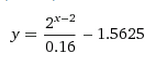

# TP2 - Programação Web Empreendimentos SA

Você acordou um dia sentindo-se um empreendedor nato e se juntou a outro (1)
colega para desenvolver um novo serviço Web revolucionário e, de quebra, ficar
rico.

Esse novo serviço que você vai criar deve ser um dos listados abaixo:

- Um **loja** de e-commerce tão boa que venda gelo para eskimó
- Um **ambiente virtual de aprendizagem** (AVA) que vá substituir o Moodle
- Um **sistema de blogs** para desbancar o Wordpress
- Um **portal de notícias** forjadas
- Um sistema de gerenciamento de **tarefas** a serem procrastinadas
- Uma aplicação para visualizar e compartilhar **trechos de código** html, css e javascript fazendo forte concorrência ao jsfiddle

Você também pode propor outra alternativa para o professor, mas faça isso o
quanto antes para que haja tempo de desenvolver. Não vale entregar algo que o professor não sabia que vocês estavam desenvolvendo.

Como você se lembra do curso de programação Web via correspondência que fez,
o serviço Web que você vai criar deve possuir os seguintes elementos:

1. A funcionalidade básica, porém completa, típica do serviço que está criando. Por exemplo:
  - Para uma loja, precisa da página inicial, página
    de produto e carrinho de compra
  - Para o sistema de tarefas, precisa de cadastro de
    usuário, registro, edição e exclusão de tarefas etc.
1. Pelo menos 3 páginas diferentes
1. As páginas devem ter conteúdo dinâmico
1. Persistência de dados no servidor (banco de dados ou arquivos)
1. Chamadas AJAX para recuperação de dados ou para atualização de trechos da página
1. Autenticação/criação de usuário
1. _Layout_ e _design_ agradáveis - não precisa ser profissional, mas também não pode ter carinha de site da década de 90

## Funcionalidade extra

O que foi descrito anteriormente do trabalho equivale a uma pontuação de 80%.
Para chegar a 100% (ou a mais e ganhar uns pontinhos extras, até o limite de 120%), você deve
implementar também um conjunto de outras funcionalidades, a saber:

- Usar APIs do HTML5 de forma a melhorar a experiência de usuário **(3-8% cada)**
- Fazer as páginas "responsivas" **(5%)**
- Animações e/ou transições CSS **(5%)**
- Desenvolver no formato de _Single Page Application_ usando **(12%)**
  - [Backbone](http://backbone.org)
  - [Angular](http://angularjs.org/)
  - [Knockout](http://knockoutjs.com/)
  - [Ember](http://emberjs.com/)
  - [React](https://facebook.github.io/react/), etc
- Usar um preprocessador CSS **(7%)**
- Usar _sprites_ CSS para imagens pequenas **(5%)**
- Usar um serviço de autenticação de terceiros como Google, Facebook, Twitter, Github etc.
**(8%)**
- Usar um _task runner_ como GruntJS, Gulp, Broccoli etc. para
  - "Minificar" os arquivos CSS e JS **(3%)**
  - Reduzir tamanho de imagens **(3%)**
  - Gerar CSS _sprites_ automaticamente **(3%)**
- Usar um carregador de módulos Javascript AMD (RequireJS, YUI3) ou CommonJS (
  Browserify) **(8%)**
- _Upload_ de arquivos **(5%)**
- Integrar a uma API de terceiros existente, e.g., Google Analytics, Google Maps, Facebook,
  Google+ etc. **(1-10%)**
- Envio de emails a partir do servidor (e.g., quando
  o usuário cadastra) **(5%)**
- Acesso aos dados do servidor exclusivamente por meio de um _web service_ criado por vocês **(7%)**

Você pode usar bibliotecas/frameworks Javascript e CSS. Contudo, para usar as
listadas abaixo, você precisa pagar uns pontinhos:

- jQuery (-8%)
  - Plugin jQuery de terceiros (-2% cada)
- Bootstrap/Foundation/Materialize (e similares) (-8%)

## Critérios de avaliação

O código do serviço Web será avaliado, dentre outros fatores, segundo:

1. Esforço de implementação
  - Um trabalho cujo código foi gerado automaticamente (e.g., _scaffolding_ do Rails, Grails etc.) não valerá muitos pontos
1. Aderência da implementação dos elementos obrigatórios à especificação
1. Separação de responsabilidades (HTML -> estrutura, CSS -> apresentação, JS
    -> comportamento)
1. Boas práticas de programação tanto no cliente quanto no servidor
1. Utilização de HTML5 e CSS3 válidos e de compatibilidade entre os principais navegadores

## Instruções gerais

O trabalho deve ser produzido integralmente pelo grupo. **Trabalhos muito semelhantes receberão nota 0**, independente de quem copiou
de quem. Trabalhos semelhantes aos de outras pessoas (ex-alunos, pessoas na Internet)
também receberão nota 0.

## O que faz perder nota

Alguns descuidos podem fazer com que sua nota fique muito abaixo do esperado:
- Cópia de trabalho de outrem: nota 0
- Ausência de qualquer item obrigatório da entrega
- Ausência de itens da especificação obrigatória
- Baixa legibilidade do código
- Baixa qualidade da implementação
- Atraso na entrega. Cada dia de atraso reduz o valor máximo de nota da
  maneira abaixo. Considere `x` como dias de atraso e `y` a penalidade
  percentual na nota:

  
  - Isso implica que 1 ou 2 dias de atraso são pouco penalizados
  - E após 5 dias de atraso, o trabalho vale 0
  - _Seeing is believing_: https://www.google.com.br/search?q=y%3D(2%5E(x-2)%2F0.16-1.5625)%2Cy%3D100

## O que deve ser **entregue**

O trabalho deve ser entregue via GitHub ou BitBucket, em um
repositório com o nome `web-projeto`. Não se esqueça de fazer vários e
pequenos _commits_, que é uma importante boa prática em `git` e também é
interessante para demonstrar seu progresso. Todos os integrantes do grupo devem participar (vou procurar a carinha de cada um nos _commits_ :).

Além do código do seu serviço Web, seu repositório deve conter também um arquivo README.md em sua pasta raiz que descreva brevemente o que ele é e contenha a lista de itens extras (ou penalidades) as quais está pleiteando.

Você deve usar um serviço de hospedagem gratuito para a avaliação do seu
trabalho. Abaixo, uma lista desses serviços que possuem um plano gratuito:

- [Heroku](https://www.heroku.com/) (Java, Grails, Node, Ruby)
- [Appfog](https://www.appfog.com/) (Java, Grails, Node, Ruby)
- [Openshift](https://www.openshift.com/) (Java, Grails)
- [cloudno.de](http://cloudno.de/) (Node)

Se você não conhecer serviços gratuitos que atendam às necessidades do seu
projeto, converse com o professor.

Ao final do seu trabalho, você deve submeter pelo Moodle o link do seu repositório
e o link do seu site hospedado.
