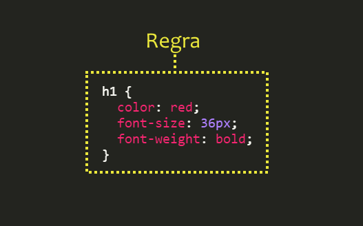
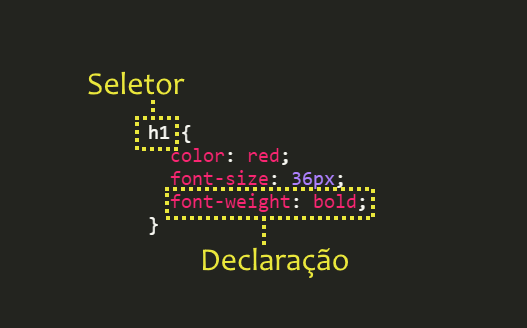
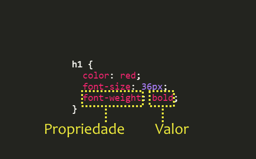

# CSS - Parte 1

---
# Roteiro de hoje

1. História
1. A sintaxe
1. Classes e IDs
1. A cascata
1. Seletores
1. **Os Ninjas**

---
## História

1989 - 1993 <!-- {.bullet-old} -->
  ~ Tim Berners-Lee cria a WWW em CERN
    (_European Organization for Nuclear Research_) e a deixa aberta ao público
    geral <!-- {dd:.bullet-old} -->

1994
  ~ ::: figure .floating-portrait-container.push-right
    
    :::
    Håkon propõe uma linguagem para dar conta da responsabilidade
    de alterar a aparência de páginas web chamada CSS

1996
  ~ Juntamente com Bert Bos, Håkon publica a especificação do
    **CSS1**
    
1998
  ~ Já gerenciado pela W3C, a especificação do **CSS2** foi
  publicada
  
1998 - 2014
  ~ Desenvolvimento da especificação do **CSS3** (_living standard_)

2013
  ~ Håkon tornou-se CTO na _Opera Software_

---
# Recapitulando a **sintaxe**

---
## Sintaxe: **regra**



---
## Sintaxe: **seletor** e **declaração**



---
## Sintaxe: **propriedade** e **valor**



---
## Problema: **selecionando** elementos

- Como fazemos para selecionar (_e.g._):
  1. apenas **alguns parágrafos** em vez de todos?
  1. apenas o **primeiro título h2** da página?
  1. apenas **uma imagem em especial**?
- Uma solução possível é usar os atributos universais¹ HTML chamados
  **`class`** e **`id`** para identificar os elementos e estilizá-los
  - ¹: atributos que qualquer elemento pode ter

---
# Classes e IDs
---
## Classe

- Até agora, estilizamos elementos `html` da seguinte forma:
  ```css
  p {
    color: blue;
  }
  ```
  - Isso faz com que **todos** os parágrafos sejam estilizados com a cor azul
  - Como fazemos, então, para estilizar apenas um ou um subconjunto de
    parágrafos da forma como queremos?
    - Resposta: usando **classes**

---
## Classe (cont.)

- Dada a seguinte estrutura de um &lt;body&gt;&lt;/body&gt;:
  ```html
  <p>Primeiro</p>
  <p>Segundo</p>
  <p>Terceiro</p>
  ```
- Para criar uma regra `CSS` para, digamos, os dois primeiros parágrafos, podemos
  alterar a estrutura `html` para:
  ```html
  <p class="destacado">Primeiro</p>
  <p class="destacado">Segundo</p>
  <p>Terceiro</p>
  ```
- continua...

---
## Classe (cont.)

- E, em um arquivo `CSS`, podemos escrever o nome da _tag_, seguido por um ponto
   "`.`", seguido pelo nome da classe:
  ```css
  p.destacado {
    font-weight: bold; /* negrito */
  }
  ```
- Ou, se quisermos usar a classe `destacado` para outros elementos que não
  `<p></p>`, podemos omitir o nome da _tag_:
  ```css
  .destacado {
    font-weight: bold;
  }
  ```

---
## Atributo Universal **ID**

- Caso soubermos que um elemento deve aparecer apenas uma vez no arquivo `html`
  (por exemplo, o menu principal, o logotipo etc.), podemos usar **um
  identificador único** que chamamos de **id**
  ```html
  
  ```
- Para criar uma regra `CSS` para esse elemento, podemos utilizar seu id
  precedido por `#`, opcionalmente precedido pelo nome da _tag_:
  ```css
  #logotipo {
    width: 250px;
  }
  ```

---
# A Cascata

---
## Cascata

- CSS é a sigla para _**Cascading** Style Sheets_
- Algumas propriedades são herdadas dos elementos ascendentes
  - ```css
    body {
      color: red;
    }
    ```
    - Todo o texto que estiver dentro de &lt;body&gt;, mesmo que dentro de
      parágrafos ou outros elementos, ficarão vermelhos

---
## Exemplo da Cascata

<iframe width="100%" height="300" src="//jsfiddle.net/fegemo/gqgacz36/embedded/html,css,result/" allowfullscreen="allowfullscreen" frameborder="0"></iframe>

- Nota: clique nas abas "HTML", "CSS" e "Result". Para editar o código, clique
  em "Edit in JSFiddle"

---
## Cascata (cont.)

- Para as propriedades que não são herdadas por padrão (_e.g._, `border`),
  podemos forçar que sejam herdadas usando o valor `inherit`:
  ```css
  p {
    border: 1px solid red;
  }
  em {
    border: inherit;
  }
  ```

---
## Cascata (cont.)

- Também podemos sobrescrever a herança de uma propriedade:
  ```css
  body {
    font-weight: bold;
  }
  em {
    font-weight: normal;
  }
  ```

---
# Seletores

---
## Seletores

- Até agora, já sabemos selecionar elementos:
  1. Pelo **nome de sua _tag_**: `p { color: white; }`
  1. Por (uma de) suas **classes**: `.spam { color: red; }`
  1. Por seu **id**: `#topo-da-pagina { color: green; }`
- Contudo, a vida não para por aí...
  - Há 20+ tipos de seletores (dos quais já vimos 3)
  - Não é necessário decorar todos, apenas saber que existem para poder
    consultá-los (Google) depois ;)

---
## Seletor: **Descendente**

- Formato: `X Y`
- Exemplo
  ```css
  li a {
    text-decoration: none;
  }
  ```
- Descrição: seleciona todos os elementos `a` que têm um `li` como antecedente

---
## Seletor: **Filho** direto

- Formato: `X` &gt; `Y`
- Exemplo
  ```css
  #menu-principal > ul {
    padding: 20px;
  }
  ```
- Descrição: seleciona todos os elementos `ul` que têm `#menu-principal` como
  elemento pai

---
## Seletor: **Adjacente**

- Formato: `X + Y`
- Exemplo
  ```css
  ul + p {
    color: red;
  }
  ```
- Descrição: seleciona o `p` que é imediatamente antecedido por um `ul`

---
## Seletor: **Irmão**

- Formato: `X ~ Y`
- Exemplo
  ```css
  ul ~ p {
    color: red;
  }
  ```
- Descrição: seleciona todos os `p`s que aparecem no mesmo nível de um `ul`,
  após este último

---
## Seletor: por **Atributo**

- Formato: `X[atributo]`
- Exemplo
  ```css
  img[alt] {
    border: 1px solid blue;
  }
  ```
- Descrição: seleciona toda `img` que contém o atributo `alt`

---
## Seletor: por **valor** de **atributo**

- Formato: `X[atributo="valor"]`
- Exemplo
  ```css
  a[href="http://google.com/"] {
    color: blue;
  }
  ```
- Descrição: seleciona todo `a` que tem um atributo `href` igual a http://google.com/

---
## Seletor: por **trecho de valor** de **atributo**

- Formato: `X[atributo*="trecho"]`
- Exemplo
  ```css
  a[href*="goo"] {
    color: white;
  }
  ```
- Descrição: seleciona todo `a` cujo atributo `href` contenha a _string_ `"goo"`

---
## Seletor: por **trecho inicial de valor** de **atributo**

- Formato: `X[atributo^="trecho"]`
- Exemplo
  ```css
  a[href^="http"] {
    background: url(globo.png) no-repeat;
  }
  ```
- Descrição: seleciona todo `a` cujo atributo `href` comece com a _string_
  `"http"`

---
## Seletor: por **trecho final de valor** de **atributo**

- Formato: `X[atributo$="trecho"]`
- Exemplo
  ```css
  img[src$=".jpg"] {
     color: red;
  }  
  ```
- Descrição: seleciona toda `img` cujo atributo `src` termine com a _string_
  `".jpg"`

---
## Seletor: elemento **no estado selecionado**

- Formato: `X:checked`
- Exemplo
  ```css
  input[type="radio"]:checked {
     border: 1px solid black;
  }  
  ```
- Descrição: seleciona o elemento _radio_ em seu estado "marcado"

---
## Seletor: **after** e **before**

- Formato: `X:after` ou `X:before`
- Exemplo
  ```css
  a:before {
    content: " ";
    width: 20px;
    background: url(globe.png) no-repeat;
  }
  ```
- Descrição: seleciona (e cria) um elemento anterior (`before`) ou posterior
  (`after`) quaisquer `a`s

---
## Seletor: **hover**

- Formato: `X:hover`
- Exemplo
  ```css
  tr:hover {
    background-color: red;
  }
  ```
- Descrição: seleciona o estado "com mouse em cima" do elemento (no caso, `tr`s)

---
## Seletor: **Negação**

- Formato: `X:not(seletor)`
- Exemplo
  ```css
  p:not(.destacado) {
    color: gray;
  }
  ```
- Descrição: seleciona todos os elementos (`p`) que não passem pelo teste do
  `seletor` (têm a classe `destacado`)

---
## Seletor: **pseudo elemento**

- Formato: `X::pseudoElemento`
- Exemplo
  ```css
  p::first-letter {
    font-size: 5em;
  }
  ```
- Descrição: seleciona um fragmento (`first-letter`) do elemento (`p`)

---
## Outros seletores

- `X:first-child`
- `X:last-child`
- `X:nth-child(n)`
- `X:nth-last-child(n)`
- `X:nth-of-type(n)`
- `X:nth-last-of-type(n)`
- `X:only-child`
- `X:only-of-type`
- `X:first-of-type`

<!-- {ul:.multi-column-list-2}-->

---
## Atividade de Hoje

1. Instalar o git na máquina, caso ele não esteja instalado
1. **Criar um _fork_** do repositório do professor em [`https://github.com/fegemo/cefet-web-ninjas`](https://github.com/fegemo/cefet-web-ninjas)
  e **cloná-lo para sua área de trabalho**
1. Fazer o exercício e fazer _commits_ e _push_ no seu repositório
1. Enviar, via **Moodle**, o link do seu repositório até o final da aula

---
## Exercício


1. Você deve estilizar as duas páginas web do repositório usando os
  conhecimentos que vimos nas aulas anteriores
1. Lembre-se das boas práticas - prefira usar CSS _linked_ (_i.e._, em arquivo
  separado)
1. Você pode modificar o HTML das páginas para colocar `class` e `id` nos
  elementos para os quais essa alteração seja necessária
1. Siga os passos descritos no [arquivo README.md do exercício](https://github.com/fegemo/cefet-web-ninjas/blob/gh-pages/README.md)

---
# Referências

1. Capítulo 7 do livro
1. [Os 30 seletores CSS que você precisa memorizar (inglês)][css-selectors-30]

[css-selectors-30]: http://code.tutsplus.com/tutorials/the-30-css-selectors-you-must-memorize--net-16048
[Print a Book in CSS]: http://alistapart.com/article/boom
