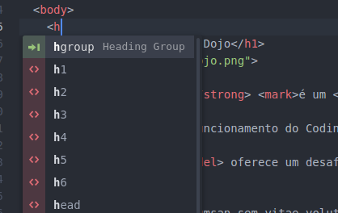
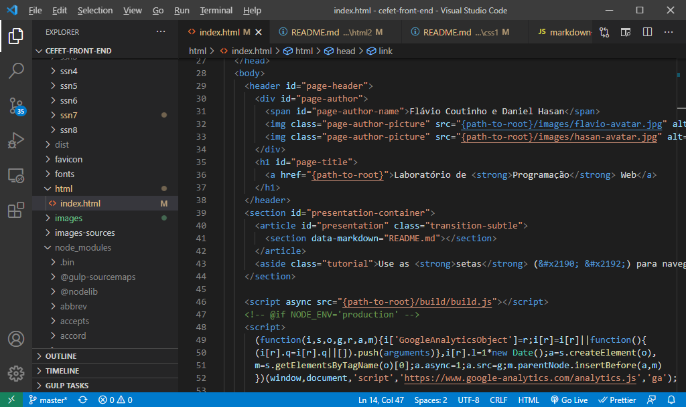
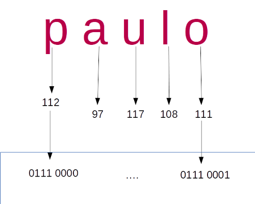
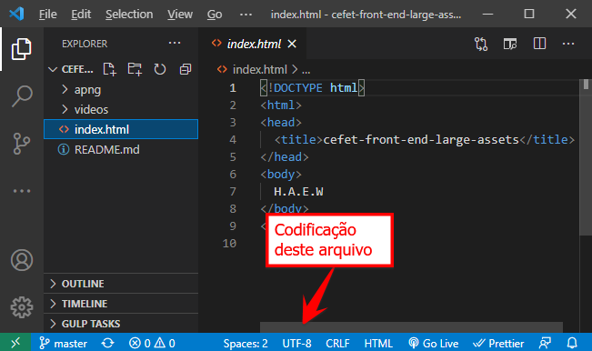
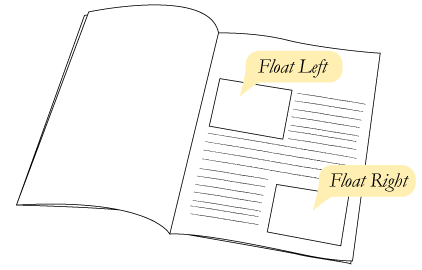
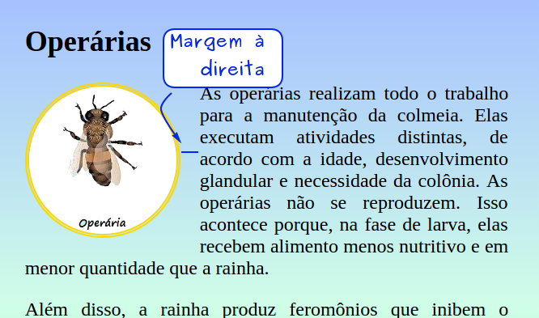
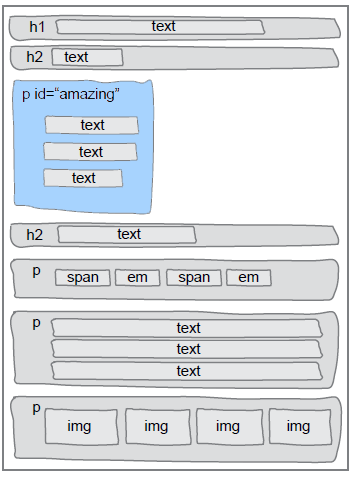
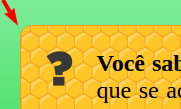

<!-- {"layout": "title"} -->
# **CSS** parte 1
## Seletores de classe, Flutuação e Abelhas :honeybee:

---
# Na última aula...

- Tabelas são criadas com as tags
  - **`<table>...</table>`**, para marcar a tabela
  - `<thead>...</thead>`, cabeçalho, contém linhas
  - `<tbody>...</tbody>`, corpo, contém linhas
  - `<tfoot>...</tfoot>`, rodapé, contém linhas
  - **`<tr>...</tr>`**, linha da tabela
  - **`<td>...</td>`**, célula de dados
  - `<th>...</th>`, célula do cabeçalho
  - `<caption>...</caption>`, legenda
- [Referência na Mozilla Developer Network][mdn-table]

[mdn-table]: https://developer.mozilla.org/en-US/docs/Web/HTML/Element/table

---
<!-- {"layout": "centered"} -->
# Hoje veremos

1. [Editores de Texto](#editores-de-texto)
1. [DOCTYPE e Codificação](#doctype-e-codificacao)
1. [Reaproveitando código CSS](#reaproveitando-codigo-css)
1. [Abelhas :honeybee: e suas castas](#abelhas-e-suas-castas)

---
<!-- {"layout": "section-header", "hash": "editores-de-texto"} -->
# Editores de texto
## Ferramentas para edição e melhoria da produtividade

- Editores de texto
- _Hotkeys_
<!-- {ul:.content} -->

---
## Como ser mais **produtivo**

- Na hora de escrever código HTML, CSS e JavaScript, queremos ter:
  - **Destacamento (_highlighting_) de código fonte**
  - **Indentação** automática
  -  <!-- {.push-right} -->
    **Auto-completar** tags HTML, propriedades CSS etc.
- Editores indicados:
  - [VSCode][vscode] (gratuito 🌟)
  - [Atom][atom] (gratuito)
  - [Sublime Text 3][sublime] (pago, faz vista grossa com quem não paga)

[atom]: https://atom.io/
[sublime]: https://www.sublimetext.com/3
[vscode]: https://code.visualstudio.com/

---
<!-- {"layout": "2-column-content"} -->
## Sugestão do professor: **VS Code** 🌟

- Benefícios: <!-- {ul:.no-padding} --> <!-- {li:style="list-style-type: none"} -->
  - **Gratuito**
  - Altamente **personalizável**
  - **Atalhos** úteis
- **Atenção:** os atalhos e sugestões no VS Code só irão **funcionar após salvar**
  o arquivo como `.html` <!-- {li:.note.warning style="margin-top: 1em"} -->

[](https://code.visualstudio.com/) <!-- {style="max-width: 540px; margin-top: 1.5em;"} -->

---
<!-- {"layout": "2-column-content"} -->
## Abrindo uma pasta inteira

<video src="https://fegemo.github.io/cefet-front-end-large-assets/videos/vscode-opening-project.mp4" width="100%" controls></video>

- Evite "Open File" (1 arquivo só), abra uma pasta inteira (**"Open Folder"**)
  - Deixa claro quais arquivos compõe a página/site
- Salve o arquivo (ex, `.html`) para ter coloração de sintaxe
- Mantenha a indentação. Se precisar corrigir:
  1. <kbd>Ctrl</kbd>+<kbd>Shift</kbd>+<kbd>P</kbd> (guia de comandos)
  1. _Format Document_

---
<!-- {"layout": "2-column-content"} -->
## Digitando sem erros

- Solicite do editor o **esqueleto básico** de uma página HTML
  - Digite a palavra "html" e pressione <kbd>Tab ↔️</kbd>
- Evite usar as teclas <kbd>&lt;</kbd> e <kbd>&gt;</kbd>
  - Digite apenas o nome da _tag_, depois <kbd>Tab ↔️</kbd>
  - Assim você fica muito mais rápido
- Use os atalhos sugeridos
  - Algumas _tags_ já vêem com atributos básicos (ex, ``)

<video src="https://fegemo.github.io/cefet-front-end-large-assets/videos/vscode-autocomplete.mp4" width="100%" controls></video>

---
<!-- {"layout": "2-column-content"} -->
## Atualização automática ao salvar

<video src="https://fegemo.github.io/cefet-front-end-large-assets/videos/vscode-auto-reload.mp4" width="100%" controls></video>

- Instale uma extensão (_plugin_ ou _add-on_) para **atualizar automaticamente o navegador** sempre que salvar um arquivo
  
  VS Code <!-- {dl:.width-30} -->
  ~ Live Server ([link][live-server])

  Atom
  ~ Atom Live Server ([link][atom-live-server])
- Efeito colateral: estará acessando o site usando um **servidor web**

[live-server]: https://marketplace.visualstudio.com/items?itemName=ritwickdey.LiveServer
[atom-live-server]: https://atom.io/packages/atom-live-server

---
<!-- {"layout": "section-header", "hash": "doctype-e-codificacao"} -->
# Codificação e DOCTYPE

- Codificação do arquivo
  - Como um texto é armazenado em seu computador?
    - ASCII
    - UNICODE e UTF-8
- Versão do HTML:
  - DOCTYPE
<!-- {ul^3:.content} -->

---
<!-- {"layout": "2-column-content"} -->
## Como o texto é armazenado em seu computador?

<!-- {.push-right.invert-colors-dark-mode style="height: 300px"} -->

- Arquivos HTMLs são representados como arquivos textuais
- Porém, internamente, eles são armazenados no formato **numérico** em **binário**
- Codificação é um **<u>mapeamento</u> de letras para números**
- Na web há vários tipos de codificações:
  - (1) ASCII, (2) UNICODE, ...

---
## Codificação **ASCII**

- ASCII é um dos **mais antigos** padrões de codificação
- Cada caractere (letra) é representada por um número
- Esta codificação possui:
  - Letras do alfabeto latino/romano
  - Pontuações
  - Números e símbolos matemáticos
  - Símbolos de controle (tab, espaço...)

---
<!-- {"layout": "2-column-content"} -->
## **Tabela ASCII** (um pedacinho)

| Código| Letra 	|
|:-----:|:-------:|
| ⋮    |   ⋮     |
| 32    | Espaço 	|
| 33    |     ! 	|
| 34    |     "   |
| ⋮    |    ⋮    |
| 65    |    A    |
| 66    |    B    |
| 67    |    C    |
| ⋮    |    ⋮    |

| Código| Letra 	|
|:-----:|:-------:|
| ⋮    |   ⋮     |
| 97    |    a    |
| 98    |    b    |
| 99    |    c    |
| ⋮    |    ⋮    |

---
## Codificação **Unicode** e UTF-8

- Unicode provê o suporte multilíngua <!-- {ul:.full-width.bulleted-0} -->
  - Diversos alfabetos, não apenas o romano/latino
- **UTF-8** é uma codificação que usa uma sequência de **8 bits** para
  armazenar códigos UNICODE
  - Os 128 primeiros caracteres UTF-8 são idênticos aos ASCII
    - Ou seja, todo o alfabeto, pontuações mais comuns e números
- <!-- {li:.push-code-right.compact-code-more} -->
  ```html
  ...
  <head>
    <meta charset="utf-8">  <!-- USE ESTA META TAG -->
    <title>...</title>
    ...
  ```
  Em HTML, dentro do `<head>` da página, usamos uma `<meta>` _tag_ com
  o atributo `charset` para isso ➡️
  - Essa _tag_ deve aparecer nos primeiros 1024 caracteres da página ([entenda][mdn-charset])
- Para ASCII, seria `<meta charset="ISO-8859-1">` (ASCII romano/latino)

[mdn-charset]: https://developer.mozilla.org/pt-BR/docs/Web/HTML/Element/meta#attr-charset

---
## Codificação em uma página web

-  <!-- {.push-right style="max-width: 360px"} -->
  Além do arquivo HTML especificar, o próprio arquivo **deve estar salvo usando UTF-8**. No VS Code ➡️
- Opções de codificação são gerenciadas pela IANA e [podem ser vistas aqui](http://www.iana.org/assignments/character-sets/character-sets.xhtml)


1.  <!-- {.push-left style="max-width: 360px;"} --> <!-- {ol:.no-padding.no-bullets.no-margin} -->
  ⬅️ Caso haja divergência de codificação, alguns caracteres podem não aparecer corretamente

*[IANA]: Internet Assigned Numbers Authority

---
# DOCTYPE - Versão do HTML

- Especifica qual a versão do HTML que estamos usando. Formato: <!-- {ul:.full-width} -->
  ```html
  <!DOCTYPE ... >
  ```
- Deve ser a primeira "_tag_" em um arquivo HTML
  - Não pode haver nem comentários antes: <!-- {li:.two-column-code} -->
    ```html
    <!DOCTYPE html> ✔️
    <html>
    ...
    <!-- um comentário --> ❌
    <!DOCTYPE html>
    <html>
    ```

---
## Valores do DOCTYPE

HTML 4.01
~ ```xml
  <!DOCTYPE html PUBLIC "-//W3C//DTD HTML 4.01//EN"
  "http://www.w3.org/TR/html4/strict.dtd">
  ```

XHTML 1.1
~ ```xml
  <!DOCTYPE html
    PUBLIC "-//W3C//DTD XHTML 1.1//EN"
    "http://www.w3.org/TR/xhtml11/DTD/xhtml11.dtd">
  ```

HTML5
~ ```xml
  <!DOCTYPE html>
  ```

Hoje em dia usamos sempre HTML5 😉 <!-- {.flex-align-center} -->

---
<!-- {"layout": "section-header", "hash": "reaproveitando-codigo-css"} -->
# Reaproveitando código CSS
## Seletor de classe, incluindo arquivo e mais sobre cores

- Seletor de classes
- Incluindo arquivos **CSS**
- Cores e Gradientes
<!-- {ul:.content} -->

---
<!-- {"layout": "centered-horizontal", "embedSVG": "img[src$='.svg']", "styles": ["../../styles/classes/css-rule-anatomy.min.css"]} -->
## Relembrando... **regra CSS**

-  <!-- {.css-rule-anatomy.rule.push-right data-viewbox="56 0 90 10" style="width: 250px"} -->
-  <!-- {.css-rule-anatomy.declaration.selector.push-right data-viewbox="50 10 150 65" style="width: 370px"} -->
-  <!-- {.css-rule-anatomy.property.value.push-right data-viewbox="56 30 90 65" style="width: 250px"} --> <!-- {ul:.card-list} -->


---
## Problema: **selecionando** elementos

- Como fazemos para selecionar (_e.g._): <!-- {ul:.bulleted} -->
  1. apenas **alguns parágrafos** em vez de todos?
  1. apenas o **primeiro título h2** da página?
  1. apenas **uma imagem em especial**?
- Uma solução possível é usar os atributos universais¹ HTML chamados
  **`class`** e **`id`** para identificar os elementos e estilizá-los
  > ¹**Atributos universais**: aqueles que qualquer elemento pode ter <cite>Coutinho & Hasan, 2021</cite>
  >
- Vamos ver diferentes formas para isso...

---
## Selecionar **por nome de _tag_**

- Até agora, estilizamos elementos HTML de duas formas:
- **Primeira forma:** Selecionando a _tag_:
  ```css
  p {
    color: blue;
  }
  ```
  - Isso faz com que **todos os parágrafos** fiquem com a cor azul

---
## Selecionar **por `id`**

- **Segunda forma:** selecionando 01 elemento em específico
  - Supondo que temos: `<p id="resumo">Este é o resumo da notícia...</p>`:
  ```css
  #resumo {
    color: blue;
  }
  ```
  - Deixando de cor azul apenas o parágrafo cujo `id` é `resumo`.
  - Contudo, <u>não pode haver mais de 1 elemento</u> com o mesmo `id` <!-- {li:.bullet} -->
  - Como fazemos, então, para estilizar não apenas 01, mas **um subconjunto de
    elementos** da forma como queremos? <!-- {li:.bullet} -->
    - Resposta: usando **classes** <!-- {li:.bullet} -->

---
<!-- {"hash": "css-seletor-por-classe"} -->
## Selecionar **por classe**

- Dada a seguinte estrutura de um `<body></body>`:
  ```html
  <p>Primeiro</p>
  <p>Segundo</p>
  <p>Terceiro</p>
  ```
- Para criar uma regra CSS para, digamos, os dois primeiros parágrafos, podemos
  alterar a estrutura HTML para:
  ```html
  <p class="destacado">Primeiro</p>
  <p class="destacado">Segundo</p>
  <p>Terceiro</p> <!-- continua no próximo slide -->
  ```

---
## Selecionar por classe (cont.)

- E, em um arquivo CSS, podemos escrever o nome da _tag_, seguido por um ponto
   "`.`", seguido pelo nome da classe:
  ```css
  p.destacado {
    font-weight: bold; /* negrito */
  }
  ```
- Ou, se quisermos usar a classe `destacado` para outros elementos além de
  `<p></p>`, podemos omitir o nome da _tag_:
  ```css
  .destacado {
    font-weight: bold;
  }
  ```

---
<!-- {"hash": "incluindo-css"} -->
# Incluindo arquivo CSS

- Por enquanto, colocamos o CSS **dentro do arquivo HTML**
   ```html
   <style> /* reaproveitamento de código CSS dentro do arquivo */
     p {
       color: #fff;
     }     /* misturamos código CSS dentro do arquivo HTML */
   </style>
   ```
   - Mas **isto é uma prática ruim**! :scream:

---
## Referenciando o **CSS usando a tag _link_**

- Um arquivo HTML pode referenciar ("incluir") um CSS assim:
  ```html
  <link rel="stylesheet" href="arquivo-de-estilos.css">
  ```
  - Mais de um arquivo HTML pode usar esse CSS
    - **Reaproveitamento** de código CSS
  - **_Caching_** do arquivo CSS: o arquivo é baixado apenas uma vez e
    usado sempre que necessário
    - Útil se o site tem várias páginas
- Quando o navegador lê essa linha, ele baixa esse arquivo CSS e o interpreta

---
<!-- {"layout": "2-column-content"} -->
## Referenciando o CSS : Exemplo de **atalho no Atom**

- Esqueceu toda a sintaxe (forma de escrita)?
- Digite apenas `link` e, logo após, aperte <kbd>Tab ↔️</kbd>:
- O mesmo vale para o VS Code

<video src="../../videos/link-css-atom.mp4" height="340" controls style="margin: 0 auto;"></video>

---
<!-- {"hash": "cores-e-gradientes", "layout": "main-point", "state": "emphatic"} -->
<style>
.color-text { color: #ffff0a; }
.gradient-text {
    background: linear-gradient(to right, #0f9000, #c900d6);
    -webkit-background-clip: text;
    -webkit-text-fill-color: transparent;
  }
</style>

# <span class="color-text">Cores</span> e <span class="gradient-text">Gradientes</span>

---
<!-- {"layout": "3-column-content", "slideStyles": {"grid-template-columns": "auto auto auto", "grid-template-rows": "auto auto auto"}, "classes": "compact-code-more", "styles": "../../styles/classes/color-portraits.min.css"} -->
## Notações: Nome, RGB e Hexadecimal

- ### **Nomes** <!-- {ul:.no-bullets.no-padding.no-margin} -->
  <pre class="hljs"><code><span class="color-portrait red"></span> red
  <span class="color-portrait cyan"></span> cyan
  <span class="color-portrait gold"></span> gold
  <span class="color-portrait forestgreen"></span> forestgreen
  <span class="color-portrait cornflowerblue"></span> cornflowerblue
  <span class="color-portrait rebeccapurple"></span> rebeccapurple
  ⋮</code></pre>
1. ### Notação **RGB** <!-- {ol:.no-bullets.no-padding.no-margin} -->
   <pre class="hljs"><code>rgb(<span style="color: #fb4d4d">verme</span>, <span style="color: #18dc18">verde</span>, <span style="color: cornflowerblue;">azul</span>)</code></pre>
   - rgb(...) com número entre 0...255 para <u>verme</u>lho, <u>verde</u>, <u>azul</u> <!-- {li:.smaller-text-80} -->
- ### Notação **Hexadecimal** <!-- {ul:.no-bullets.no-padding.no-margin} -->
  <pre class="hljs"><code>#<span style="color: #fb4d4d">vm</span><span style="color: #18dc18">vd</span><span style="color: cornflowerblue">az</span></code></pre>
  - '#' + 2 caracteres para <u>v</u>er<u>m</u>elho, <u>v</u>e<u>r</u>de, <u>az</u>ul <!-- {li:.smaller-text-80} -->
  - (0...9, A(10)...F(15)) <!-- {li:.smaller-text-80} -->

1. Exemplo: <!-- {ol:.no-bullets.no-padding.no-margin} -->
   ```css
   p {
     color: cyan;
   }
   ```
- Exemplo:<!-- {ul:.no-bullets.no-padding.no-margin} -->
  ```css
  p {
    color: rgb(0, 255, 255);
  }
  ```
1. Exemplo:<!-- {ol:.no-bullets.no-padding.no-margin} -->
   ```css
   p {
     color: #00ffff;
   }
   ```

---
<!-- {"layout": "3-column-content", "slideStyles": {"grid-template-columns": "auto auto auto", "grid-template-rows": "auto auto auto"}, "classes": "compact-code-more", "styles": "../../styles/classes/color-portraits.min.css"} -->
## Cores **com opacidade** <!-- {.underline.upon-activation.delay-1000} --> (transparência)

- ### **Nomes** <!-- {ul:.no-bullets.no-padding.no-margin} --> ❌
  <pre class="hljs"><code><span class="color-portrait red"></span> red
  <span class="color-portrait cyan"></span> cyan
  <span class="color-portrait gold"></span> gold
  <span class="color-portrait forestgreen"></span> forestgreen
  <span class="color-portrait cornflowerblue"></span> cornflowerblue
  <span class="color-portrait rebeccapurple"></span> rebeccapurple
  ⋮</code></pre>
  - Não tem como <!-- {li:.smaller-text-80} -->
1. ### Notação **RGB<u>A</u>** <!-- {ol:.no-bullets.no-padding.no-margin} -->
   <pre class="hljs"><code>rgb<ins>a</ins>(verme, verde, azul, <ins style="color: black; font-weight: bolder">alpha</ins>)</code></pre>
   - `alpha` é a opacidade da cor <!-- {li:.smaller-text-80} -->
     - opacidade = 1 - transparência <!-- {li:.smaller-text-80} -->
   - De 0 (transp.) até 1 (opaco) <!-- {li:.smaller-text-80} -->
- ### Notação **Hexadecimal <u>+AA</u>** <!-- {ul:.no-bullets.no-padding.no-margin} -->
  <pre class="hljs"><code>#vmvdaz<ins style="color: black; font-weight: bolder">aa</ins></code></pre>
  - 2 caracteres para `alpha` <!-- {li:.smaller-text-80} -->
  - De 0 (transp.) até FF (opaco) <!-- {li:.smaller-text-80} -->

1. Exemplo: <!-- {ol:.no-bullets.no-padding.no-margin} -->
   - Não tem!
- Exemplo:<!-- {ul:.no-bullets.no-padding.no-margin} -->
  ```css
  p {
    color: rgba(0, 255, 255, 0.5);
  }
  ```
1. Exemplo:<!-- {ol:.no-bullets.no-padding.no-margin} -->
   ```css
   p {
     color: #00ffff80;
   }
   ```

---
## Mais exemplos de cores

- ```css
  #FF0033 /* maiúsc. ou min. */
  #ff0033
  #f03
  ```
  <!-- {ul:.push-code-right} -->
  Se ambos caracteres de cada componente em hexa são iguais (ex: `#ff0033`), pode escrever só 1 de cada (ex: `#f03`)
- ```css
  rgb(255, 0, 51)
  rgb(100%, 0%, 20%)
  rgba(255, 0, 0, 0.1)         
  ```
  Em vez de 0...255, pode escrever 0%...100% <!-- {li:.clearer} -->
- ```css
  hsl(60, 100%, 50%)
  hsla(240, 100%, 50%, 0.05)   
  ````
  Também existe `hsl(hue, sat, light)`, mas é menos comum <!-- {li:.clearer} -->

---
<!-- {"layout": "centered-horizontal", "hash": "escolhendo-cores"} -->
## Escolhendo cores (<kbd>F12</kbd>)

<video src="../../videos/escolhendo-cores.mp4" height="460" controls style="margin: 0 auto;"></video>

---
<!-- {"hash": "gradientes"} -->
## Gradientes (ou degradês)

- `linear-gradient` é um **valor válido para `background-image`**,
      e não para `background-color` nem para `color`
  - Veja a documentação do que é um [`gradient`](https://developer.mozilla.org/en-US/docs/Web/CSS/gradient)

1. <!-- {ol:.item-code-with-image.full-width.compact-code-more} -->
   ::: result . max-width: calc(100% - 600px);
   0 graus, iniciando com azul e terminando como verde <!-- {style="background-image: linear-gradient( 0deg, blue, #00FF00 ); font-size: 75%; color: white; text-shadow: 1px 1px black;"} -->
   :::
   ```css
   p {
     background-image: linear-gradient( 0deg, blue, #00FF00 );
   }
   ```
1. ::: result . max-width: calc(100% - 650px);
   Começa amarelo e termina azul no canto esquerdo superior  <!-- {style="background-image: linear-gradient( to left top, yellow, blue ); font-size: 75%; color: white; text-shadow: 1px 1px black;"} -->
   :::
   ```css
   p {
     background-image: linear-gradient( to left top, yellow, blue );
   }
   ```
1. ::: result . max-width: calc(100% - 600px);
   Azul, branco e verde <!-- {style="background-image:linear-gradient( 90deg, blue, white 20%,#00FF00); font-size: 75%; color: white; text-shadow: 1px 1px black;"} -->
   :::
   ```css
   p {
     background-image: linear-gradient( 90deg, blue, white 20%, #00FF00 );
   }
   ```

---
<!-- {"layout": "section-header", "hash": "abelhas-e-suas-castas"} -->
# Abelhas :honeybee: e suas castas
## :honey_pot: :honey_pot: :honey_pot: :honey_pot: :honey_pot:

- A atividade das abelhas
- Flutuando coisas
- Pesquisando novas propriedades CSS/elementos HTML
<!-- {ul:.content} -->

---
<!-- {"backdrop": "pratica-abelhas"} -->

---
# Abelhas :honeybee: e suas castas

1. [Baixe as imagens e páginas](https://github.com/fegemo/cefet-front-end-bees/archive/master.zip)
   que serão usados
   1. Descompacte o arquivo `cefet-front-end-bees-master.zip` na área de trabalho
      - Isto criará uma pasta com o nome `cefet-front-end-bees-master` lá
   1. **Renomeie** a pasta criada na área de trabalho para `site-abelhas`
      - Esta é a **pasta raiz** do site - onde devem ficar os arquivos `.html`
   1. Veja [instruções detalhadas aqui](https://github.com/fegemo/cefet-front-end-bees/blob/master/README.md)

---
<!-- {"hash": "flutuando-coisas"} -->
# Flutuando coisas

>  <!-- {.push-right style="height: 200px;"} -->
  **Jornais e revistas** costumam colocar **imagens junto ao texto** para
  fazer uma bela diagramação do conteúdo
> <cite>Coutinho, 2017</cite>
> Isso se chama **deixar o elemento** (_e.g._, imagem) **flutuando**
> <cite>Hasan, 2017</cite>

- Na web também queremos fazer isso!

---
<!-- {"layout": "centered-horizontal"} -->
## Como flutuar elementos usando CSS?



Vamos conhecer um nova propriedade: `float`

---
## Propriedade `float`

- Usado para alterar o fluxo tradicional da página
  - Em CSS:  
    ```css
    img#abelha-operaria {
      float: left; /* left, right, none */
    }              /* none é o valor padrão - sem flutuação */
    ```
  - No HTML:
    ```html
    
    <p>Texto ...</p>
    ```

---
## Como funciona o `float`

-  <!-- {.push-right} -->
  Um elemento flutuante é removido do fluxo tradicional e
  - os elementos `block` depois dele fingem que ele não está ali
  - os elementos `inline` depois dele respeitam seu formato
- Vamos fazer com que o parágrafo com `id="amazing"`
  flutue à direita **nos próximos 2 slides**...

---
## Exemplo de `float` (1º passo)

-   <!-- {.push-right style="max-height: 440px;"} -->
  Alterando a largura de um parágrafo para 200px
  ```css
  p#amazing {
    width: 200px;
  }
  ```

---
## Exemplo de `float` (2º passo)

-   <!-- {.push-right style="max-height: 350px;"} -->
  Flutuando o parágrafo à direita
  ```css
  p#amazing {
    width: 200px;
    float: right;
  }
  ```
  - Repare que:
    - Elementos declarados <u>antes</u> do parágrafo flutuante
      **não são alterados**
    - Elementos declarados <u>depois</u>:
      - Se forem `block`, **ignoram** o elemento flutuante
      - Se forem `inline`, **respeitam** o elemtno flutuante

---
<!-- {"hash": "arredondando-bordas"} -->
# Arredondando bordas

-  <!-- {.push-right} -->
  Como arredondar bordas?
  - Há muitas propriedades CSS que não teremos tempo de ver no curso
  - Contudo, a Web é uma ótima fonte de informação
  - Pesquise ["como arredondar bordas em CSS" no Google][border-radius-google],
    por exemplo

[border-radius-google]: https://www.google.com.br/search?hl=pt-BR&q=como+arredondar+bordas+em+css&meta=

---
<!-- {"layout": "centered"} -->
# Referências

1. Capítulos 5 e 6 do livro
