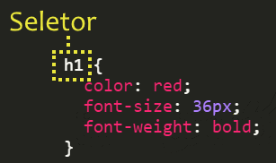
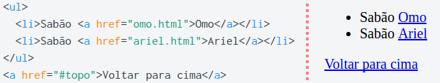

<!-- {"layout": "title"} -->
# CSS - Parte 2
## História, a Cascata e outros Seletores, Ferramentas e Ninjas :dash:

---
# Na última aula... (1/4)
## Ferramentas de Produtividade
- Boas ferramentas possuem: Destacamento de código fonte, identação e autocompletar
- Atalhos interessantes no **Atom**
  - Uso do <kbd>tab</kbd> após uma _tag_ para completar com a tag desejada (eg. `html`)
  - Visualização prévia do código: <kbd>Ctrl</kbd>+<kbd>Shift</kbd>+<kbd>M</kbd>

---
# Na última aula... (2/4)
## Codificação e DOCTYPE
- Codificação do arquivo
  - Como um texto é armazenado em seu computador?
    - ASCII
    - UNICODE e UTF-8
    <!-- {.push-right style="height: 300px"} -->
- Versão do HTML:
  - DOCTYPE

---
# Na última aula... (3/4)
## CSS

- **Seletores de classe**: uso de `.curiosidades` para selecionar
uma classe curiosidade (previamente definido na tag pelo atributo `class` )
- **Incluindo arquivos CSS**:
```html
<link rel="stylesheet" href="estilos.css">
```
  - Vantagem: Reaproveita o estilo para diversas páginas


---
# Na última aula... (4/4)

- **Cores e gradientes** :
  ```css
  p {
    background-image: linear-gradient( 45deg, blue, #00FF00 );
  }
  ```
   <!-- {.push-right style="max-height: 200px;"} -->

---
# Hoje veremos

1. [Ferramentas do Desenvolvedor](#ferramentas-do-desenvolvedor)
1. [Aprofundando em CSS](#aprofundando-em-css)
   - História
   - A cascata
   - Outros seletores
1. [Os Ninjas](#os-ninjas)

---
<!-- {"layout": "section-header", "slideHash": "ferramentas-do-desenvolvedor"} -->
# Ferramentas do Desenvolvedor
## Investigando erros e experimentando propriedades

- Ferramenta do Google Chrome
- Alterando/testando propriedades
- Investigando erros
  1. :mega: "Criei uma regra e ela não funcionou"
  1. :mega: "Apliquei uma propriedade e ela não apareceu"
  1. :mega: "Coloquei uma imagem ou arquivo CSS e não apareceu"

<!-- {ul:.content} -->

---
## Ferramentas do Desenvolvedor


---
## Exemplo: Alterando/testando propriedades

<video src="../../videos/desenv-chrome.mp4" height="400" controls style="margin: 0 auto;"></video>

---
## Usando as Ferramentas

- Visualizando o código fonte:
  - Tecla de atalho no Chrome: <kbd>Ctrl-U</kbd>
  - Ou então:
    1. clicar com **botão direito** do Mouse **na página**
    1. selecionar **"Exibir código fonte da página"**
- Ativando o depurador:
  - Tecla de atalho padrão: <kbd>Ctrl</kbd>+<kbd>Shift</kbd>+<kbd>I</kbd> ou <kbd>F12</kbd>
  - Ou então:
    1. clicar com **botão direito** do Mouse **na página**
    1. selecionar **"Inspecionar"**

---
### Investigando - _"Criei **uma regra** e ela **não funcionou**"_

<video src="../../videos/tools-investigate-wrong-selector.webm" height="500" controls style="margin: 0 auto;"></video>

---
### Investigando - _"Nova **propriedade não funcionou**"_

<video src="../../videos/tools-investigate-wrong-property.webm" height="500" controls style="margin: 0 auto;"></video>

---
### Investigando - _"**Arquivo não apareceu**"_

<video src="../../videos/tools-investigate-wrong-path.webm" height="500" controls style="margin: 0 auto;"></video>

---
<!-- {"layout": "section-header", "slideHash": "aprofundando-em-css"} -->
# Aprofundando<br>em **CSS**
## CSS: Folhas de Estilo em **Cascata**

- História
- A cascata
- Outros seletores

<!-- {ul:.content} -->

---
## História

1989 - 1993 <!-- {.bullet-old} -->
  ~ Tim Berners-Lee cria a WWW em CERN
    (_European Organization for Nuclear Research_) e a deixa aberta ao público
    geral <!-- {dd:.bullet-old} -->

1994
  ~ ::: figure .floating-portrait-container.push-right
      
    :::
    Håkon Wium Lie propõe uma linguagem para dar conta da responsabilidade
    de alterar a aparência de páginas web chamada CSS

1996
  ~ Juntamente com Bert Bos, Håkon publica a especificação do  **CSS1**
1998
  ~ Já gerenciado pela W3C, a especificação do **CSS2** foi
  publicada

1998 - 2014
  ~ Desenvolvimento da especificação do **CSS3** (_living standard_)

2013
  ~ Håkon tornou-se CTO na _Opera Software_

---
# A Cascata

---
## Cascata

- CSS é a sigla para _**Cascading** Style Sheets_
- Algumas propriedades são **herdadas** dos elementos ascendentes
  ```css
  body {
    color: #ff0000; /* mesmo que 'red' */
  }
  ```
  - Todo o texto que estiver dentro de `<body>...</body>`, mesmo que dentro de
    parágrafos ou outros elementos, ficarão vermelhos (!)

---
## Exemplo da Cascata

<iframe width="100%" height="300" src="//jsfiddle.net/fegemo/gqgacz36/embedded/result,html,css/" allowfullscreen="allowfullscreen" frameborder="0"></iframe>

- Nota: clique nas abas "HTML", "CSS" e "Result". Para editar o código, clique
  em "Edit in JSFiddle"

---
## Cascata (cont.)

- Para as propriedades que não são herdadas por padrão (_e.g._, `border`),
  podemos forçar que sejam herdadas usando o valor `inherit`:
  ```css
  p {
    border: 1px solid red;
  }
  em {
    border: inherit;
  }
  ```
  ::: result
  <p style="border: 1px solid red;">Este é um <em style="border: inherit">parágrafo</em> (&lt;em&gt; em 'parágrafo')</p>
  :::

---
## Cascata (cont.)

- Também podemos sobrescrever a herança de uma propriedade:
  ```css
  body {
    font-weight: bold;
  }
  em {
    font-weight: normal;  /* ou, então, font-weight: initial */
  }                       /* initial é o valor padrão para aquela tag */
  ```
  ::: result
  <p style="font-weight: bold;">Este é um <em style="font-weight: normal">parágrafo</em> (&lt;em&gt; em 'parágrafo')</p>
  :::

---
# Outros Seletores

---
## Seletores

-  <!-- {.push-right} -->
  Até agora, já sabemos selecionar elementos:
  1. Pelo **nome de sua _tag_**: `p { color: white; }`
  1. Por (uma de) suas **classes**: `.spam { color: red; }`
  1. Por seu **id**: `#manchete-principal { color: green; }`
- Contudo, a vida não para por aí...
  - Há 20+ tipos de seletores (dos quais já vimos 3)
  - Não é necessário decorar todos, apenas saber que existem para poder
    consultá-los (Google) depois ;)

---
<!-- {"layout": "regular"} -->
## Desafio #1

> Colorir de laranja **apenas os <u>links dentro da lista</u> não ordenada**:
>  <!-- {.centered} -->

- Poderíamos usar uma classe (`.marca-de-sabao`) nos links da lista
  - Mas há uma forma melhor!
  - É possível **fazer isso sem alterar o HTML**!

---
## Seletor: **Descendente**

- Exemplo:
  ```css
  ul a {
    text-decoration: none;
  }
  ```
  - Descrição: seleciona todos hiperlinks `a` que têm um `ul` como
    antecedente (pai, avô, bisavô etc.)
- Formato: `X Y` _(antecessor, espaço, elemento selecionado)_

---
## Seletor: **Filho** direto

- Exemplo:
  ```css
  #menu-principal > ul {
    padding: 20px;
  }
  ```
  - Descrição: seleciona todos os `ul` que têm `#menu-principal` como pai
- Formato: `X > Y` _(pai, sinal de maior, elemento selecionado)_

---
## Exemplo: **Filho direto** vs **Descendente**

```html
<p>
  <strong>Ola! <a href="http://www.google.com">Este é meu link! </a></strong>
  <a href="http://www.terra.com.br">Esta é uma outra pagina</a>
</p>
<a href="http://google.com">Este é outro link</a>
```
```css
p > a {
  text-decoration: line-through;
}
p  a {
  color: red;
}
```

:::result
<p >
  <strong style="color:black;">Ola! <a style="color:red;" href="http://www.google.com">Este é meu link! </a></strong>
  <a style="color:red;text-decoration: line-through;" href="http://www.terra.com.br">Esta é uma outra pagina</a>
</p>
<a style="color:blue" href="http://google.com">Este é outro link</a>
:::

---
## Seletor: por **Atributo**

- Exemplo:
  ```css
  img[alt] {
    border: 1px solid blue;
  }
  ```
  - Descrição: seleciona toda `img` que contém o atributo `alt`
- Formato: `X[atributo]` _(elem. selecion., nome do atributo entre colchetes)_

---
## Seletor: por **valor** de **atributo**

- Exemplo:
  ```css
  a[href="http://google.com/"] {
    color: blue;
  }
  ```
  - Descrição: seleciona todo `a` que tem um atributo `href`
    igual a http://google.com/
- Formato: `X[atributo="valor"]`

---
## Seletor: por **trecho de valor** de **atributo**

- Exemplo:
  ```css
  a[href*="goo"] {
    color: white;
  }
  ```
  - Descrição: seleciona todo `a` cujo atributo `href` **contenha
    a _string_** `"goo"`
- Formato: `X[atributo*="trecho"]`

---
## Seletor: por **trecho inicial de valor** de **atributo**

- Exemplo:
  ```css
  a[href^="http"] {
    background: url(globo.png) no-repeat;
  }
  ```
  - Descrição: seleciona todo `a` cujo atributo `href` **comece com a _string_**
    `"http"`
- Formato: `X[atributo^="trecho"]`

---
## Seletor: por **trecho final de valor** de **atributo**

- Exemplo:
  ```css
  img[src$=".jpg"] {
     color: red;
  }  
  ```
  - Descrição: seleciona toda `img` cujo atributo `src` **termine com a
    _string_** `".jpg"`
- Formato: `X[atributo$="trecho"]`

---
## Seleção de trechos de atributos

```css
a[href$=".br"] {
  background-image: linear-gradient(45deg, green, yellow);
}
img[alt*="ninja"] {
  border: 3px solid black;
}
a[href^="http"] {
  color: purple;
}
```

```html


<a href="http://www.terra.com.br">Um site brasuca<a>
<a href="http://www.cnn.com">Um site gringo<a>
```

:::result


<a style="color:purple;background-image: linear-gradient(45deg, green, yellow);" href="http://www.terra.com.br">Um site brasuca<a>
<a style="color:purple;" href="http://www.cnn.com">Um site gringo<a>
:::

---
## Seletor: **hover**

- Exemplo:
  ```css
  a:hover {
    background-color: red;
  }
  ```
  - Descrição: seleciona o estado **"com mouse em cima"** do elemento
    (no caso, `a`s)
- Formato: `X:hover`

---
## Seletor: **Negação**

- Exemplo:
  ```css
  p:not(.destacado) {
    color: gray;
  }
  ```
- Descrição: seleciona todos os elementos (`p`) que não passem pelo teste do
  `seletor`
  - Ou seja, no exemplo, seleciona todos os **parágrafos que
    não possuam a classe `.destacado`**
- Formato: `X:not(seletor)`

---
## Outros seletores

- `X:first-child`
- `X:last-child`
- `X:nth-child(n)`
- `X:nth-last-child(n)`
- `X:nth-of-type(n)`
- `X:nth-last-of-type(n)`
- `X:only-child`
- `X:only-of-type`
- `X:first-of-type`
- Ver: [Os 30 seletores CSS que você precisa memorizar (inglês)][css-selectors-30]

<!-- {ul:.multi-column-list-2}-->

[css-selectors-30]: https://code.tutsplus.com/pt/tutorials/the-30-css-selectors-you-must-memorize--net-16048

---
<!-- {"layout": "section-header"} -->
# Os Ninjas :dash:
## Conheça essa gente ligeira

- Atividade de hoje
- Atributos `alt` das imagens
- Embutindo páginas com `<iframe></iframe>`

<!-- {ul:.content} -->

---
## Atividade de Hoje


1. Você deve estilizar as duas páginas web dos ninjas usando os
   conhecimentos que vimos nas aulas anteriores
1. Lembre-se das boas práticas - use CSS em arquivo externo
1. Você pode modificar o HTML das páginas para colocar `class` e `id` nos
   elementos para os quais essa alteração seja necessária
   - Mas considere **usar os seletores <u>mais apropriados</u>**
1. Siga os passos descritos no [arquivo README.md do exercício](https://github.com/fegemo/cefet-front-end-ninjas/blob/master/README.md)

---
# Atributo **alt** da imagem

- Descreve textualmente a imagem
- É recomendável que todas as imagens utilizem esta propriedade
- Útil quando:
  - ocorreu algum erro no endereço imagem;
  - conexões lentas;
  - utiliza-se **um leitor de tela** para navegar na página.
- Deve descrever bem a imagem
  - É a única descrição da imagem que uma pessoa cega tem ao acessar a página
  - Assista [como uma pessoa cega navega na Web](https://www.youtube.com/watch?v=zNVrNo7MxsA)
---
## Atributo **alt** da imagem - Exemplo

- Exemplo (imagem com endereço errado):
  ```html
  
  ```
  :::result
  
  :::

---
## Elemento **iframe**

- Usada para **embutir outra página** web dentro da atual
- Exemplo:
  ```html
  <iframe src="www.terra.com.br"></iframe>
  ```
  :::result
  <iframe src="http://www.terra.com.br" width="100%"></iframe>
  :::
  - Usos comuns:
    - Colocar um vídeo do Youtube na página
    - Colocar um mapa do Google Maps na página

---
# Referências

1. Capítulo 7 do livro
1. [Os 30 seletores CSS que você precisa memorizar (inglês)][css-selectors-30]

[css-selectors-30]: http://code.tutsplus.com/tutorials/the-30-css-selectors-you-must-memorize--net-16048
[Print a Book in CSS]: http://alistapart.com/article/boom
