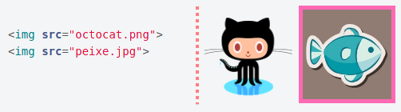
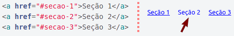
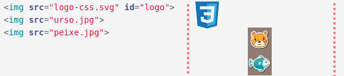

<!-- {"layout": "title"} -->
# **CSS** parte 2
## História, a Cascata e outros Seletores, Ferramentas e Ninjas :dash:

<!-- @include PATH_TO_REVIEW_FILE -->

---
<!-- {"layout": "centered"} -->
# Hoje veremos

1. [Ferramentas do Desenvolvedor](#ferramentas-do-desenvolvedor)
1. [Aprofundando em CSS](#aprofundando-em-css)
   - História
   - A cascata
   - Outros seletores
1. [Os Ninjas](#os-ninjas)

---
<!-- {"layout": "section-header", "hash": "ferramentas-do-desenvolvedor"} -->
# Ferramentas do Desenvolvedor
## Investigando erros e experimentando propriedades

- Ferramenta do Google Chrome
- Alterando/testando propriedades
- Investigando erros
  1. :mega: "Criei uma regra e ela não funcionou"
  1. :mega: "Apliquei uma propriedade e ela não apareceu"
  1. :mega: "Coloquei uma imagem ou arquivo CSS e não apareceu"
<!-- {ul:.content} -->

---
## Ferramenta do Desenvolvedor


<!-- {.bordered.rounded style=" max-height: calc(var(--slide-height) - 5em)"} -->
<!-- {p:.flex-align-center} -->

---
# O HTML visto como uma árvore

::: figure .figure-slides.clean.flex-align-center
 <!-- {.bullet.figure-step.bullet-no-anim} -->
 <!-- {.bullet.figure-step.bullet-no-anim} -->
 <!-- {.bullet.figure-step.bullet-no-anim} -->
 <!-- {.bullet.figure-step.bullet-no-anim} -->
:::

---
<!-- {"layout": "centered-horizontal"} -->
## Exemplo: Alterando/testando propriedades

<video src="../../videos/desenv-chrome.mp4" height="480" controls></video>

---
## Usando as ferramentas

- Visualizando o código fonte da página:
  - Tecla de atalho no Chrome: <kbd>Ctrl+U</kbd>
  - Ou então:
    1. clicar com **botão direito** do Mouse **na página**
    1. selecionar "**Exibir código fonte da página**"
- Ferramenta do desenvolvedor:
  - Tecla de atalho padrão: <kbd>Ctrl</kbd>+<kbd>Shift</kbd>+<kbd>I</kbd> ou <kbd>F12</kbd>
  - Ou então:
    1. clicar com **botão direito** do Mouse **na página**
    1. selecionar "**Inspecionar**"

Vejamos alguns exemplos de como as ferramentas podem ajudar...

---
<!-- {"layout": "centered-horizontal"} -->
### Investigando - _"Criei **uma regra** e ela **não funcionou**"_

<video src="../../videos/tools-investigate-wrong-selector.webm" height="500" controls></video>

---
<!-- {"layout": "centered-horizontal"} -->
### Investigando - _"Nova **propriedade não funcionou**"_

<video src="../../videos/tools-investigate-wrong-property.webm" height="500" controls></video>

---
<!-- {"layout": "centered-horizontal"} -->
### Investigando - _"**Arquivo não apareceu**"_

<video src="../../videos/tools-investigate-wrong-path.webm" height="500" controls></video>

---
<!-- {"layout": "section-header", "hash": "aprofundando-em-css"} -->
# Aprofundando<br>em **CSS**
## CSS: Folhas de Estilo<br>em **Cascata**

- História
- A cascata
- Outros seletores
<!-- {ul:.content} -->

*[CSS]: Cascading Style-Sheets

---
## História

1989 - 1993 <!-- {.bullet-old} -->
  ~ Tim Berners-Lee cria a WWW em CERN e a deixa aberta ao público
    geral <!-- {dd:.bullet-old} -->

1994
  ~ ::: figure .floating-portrait-container.push-right
      
    :::
    Håkon Wium Lie propõe uma linguagem com a responsabilidade
    de alterar a aparência de páginas web chamada CSS

1996
  ~ Juntamente com Bert Bos, Håkon publica a especificação do  **CSS1**
1998
  ~ Já gerenciado pela W3C, o **CSS2** foi publicado

1998 - 2014
  ~ Desenvolvimento da especificação do **CSS3** (_living standard_)

2013
  ~ Håkon tornou-se CTO na _Opera Software_

*[CERN]: European Organization for Nuclear Research*

---
<!-- {"classes": "compact-code-more"} -->
## A **Cascata**

- CSS é a sigla para _**Cascading** Style Sheets_
- Algumas propriedades são **herdadas** dos elementos ascendentes
  ```css
  body {
    color: #ff0000; /* mesmo que 'red' */
  }
  ```
  - Todo o texto que estiver dentro de `<body>...</body>`, mesmo que dentro de
    parágrafos ou outros elementos, ficarão vermelhos (!)
    - <!-- {ul^0:.compact-code.no-bullets.no-padding} -->
      ::: result .push-right margin-left: 1.5em; 
      # Título <!-- {style="font-family: serif; color: red;"} -->
      :::
      ```html
      ⋮
      <style>
        body {
          color: red;
        }
      </style>
      </head>
      <body>
        <h1>Título</h1>
        ⋮
      ```

---
## Exemplo da **cascata**

<iframe width="100%" height="300" src="//jsfiddle.net/fegemo/gqgacz36/embedded/result,html,css/" allowfullscreen="allowfullscreen" frameborder="0"></iframe>

- Clique nas abas "HTML", "CSS" e "Result". Para editar o código, clique
  em "Edit in JSFiddle"

Algumas propriedades (ex: `color`) são herdadas pelos descendentes, outras não (ex: `border`) <!-- {p:.note.info} -->

---
## Cascata: propriedades **não-herdadas**

- Para as **propriedades que não são herdadas** por padrão (_e.g._, `border`),
  podemos forçar que sejam herdadas usando o valor `inherit`:
  ```css
  p {
    border: 1px solid red;
  }
  em {
    border: inherit;
  }
  ```
  ::: result
  <p style="border: 1px solid red;">Este é um <em style="border: inherit">parágrafo</em> (&lt;em&gt; em 'parágrafo')</p>
  :::

---
## Cascata: **sobrescrita** de propriedade

- Também podemos sobrescrever a herança de uma propriedade:
  ```css
  body {
    font-weight: bold;
  }
  em {
    font-weight: normal;  /* ou, então, font-weight: initial */
  }                       /* initial é o valor padrão para aquela tag */
  ```
  ::: result
  <p style="font-weight: bold;">Este é um <em style="font-weight: normal">parágrafo</em> (&lt;em&gt; em 'parágrafo')</p>
  :::

---
<!-- {"hash": "outros-seletores", "embedSVG": "img[src$='.svg']", "styles": ["../../styles/classes/css-rule-anatomy.min.css"]} -->
## Seletores

-  <!-- {.push-right.css-rule-anatomy.selector width="300" data-viewbox="50 0 90 60"} -->
  Até agora, já sabemos **selecionar elementos de <u>03 formas</u>**:
  1. Pelo **nome de sua _tag_**: `p { color: white; }`
  1. Por (uma de) suas **classes**: `.livro { color: red;}`
  1. Por seu **id**: `#manchete-principal { color: green; }`
- Contudo, a vida não para por aí...
  - Há 20+ tipos de seletores (dos quais já vimos 3)
  - Não é necessário decorar todos, apenas saber que existem para poder
    consultá-los (Google) depois ;)

---
## Desafio #1

> Colorir de laranja **apenas os <u>links dentro da lista</u> não ordenada**:
>  <!-- {.centered} -->
<!-- {p:style="text-align: left"} -->

- Poderíamos usar uma classe (`.marca-de-sabao`) nos links da lista
  - Mas há uma forma melhor!
  - É possível **fazer isso sem alterar o HTML**! <!-- {li:.bullet} -->
    - ```css
      ul a {  /* todo <a> dentro de uma <ul> */
        color: orange;
      }
      ```
      <!-- {ul^0:.bullet.no-list-icon.layout-split-2} -->
    - :::result
      - Sabão [Omo](http://omo.com.br) <!-- {style="color: orange"} -->
      - Sabão [Ariel](http://ariel.com.br) <!-- {style="color: orange"} -->

      [Voltar para cima](#) <!-- {style="color: blue"} -->
      :::

---
## Seletores de **Descendente** e **Filho direto**

- Formato: `X Y` _(antecessor, espaço, elemento selecionado)_ <!-- {ul:.code-split-2.no-padding.no-list-icon} -->
  - Exemplo:
    ```css
    ul a {
      text-decoration: none;
    }
    ```
    - Descrição: seleciona todos hiperlinks `a` que têm um `ul` como
      antecedente (pai, avô, bisavô etc.)
- Formato: `X > Y` _(pai, sinal de maior, elemento selecionado)_
  - Exemplo:
    ```css
    #menu-principal > ul {
      padding: 20px;
    }
    ```
    - Descrição: seleciona todos os `ul` que têm `#menu-principal` como pai

---
<!-- {"classes": "compact-code"} -->
## Exemplo: **Descendente** vs **Filho direto**

- ```html
  <p>
    <strong>Ola! <a href="http://www.google.com">Este é meu link! </a></strong>
    <a href="http://www.terra.com.br">Esta é uma outra pagina</a>
  </p>
  <a href="http://google.com">Este é outro link</a>
  ```
- &nbsp;
  - ```css
    p > a { /* <a>s filhos de um <p> */
      text-decoration: line-through;
    }
    p a { /* <a>s descendentes de um <p> */
      color: red;
    }
    ```
  - :::result
    <p>
      <strong style="color:black;">Ola! <a style="color:red;" href="http://www.google.com">Este é meu link! </a></strong>
      <a style="color:red;text-decoration: line-through;" href="http://www.terra.com.br">Esta é uma outra pagina</a>
    </p>
    <a style="color:blue" href="http://google.com">Este é outro link</a>
    :::

    <!-- {ul^0:.no-list-icon.no-padding.layout-split-2}-->
    <!-- {ul^1:.no-list-icon.no-padding}-->

---
<!-- {"hash": "desafio-seletor-atributo"} -->
## Desafio #2

> Colocar uma borda rosa **apenas nas imagens .jpg**:
> 
<!-- {p:style="text-align: left"} -->

- Poderíamos usar uma classe (`.formato-jpg`) nessas imagens...
  - Mas há uma forma melhor! <!-- {li:.bullet} -->
  - É possível **selecionar elementos de acordo com seus atributos**! <!-- {li:.bullet} -->
    ```css
    img[src$=".jpg"] {
      border: 5px solid hotpink;
    }
    ```

---
## Seletores de **Atributo**

- Podemos selecionar elementos HTML **de acordo com <u>seus atributos</u>**:
  - ```css
    a[href] {
      color: blue;  /* [a] */
    }
    a[href="http://google.com"] {
      color: blue;  /* [b] */
    }
    a[href^="http"] {
      color: blue;  /* [c] */
    }
    a[href$=".com"] {
      color: blue;  /* [d] */
    }
    a[href*="google"] {
      color: blue;  /* [e] */
    }
    ```
  - Há **5 variações**: <!-- {li:style="margin-left: 1em"} -->
    - [a] existência do atributo: `[atributo]` <!-- {li:.push-code-right} -->
      - Neste caso, todo `<a>` que possua `href`
    - [b] valor inteiro: `[atrib="valor"]` <!-- {li:.push-code-right} -->
    - [c] começo do valor: `[atrib^="inicio"]` <!-- {li:.push-code-right} -->
    - [d] fim do valor: `[atrib$="final"]` <!-- {li:.push-code-right} -->
    - [e] trecho do valor: `[atrib*="trecho"]` <!-- {li:.push-code-right} -->
    - Repare que esses seletores podem ser **usados com qualquer elemento**:
      ```css
      img[alt] {
        border: 5px solid red;
      }
      ```
    <!-- {ul^2:.layout-split-2.no-list-icon.no-padding.compact-code} -->

---
## Exemplos de seletores de atributos

```css
a[href$=".br"] {
  background-image: linear-gradient(45deg, green, yellow);
}
img[alt*="ninja"] {
  border: 3px solid black;
}
a[href^="http"] {
  color: purple;
}
```

```html


<a href="http://www.terra.com.br">Um site brasuca<a>
<a href="http://www.cnn.com">Um site gringo<a>
```

:::result . margin: 1em auto;


<a style="color:purple;background-image: linear-gradient(45deg, green, yellow);" href="http://www.terra.com.br">Um site brasuca<a>
<a style="color:purple;" href="http://www.cnn.com">Um site gringo<a>
:::

---
<!-- {"hash": "desafio-seletor-estado"} -->
## Desafio #3

> Tirar o sublinhado do hyperlink **quando passar o mouse sobre ele**:
> 
<!-- {p:style="text-align: left"} -->

- A única forma de fazer é usando **seletores de estado**: <!-- {li:.bullet} -->
  - ```css
    a:hover {
      text-decoration: none;
    }
    ```
    <!-- {li:.bullet} -->

---
<!-- {"embeddedStyles": ".link:link {color: blue; text-decoration: underline;}.link:hover {color: cyan;}.link:active {color: gold;}"} -->
## Seletores de **Estado**

- Podemos selecionar elementos HTML **de acordo com <u>seus atributos</u>**:
  - ```css
    a:link {
      color: blue;  /* [a] */
    }
    a:hover {
      color: cyan;  /* [b] */
    }
    a:active {
      color: gold;  /* [c] */
    }


    ```
    ::: result
    [Um link](#um-link) <!-- {a:.link} -->
    :::
  - Há pelo menos **3 estados**: <!-- {li:style="margin-left: 1em"} -->
    - [a] situação inicial `:link`
    - [b] mouse em cima: `:hover`
    - [c] começo do valor: `:active`
    - Repare que os seletores `:hover` e `:active` podem ser **usados com outros elementos**:
      ```css
      tr {
        background-color: white;
      }
      tr:hover {
        background-color: silver;
      }
      ```
    <!-- {ul^1:.layout-split-2.no-list-icon.no-padding.compact-code} -->

---
<!-- {"hash": "desafio-seletor-negacao"} -->
## Desafio #4

> Centralizar todas imagens **exceto uma ou outra**:
> 
<!-- {p:style="text-align: left"} -->

- Isso poderia ser feito colocando classes/ids nos elementos <!-- {li:.bullet} -->
  - Mas há outra forma, com o **seletor de negação**:
    ```css
    img:not(#logo) {
      display: block;
      margin: 0 auto; /* vertical: 0, horizontal: auto */
    }
    ```
    <!-- {li:.bullet} -->

---
## Seletor: **Negação**

- Formato: `X:not(seletor)`
- Exemplo:
  ```css
  p:not(.destacado) {
    color: gray;
  }
  ```
- Descrição: seleciona todos os elementos que **não passem pelo teste** do
  `seletor`
  - Ou seja, no exemplo, seleciona todos os **`<p>` que
    não possuam a classe `.destacado`**

---
<!-- {"slideStyles": {"display": "block"}, "embeddedStyles": ".tabela tr:nth-child(2n){background:white;}.tabela tr:nth-child(2n+1){background:silver;} .tabela { line-height: 1.25em; } .tabela td { border: 1px solid black; } .tabela {border: none!important}", "classes": "compact-code"} -->
## Outros seletores

::: did-you-know .push-right width: 400px; margin-left: 1em;
A parte dos seletores "com dois pontos" (eg, `:not()`, `:hover`) é chamada
de **pseudoclasse**. Veja [todas aqui](https://developer.mozilla.org/pt-BR/docs/Web/CSS/Pseudo-classes).
:::

- Seletores **de posição** dentro do pai: <!-- {li:.bullet} -->
  - `X:first-child`
  - `X:last-child`
  - `X:nth-child(n)` <!-- {ul^0:.multi-column-list-2}-->
- Seletores **de posição** de um tipo:
  - `X:first-of-type`
  - `X:last-of-type`
  - `X:nth-of-type(n)` <!-- {ul^0:.multi-column-list-2}-->
- Exemplo de `nth-child`: <!-- {li:.bullet} -->
  - ```html
    <table>
      <tr><td>Linha 1</td></tr>
      <tr><td>Linha 2</td></tr>
      <tr><td>Linha 3</td></tr>
      <tr><td>Linha 4</td></tr>
    </table>
    ```
  - ```css
    tr:nth-child(2n) {   /*par*/
      background: white;
    }
    tr:nth-child(2n+1) { /* ímpar */
      background: silver;
    }
    ```
  - ::: result
    <table class="tabela smaller-text-70">
      <tr><td>A</td><td>Linha 1</td></tr>
      <tr><td>B</td><td>Linha 2</td></tr>
      <tr><td>C</td><td>Linha 3</td></tr>
      <tr><td>D</td><td>Linha 4</td></tr>
    </table>
    :::
    <!-- {ul^0:.layout-split-3.no-list-icon.no-padding style="justify-content:space-between;"}-->

[css-selectors-30]: https://code.tutsplus.com/pt/tutorials/the-30-css-selectors-you-must-memorize--net-16048

---
<!-- {"layout": "section-header", "hash": "os-ninjas"} -->
# Os Ninjas :dash:
## Conheça essa gente ligeira

- Atividade de hoje
- Atributos `alt` das imagens
- Embutindo páginas com `<iframe></iframe>`
<!-- {ul:.content} -->

---
## Atividade de Hoje

 <!-- {p:.flex-align-center} -->

1. Você deve estilizar as duas páginas web dos ninjas usando os
   conhecimentos que vimos nas aulas anteriores
1. Lembre-se das boas práticas - use CSS em arquivo externo
1. Você pode modificar o HTML das páginas para colocar `class` e `id` nos
   elementos para os quais essa alteração seja necessária
   - Mas considere **usar os seletores <u>mais apropriados</u>**
1. Siga os passos descritos no [arquivo README.md do exercício](https://github.com/fegemo/cefet-front-end-ninjas/blob/master/README.md)

---
# Atributo **alt** da imagem

- Descreve textualmente a imagem
- É recomendável que todas as imagens utilizem esta propriedade
- Útil quando:
  - ocorreu algum erro no endereço imagem;
  - conexões lentas;
  - utiliza-se **um leitor de tela** para navegar na página.
- Deve descrever bem a imagem
  - É a única descrição da imagem que uma pessoa cega tem ao acessar a página
  - Assista [como uma pessoa cega navega na Web](https://www.youtube.com/watch?v=zNVrNo7MxsA)

---
## Atributo **alt** da imagem - Exemplo

- Exemplo (imagem com endereço errado):
  ```html
  
  ```
  :::result
  
  :::

---
## Elemento **iframe**

- Usada para **embutir outra página** web dentro da atual
- Exemplo:
  ```html
  <iframe src="https://fegemo.github.io/cefet-front-end-ajax/"></iframe>
  ```
  :::result
  <iframe src="https://fegemo.github.io/cefet-front-end-ajax/" width="100%"></iframe>
  :::
  - Usos comuns:
    - Colocar um vídeo do Youtube na página
    - Colocar um mapa do Google Maps na página

---
<!-- {"layout": "centered"} -->
# Referências

1. Capítulo 7 do livro
1. [Os 30 seletores CSS que você precisa memorizar (inglês)][css-selectors-30]

[css-selectors-30]: http://code.tutsplus.com/tutorials/the-30-css-selectors-you-must-memorize--net-16048
[Print a Book in CSS]: http://alistapart.com/article/boom
