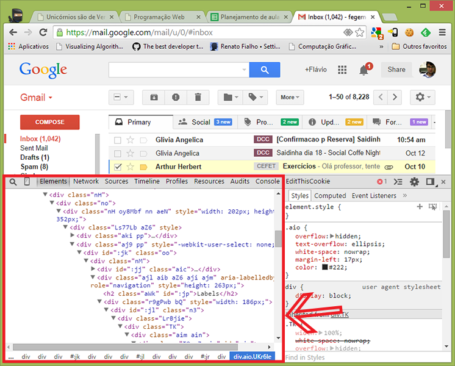

# CSS - Parte 3

---
## Na última aula (cont.)

- Podemos precisar agrupar alguns elementos logicamente semelhantes ou por
  questões de estilização
- Podemos usar os elementos `div` (`block`) e `span` (`inline`) para criar
  grupos
  ```html
  <div>
    <h1>Título</h1>
    <h2>Subtítulo</h2>
  </div>
  ```

---
# Na última aula...

- Aprendemos sobre o **_box model_**
  - Todo elemento de conteúdo (dentor do `body`) é representado por uma caixa
  - Podemos especificar, para a caixa:
    - O espaço do conteúdo (`width`, `height`)
    - Um espaço de preenchimento (`padding`)
    - Uma borda (`border`)
    - Um espaço externo (`margin`)
  - Quando definimos `width` ou `height`, estamos definindo o tamanho do
    **conteúdo**, e não da caixa inteira
  - É possível alterar o significado de `width` e `height` usando `box-sizing`

---
## Na última aula (cont.)

- Aprendemos que os elementos podem flutuar
  ```css
  img#principal {
    float: left; /* right, none */
  }
  ```
  - Elementos flutuantes alteram o fluxo dos elementos posteriores
    - `blocks` fingem que os flutuantes não estão ali
    - `inlines` adequam sua forma aos flutuantes
- [Questionário Maroto](https://moodle.cefetmg.br/mod/quiz/view.php?id=18171)

---
# Roteiro de hoje

1. Divitite - doença e cura com **_tags_ semânticas**
1. A propriedade **display**
1. Alterando a visibilidade
1. _Pseudo-classes_ e _pseudo-elements_
1. **Layout e posicionamento**

---
# Divitite e _Tags_ Semânticas

---
## Divitite

- Sintomas
  - Um acúmulo grande de elementos `div` e `span` aninhados
- Muitas páginas Web usam `div`/`span` como, por exemplo:
  ```html
  <div id="header">...</div>
  <div id="footer">...</div>
  <div class="article">...</div>
  <span class="time">...</div>
  <div id="navigation">...</div>
  ```

---


---
## A cura da Divitite: **_tags_ semânticas**

- O Dr. html5 propôs elementos idênticos às `divs`/`spans`, mas que possuem
  sentido para o navegador. Por exemplo:
  ```html
  <header></header>
  <footer></footer>
  <article></article>
  <time></time>
  <nav></nav>
  ```

---
## Elementos semânticos (1/3)

- [`<header></header>`](http://www.w3.org/TR/html-markup/header.html) `(block)`
  - Cabeçalho da página ou de seções (`section`) ou artigos (`article`)
- [`<footer></footer>`](http://www.w3.org/TR/html-markup/footer.html) `(block)`
  - Análogo ao `header`, porém recomendado para que contenha informação típica
    de um rodapé de página
- [`<article></article>`](http://www.w3.org/TR/html-markup/article.html)
  `(block)`
  - Um componente "completo" (ou auto-contido) da página
    - Em um blog, seria um _post_
    - Em uma loja, seria um produto

---
## Elementos semânticos (2/3)

- [`<section></section>`](http://www.w3.org/TR/html-markup/section.html)
  `(block)`
  - Uma seção lógica da página, tipicamente contendo um título
- [`<nav></nav>`](http://www.w3.org/TR/html-markup/nav.html) `(block)`
  - Uma seção da página que contenha _links_ de navegação
  - Exemplos:
    - O menu principal da página
    - Tabela de conteúdo (TOC) com
      _links_ internos

*[TOC]: Table of Contents*

---
## Elementos semânticos (3/3)

- [`<aside></aside>`](http://www.w3.org/TR/html-markup/aside.html) `(block)`
  - Uma seção de conteúdo periférico na página
  - Exemplos:
    - Barras laterais
    - _Widgets_ periféricos
    - Conteúdo à parte do principal
- [`<time></time>`](http://www.w3.org/TR/html-markup/time.html) `(inline)`
  - Representa uma data e/ou horário
- [`<mark></mark>`](http://www.w3.org/TR/html-markup/mark.html) `(inline)`
  - Representa uma marcação no texto
    (tipo <mark style="background-color: yellow">caneta marcadora</mark>)

---
## Elementos semânticos **pré-html5**

- [`<address></address>`](http://www.w3.org/TR/html-markup/address.html)
- [`<abbr title=""></abbr>`](http://www.w3.org/TR/html-markup/abbr.html)
- [`<blockquote></blockquote>`](http://www.w3.org/TR/html-markup/blockquote.html),
  [`<q></q>`](http://www.w3.org/TR/html-markup/q.html)
- [`<cite></cite>`](http://www.w3.org/TR/html-markup/cite.html)
- [`<code></code>`](http://www.w3.org/TR/html-markup/code.html)
- [`<kbd></kbd>`](http://www.w3.org/TR/html-markup/kbd.html)
- E outros...

---
# A propriedade **display**

---
## A propriedade **display** (na [MDN](https://developer.mozilla.org/en-US/docs/Web/CSS/display))

- Define o **tipo de visualização** de um elemento e também seu
  **comportamento** no fluxo da página
- Os valores mais comuns
  - `block`, para definir um elemento com comportamento `block`
  - `inline`, similarmente, para `inline`
  - `inline-block`, similar a `block`, porém sem quebra de linha
  - `none`, sem renderização
- Ao todo, são 25 valores, dos quais apenas 15 são suportados pelos principais
  navegadores (Outubro/2014)

---
## A propriedade **display** (cont.)

- É possível, por exemplo:
  ```css
  div { display: inline; }
  span { display: block; }
  ```

  - Mas é claro que você não vai fazer isso... :)
- Para **remover um elemento do fluxo e não renderizá-lo** de forma alguma:
  ```css
  a[href*="xxx"] { display: none; }
  ```

---
## Display: **inline-block**

- Une a capacidade de se definir dimensões de `block` e a possibilidade de ter
  um fluxo lateral (sem quebra de linha), como `inline`
- Exemplo:
  ```html
  <div class="passo">1<br>Instalar</div>
  <div class="passo">2<br>Aprender</div>
  <div class="passo">3<br>Programar</div>
  ```
  ```css
  .passo { display: inline-block;
           width: 150px;
           height: 100px; /* ... */ }
  ```

---
## Display: **inline-block**

- Resultado:

  <style>.passo { display: inline-block; width: 150px; height: 150px; border: 2px inset rebeccapurple; background: rgba(255, 255, 255, .5); font-size: 26px; font-family: "Comic Sans MS"; text-align: center; line-height: 50px; border-radius: 75px; }</style>
  <div class="passo">1<br>Instalar</div>
  <div class="passo">2<br>Aprender</div>
  <div class="passo">3<br>Programar</div>

---
## Display: **table-***

- <div class="caniuse" data-feature="css-table" style="float: right;"></div>

  Alguns valores são para a criação de _layouts_ em formato de tabelas:
  - `table`, `table-cell`, `table-column`, `table-column-group`, 
    `table-footer-group`, `table-header-group`, `table-row`, 
    `table-row-group`, `inline-table`
- [Exemplos de uso](http://colintoh.com/blog/display-table-anti-hero)

---
## Display: **flex**

- Um novo tipo de fluxo de "caixa flexível" que facilita _layouts_ fluidos
  - Propriedades:
    ```css
    .container { display: flex; }
    .filho { flex: 1 }
    ```
- Exemplo:
  <iframe width="100%" height="150" src="//jsfiddle.net/fegemo/f5odrgk9/embedded/result,html,css/" allowfullscreen="allowfullscreen" frameborder="0"></iframe>

---
## Display: **flex** (cont.)

- Possibilita trocar o fluxo com a propriedade
  [`flex-direction`](https://developer.mozilla.org/en-US/docs/Web/CSS/flex-direction)
  nos contâineres:
  ```css
  .container.vertical { display: flex; flex-direction: column; }
  .filho { flex: 1 }
  ```
  - Exemplo:
    <iframe width="100%" height="230" src="//jsfiddle.net/fegemo/f5odrgk9/1/embedded/result,html,css/" allowfullscreen="allowfullscreen" frameborder="0"></iframe>

---
## Display: **flex** (cont. 2)

- Possibilita definir uma ordem arbitrária para os filhos com a propriedade
  [`order`](https://developer.mozilla.org/en-US/docs/Web/CSS/order):
  ```css
  .filho:first-child  { order: 3 }
  .filho:nth-child(2) { order: 2 }
  .filho:last-child   { order: 1 }
  ```
  - Exemplo:
    <iframe width="100%" height="150" src="//jsfiddle.net/fegemo/f5odrgk9/2/embedded/result,html,css/" allowfullscreen="allowfullscreen" frameborder="0"></iframe>

---
## Display: **flex** - _can I use, plx?_

<div class="caniuse" data-feature="flexbox"></div>

- Um **jogo** para aprender a usar flexbox:
  [Flexbox Froggy](http://flexboxfroggy.com/)

---
# Alterando a visibilidade

---
## Usando **display**

- É possível tornar um elemento invisível usando `display: none;`
- O elemento é **removido do fluxo**, ou seja, o espaço onde ele seria
  posicionado é liberado
- ```css
  img#logotipo {
    display: none;
  }
  ```

---
## A propriedade **visibility** ([na MDN](https://developer.mozilla.org/en-US/docs/Web/CSS/visibility))

- Usada para alterar a visibilidade de elementos
- ```css
  img#logotipo {
    visibility: hidden; /* visible */
  }
  ```
- Os elementos invisíveis (`hidden`) continuam ocupando espaço
- Descendentes de elementos invisíveis herdam o valor `hidden`, mas podem
  tornar-se visíveis usando `visibility: visible;`

---
## Visibilidade **+ JavaScript**

- Um comportamento bastante comum é o de alterar a visibilidade
  (`display` ou `visibility`) de um elemento de acordo com a interação do
  usuário:
  ```css
  .oculto { visibility: hidden; }
  ```
  ```js
  var button = document.getElementById('botao-alterna');
  button.addEventListener(function() {
    document.getElementById('titulo').classList.toggle('oculto');
  });
  ```
  <button onclick="javascript: document.getElementById('visibilidade-javascript').classList.toggle('oculto');">Alterna vibilidade do título</button>
  <style>
    .oculto { visibility: hidden; }
  </style>

---
## A propriedade **overflow** ([na MDN](https://developer.mozilla.org/en-US/docs/Web/CSS/overflow))

- Controla se conteúdo que extrapola o elemento deve ser cortado, se deve ser
  mostrado ou se deve ser criada uma barra de rolagem
- ```css
  div {
    overflow: scroll; /* visible, hidden, scroll, auto */
  }
  ```

---
# _Pseudo-classes_ e _Pseudo-elements_

---
## _Pseudo-**classes**_

- Indicam um estado de um elemento. Exemplos:
  ```css
  .link-para-comprar:hover {
    text-decoration: underline;
  }
  ```
- Algumas das _pseudo-classes_ mais comuns:
  - `:focus` - contém o foco
  - `:hover` - mouse em cima
  - `:last-child` - último
  - `:not()` - exceto que
  - `:nth-child()` - n-ésimo
  - `:checked` - caixa marcada <!-- {ul:.multi-column-list-2} -->
- [Lista com todas](https://developer.mozilla.org/en-US/docs/Web/CSS/Pseudo-classes)
  na MDN

---
## _Pseudo-**elements**_

- Indicam partes de um elemento. Exemplos:
  ```css
  p::selection {
    color: white;
    background-color: hotpink;
  }
  ```
  <style>
    .different-selection::selection { background-color: hotpink; color: white; }
  </style>
  `<p>`<span class="different-selection">Me selecione, bem aqui &larr;</span>`</p>`
- Pode-se usar tanto `::pseudo-element` quanto `:pseudo-element`

---
## _Pseudo-**elements**_ comuns

- Os _pseudo-elements_ mais comuns:
  - `::selection` - seleção de texto
  - `::placeholder` - descrição de `input`
  - **`::after` - conteúdo "pós-conteúdo"**
  - **`::before` - conteúdo "pré-conteúdo"**
  - `::first-letter` - primeira letra
- [Lista com todos](https://developer.mozilla.org/en-US/docs/Web/CSS/Pseudo-elements)
  na MDN

---
## Exemplo de **::before**

- Por exemplo, como colocar um texto de "leia mais" ao final de cada notícia?
  ```css
  .novidade::before {
    content: "Novidade!";
    display: inline-block;
    background: orange;
    /* ... */
  }
  ```
  - Resultado:
    <iframe width="100%" height="120" src="//jsfiddle.net/fegemo/76wdcLao/embedded/result,html,css/" allowfullscreen="allowfullscreen" frameborder="0"></iframe>

---
# Layout e posicionamento

---
## Layout e posicionamento

- Além do fluxo normal visto na última aula, também podemos dar
  **fluxos alternativos** aos elementos
  - Propriedades envolvidas:
    - ```css
      position: static; /* relative, absolute, fixed */
      top: 0px;         /* uma dimensão */
      right: 0px;       /* uma dimensão */
      bottom: 0px;      /* uma dimensão */
      left: 0px;        /* uma dimensão */
      z-index: 1;       /* um inteiro */
      ```

---
## **top, right, bottom e left**

- Usadas para definir a posição (ou _offset_) do elemento
- Sua interpretação depende de qual valor de `position` estamos usando para
  aquele elemento

---
## **position**

- `static`
  - Comportamento padrão. O elemento é **posicionado no fluxo normal (padrão)**.
  - As propriedades `left`, `right`, `top`, `bottom` e `z-index`
    **são ignoradas**
- `absolute`
  - O elemento **não tem espaço reservado para ele**. Em vez disso, ele fica
    exatamente na posição especificada por `left`, `right`, `top`, `bottom`
    relativo ao seu mais próximo antecessor-posicionado
  - Margens se aplicam, porém elas não fazem _margin collapse_ com outras

---
## **position** (cont.)

- `relative`
  - O elemento continua no **fluxo normal**, a menos que tenha suas propriedades
    `left`, `right`, `top` e `bottom` ajustadas.
  - A posição do elemento será **ajustada com relação à sua posição original**
    (caso ele fosse `static`)
  - Os elementos posteriores **não são ajustados** para ocupar eventuais
    "buracos" na página
- `fixed`
  - Bem semelhante ao `absolute`, porém o elemento é ajustado na posição
    `left`, `right`, `top`, `bottom` **no espaço da tela** (_viewport_), e não
    da página

---
## **z-index**

- Define a ordem "no eixo Z" com a qual elementos que se tocam deve ser exibida
- Útil apenas para elementos `position: absolute` ou `position: fixed`

---
# Referências

- Capítulo 12 do livro
- [Capítulo _semantics_](http://diveintohtml5.info/semantics.html) do livro
  diveintohtml5.org
- [Propriedade **display** na MDN](https://developer.mozilla.org/en-US/docs/Web/CSS/display)
- [Propriedade **visibility** na MDN](https://developer.mozilla.org/en-US/docs/Web/CSS/visibility)
- [Propriedade **overflow** na MDN](https://developer.mozilla.org/en-US/docs/Web/CSS/overflow)
- [Propriedade **position** na MDN](https://developer.mozilla.org/en-US/docs/Web/CSS/position)
- [Um breve e interessante tutorial sobre posicionamento](http://learnlayout.com/position.html)
- Jogo [Flexbox Froggy](http://flexboxfroggy.com/)
