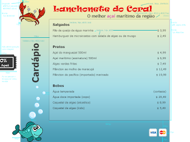

# CSS - Parte 4

---
# Roteiro de hoje

1. Criar a página da <span style="font-family: Ravie, serif; color: #e90c0c">Lanchonete do Coral 55</span>
1. Mais sobre Layout e posicionamento
1. A propriedade **line-height**
1. Centralizando as coisas

---
<h2 style="font-family: Ravie, serif; color: #e90c0c">Lanchonete do Coral 55</h2>


---
## <abbr title="Comprehensive Layout">Comp</abbr> / <abbr title="Specifications">Specs</abbr>

[](../../images/coral55-comp.png)
[](../../images/coral55-specs.png)

---
## Passos para o exercício

1. Instalar o git na máquina, caso ele não esteja instalado
1. Criar um _fork_ do repositório do professor em `https://github.com/fegemo/cefet-web-coral55`
1. Fazer o exercício e fazer _commits_ e _push_ no seu repositório
1. Enviar, via **Moodle**, o link do seu repositório até o final da aula

---
## Detalhes sobre o exercício

1. O objetivo é treinar **_Layout_ e posicionamento** em `CSS`
  - `position` (`static`, `relative`, `absolute`, `fixed`), `float`, `clear` etc.
1. O _layout_ que usamos no exercício dos Unicórnios se chama **fluido**. Hoje,
   você vai fazer um **_layout_ de tamanho fixo**
   - O conteúdo da página deve ter `800px` de largura e deve estar centralizado
   - Lembre-se sempre de como o box model funciona ;)

---
# _Layout_ e posicionamento

---
## _Layout_ e posicionamento (recapitulando)

- Vimos que o navegador **posiciona** elementos `block` e elementos `inline`
  usando algumas **regras de fluxo**
  - `block`s são colocados de cima para baixo e ocupam toda a largura
  - `inline`s são dispostos da esquerda para a direita
- Podemos alterar a posição de elementos de algumas formas
  - `width`, `height`
  - `margin`
  - `float`, `clear`
- Contudo, se quisermos um controle maior sobre a posição dos elementos,
  precisamos sair do fluxo padrão do navegador

---
## _Layout_ e posicionamento

- A propriedade `position` possibilita definir que tipo de fluxo um elemento
  terá
- O valor `static` equivale ao fluxo padrão do navegador e é o valor inicial de
  qualquer elemento
- Outros valores são:
  - `position: relative;`
  - `position: absolute;`
  - `position: fixed;`

---
## Posição estática

- Valor padrão - usa o posicionamento do fluxo padrão
  ```html
  <div class="estatico">Conteúdo</div>
  ```
  ```css
  .estatico {
    position: static;
  }
  ```
- <div style="display:inline-block;float:right;height:1em;font-size:.4em;"><input type="checkbox" checked id="button-estatico" class="switch" onclick="javascript: (function() { var b = document.getElementById('estatico'); b.classList.toggle('estatico');}())" />
    <label for="button-estatico">`.estatico`</label>
  </div>
  Resultado
  <style>.estatico {position: static;}</style>
  <div id="estatico" class="estatico" style="border: 3px dashed rebeccapurple">Conteúdo</div>

---
## Posição relativa

- O elemento é posicionado como se estivesse no fluxo padrão, mas pode ser
  **deslocado** com as propriedades `top`, `right`, `bottom` e `left`
  ```html
  <div class="relativo1">Comporta-se como static.</div>
  <div class="relativo2">Mas pode ter um deslocamento.</div>
  ```
  ```css
  .relativo1 { position: relative; }
  .relativo2 { position: relative; width: 50%;
               left: 30px; top: -10px; }
  ```
- <div style="display:inline-block;float:right;height:1em;font-size:.4em;"><input type="checkbox" checked id="button-relativo2" class="switch" onclick="javascript: (function() { var b = document.getElementById('relativo2'); b.classList.toggle('relativo2');}())" />
    <label for="button-relativo2">`.relativo2`</label>
  </div>
  Resultado:
  <style>.relativo2 { position: relative; width: 50%; left: 30px; top: -10px; }</style>
  <div style="position: relative; border: 3px dashed rebeccapurple; background: white;">Comporta-se como <code>static</code>.</div>
  <div id="relativo2" class="relativo2" style="border: 3px dashed green; background: white;">Mas pode ter um deslocamento.</div>

---
## Posição absoluta

- O elemento é posicionado de acordo com os valores das propriedades `top`,
  `right`, `bottom` e `left`, considerando como ponto de partida **o ancestral
  mais próximo que é posicionado não estaticamente** (`relative`, `absolute` ou
  `fixed`)
- Não ocupa espaço, já que o elemento é removido do fluxo
  ```html
  <div class="relativo">Este é um recipiente relativo.
    <div class="absoluto">Este é absoluto.</div>
  </div>
  ```

---
## Posição absoluta (cont.)

- ```css
  .relativo { position: relative; }
  .absoluto { position: absolute; width: 50%;
               right: 30px; bottom: 10px; }
  ```
- <div style="display:inline-block;float:right;height:1em;font-size:.4em;"><input type="checkbox" checked id="button-absoluto" class="switch" onclick="javascript: (function() { var b = document.getElementById('absoluto'); b.classList.toggle('absoluto');}())" />
    <label for="button-absoluto">`.absoluto`</label>
  </div>
  Resultado:
  <style>.absoluto { position: absolute; width: 50%; right: 30px; bottom: 10px; }</style>
  <div style="position: relative; height: 150px; border: 3px dashed rebeccapurple; background: white">Este é um recipiente relativo.
    <div id="absoluto" class="absoluto" style="border: 3px dashed green; background: white">Este é absoluto.</div>
  </div>

---
## Posição fixa

- O elemento é posicionado de acordo com os valores das propriedades `top`,
  `right`, `bottom` e `left`, assim como `absolute`, porém **seu ponto de
  partida é o canto superior esquerdo da _viewport_ (tela)**
- Não acompanha a rolagem da página
- Não ocupa espaço, já que o elemento é removido do fluxo
  ```html
  <div class="fixo">Este é um elemento fixo.</div>
  ```

---
## Posição fixa (cont.)

- ```css
  .fixo { position: fixed; right: 0; bottom: 10px; }
  ```
- Resultado:
  <iframe width="100%" height="300" src="http://jsfiddle.net/fegemo/s01Lc3a8/2/embedded/result,html,css/" allowfullscreen="allowfullscreen" frameborder="0"></iframe>

---
# A propriedade **line-height**

---
## A propriedade **line-height** ([na MDN](https://developer.mozilla.org/en-US/docs/Web/CSS/line-height))

- Define a altura de uma linha de texto.
- Inicialmente, `line-height: 1em;`, mas qualquer valor de medida de tamanho
  pode ser usado
  - Exemplo:
    ```css
    .espacamento-simples { line-height: 1em; }
    .espacamento-duplo   { line-height: 2em; }
    ```

    <p style="float: left; width: 45%; line-height: 1em; height: 100px; overflow: auto; border: 3px solid black">
      Lorem ipsum dolor sit amet, consectetur
    adipiscing elit. Curabitur mauris eros, fermentum eget dolor sit amet.</p>

    <p style="float: right; width: 45%; line-height: 2em; height: 100px; overflow: auto; border: 3px solid black">
    Lorem ipsum dolor sit amet, consectetur
    adipiscing elit. Curabitur mauris eros, fermentum eget dolor sit amet.</p>

---
# Centralizando as coisas

---
## Centralizando horizontalmente

- Existem várias formas para centralizar elementos que se aplicam a situações
  diferentes
- Centralizando conteúdo `inline`:
  ```css
  .centraliza { text-align: center; }
  ```
- Centralizando um elemento com largura definida
  ```css
  .centraliza-definida { margin: 0 auto; }
  ```

---
## Centralizando horizontalmente (cont.)

- Centralizando um elemento com `position` `absolute` ou `fixed`
  ```css
  .centraliza-position { left: (LARGURA_P - LARGURA_E)/2; }
  ```
  - Onde `LARGURA_P` é a largura do recipiente e `LARGURA_E` é a largura
    conhecida do elemento que queremos centralizar
- Centralizando um elemento com `position` `absolute` ou `fixed` em um
  recipiente fluido (largura pode variar)
  ```css
  .centraliza-fluido { left: 50%; margin-left: -(LARGURA_E / 2); }
  ```
- [Um guia sobre como centralizar qualquer elemento no site designshack.net](http://designshack.net/articles/css/how-to-center-anything-with-css/)

---
# Referências

- Capítulo 11 do livro
- [Propriedade **line-height** na MDN](https://developer.mozilla.org/en-US/docs/Web/CSS/line-height)
- [Um breve e interessante tutorial sobre posicionamento](http://learnlayout.com/position.html)
- [Técnicas para alinhamento vertical na smashingmagazine.com](http://www.smashingmagazine.com/2013/08/09/absolute-horizontal-vertical-centering-css/)
