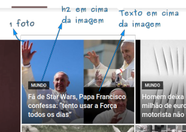
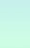
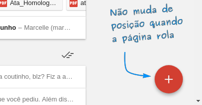

<!-- {"layout": "title"} -->
# CSS - Parte 4
## Posicionamento e mais Assombrações :ghost::ghost::ghost:

---
<!-- {"layout": "regular"} -->
# Na última aula (1/4)

- **_Tags_ Semânticas**:
  - O HTML5  <!-- {.emoji} -->
    propôs elementos idênticos às `divs`/`spans`, mas que **possuem
    sentido para o navegador**. Por exemplo:
    ```html
    <header></header>   <!-- em vez de <div id="header"></div> -->
    <footer></footer>   <!-- em vez de <div id="footer"></div> -->
    <article></article> <!-- em vez de <div id="article"></div> -->
    <time></time>       <!-- em vez de <span id="time"></span> -->
    <nav></nav>         <!-- em vez de <div id="navigation"></div> -->
    ```
    - E várias outras...

---
# Na última aula  (2/4)

- **Propriedade `display`**

  <iframe width="600" height="300" src="//jsfiddle.net/fegemo/2gfkyrrh/3/embedded/result,html,css/" allowfullscreen="allowfullscreen" frameborder="0"></iframe>

---
# Na última aula (3/4)

- **Alterando a visibilidade**:
  - `display:none`: o elemento é removido do fluxo
  - `visibility: hidden;`: o elemento fica escondido, mas ainda ocupa espaço
  - `opacity`: define a opacidade:
    ```css
      video {
        opacity: 0.5; /* 0.0 (transparente) a 1.0 (opaco) */
      }
    ```

---
# Na última aula (4/4)

- **_Pseudo-classes_ e _Pseudo-elements_**:

  _Pseudo-class_
    ~ permitem **selecionar** elementos em **diferentes situações**
    ~ Exemplos: `:focus` (contém o foco), `:hover` (mouse em cima)

  _Pseudo-element_
    ~ permitem **estilizar** certas **partes de elementos**
    ~ Exemplos: `::selection` (seleção de texto) `::first-letter`
      (primeira letra)

---
# Roteiro de hoje

1. [Posicionamento estático](#posicionamento-estatico)
1. [Posicionamento relativo](#posicionamento-relativo)
1. [Posicionamento absoluto](#posicionamento-absoluto)
1. [Posicionamento fixo](#posicionamento-fixo)
1. [Mais Assombrações](#mais-assombracoes) :ghost::ghost::ghost:

---
<!-- {"layout": "section-header", "slideHash": "posicionamento-estatico"} -->
# Posicionamento estático
## Deixando o navegador definir o fluxo da página

- Relembrando o fluxo padrão
- A propriedade `position`
- O valor `static`

<!-- {ul:.content} -->

---
<!-- {"layout": "tall-figure-right", "backdrop": "oldtimes"} -->
# Relembrando o fluxo padrão


Elementos **`block`**
  ~ Ocupam **toda a largura** disponível
  ~ Dispostos de **cima para baixo**
  ~ **Quebram linha**

Elementos **`inline`** <!-- {strong:.alternate-color} -->
  ~ Ocupam o **espaço necessário**  <!-- {.alternate-color} --> (não mais)
  ~ Dispostos da **esquerda para direita**  <!-- {.alternate-color} -->

---
<!-- {"backdrop": "oldtimes"} -->
## Alterando o fluxo com `float` e `clear`

- ::: figure .figure-slides.push-right
  <div class="bullet figure-step bullet-no-anim"><figcaption>Sem float</figcaption></div>

  <div class="bullet figure-step bullet-no-anim"><figcaption>Com float</figcaption></div>
  :::
  Flutuando o parágrafo à direita:
  ```css
  p#amazing {
    width: 200px;
    float: right;
  }
  ```
- Quem flutua é **removido do fluxo**
  - _i.e._, não ocupa mais espaço
- Elementos **<u>depois</u> do flutuante**:
  - Os `block`: passam a ignorar o elemento flutuante
  - Os `inline`: respeitam o flutuante


---
<!-- {"layout": "regular", "backdrop": "exemplo-position-absolute"} -->
## **Limitações** do fluxo padrão

- Mesmo com `float` e `clear` não é possível fazer algumas coisas
  - Por exemplo, como colocar um texto em cima de uma imagem?

---
# A propriedade `position`

- **A propriedade `position`** permite definirmos se o navegador vai
  dispor um elemento usando **o fluxo padrão ou outro fluxo**
- Valores possíveis:
  1. `position: static` (valor padrão, para o fluxo padrão)
  1. `position: relative` (fluxo padrão, com deslocamento)
  1. `position: absolute`
  1. `position: fixed`
  1. `position: sticky`  <!-- {.emoji} -->

---
## Posição **estática**

- O próprio navegador encontra as posições (x,y) dos elementos
- Valor padrão - usa o posicionamento do fluxo padrão
  ```html
  <div class="estatico">Conteúdo</div>
  ```
  ```css
  .estatico {
    position: static; /* este já é o valor padrão */
  }
  ```
- <div style="display:inline-block;float:right;height:1em;font-size:.4em;"><input type="checkbox" checked id="button-estatico" class="switch" onclick="javascript: (function() { var b = document.getElementById('estatico'); b.classList.toggle('estatico');}())" />
    <label for="button-estatico">`.estatico`</label>
  </div>
  Resultado
  <style>.estatico {position: static;}</style>
  <div id="estatico" class="estatico" style="border: 3px dashed rebeccapurple">Conteúdo</div>

  - Definir um `position: static` não altera nada


---
<!-- {"layout": "section-header", "slideHash": "posicionamento-relativo"} -->
# Posicionamento relativo
## Deslocando elementos

- O valor `relative`
- **Deslocando** um elemento com as propriedades:
  1. `top`
  1. `right`
  1. `bottom`
  1. `left`

<!-- {ul:.content} -->

---
## Posicionamento **relativo**

- O elemento é posicionado como se estivesse no fluxo padrão, mas pode ser
  **deslocado** com as propriedades `top`, `right`, `bottom` e `left`
  ```html
  <div class="relativo1">Comporta-se como static...</div>
  <div class="relativo2">...Mas pode ter um deslocamento.</div>
  ```
  ```css
  .relativo1 { position: relative; }
  .relativo2 { position: relative; left: 30px; top: -10px; }
  ```
- <div style="display:inline-block;float:right;height:1em;font-size:.4em;"><input type="checkbox" checked id="button-relativo2" class="switch" onclick="javascript: (function() { var b = document.getElementById('relativo2'); b.classList.toggle('relativo2');}())" />
    <label for="button-relativo2">`.relativo2`</label>
  </div>
  Resultado:
  <style>.relativo2 { position: relative; left: 30px; top: -10px; }</style>
  <div style="position: relative; border: 3px dashed rebeccapurple; background: white;">Comporta-se como <code>static</code>...</div>
  <div id="relativo2" class="relativo2" style="border: 3px dashed green; background: white;">...Mas pode ter um deslocamento.</div>

---
<!-- {"layout": "regular"} -->
## Detalhes sobre `position: relative`

1. O elemento continua no **fluxo normal**, a menos que tenha suas propriedades
   `top` :arrow_up:, `right` :arrow_right:, `bottom` :arrow_down: e `left`
   :arrow_left: ajustadas.
1. A posição do elemento será **ajustada com relação à sua posição original**
   (caso ele fosse `static`)
1. Os elementos posteriores a um elemento com `position: relative` **não
   são ajustados** para ocupar eventuais "buracos" na página

---
<!-- {"layout": "regular", "backdrop": "exemplo-position-relative"} -->
## **Utilidade** do `position: relative` (1/2)

- É útil quando queremos que um elemento fique próximo de onde ele estaria,
  mas **levemente deslocado**
  - Legal para **"dar um charme"** no _layout_

---
<!-- {"layout": "regular"} -->
## **Utilidade** do `position: relative` (2/2)

<style>
.button-img {
  position: relative;
}
.button-img:active {
  left: -3px;
  top: -3px;
}
</style>

- Podemos fazer um pequeno deslocamento dando a ideia de botão:
  ::: figure .push-right.center-aligned
   <!-- {.button-img} -->
  <br>Click me!
  :::
  ```css
  img {
    position: relative;
  }
  img:active {
    left: -3px;
    top: -3px;
  }
  ```
- Também utilizamos `position: relative` para definir um "plano de
  referência" para os filhos que estiverem com `position: absolute`
  (veremos mais adiante)

---
<!-- {"layout": "section-header", "slideHash": "posicionamento-absoluto"} -->
# Posicionamento absoluto
## Definindo (x,y) dos elementos

- O valor `absolute`
- **Posicionando** com:
  1. `top` :arrow_up:
  1. `right` :arrow_right:
  1. `bottom` :arrow_down:
  1. `left` :arrow_left:
- Casos comuns

<!-- {ul:.content} -->

---
## Posicionamento **absoluto**

- O elemento é colocado nas posições especificadas pelas propriedades
  `top` :arrow_up:, `right` :arrow_right:, `bottom` :arrow_down: e `left`
  :arrow_left:, considerando como referência **o ancestral
  mais próximo que esteja posicionado não estaticamente** (`relative`, `absolute` ou
  `fixed`)
  - Se não houver um ancestral, posiciona de acordo com elemento `<html>`
- **Não ocupa espaço**, já que o elemento é removido do fluxo

---
## Exemplo de posição absoluta


- ```html
  <div class="relativo">Este é um recipiente relativo.
    <div class="absoluto">Este é absoluto.</div>
  </div>
  ```
  ```css
  .relativo { position: relative; }
  .absoluto { position: absolute; width: 50%;
               right: 30px; bottom: 10px; }
  ```
  <div style="display:inline-block;float:right;height:1em;font-size:.4em;"><input type="checkbox" checked id="button-absoluto" class="switch" onclick="javascript: (function() { var b = document.getElementById('absoluto'); b.classList.toggle('absoluto');}())" />
    <label for="button-absoluto">`.absoluto`</label>
  </div>
  Resultado:
  <style>.absoluto { position: absolute; width: 50%; right: 30px; bottom: 10px; }</style>
  <div style="position: relative; height: 150px; border: 3px dashed rebeccapurple; background: white">Este é um recipiente relativo.
    <div id="absoluto" class="absoluto" style="border: 3px dashed green; background: white">Este é absoluto.</div>
  </div>

---
## **Utilidades** do `position: absolute`

1. <video src="../../videos/exemplo-position-absolute-steam.mp4" loop="0" class="push-right" controls></video>
   **Criar _"drop-downs"_** de opções que não "empurram" a página pra baixo
   (porque não ocupam espaço)
1. Colocar elementos "**um em cima do outro**"
    <!-- {.block.centered} -->
1.  <!-- {.push-right} -->
   **Posicionar** elementos em **qualquer lugar** na página

<!-- {ol:.bulleted} -->
---
<!-- {"layout": "regular"} -->
## **Detalhes** do `position: absolute`

- O elemento **não tem espaço reservado para ele**. Em vez disso, ele fica
  exatamente na posição especificada por `top`, `right`, `bottom`, `left`
  relativo ao **seu mais próximo antecessor-posicionado (não _static_)**
  <!-- {strong:.underline.upon-activation.delay-1600} -->

   <iframe width="100%" height="300" src="//jsfiddle.net/fegemo/nt2bqmar/embedded/result,html/" allowfullscreen="allowfullscreen" frameborder="0"></iframe>

<!-- isto é avançado demais
1. Margens se aplicam, porém elas não fazem _margin collapse_ com outras
   - Ou seja, elas sempre se somam
-->

---
<!-- {"layout": "section-header", "slideHash": "posicionamento-fixo"} -->
# Posicionamento fixo
## Definindo (x,y) dos elementos **na janela**

- O valor `fixed`
- **Posicionando** com:
  1. `top` :arrow_up:
  1. `right` :arrow_right:
  1. `bottom` :arrow_down:
  1. `left` :arrow_left:
- Casos comuns
- `z-index`

<!-- {ul:.content} -->

---
## Posicionamento **fixo**

- O elemento é posicionado de acordo com os valores das propriedades `top`,
  `right`, `bottom` e `left`, assim como `absolute`, porém **seu ponto de
  partida é o canto superior esquerdo da _janela_** <!-- {em:.underline.upon-activation.delay-1200} -->
- Não acompanha a rolagem da página
- Não ocupa espaço, já que o elemento é removido do fluxo

---
## Posição fixa (cont.)

- ```html
  <div class="fixo">Este é um elemento fixo.</div>
  ```
  ```css
  .fixo { position: fixed; right: 0; bottom: 10px; }
  ```
- Resultado:
  <iframe width="100%" height="240" src="https://jsfiddle.net/fegemo/s01Lc3a8/2/embedded/result,html,css/" allowfullscreen="allowfullscreen" frameborder="0"></iframe>

---
<!-- {"layout": "2-column-content-zigzag"} -->
## **Utilidade** do `position: fixed`

- Manter elementos **sempre na mesma posição**, independente da **barra
  de rolagem**




- Criar **caixas de diálogo modais** (que o usuário precisa interagir ou fechar)

---
## **position** -- Exemplo com todos

<style>
.minibola{
  display: inline-block;

  width:48px;

  padding: 4px 15px;
  border: 2px solid rebeccapurple;
  background: rgba(255, 255, 255, .5);
  border-radius: 70px;

}
</style>


- Considere que:
  - O div representado pelo **quadrado pontilhado** está como
    **`position:relative`**
  - O div <span class="minibola"> 2 </span> possui as propriedades:
    **`top:-20px`** e **`left: 30px`**

<iframe width="90%" height="50%" src="//jsfiddle.net/fegemo/jnjvsqy4/embedded/result,html,css/" allowfullscreen="allowfullscreen" frameborder="0" style="float: right"></iframe>

---
<!-- {"slideHash": "valores-position"} -->

| `position` | Descrição                                                         | Exemplos de uso                                                                                              | `top`, `right`, `bottom`, `left`      | `z-index`       |
|------------|-------------------------------------------------------------------|--------------------------------------------------------------------------------------------------------------|---------------------------------------|-----------------|
| `static`   | Fluxo normal                                                      | Elementos que **não requerem posicionamento especial**                                                       | ignorados                             | ignorado        |
| `relative` | Fluxo normal, deslocado                                           | Elementos que podem se **deslocar um pouco**; elementos **contextos para outros absolutamente posicionados** | **deslocamentos** nas 4 direções      | determina ordem |
| `absolute` | Removido do fluxo, posicionado em um (x,y) relativo a um contexto | Elementos que queremos **determinar os valores (x,y)** para posicioná-los exatamente em algum lugar          | **posições** referentes às 4 direções | determina ordem |
| `fixed`    | Removido do fluxo, posicionado em um (x,y) relativo à janela      | Idem ao `absolute`, mas a **posição é fixa na janela** (e não na página)                                     | **posições** referentes às 4 direções | determina ordem |

<!-- {table:style="transform: scale(.75)"} -->

---
## **z-index**
<style>
  .quadrado{
    height: 100px;
    width: 140px;
    border: 1px dashed black;
    position:absolute;
  }
  .q1{
    background-color:lightblue;
    z-index:1;
  }
  .q2{
    background-color:lightyellow;
    top:45px;
    left: 20px;
    z-index:2;
  }
  .q3{
    background-color:lightgreen;
    top:75px;
    left: 30px;
    z-index:3;


    }
</style>
- Define a ordem "no eixo Z" com a qual elementos que se tocam deve ser exibida
:::result
  <div style="width:200px;height:170px;">
    <div class="quadrado q1">
      z-index=1
    </div>
    <div class="quadrado q2">
      z-index=2
    </div>
    <div class="quadrado q3">
      z-index=3
    </div>

  </div>
:::

- Útil apenas para elementos `position: absolute` ou `position: fixed`


---
<!-- {"layout": "section-header", "slideHash": "mais-assombracoes"} -->
# Mais Assombrações :ghost:
## Outros exercícios no blog Assombrado

- Atividade de hoje

<!-- {ul:.content} -->

---
<!-- {"backdrop": "assombrado-position"} -->

---
<!-- {"layout": "regular"} -->
# Atividade de Hoje

- Fazer mais exercícios no "Blog Assombrado"
- [Baixe os arquivos][assombrado-exercicio-position] contendo o HTML e faça os exercícios
  - O resultado final tem que ser semelhante ao [desta imagem](../../images/assombrado-position.png)
  - Leia as instruções detalhadas no arquivo `README.md`. No geral:
    1. _Tags_ parecendo botões
    1. Títulos em cima das imagens
    1. Botão "voltar ao topo"
    1. +3 desafios ;)

[assombrado-exercicio-position]: https://github.com/fegemo/cefet-front-end-assombrado/archive/exercise-positioning.zip

---
# Referências

- [Propriedade **position** na MDN](https://developer.mozilla.org/en-US/docs/Web/CSS/position)
- [Um breve e interessante tutorial sobre posicionamento](https://learnlayout.com/position.html)
