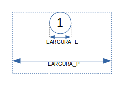

# CSS - Parte 4
## Especificidade de seletores, Layout e posicionamento e centralizando coisas

---
## Na última aula - _Tags_ Semânticas (1/4)

- O HTML5  <!-- {.emoji} -->
  propôs elementos idênticos às `divs`/`spans`, mas que **possuem
  sentido para o navegador**. Por exemplo:
  ```html
  <header></header>   <!-- em vez de <div id="header"></div> -->
  <footer></footer>   <!-- em vez de <div id="footer"></div> -->
  <article></article> <!-- em vez de <div id="article"></div> -->
  <time></time>       <!-- em vez de <span id="time"></span> -->
  <nav></nav>         <!-- em vez de <div id="navigation"></div> -->
  ```
---
## Na última aula - propriedade **display** (2/4)

<iframe width="600" height="300" src="//jsfiddle.net/fegemo/2gfkyrrh/3/embedded/result,html,css/" allowfullscreen="allowfullscreen" frameborder="0"></iframe>

---
## Na última aula - alterando a visibilidade (3/4)

- `display:none`: o elemento é removido do fluxo
- `visibility: hidden;`: o elemento fica escondido, mas ainda ocupa espaço
- `opacity`: define a opacidade:
  ```css
    video {
      opacity: 0.5; /* 0.0 (transparente) a 1.0 (opaco) */
    }
  ```

---
## Na última aula -  _Pseudo-classes_ e _Pseudo-elements_ (4/4)
 _Pseudo-class_
  ~ permitem **selecionar** elementos em **diferentes situações**.  
  ~ Exemplos: `:focus` (contém o foco), `:hover` (mouse em cima)


_Pseudo-element_
  ~ permitem **estilizar** certas **partes de elementos**
  ~ Exemplos: `::selection` (seleção de texto) `::first-letter` (primeira letra)
---
# Roteiro de hoje

1. Especificidade de seletores
1. Layout e posicionamento
1. Centralizando coisas
---
<!-- {"layout": "section-header"} -->
# Especificidade de seletores
## Aplicando regras

- Mais de uma regra definindo a mesma propriedade
- Regras de especificidade
- Especificator Tabajara(tm)
<!-- {ul:.content} -->

---
## Motivação

- Dadas <u>mais de uma regra `CSS` definindo a mesma propriedade</u> para
  um elemento, qual prevalece?
  - Como determinar qual a cor do elemento?
    ```html
    <style>
      h4 { color: black; }
      h4 { color: white; }      
    </style>

    <h4>Arthur Dent</h4> <!-- qual a cor de Arthur Dent? -->
    ```

---
## Mais Difícil...

```html
<style>
  .destaque { color: red; }
  #titulo   { color: green; }
  h4        { color: blue; }
</style>

<h4 id="titulo" class="destaque">Ford Prefect</h4>
```
- E agora??
- Os **3 seletores <u>se aplicam</u>** ao elemento! <!-- {ul:.bulleted} -->
  - Mas com **prioridades diferentes**
  - (↑) mais específico o seletor da regra → (↑) maior sua prioridade
    - Neste caso, <h4 style="display: inline; color: green;">Ford Prefect (`green`)</h4>

---
<!-- {"layout": "regular"} -->
## Regras gerais de especificidade

Regra 1 <!-- {dl:.bulleted} -->
  ~ Cada seletor tem uma **pontuação de especificidade**

Regra 2
  ~ Se dois seletores selecionam o mesmo elemento, mas com pontuações
    diferentes, ganha aquele com pontuação maior

Regra 3
  ~ Se dois seletores selecionam o mesmo elemento e têm a mesma
    pontuação, ganha o que foi declarado por último

Regra 4
  ~ Estilo Inline &gt;&gt; Arquivo Externo &gt;&gt; Incorporado

Regra 5
  ~ ID &gt;&gt; classe &gt;&gt; atributo &gt;&gt; tag

---
<!-- {"layout": "regular"} -->
## Cálculo da **pontuação de especificidade**

- [Especificação na W3C sobre _CSS3 Selectors_](http://www.w3.org/TR/css3-selectors/#specificity)
- Algoritmo
  1. Contar o número de IDs no seletor (variável `a`)
  1. Contar o número de classes, atributos e pseudo-classes no seletor (`b`)
  1. Contar o número de tags e pseudo-elementos no seletor (`c`)
  1. Concatenar os três números (`abc`)

---
## Exemplos

```css
/* seletor { propriedades }  abc */
li { }                    /* 001 */
.destaque { }             /* 010 */
li.destaque { }           /* 011 */

#rodape { }               /* 100 */
#rodape #logo { }         /* 200 */

a[href^="www"] { }        /* 011 */
p strong em { }           /* 003 */
```

---
## Exercício

- Qual é a cor do texto?
  ```html
  <style>
    #a .b .c { color: red; }
    .d .e .f { color: green; }
    .g .h #i { color: blue; }
  </style>
  <p id="a" class="d g">
      <strong class="b e h">
          <em id="i" class="c f">Qual é a minha cor?</em>
      </strong>
  </p>
  ```
  - [Resposta](https://jsfiddle.net/fegemo/bw1xt1az/) no JSFiddle

---
<!--
{
  "scripts": ["../../scripts/classes/spec-tabajara.min.js"],
  "styles": ["../../styles/classes/spec-tabajara.min.css"]
}
-->

## **Specificator Tabajara**

<article id="spec-tabajara">
  <div>
    <input type="text" id="spec-tabajara-input" placeholder="seletor...">
  </div>
  <div>
    <button id="spec-tabajara-button">Calcular</button>
  </div>
  <div>
    <div class="spec-class">
      <div id="spec-tabajara-output-a" class="spec-output">0</div>
      <div>A IDs</div>
    </div>
    <div class="spec-class">
      <div id="spec-tabajara-output-b" class="spec-output">0</div>
      <div>Classes, atributos e pseudo-classes</div>
    </div>
    <div class="spec-class">
      <div id="spec-tabajara-output-c" class="spec-output">0</div>
      <div>Elementos, pseudo-elementos</div>
    </div>
  </div>
</article>

---
<!-- {"layout": "section-header"} -->
# Layout e posicionamento
## Aplicando fluxos alternativos aos elementos

- Posicionamento: `top`, `right`, `bottom` e `left`
- Tipos de `position`:`absolute`, `relative`, `fixed` e `static`
- `z-index`
<!-- {ul:.content} -->

---
## Layout e posicionamento

- Podemos dar
  **fluxos alternativos** aos elementos
  - Propriedades envolvidas:
    - ```css
      position: static; /* relative, absolute, fixed */
      top: 0px;         /* uma dimensão */
      right: 0px;       /* uma dimensão */
      bottom: 0px;      /* uma dimensão */
      left: 0px;        /* uma dimensão */
      z-index: 1;       /* um inteiro */
      ```

---
## **top, right, bottom e left**

- Usadas para definir a posição (ou _offset_) do elemento
- Sua interpretação depende de qual valor de `position` estamos usando para
  aquele elemento

---
## **position**

- `static`
  - Comportamento padrão. O elemento é **posicionado no fluxo normal (padrão)**.
  - As propriedades `left`, `right`, `top`, `bottom` e `z-index`
    **são ignoradas**
- `absolute`
  - O elemento **não tem espaço reservado para ele**. Em vez disso, ele fica
    exatamente na posição especificada por `left`, `right`, `top`, `bottom`
    relativo ao seu mais próximo antecessor-posicionado (não _static_)
  - Margens se aplicam, porém elas não fazem _margin collapse_ com outras

---
## **position** (cont.)

- `relative`
  - O elemento continua no **fluxo normal**, a menos que tenha suas propriedades
    `left`, `right`, `top` e `bottom` ajustadas.
  - A posição do elemento será **ajustada com relação à sua posição original**
    (caso ele fosse `static`)
  - Os elementos posteriores **não são ajustados** para ocupar eventuais
    "buracos" na página
- `fixed`
  - Bem semelhante ao `absolute`, porém o elemento é ajustado na posição
    `left`, `right`, `top`, `bottom` **no espaço da tela** (_viewport_), e não
    da página
---
## **position** -- Exemplo
<style>
.minibola{
  display: inline-block;

  width:48px;

  padding: 4px 15px;
  border: 2px solid rebeccapurple;
  background: rgba(255, 255, 255, .5);
  border-radius: 70px;

}
</style>


  - Considere que:
    - O div representado pelo **quadrado pontilhado** está como **position:relative**
    - O div <span class="minibola"> 2 </span> possui as propriedades: **top:-20px** e **left: 30px**

<iframe width="90%" height="50%" src="//jsfiddle.net/fegemo/jnjvsqy4/embedded/result,html,css/" allowfullscreen="allowfullscreen" frameborder="0" style="float: right"></iframe>
---
## **z-index**
<style>
  .quadrado{
    height: 100px;
    width: 140px;
    border: 1px dashed black;
    position:absolute;
  }
  .q1{
    background-color:lightblue;
    z-index:1;
  }
  .q2{
    background-color:lightyellow;
    top:45px;
    left: 20px;
    z-index:2;
  }
  .q3{
    background-color:lightgreen;
    top:75px;
    left: 30px;
    z-index:3;


    }
</style>
- Define a ordem "no eixo Z" com a qual elementos que se tocam deve ser exibida
:::result
  <div style="width:200px;height:170px;">
    <div class="quadrado q1">
      z-index=1
    </div>
    <div class="quadrado q2">
      z-index=2
    </div>
    <div class="quadrado q3">
      z-index=3
    </div>

  </div>
:::

- Útil apenas para elementos `position: absolute` ou `position: fixed`


---
<!-- {"layout": "section-header"} -->
# Centralizando as coisas
## Centralizando elementos de acordo com o seu tipo

- Centralizando conteúdo `inline`
- Centralizando conteúdo com largura definida
- Centralizando um elemento com `position` `absolute` ou `fixed`
<!-- {ul:.content} -->


---
## Centralizando horizontalmente

- Existem várias formas para centralizar elementos que se aplicam a situações
  diferentes
- Centralizando conteúdo `inline`:
  ```css
  .centraliza { text-align: center; }
  ```
- Centralizando um elemento com largura definida
  ```css
  .centraliza-definida { margin: 0 auto; }
  ```

---
## Centralizando horizontalmente (cont.)

- Centralizando um elemento com `position` `absolute` ou `fixed`
  ```css
  .centraliza-position { left: (LARGURA_P - LARGURA_E)/2; }
  ```
   <!-- {.push-right} -->

  - Onde `LARGURA_P` é a largura do recipiente e `LARGURA_E` é a largura
    conhecida do elemento que queremos centralizar

---
## Centralizando horizontalmente (cont.)

- Centralizando um elemento com `position` `absolute` ou `fixed` em um
  recipiente fluido (largura pode variar)
  ```css
  .centraliza-fluido { left: 50%; margin-left: -(LARGURA_E / 2); }
  ```
- [Um guia sobre como centralizar qualquer elemento no site designshack.net](http://designshack.net/articles/css/how-to-center-anything-with-css/)
   <!-- {.push-right} -->

---
# Referências

- [Propriedade **position** na MDN](https://developer.mozilla.org/en-US/docs/Web/CSS/position)
- [Um breve e interessante tutorial sobre posicionamento](http://learnlayout.com/position.html)
