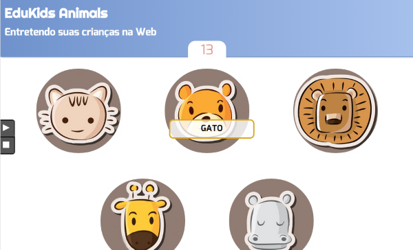
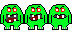
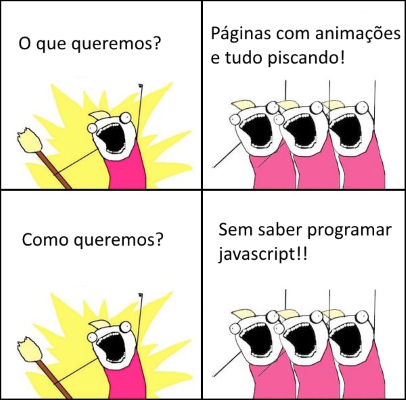
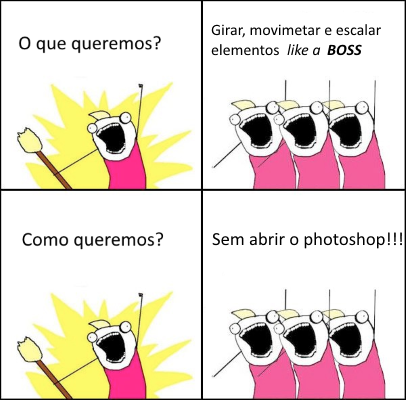

# CSS - Parte 5

---
<!--
{
  "embeddedStyles": ".righteous { font-family: Righteous, cursive; color: #e90c0c }"
}
-->
# Roteiro de hoje

1. Finalizar o jogo **EduKids Animals** <!-- {.righteous} -->
1. Sprites
1. Transições
1. Transformações
1. Animações

---
## EduKids Animals <!-- {.righteous} -->

 <!-- {.portrait} -->

---
## Motivação

Seu irmão e sua cunhada acabam de fazer 3 anos de casados e vão viajar em um
cruzeiro. Resta a você, desejar boa viagem e cuidar do seu sobrinho de 2
anos.

Com um comportamento de anjinho (#sqn), o pequeno Joãozinho vai precisar ser
entretido por um bom tempo. Você, como um ótimo tio e programador exímio,
decide que é hora de criar um jogo Web para, além de entreter seu
mini-sobrinho, ensiná-lo como falar o nome de alguns animais.

---
## O jogo

[](../../images/edukids.png)

---
## O jogo, como está

- Funcionamento do jogo:
  - Assim que apertar **play**, o jogo começa
  - A cada ~2s, um animal é sorteado e começa a ficar agitado, com fome
  - Você deve clicar no animal agitado para alimentá-lo antes que ele coma
    alguém
    - Fazendo isso, ganha-se 1 ponto
  - Se um animal não é clicado, perde-se 2 pontos
  - Se um animal que estava sossegado é perturbado fora de hora, perde-se 1
    ponto
- Essa funcionalidade **já está implementada**

---
## O que está **faltando**

1. O jogo ainda não dá um _feedback_ visual interessante para o jogador
   - Apenas o nome do animal aparece escrito e seu sobrinho ainda não sabe ler
1. O arquivo javascript `jogo.js` controla o jogo. Ele tem um temporizador que
   fica **adicionando e removendo classes dos elementos** dos animais
   - `agitado`, quando o animal está com fome
   - `alimentado`, quando o animal acabou de comer
   - `perturbado`, quando um animal sossegado é perturbado
   - `instinto-selvagem`, quando um animal com fome não é alimentado a tempo

---
## Pede-se: fazer os **3 exercícios** abaixo

1. Criar uma **transição para quando o mouse estiver em cima dos botões**
   _play/stop_ (para que o elemento se revele lentamente)
1. Você deve implementar uma **metáfora visual** para cada um dos 4 estados dos
   animais. Algumas sugestões:
   - `agitado`, animal piscando (opacidade variando)
   - `alimentado`, uma borda verde no animal e o animal fica girando de alegria
   - `perturbado`, animal vai crescendo, ou fica pulsando
   - `instinto-selvagem`, animal dá um salto e cresce, com uma borda vermelha
1. Criar uma **imagem _sprite_**   com as imagens dos ícones de "começar/parar" o jogo
   de forma a fazer com que a página carregue mais rápido

---
## Entrega do exercício

1. O jogo já está funcionando 85% e você pode acessar [seu repositório no
   GitHub](https://github.com/fegemo/cefet-web-edukids)
1. Crie um _fork_ do repositório e trabalhe em cima dele
1. Terminar o jogo (slide anterior) e dar **_commit_ e _push_**
1. Enviar, via **Moodle**, o link do seu repositório até o final da aula

---
# _Sprites_

---
## Por que preciso de mais isso?

- Para melhorar o desempenho da sua página e reduzir a transferência de dados
  (3G, 4G etc.)
- Para cada imagem que temos em uma página:
  1. O navegador faz uma requisição GET `http` para o servidor
  1. O navegador espera pela resposta
  1. O navegador baixa a respota, que contém meta-informação (os cabeçalhos)
     do protocolo `http`, o arquivo de image (e os cabeçalhos do arquivo de
     imagem)
- Tipicamente, um navegador não faz mais que 5 requisições por domínio ao mesmo
  tempo
  - [Estudo do Steve Souders sobre o assunto](http://www.stevesouders.com/blog/2008/03/20/roundup-on-parallel-connections/)

---
## _**Sprites** to the rescue_

- _Sprite_ é um arquivo de imagem que possuem várias imagens agrupadas
  - Muito comum em jogos digitais<br>
     <!-- {style="width: 150px; image-rendering: pixelated;"} -->
  - Pode ser usado para criar animações, mas também para agrupar as imagens
- Benefício para páginas web
  - Apenas uma _round-trip_ de requisição/resposta `http`
  - Menos tempo para carregar imagens
  - Menor transferência de dados
  - Maior paralelização das requisições `http`

---
## **Relembrando**: duas formas para incluir imagens

- Em páginas Web, temos **duas formas de mostrar imagens**:
  ```html
  
  ```
  ```css
  #cabecalho { background-image: url("images/bolhas.png"); }
  ```
- Para decidir sobre a forma de uso de imagens, devemos ponderar:
  - Se a imagem fizer sentido como conteúdo da página, optamos por `img`
  - Se a imagem trata-se de aparência, optamos por `background-image`
    - Quando imprimimos uma página, as `background-image`s não aparecem!

---
## Usando _sprites_ em páginas

- Também existem duas formas para usar _sprites_:
  1. Tradicional
     - Para ser usado em contextos em que pode-se usar a propriedade
       `background-image`
  1. Semântico
     - Usado em contextos de imagens semânticas

---
## Usando _sprites_: forma **tradicional**

- ```html
  <div id="monstro"></div>
  ```
  ```css
  #monstro {
    width: 24px;
    height: 32px;
    background-image: url('images/terrivel-eating.png');
    background-position: -48px 0;  /* 3º quadro */
  }
  ```

<div style="width: 24px;height: 32px;background-image: url('../../images/terrivel-eating.png');background-position: -48px 0;"></div>

---
## Usando _sprites_: forma **semântica**

- ```html
  <figure id="monstro">
    
  </figure>
  ```
  ```css
  #monstro {
    width: 24px; height: 32px;
    overflow: hidden; position: relative; }
  #monstro img {
    position: absolute;
    left: -48px; top: 0;  }
  ```

<figure style="width: 24px;height: 32px;overflow: hidden;position: relative;margin-top:-10px;">
  
</figure>

---
# Transições

---
## Pra que isso?



---
## Transições CSS

- Muitas vezes queremos criar pequenas animações em nossas páginas
  - Mudança da cor do botão quando passamos o mouse em cima
  - Um elemento se expandindo para revelar mais conteúdo
  - Um painel sumindo gradativamente, em vez de desaparecendo
- CSS3 especifica uma nova propriedade: `transition`

---
## Como usar

- ```css
  a:link  { color: #f00; }
  a:hover { color: #000; }
  a       { transition: color 600ms linear; }
  ```
  <style>
    a.transition-link {
      transition: color 600ms linear;
      -webkit-transition: color 600ms linear;
      -moz-transition: color 600ms linear;
      -ms-transition: color 600ms linear;
    }
    a.transition-link:link  { color: red; }
    a.transition-link:hover { color: #000; text-decoration: none; }
  </style>
  <a href="#" class="transition-link">Heyyy, hover me</a>
- Escolhemos que propriedade `CSS` queremos animar, por quanto tempo e qual a
  função de interpolação

---
## Propriedades que podemos animar

- Nem todas as propriedades são animáveis e elas podem variar entre navegadores
- Algumas que são animáveis:
  - `transform`
  - `opacity`
  - `color`
  - `background-color`
  - `left`
  - `right`
  - `top`
  - `bottom`
  - `background-position`
  - `border-radius`
  - `margin`
  - `padding`
  - `width`
  - `height`
  - [E mais...](https://developer.mozilla.org/en-US/docs/Web/CSS/CSS_animated_properties) <!-- {ul:.multi-column-list-3}-->


---
## A propriedade **transition** (na [MDN](https://developer.mozilla.org/en-US/docs/Web/CSS/transition))

- É um atalho para:
  - `transition-duration: 0s`, a duração da transição
  - `transition-property: all`, que propriedades `CSS` devem sofrer transição
  - `transition-timing-function: ease`, a função de interpolação
  - `transition-delay: 0s`, tempo de atraso até que se comece a transição
- Sintaxe formal:
  ```
  transition: [ none | <single-transition-property> ] || <time>
                || <timing-function> || <time>;
  ```

---
## Função de interpolação (_**timing-function**_)

<iframe width="100%" height="440" src="http://jsfiddle.net/fegemo/2a5450ds/embedded/result,html,css/" allowfullscreen="allowfullscreen" frameborder="0"></iframe>

---
## Compatibilidade nos navegadores

<div class="caniuse" data-feature="css-transitions"></div>

---
## Compatibilidade: uso de prefixos

- Novas funcionalidades do CSS3 tem sido construídas sob um **prefixo** que
  varia por navegador
- Exemplo, no caso da propriedade `transition`:
  ```css
  #monster {
    -webkit-transition: top 1s ease-out; /* chrome, safari, android */
       -moz-transition: top 1s ease-out; /* firefox */
        -ms-transition: top 1s ease-out; /* internet explorer */
         -o-transition: top 1s ease-out; /* opera */
            transition: top 1s ease-out;
  }
  ```

---
## Compatibilidade: uso de prefixos

- Dessa forma, evita-se problemas devido a divergências na implementação da
  especificação do CSS3 entre navegadores
  - Por exemplo, o Firefox vai ignorar propriedades desconhecidas a ele
    (`-webkit-*, -ms-*, -o-*`)
- Como saber se precisa de prefixos?
  - Site [caniuse.com](http://caniuse.com/#feat=css-transitions)
- Atualmente, todos os navegadores suportam a propriedade `transition`
  sem o uso de prefixos

---
# Transformações

---
## Por que?



---
## A propriedade **transform**  ([na MDN](https://developer.mozilla.org/en-US/docs/Web/CSS/transform))

- Define uma **transformação geométrica** aplicada aos "vértices" de um
  elemento **`block`** (ou **`inline-block`**)
- Exemplo:
  ```html
  <p>Yay, sem Photoshop!</p>
  ```
  ```css
  p { transform: rotate(-10deg); }
  ```
- Resultado:
  <p style="-webkit-transform: rotate(-10deg); -moz-transform: rotate(-10deg); -ms-transform: rotate(-30deg); -o-transform: rotate(-10deg); transform: rotate(-10deg); background-color: white">Yay, sem Photoshop!</p>

---
## A propriedade **transform** (cont.)

- Diversas matrizes de transformação podem ser atribuídas como valor para a
  propriedade `transform`:
  - `translate(x,y)`
  - `translate3d(x,y,z)`
  - `translateX(x)`
  - `translateY(y)`
  - `translateZ(z)`
  - `scale(x,y)`
  - `scale3d(x,y,z)`
  - `scaleX(x)`
  - `scaleY(y)`
  - `scaleZ(z)`
  - `rotate(ang)`
  - `rotat3d(x,y,z,ang)`
  - `rotateX(ang)`
  - `rotateY(ang)`
  - `rotateZ(ang)`
  - [E mais...](https://developer.mozilla.org/en-US/docs/Web/CSS/transform) <!-- {ul:.multi-column-list-3}-->

---
## Combinando **transition** e **transform**

- ```html
  <a href="#">Effects like a boss</a>
  ```
  ```css
  a {
    display: inline-block;
    transition:transform .2s cubic-bezier(.37,1.89,.59,.73);
  }
  a:hover {
    transform: scale(1.4);
  }
  ```

<style>
a.combinando {
  display: inline-block;
  transition:transform .2s cubic-bezier(.37,1.89,.59,.73);
}
a.combinando:hover {
  transform: scale(1.4);
}
</style>
<a href="#" class="combinando">Effects like a boss</a>

---
## Compatibilidade nos navegadores

<div class="caniuse" data-feature="transforms2d"></div>

---
# Animações

---
## O que queremos?

- Criar animações mais complexas do que uma interpolação entre dois valores de
  uma propriedade
- Sem usar Javascript!!
  - Maior desempenho
  - Fácil de fazer (de forma declarativa em vez de imperativa)
  - Permite que o navegador controle a animação, possibilitando que ele utilize
    dos recursos de hardware gráficos presentes ou mesmo pausando a computação
    de animações que não estão visíveis

---
## A propriedade **animation** (na [MDN](https://developer.mozilla.org/en-US/docs/Web/CSS/animation))

- Especificada no CSS3, `animation` e `@keyframes` possibilitam o uso de
  animações de propriedades CSS de forma similar a `transition`
  ```html
  
  ```
  ```css
  #urso {
    position: relative;
    animation: flutuando .5s ease-in-out 0s infinite alternate;
  }
  @keyframes flutuando {
    from { top: 0;     }
    to   { top: -30px; }
  }
  ```
<style>
.urso-flutuante {
  position: relative;
  -webkit-animation: urso-flutuando .5s ease-in-out 0s infinite alternate;
  -moz-animation: urso-flutuando .5s ease-in-out 0s infinite alternate;
  -ms-animation: urso-flutuando .5s ease-in-out 0s infinite alternate;
  -o-animation: urso-flutuando .5s ease-in-out 0s infinite alternate;
  animation: urso-flutuando .5s ease-in-out 0s infinite alternate;
  transition: opacity 200ms ease-out;
}
.urso-flutuante:hover {
  opacity: 0.25;
}
@-webkit-keyframes urso-flutuando {
  from { top: 0;     }
  to   { top: -30px; }
}
@-moz-keyframes urso-flutuando {
  from { top: 0;     }
  to   { top: -30px; }
}
@-ms-keyframes urso-flutuando {
  from { top: 0;     }
  to   { top: -30px; }
}
@keyframes urso-flutuando {
  from { top: 0;     }
  to   { top: -30px; }
}
  </style>
  <div style="position: absolute; top: 50%; left: 50%; margin-top: -75px; margin-left: -75px;">
  
  </div>

---
## Criando uma animação

- Uma animação CSS é composta por
  1. Uma definição de quadros de animação (`@keyframes`) e
  1. Uma configuração de parâmetros da animação (`animation`)
- Os `@keyframes` definem o valor das propriedades que variam ao longo da
  animação
- A `animation` configura o tempo da animação, a ordem de execução e o nome da
  sequência de quadros a ser usada

---
## A propriedade **animation** (cont.)

- É um atalho para:
  - `animation-name: none`, nome dado ao **`@keyframes`** a ser usado
  - `animation-duration: 0s`, duração
  - `animation-timing-function: ease`, função de interpolação
  - `animation-delay: 0s`, tempo de atraso
  - `animation-iteration-count: 1`, quantas vezes rodar (pode ser `infinite`)
  - `animation-direction: normal`, em que sentido executar
    - `normal`, `reverse`, `alternate`, `alternate-reverse`
  - `animation-fill-mode: none`, o que fazer com o resultado da animação após
    terminar
  - `animation-play-state: running`, estado da animação

---
## Definindo **@keyframes**

<style>
@-webkit-keyframes terra-ao-longo-do-dia {
  0%   { background: #6c5228; }
  33%  { background: #48a037; }
  66%  { background: #48a037; }
  100% { background: #6c5228;	}
}
@keyframes terra-ao-longo-do-dia {
  0%   { background: #6c5228; }
  33%  { background: #48a037; }
  66%  { background: #48a037; }
  100% { background: #6c5228;	}
}
.terra {
  position: absolute;
  bottom: 0;
  height: 65px;
  left: 0;
  right: 0;
  z-index: -1;
  -webkit-animation: terra-ao-longo-do-dia 20s linear 4s 1 normal forwards;
  -moz-animation: terra-ao-longo-do-dia 20s linear 4s 1 normal forwards;
  -ms-animation: terra-ao-longo-do-dia 20s linear 4s 1 normal forwards;
  animation: terra-ao-longo-do-dia 20s linear 4s 1 normal forwards;
}</style>

- ```css
  @keyframes piscando {
    from { opacity: 1.0; }
    to   { opacity: 0.7; }
  }
  ```
  ```css
  @keyframes terra-ao-longo-do-dia {
  	0%   { background: #6c5228; }  33%  { background: #48a037; }
  	66%  { background: #48a037; }  100% { background: #6c5228; }
  }
  ```
  <div class="terra"> </div>

---
## Definindo **@keyframes** (cont.)

<style>
.estrela-mario-1:hover {
  -webkit-animation: girando 1s ease-in-out 0s infinite alternate;
  -moz-animation: girando 1s ease-in-out 0s infinite alternate;
  -ms-animation: girando 1s ease-in-out 0s infinite alternate;
  animation: girando 1s ease-in-out 0s infinite alternate;
}
@-webkit-keyframes girando {
  from { transform: rotate(15deg); }
  to   { transform: rotate(-15deg); }
}
@-moz-keyframes girando {
  from { transform: rotate(15deg); }
  to   { transform: rotate(-15deg); }
}@-ms-keyframes girando {
  from { transform: rotate(15deg); }
  to   { transform: rotate(-15deg); }
}
@keyframes girando {
  from { transform: rotate(15deg); }
  to   { transform: rotate(-15deg); }
}</style>

- ```css
  .estrela-mario-1:hover {
    animation: girando 1s ease-in-out 0s infinite alternate;
  }
  @keyframes girando {
    from { transform: rotate(15deg); }
    to   { transform: rotate(-15deg); }
  }
  ```
  

---
## Definindo **@keyframes** (cont.)

<style>
.estrela-mario-2:hover {
  -webkit-animation: pirando 600ms ease-in 3s 1 forwards, girando-costas 3600ms ease-in 1 forwards;
  -moz-animation: pirando 600ms ease-in 3s 1 forwards, girando-costas 3600ms ease-in 1 forwards;
  -ms-animation: pirando 600ms ease-in 3s 1 forwards, girando-costas 3600ms ease-in 1 forwards;
  animation: pirando 600ms ease-in 3s 1 forwards, girando-costas 3600ms ease-in 1 forwards;
}

@-webkit-keyframes pirando {
  from { opacity: 1; top: 0;      width: 100px; left: 0     }
  to   { opacity: 0; top: -200px; width: 20px;  left: 40px; }
}
@-moz-keyframes pirando {
  from { opacity: 1; top: 0;      width: 100px; left: 0     }
  to   { opacity: 0; top: -200px; width: 20px;  left: 40px; }
}
@-ms-keyframes pirando {
  from { opacity: 1; top: 0;      width: 100px; left: 0     }
  to   { opacity: 0; top: -200px; width: 20px;  left: 40px; }
}
@keyframes pirando {
  from { opacity: 1; top: 0;      width: 100px; left: 0     }
  to   { opacity: 0; top: -200px; width: 20px;  left: 40px; }
}

@-webkit-keyframes girando-costas {
  from { transform: rotateY(0); }
  to   { transform: rotateY(3600deg); }
}
@-moz-keyframes girando-costas {
  from { transform: rotateY(0); }
  to   { transform: rotateY(3600deg); }
}
@-ms-keyframes girando-costas {
  from { transform: rotateY(0); }
  to   { transform: rotateY(3600deg); }
}
@keyframes girando-costas {
  from { transform: rotateY(0); }
  to   { transform: rotateY(3600deg); }
}
</style>

- ```css
  .estrela-mario-2:hover {
    animation: pirando 600ms ease-in 3s 1 forwards,
               girando-costas 3600ms ease-in 1 forwards;
  }
  ```
  <div style="position:relative;">
    
  </div>

---
## Definindo **@keyframes** (cont.)

- ```css
  @keyframes pirando {
    from { opacity: 1; top: 0;      width: 100px; left: 0     }
    to   { opacity: 0; top: -200px; width: 20px;  left: 40px; }
  }
  @keyframes girando-costas {
    from { transform: rotateY(0); }
    to   { transform: rotateY(3600deg); }
  }
  ```

---
## **animation** ou **transition**?

- **`transition`** é uma interpolação entre dois valores de uma propriedade
- **`animation`** é uma interpolação entre dois ou mais valores, opcionalmente
  acontecendo mais de uma vez e em ordem alternada
- Sempre optamos pelo mais simples
  - No caso, `transition`, quando possível

---
## Compatibilidade nos navegadores

<div class="caniuse" data-feature="css-animation">Carregando das **Internetchas...**</div>

---
# Referências

- [Mozilla Developer Network](https://developer.mozilla.org/)
- [caniuse.com](http://caniuse.com/)

---
# Slide **_easter egg_**!!

- Em 01/04/2015, a Google lançou um espelho para seu buscador, o com.google.
  Ele se parecia com isto:
  [com.google](../../images/comgoogle.png)

- Usando transformações e animações, fica facinho fazer um desses!!
  <a class="bookmarklet" href="javascript:(function(){ if (document.body.style.transform === '') { document.body.style.transform='rotateY(180deg)'; } else { document.body.style.transform = '';}})()">Paradinha do Google</a>
  <a class="bookmarklet" href="javascript:(function(){ if (!document.getElementById('aew-anim')) { document.getElementsByTagName('html')[0].style.overflowX='hidden'; var s= document.createElement('style'); s.id='aew-anim'; s.innerText='@-webkit-keyframes aew { from { transform: skewX(-2deg); } to { transform: skewX(2deg); }}'; document.head.appendChild(s); } if (document.body.style.webkitAnimation === '') { document.body.style.transform='skewX(10deg)';document.body.style.transformOrigin='-50% 0';document.body.style.webkitAnimation='aew 400ms ease-in-out infinite alternate'; } else { document.body.style.webkitAnimation='';document.body.style.transform='';}})()">Rabo do cachorro</a>

  - Modo de uso de um **_bookmarklet_**: arraste o link para sua barra de favoritos e
    simplesmente clique no favorito quando estiver em uma página
