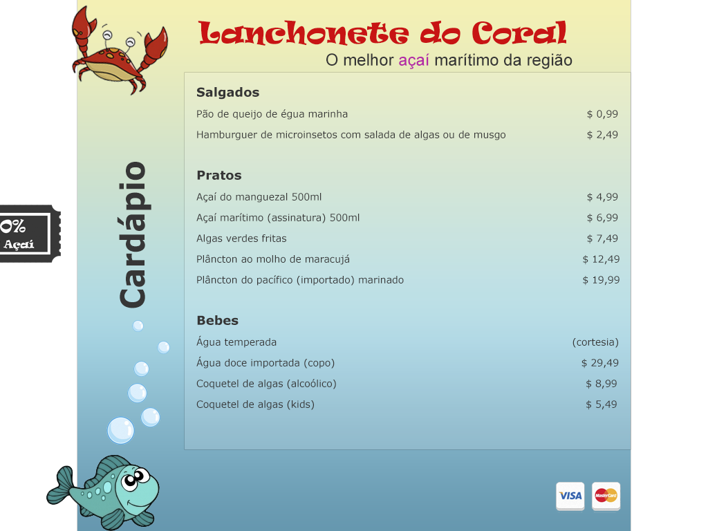
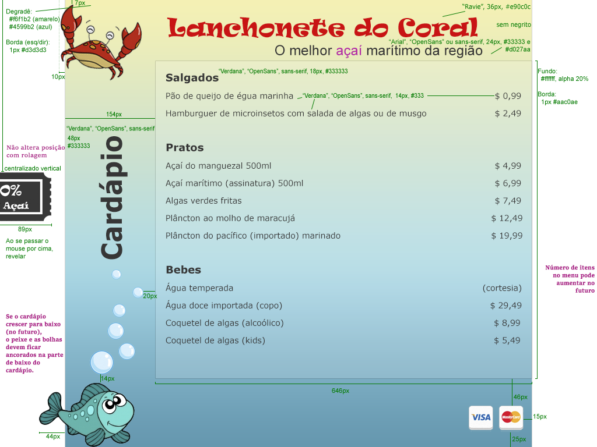
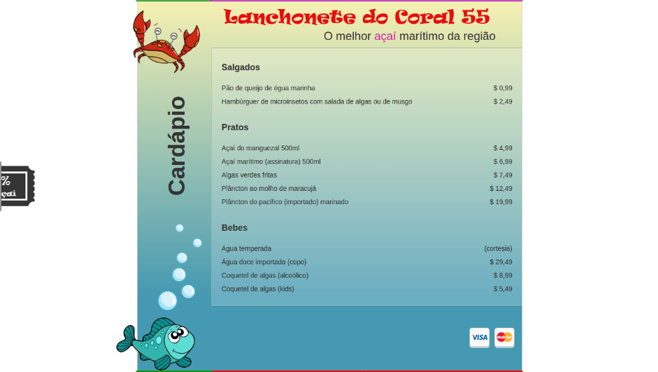
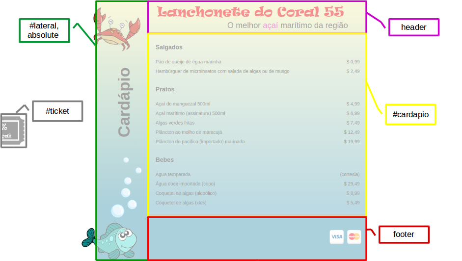

<!-- {"layout": "title"} -->
# CSS - Parte 5
## Especificidade de seletores, Centralizando coisas e a Lanchonete do Coral 55 :palm_tree:

---
<!-- {"layout": "regular"} -->
# Na última aula (1/2)

| position | Descrição | Exemplos de uso | top, right, bottom, left | z-index |
|------------|-------------------------------------------------------------------|--------------------------------------------------------------------------------------------------------------|---------------------------------------|-----------------|
| `static` | Fluxo normal | Elementos **sem posicionamento especial** | ignorados | ignorado |
| `relative` | Fluxo normal, deslocado | Elementos que podem se **deslocar um pouco**; **contextos para elementos absolutos** | **deslocamentos** nas 4 direções | determina ordem |

---
# Na última aula  (2/2)

| position | Descrição | Exemplos de uso | top, right, bottom, left | z-index |
|------------|-------------------------------------------------------------------|--------------------------------------------------------------------------------------------------------------|---------------------------------------|-----------------|
| `absolute` | Removido do fluxo, posicionado em um (x,y) relativo a um contexto | Elementos que queremos **determinar os valores (x,y)** para posicioná-los exatamente em algum lugar | **posições** referentes às 4 direções | determina ordem |
| `fixed` | Removido do fluxo, em um (x,y) na janela | Idem, mas a **posição é fixa na janela** | **posições** para as 4 direções | determina ordem |

---
# Roteiro de hoje

1. [Lanchonete do Coral 55](#lanchonete-do-coral-55) :palm_tree:
1. [Especificidade de seletores](#especificidade-de-seletores)
1. [Centralizando coisas](#centralizando-as-coisas)

---
<!--
{
  "embeddedStyles": ".ravie { font-family: Ravie, serif; color: #e90c0c; }",
  "layout": "section-header",
  "slideHash": "lanchonete-do-coral-55"
}
-->
# Lanchonete do Coral 55  <!-- {.ravie style="font-size: 2em"} -->
## Conhecendo o menu da lanchonete

- Atividade de hoje
- Layout e posicionamento
- Propriedade `line-height`

<!-- {ul:.content} -->

---
<!-- {"backdrop": "coral-55"} -->

---
## Comp / Specs

[](../../images/coral55-comp.png) <!-- {style="width: 49%"} -->
[](../../images/coral55-specs.png) <!-- {style="width: 49%"} -->

*[Comp]: Comprehensive Layout*
*[Specs]: Specifications*

---
# Atividade de hoje

1. O objetivo é treinar **_layout_ e posicionamento** em `CSS`
   - `position` (`static`, `relative`, `absolute`, `fixed`), `float` etc.
   - O HTML está pronto, faltando o CSS da página
1. O _layout_ que usamos no exercício dos Unicórnios se chama **fluido**. Hoje,
   você vai fazer um **_layout_ de largura fixa**
   - O conteúdo da página deve ter `800px` de largura e deve estar centralizado
1. [Baixe os arquivos][coral-55-seminal]. Instruções detalhadas estão no
   arquivo README.md.

[coral-55-seminal]: https://github.com/fegemo/cefet-front-end-coral-55/archive/master.zip

---
## _Layout_ e posicionamento

- Em alguns _layouts_ podemos **usar elementos posicionados** de maneira
  diferente do tradicional `static` quando:
  1. Deseja-se posicionar um elemento em cima do outro
  1. Deseja-se especificar coordenadas (x,y) de um elemento
  1. Deseja-se que um elemento seja removido do fluxo (e não ocupe espaço)
- Veja como está estruturado o HTML e como você pode estilizar as partes

---
<!-- {
  "layout": "regular",
  "embeddedStyles": ".code pre { margin-left: 153px; } .code::before { content: 'H T M L'; display: inline-block; height: 4em; width: 1em; font-family: monospace; font-size: 110px; float: right; margin-left: 20px;}"
} -->

<div class="code">

```html
<body>
  <div id="recipiente">
    <header><!-- titulos --></header>
    <main id="conteudo">
      <section id="lateral">
        <!-- siri, peixe, bolhas -->
      </section>
      <section id="cardapio">
        <article><!-- ... --></article>
        <article><!-- ... --></article>
        <!-- mais itens do menu -->
      </section>
    </main>
    <footer><!-- cartoes --></footer>
  </div>
  <aside id="ticket"><!-- ... --></aside>
</body>
```

</div>

---
<!-- {"state": "show-active-slide-and-previous"} -->

::: figure .figure-slides
 <!-- {.bullet.figure-step.bullet-no-anim} -->
 <!-- {.bullet.figure-step.bullet-no-anim} -->
:::

---
<!-- {"slideHash": "line-height"} -->
## A propriedade **line-height** ([na MDN](https://developer.mozilla.org/en-US/docs/Web/CSS/line-height))

- Define a altura de uma linha de texto.
- Inicialmente, `line-height: 1em;`, mas qualquer valor de medida de tamanho
  pode ser usado
  - Exemplo:
    ```css
    .espacamento-simples { line-height: 1em; }
    .espacamento-duplo   { line-height: 2em; }
    ```

    <p style="float: left; width: 45%; line-height: 1em; height: 100px; overflow: auto; border: 3px solid black">
      Lorem ipsum dolor sit amet, consectetur
    adipiscing elit. Curabitur mauris eros, fermentum eget dolor sit amet.</p>

    <p style="float: right; width: 45%; line-height: 2em; height: 100px; overflow: auto; border: 3px solid black">
    Lorem ipsum dolor sit amet, consectetur
    adipiscing elit. Curabitur mauris eros, fermentum eget dolor sit amet.</p>


---
<!-- {"layout": "section-header", "slideHash": "especificidade-de-seletores"} -->
# Especificidade de seletores
## Aplicando regras

- Mais de uma regra definindo a mesma propriedade
- Regras de especificidade
- Especificator Tabajara(tm)
<!-- {ul:.content} -->

---
## Motivação

- Dadas <u>mais de uma regra `CSS` definindo a mesma propriedade</u> para
  um elemento, qual prevalece?
  - Como determinar qual a cor do elemento?
    ```html
    <style>
      h4 { color: black; }
      h4 { color: white; }      
    </style>

    <h4>Arthur Dent</h4> <!-- qual a cor de Arthur Dent? -->
    ```

---
## Mais Difícil...

```html
<style>
  .destaque { color: red; }
  #titulo   { color: green; }
  h4        { color: blue; }
</style>

<h4 id="titulo" class="destaque">Ford Prefect</h4>
```
- E agora??
- Os **3 seletores <u>se aplicam</u>** ao elemento! <!-- {ul:.bulleted} -->
  - Mas com **prioridades diferentes**
  - (↑) mais específico o seletor da regra → (↑) maior sua prioridade
    - Neste caso, <h4 style="display: inline; color: green;">Ford Prefect (`green`)</h4>

---
<!-- {"layout": "regular"} -->
## Regras gerais de especificidade

Regra 1 <!-- {dl:.bulleted} -->
  ~ Cada seletor tem uma **pontuação de especificidade**

Regra 2
  ~ Se dois seletores selecionam o mesmo elemento, mas com pontuações
    diferentes, ganha aquele com pontuação maior

Regra 3
  ~ Se dois seletores selecionam o mesmo elemento e têm a mesma
    pontuação, ganha o que foi declarado por último

Regra 4
  ~ Estilo Inline &gt;&gt; Arquivo Externo &gt;&gt; Incorporado

Regra 5
  ~ ID &gt;&gt; classe &gt;&gt; atributo &gt;&gt; tag

---
<!-- {"layout": "regular"} -->
## Cálculo da **pontuação de especificidade**

- [Especificação na W3C sobre _CSS3 Selectors_](http://www.w3.org/TR/css3-selectors/#specificity)
- Algoritmo
  1. Contar o número de IDs no seletor (variável `a`)
  1. Contar o número de classes, atributos e pseudo-classes no seletor (`b`)
  1. Contar o número de tags e pseudo-elementos no seletor (`c`)
  1. Concatenar os três números (`abc`)

```css
#posts-recentes .post.novidade > h2 {
  /* id: 1, classes: 2, tag: 1 */
  /* pontuação: 121 */
}
```
---
## Exemplos

```css
/* seletor { propriedades }  abc */
li { }                    /* 001 */
.destaque { }             /* 010 */
li.destaque { }           /* 011 */

#rodape { }               /* 100 */
#rodape #logo { }         /* 200 */

a[href^="www"] { }        /* 011 */
p strong em { }           /* 003 */
```

---
## Exercício

- Qual é a cor do texto?
  ```html
  <style>
    #a .b .c { color: red; }
    .d .e .f { color: green; }
    .g .h #i { color: blue; }
  </style>
  <p id="a" class="d g">
      <strong class="b e h">
          <em id="i" class="c f">Qual é a minha cor?</em>
      </strong>
  </p>
  ```
  - [Resposta](https://jsfiddle.net/fegemo/bw1xt1az/) no JSFiddle

---
<!--
{
  "slideHash": "specificator-tabajara",
  "scripts": ["../../scripts/classes/spec-tabajara.min.js"],
  "styles": ["../../styles/classes/spec-tabajara.min.css"]
}
-->

## **Specificator Tabajara**

<article id="spec-tabajara">
  <div>
    <input type="text" id="spec-tabajara-input" placeholder="seletor...">
  </div>
  <div>
    <button id="spec-tabajara-button">Calcular</button>
  </div>
  <div>
    <div class="spec-class">
      <div id="spec-tabajara-output-a" class="spec-output">0</div>
      <div>(a) IDs</div>
    </div>
    <div class="spec-class">
      <div id="spec-tabajara-output-b" class="spec-output">0</div>
      <div>(b) Classes, atributos e pseudo-classes</div>
    </div>
    <div class="spec-class">
      <div id="spec-tabajara-output-c" class="spec-output">0</div>
      <div>(c) Elementos, pseudo-elementos</div>
    </div>
  </div>
</article>

---
<!-- {"layout": "section-header", "slideHash": "centralizando-as-coisas"} -->
# Centralizando as coisas
## Centralizando elementos em diferentes cenários

- Centralizando horizontalmente
- Centralizando verticalmente

<!-- {ul:.content} -->

---
<!-- {"layout": "regular", "slideHash": "centralizacao-horizontal"} -->
# Centralizando **horizontalmente** <!-- {.underline.upon-activation} -->

- Existem várias formas para centralizar elementos que se aplicam a **situações
  diferentes**:
  1. Centralizar o conteúdo _inline_ de um elemento
  1. Centralizar um elemento `block` ou `inline-block` com largura definida
  1. Centralizar um elemento com `position: absolute` ou `fixed`...
     1. ...quando ele tem largura fixa
     1. ...quando ele é fluido
  1. E outras formas...

---
<!-- {"layout": "regular"} -->
## (1) Centralizando conteúdo _inline_

- Para **centralizar os filhos `inline`** de um elemento:
  ```css
  .centraliza-os-filhos {
    text-align: center;   /* usar a propriedade text-align: center */
  }
  ```
  - Exemplos:
    - centralizar texto (que é _inline_) dentro de um título h1
    - centralizar uma imagem (_inline_) dentro de um parágrafo
    - centralizar `<span>` (_inline_ ou `inline-block`) dentro de uma `<div>`:
      <iframe width="100%" height="100" src="//jsfiddle.net/fegemo/hko474g8/embedded/result,html,css/" allowfullscreen="allowfullscreen" frameborder="0"></iframe>

---
<!-- {"layout": "regular"} -->
## (2) Centralizando um elemento _block_

- Para **centralizar um elemento `block`**:
  ```css
  .centraliza-block {
    margin: 0 auto; /* margin-left: auto, margin-right: auto, top/bottom: 0 */
  }
  ```
  - Exemplos:
    - centralizar uma imagem com `display: block`
    - centralizar uma `<div>` dentro de outra
    - centralizar uma `<table>` dentro de seu container:
      <iframe width="100%" height="130" src="//jsfiddle.net/fegemo/3a21w96j/embedded/result,html,css/" allowfullscreen="allowfullscreen" frameborder="0"></iframe>

---
<!-- {"layout": "regular"} -->
## (3.1) Centralizando um elemento `absolute`

- Centralizando um elemento com `position: absolute` ou `fixed` quando a
  **largura do seu container é conhecida**:
  ```css
  .centraliza-elemento-absoluto {
    left: (LARGURA_P - LARGURA_E)/2;
  }
  ```
   <!-- {.push-right} -->

  - Onde `LARGURA_P` é a largura do recipiente e `LARGURA_E` é a largura
    do elemento que queremos centralizar

---
<!-- {"layout": "regular"} -->
## (3.2) Centralizando um elemento `absolute`

- Centralizando um elemento com `position: absolute` ou `fixed` **em um
  recipiente fluido** (largura pode variar):
  ```css
  .centraliza-elemento-com-pai-fluido {
    left: 50%;
    margin-left: -(LARGURA_E / 2);  /* margin-left negativa!! */
  }
  ```
- Mais: [Um guia sobre como centralizar qualquer elemento no site designshack.net](http://designshack.net/articles/css/how-to-center-anything-with-css/)

---
<!-- {"layout": "regular"} -->
# Centralizando **verticalmente**  <!-- {.underline.upon-activation} -->

- Assim como a centralização horizontal, a vertical depende do cenário:
  1. Centralizar um elemento com `position: absolute` ou `fixed`
  1. Centralizar um elemento `inline` com 1 única linha
  1. E outras formas...

---
<!-- {"layout": "regular", "slideHash": "centralizando-verticalmente-absolute-fixed"} -->
## (1) Centralizando vertic. um elemento `absolute`

- É feito de forma análoga à centralização horizontal de um elemento com
  `position: absolute` ou `fixed`:
  1. Container com altura conhecida:
     ```css
     .centraliza-elemento-absoluto {
       top: (ALTURA_P - ALTURA_E)/2;
     }
     ```
  1. Container fluido:
     ```css
     .centraliza-elemento-absoluto {
       top: 50%;
       margin-top: -(ALTURA_E / 2);
     }
     ```

---
<!-- {"layout": "regular"} -->
## (2) Centralizando vertic. elemento `inline`

- Para **centralizar verticalmente um conteúdo `inline`**
  1. <iframe width="380" height="171" src="//jsfiddle.net/fegemo/23311u59/embedded/result,html,css/" allowfullscreen="allowfullscreen" frameborder="0" class="push-right"></iframe>
     Se ele possui apenas 1 linha:

     ```css
     .centraliza-vertical-1-linha {
       line-height: ALTURA_E;
     }
     ```
     - Onde `ALTURA_E` é a altura do conteúdo do elemento sendo centralizado
  1. Se ele possuir mais de 1 linha:
     - Usar `display: table` - veja tutorial
      ["_Vertically center multi-lined text_"][multi-line-text-center]

[multi-line-text-center]: https://css-tricks.com/vertically-center-multi-lined-text/

---
# Referências

- [Propriedade **position** na MDN](https://developer.mozilla.org/en-US/docs/Web/CSS/position)
- [Um breve e interessante tutorial sobre posicionamento](http://learnlayout.com/position.html)
