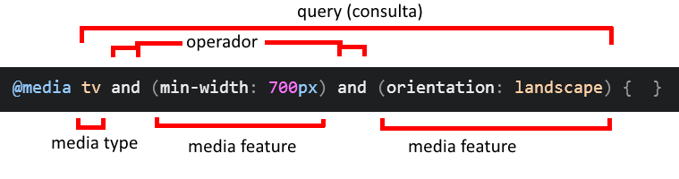
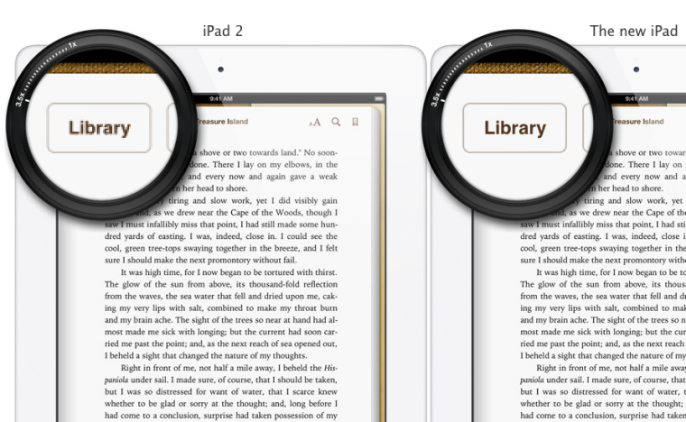
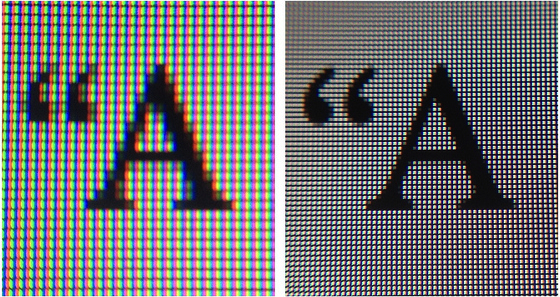
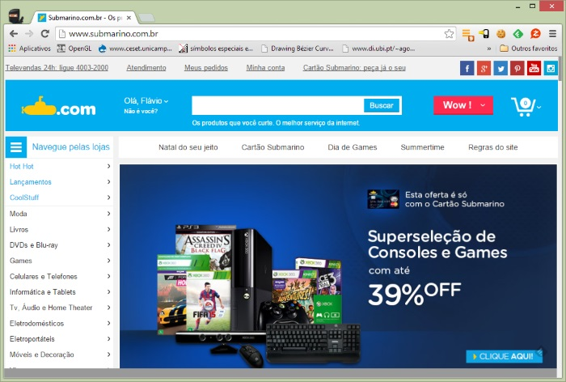
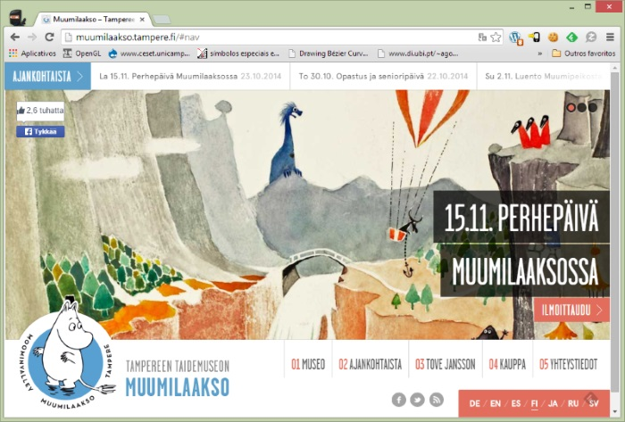
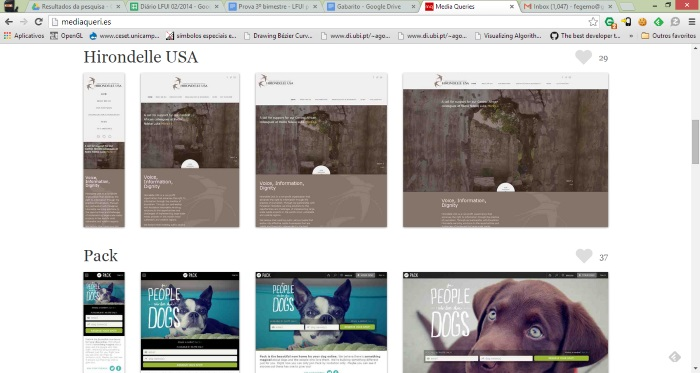
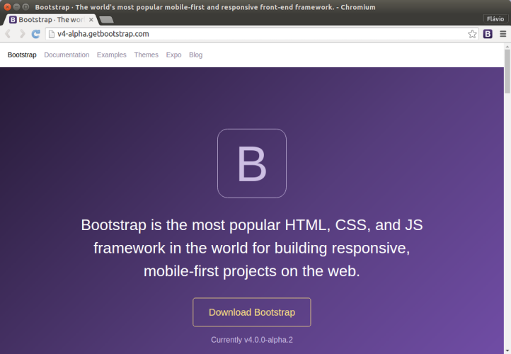
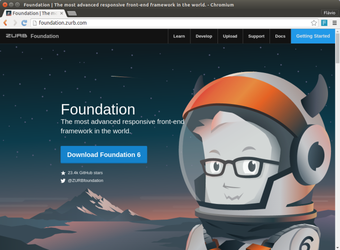

# CSS - Parte 6

---
# Roteiro de hoje

1. _Media Queries_
1. _Responsive Design_
1. Pré-processadores
1. _Frameworks CSS_

---
# _Media Queries_

---
## _Media Queries_

- O maior propósito da Web é ser disponibilizada nos mais diversos meios de
  comunicação/dispositivos
- Hoje em dia, podemos acessar a Web à partir de:
  - computadores pessoais, _notebooks_
  - _videogames_, _videogames_ portáteis
  - televisores
  - _smartphones_, _tablets_, telefones celulares "tradicionais", etc.
- Com uma gama de **configurações diferentes** entre os dispositivos, estávamos
  limitados a montar as páginas Web **que eram exibidas da mesma forma em todos
  eles**
- Especificadas no CSS3, as _media queries_ têm o propósito de possibilitar a
  delimitação do escopo de regras CSS para **diferentes mídias**

---
## _Media Queries_

- Exemplos:
  1. Arquivo com regras CSS para impressão
    ```html
    <link rel="stylesheet" media="print" href="p-impressao.css" />
    ```
  1. Dentro de um arquivo CSS, regras diferentes para o tamanho de uma imagem
     se o dispositivo estiver orientado verticalmente (_portrait_) ou
     horizontalmente (_landscape_)
     ```css
     img.produto {  width: 200px;  }
     @media screen and (orientation: landscape) {
       img.produto {  width: 100%;  }
     }
     ```

---
## Anatomia de uma _media query_



- Formada por:
  1. _Media types_
  1. _Media features_
  1. Operadores

---
## Tipos de Mídia

- `all`
  - Qualquer dispositivo
- `print`
  - Para documentos paginados ou exibidos em modo de visualização de impressão
- `screen`
  - Dispositivos com telas coloridas  
- `speech`
  - Para sintetizadores de voz

---
## Exemplo de uso de tipo de mídia

- Arquivos externos:
  ```html
  <link rel="stylesheet" media="all" href="estilos-gerais.css" />
  <link rel="stylesheet" media="screen" href="p-monitores.css" />
  <link rel="stylesheet" media="print" href="p-impressao.css" />
  ```
---
## Exemplo de uso de tipo de mídia (cont.)

- Dentro de um mesmo arquivo:
  ```css
  #artigo-principal {
    background-color: #ccc;
  }

  @media print {
    #artigo-principal {
      background-color: transparent;
    }
  }
  ```

---
## Características de Mídia

- **`width`, `height`**, `max-width`, `max-height`, `min-width`, `min-height`
  - Largura e altura da janela do navegador
- `aspect-ratio`
  - Razão da largura pela altura da janela do navegador
- `orientation`
  - Orientação (`landscape` x `portrait`) do dispositivo
- `resolution`
  - Densidade de _pixels_ do dispositivo
- [E mais...](https://developer.mozilla.org/en-US/docs/Web/CSS/@media)

---
## Exemplo de uso de características de mídia

- Arquivos externos:
  ```html
  <!-- Arquivo de estilo para dispositivos pequenos -->
  <link rel="..." media="all and (max-width: 640px)" href="small.css" />

  <!-- Arquivo de estilo para dispositivos grandes -->
  <link rel="..." media="all and (min-width: 641px)" href="large.css" />
  ```

---
## Exemplo de uso de características de mídia (cont.)

- Dentro de um mesmo arquivo
  ```css
  div#logo {
    background-image: url('img/logo.png');
  }
  /* 2dppx = 2 dots per pixel unit */
  @media screen and (min-resolution: 2dppx) {
    div#logo {
      background-image: url('img/logo2x.png');
    }
  }
  ```

---
## _Retina display_ (da Apple)



---
## _Retina display_ (da Apple)



---
## Simulação de _**retina display**_

 <!-- {style="width: 100px"} -->
 <!-- {style="width: 100px"} -->

## Para testar em um dispositivo de **tela com alta densidade de pixels**:

 <!-- {style="width: 100px"} -->
 <!-- {style="width: 100px"} -->

---
# _Responsive Design_

---
## _Responsive Design_

- Não significa desenho responsável =)
- É a idéia de que as páginas Web devem se adaptar à plataforma que a está
  exibindo
  - Melhorar a experiência de usuário
  - Aproveitar características específicas de plataformas diferentes
- Usa o recurso de _media queries_ do CSS3

---
## Exemplo de site não-_responsive_

[](http://www.submarino.com.br)

---
## Exemplo de site _responsive_

[](http://muumilaakso.tampere.fi/)

---
## Vários exemplos

- [mediaqueri.es](http://mediaqueri.es)



---
## Como fazer

- Para criar uma página _responsive_, você deve
  1. Usar medidas fluidas (em porcentagem)
  1. Definir os pontos de dimensão (largura, altura) em que sua página
     "quebra" (os _breakpoints_)
  1. Criar regras de estilos diferentes para cada conjunto de dimensões
- Por exemplo, vamos criar uma página que mostra
  - 4 produtos por linha em dispositivos grandes
  - 3 produtos por linha em dispositivos médios
  - 2 produtos por linha em dispositivos pequenos

---
## Exemplo

```css
div.produto {  display: inline-block; }

@media (min-width:801) and (max-width: 1024px) {
  /* tela grande: 4 produtos por linha */
  div.produto {  width: 25%;  }
}

@media (min-width:481px) and (max-width: 800px) {
  /* tela média: 3 produtos por linha */
  div.produto {  width: 33.333%;  }
}

@media (max-width: 480px) {
  /* tela pequena: 2 produtos por linha */
  div.produto {  width: 50%;  }
}
```

---
## Exemplo vivo

<iframe width="100%" height="450" src="http://jsfiddle.net/fegemo/Lw7prv0u/5/embedded/result,css,html/" allowfullscreen="allowfullscreen" frameborder="0"></iframe>

---
# _Frameworks_ CSS

---
## _Frameworks_ CSS

- Existem bases de código para estilização "básicas" de páginas Web
  disponíveis
- A idéia é: para fazer uma prototipação rápida, não levar muito tempo se
  preocupando com escrever código CSS para tornar o produto bem apresentável
- Dois _frameworks_ mais famosos:
  - [(Twitter) Bootstrap](http)
  - [Zurb Foundation](http)
- Na prática, você vai incluir um arquivo CSS na sua página
  ```html
  <link rel="stylesheet" href="bootstrap.css">
  <link rel="stylesheet" href="meus-estilos.css">
  ```

---
## Bootstrap



---
## Bootstrap (cont.)

- Foi criado por funcionários do Twitter
- Usa **Less** para gerar CSS, mas também há um _port_ para Sass
- É bastante _"jQuery-friendly"_, possuindo _plugins_ para coisas comuns
  - Painéis modais
  - Abas
  - Carrossel, etc.

---
## Zurb Foundation

- Criado e mantido pela [Zurb](http://zurb.com/), uma empresa de criação na Web
- Escrito em **Sass**
- Também é _"jQuery-friendly"_, assim como Bootstrap
- Usa a filosofia _mobile-first_
- Incentiva a boa prática de não se utilizar "classes de apresentação"
  (`.row`, `.column` etc.s)

---
## Zurb Foundation (cont.)



---
# Pré-processadores

---
## Motivação

- Algumas tarefas em CSS são tediosas
  - Criar imagens sprite e o CSS para configurar cada uma
  - Escrever a mesma regra várias vezes usando prefixos de navegadores
    diferentes

---
## Motivação (cont.)

- Além disso, o CSS não é muito DRY-
  _friendly_
  - Você acaba repetindo a mesma cor, as mesmas dimensões e outros valores
    várias vezes
    ```css
    div.fundo { background-color: #3399ff; }
    body { color: #3399ff; }
    ```
  - Escrevendo seletores mais complexos, também acabamos por ter que nos repetir
    ```css
    .animal { width: 200px; }
    .animal img { width: 1800px; }
    .animal figcaption { width: 100%; }
    ```

*[DRY]: Don't Repeat Yourself*

---
## Problema

- Queremos resolver alguns pontos fracos da linguagem CSS
- Mas os navegadores só conhecem a linguagem para definir estilos e não há
  movimentação de algum grupo criando outra linguagem
- Uma solução:
  - Criar uma linguagem mais poderosa e que resolva esses pontos fracos, mas
    que se transforme em CSS para que os navegadores fiquem felizes

---
## Pré-processadores CSS

- São uma extensão à linguagem CSS cujo objetivo é trazer recursos não
  presentes (ainda) na linguagem
- O pré-processador irá processar o código fonte nessa nova linguagem e
  transformá-lo em CSS, que é o que o navegador entende
- Os mais populares:
  -  <!-- {style="width: 100%;"} -->
  -  <!-- {style="width: 100%;"} -->
  -  <!-- {style="width: 100%;"} --> <!-- {ul:.horizontal-list} -->

---
## O que eles oferecem?

- Criação de constantes
  - Para poder reutilizar valores
- Criação de variáveis
  - Para constantes com efeito colateral - iteração
- Criação de funções para geração de código
  - Para evitar criar código repetido
- Hierarquia de seletores
  - Para evitar a repetição de partes de seletores

---
## Constantes e Variáveis (em **Sass**)

- Código fonte
  ```css
  $font-stack: Helvetica, sans-serif;
  $primary-color: #333;
  body {
    font: 100% $font-stack;
    color: $primary-color;
  }
  ```
- "Compilado" para CSS:
  ```css
  body {
    font: 100% Helvetica, sans-serif;
    color: #333;
  }
  ```

---
## Constantes e Variáveis (em **Less**)

- Código fonte
  ```css
  @font-stack: Helvetica, sans-serif;
  @primary-color: #333;
  body {
    font: 100% @font-stack;
    color: @primary-color;
  }
  ```
- "Compilado" para CSS:
  ```css
  body {
    font: 100% Helvetica, sans-serif;
    color: #333;
  }
  ```

---
## Constantes e Variáveis (em **Stylus**)

- Código fonte
  ```css
  font-stack Helvetica, sans-serif
  primary-color #333
  body
    font 100% font-stack
    color primary-color
  ```
- "Compilado" para CSS:
  ```css
  body {
    font: 100% Helvetica, sans-serif;
    color: #333;
  }
  ```

---
## Regras aninhadas

- Possibilita a não-repetição de seletores pela definição de regras aninhadas
- Exemplo: Código fonte em **sass** e resultado:
  ```css
  ul {
    list-style: none;
    li {  display: inline-block;  }
  }
  ```
  ```css
  ul {  list-style: 0;  }
  ul li {  display: inline-block;  }
  ```

---
## _Mixins_

- Uma espécie de função para reutilização de código fonte
- Exemplo: Código fonte em **sass** e resultado:
  ```css
  @mixin border-radius($radius) {
    -webkit-border-radius: $radius;
       -moz-border-radius: $radius;
        -ms-border-radius: $radius;
            border-radius: $radius;
  }
  .box { @include border-radius(10px); }
  ```
  ```css
  .box { -webkit-border-radius: 10px; /*... */ }
  ```

---
## Loops, Funções

- Execução de funções para gerar CSS dinamicamente
- Exemplo: Código fonte em **less** e resultado:
  ```css
  .generate-columns(@n, @i: 1) when (@i =< @n) {
    .column-@{i} {
      width: (@i * 100% / @n);
    }
    .generate-columns(@n, (@i + 1));
  }
  .generate-columns(4);
  ```
  ```css
  .column-1 {  width: 25%;  }  .column-2 {  width: 50%;  }
  .column-3 {  width: 75%;  }  .column-4 {  width: 100%; }
  ```

---
## Extensão de classes

- Similar ao _mixin_, para reutilização de código. Porém, **reutiliza o código
  gerado**
- Exemplo: Código fonte em **stylus** e resultado:
  ```css
  .message
    padding 10px;   border 1px solid gray
  .warning
    @extend .message
    color rebeccapurple
  ```
  ```css
  .message,
  .warning { padding: 10px; border: 1px solid #eee; }
  .warning { color: rebeccapurple; }
  ```

---
## E muitos outros recursos

- Geração automática de imagens sprite e do código CSS para apontar para cada
  imagem
- Operadores
- Interpolação
- Condicionais (if/else)
- Arquivos parciais, etc.

---
# Referências

- [How to choose breakpoints](https://developers.google.com/web/fundamentals/layouts/rwd-fundamentals/how-to-choose-breakpoints), Google sobre _responsive design_
- [Media Queries na MDN](https://developer.mozilla.org/en-US/docs/Web/Guide/CSS/Media_queries)
- [mediaqueri.es](http://mediaqueri.es), Exemplos de sites _responsive_
- [Sass](http://sass-lang.com/), site oficial
- [Less](http://lesscss.org/), site oficial
- [Stylus](http://learnboost.github.io/stylus/), site oficial
- [Bootstrap](http://getbootstrap.com/), site oficial
- [Zurb Foundation](http://foundation.zurb.com/), site oficial
