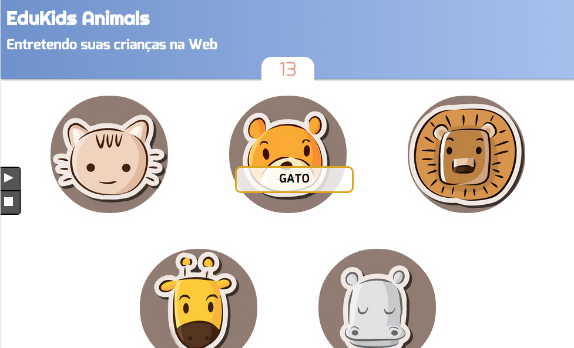

<!-- {"layout": "title"} -->
# **CSS** parte 6
## Transformações, Transições, Animações<br>e os Animais :dog: :cat:

---
<!--
{
  "layout": "centered",
  "styles": ["https://fonts.googleapis.com/css?family=Righteous"],
  "embeddedStyles": ".righteous { font-family: Righteous, cursive; color: #e90c0c }"
}
-->
# Roteiro de hoje

1. [Finalizar o jogo](#edukids-animals) **EduKids Animals** <!-- {.righteous} -->
1. [Transformações](#transformacoes)
1. [Transições](#transicoes)
1. [Animações](#animacoes)


---
<!--
{
  "layout": "section-header",
  "hash": "edukids-animals"
}
-->
# EduKids Animals <!-- {.righteous} -->
## Jogo para irmã(o)zinh@s

 <!-- {.portrait.centered style="box-shadow: 0 0 10px 5px rgba(0, 0, 0, 0.34);"} -->

---
<!-- {"layout": "2-column-content"} -->
## Motivação

> Seus pais vão viajar e você deve cuidar do seu mini irmãozinho de 3 anos.
>
> Com um comportamento de anjinho (#sqn), o pequeno Joãozinho vai dar trabalho.
>
> Você, como um ótimo irmã(ão) e programador(a)
> exímio, decide que é hora de criar um jogo Web para, além de entreter seu
> mini-irmão, ensiná-lo como falar o nome de alguns animais.

 <!-- {.full-width.bordered.rounded} -->

---
## O jogo **Edukids Animals** <!-- {.righteous} -->

- Funcionamento do jogo:
  - Assim que apertar **play**, o jogo começa
  - A cada ~2s, um animal é sorteado e começa a ficar com fome
  - Você deve clicar no animal agitado para alimentá-lo antes que ele coma
    alguém
    - Fazendo isso, ganha-se 1 ponto
  - Se um animal não é clicado a tempo, perde-se 2 pontos
  - Se um animal que estava sossegado é perturbado fora de hora, perde-se 1
    ponto
- Essa funcionalidade **já está implementada** em um arquivo JavaScript

---
## O que está **faltando**

1. O jogo ainda não dá um _feedback_ visual interessante para o jogador
   - Apenas o nome do animal aparece escrito e seu irmão ainda não sabe ler
1. O arquivo `jogo.js` controla o jogo. Ele tem um temporizador que
   fica **adicionando e removendo classes dos elementos** dos animais
   
   `com-fome`
   ~ quando o animal está com fome
   
   `satisfeito`
   ~ quando o animal acabou de comer
   
   `com-raiva`
   ~ quando um animal sossegado é perturbado
   
   `atacando`
   ~ quando um animal com fome não é alimentado a tempo

---
## Pede-se: fazer os **2 exercícios** abaixo

1. Criar uma **transição para quando o mouse estiver em cima dos botões**
   _play/stop_ (para que o elemento se revele lentamente)
1. Você deve implementar uma **metáfora visual** para cada um dos 4 estados dos
   animais. Algumas sugestões:
   1. `com-fome`, animal piscando (opacidade variando)
   1. `satisfeito`, uma borda verde no animal e o animal fica girando de alegria
   1. `com-raiva`, animal vai crescendo, ou fica pulsando
   1. `atacando`, animal dá um salto e cresce, com uma borda vermelha

---
<!--
{
  "layout": "section-header",
  "hash": "transformacoes"
}
-->
# Transformações
## Alterando a geometria dos objetos

- A propriedade `transform`
  - Translação
  - Escala
  - Rotação
- Efeitos 3D com `perspective`
- Ponto de origem da transformação
<!-- {ul^1:.content} -->

---
## A propriedade **transform** ([na MDN](https://developer.mozilla.org/en-US/docs/Web/CSS/transform))

- Define uma **transformação geométrica** aplicada aos "vértices" de um
  elemento **`block`** (ou **`inline-block`**)
- Exemplo:
  ```html
  <p>Yay, girei com força!</p>
  ```
  ```css
  p { transform: rotate(-3deg); }
  ```
- Resultado:
  <p style="transform: rotate(-3deg); background-color: #bcdefb; color: #333">Yay, girei com força!</p>

---
## **transform** com translação

- Diversas transformações podem ser atribuídas como valor para a
  propriedade `transform`:
  - **Translação**: faz um deslocamento do objeto no espaço
    - `translate(x,y)`
    - `translateX(x)`
    - `translateY(y)`
    - `translateZ(z)`
    - `translate3d(x,y,z)` <!-- {ul:.multi-column-list-3}-->

    <iframe width="100%" height="230" src="//jsfiddle.net/fegemo/hz1Lv6qr/embedded/result,html,css/" allowfullscreen="allowfullscreen" frameborder="0"></iframe>

---
## **transform** com escala

- **Escala**: faz um dimensionamento do objeto
  - `scale(x,y)`
  - `scaleX(x)`
  - `scaleY(y)`
  - `scaleZ(z)`
  - `scale3d(x,y,z)` <!-- {ul:.multi-column-list-3}-->

  <iframe width="330" height="230" src="//jsfiddle.net/fegemo/2ad66123/embedded/result,html,css/" allowfullscreen="allowfullscreen" frameborder="0" class="push-left"></iframe>

  - Unidades de medida:
    - Usa-se um número, **sem unidade de medida**, que é o **fator de escala** <!--{ul^0:style="margin-left: 0px;"}-->
    - `1` indica tamanho `100%`
    - `2` indica dobro do original <!--{ul^1:style="margin-top: 2em; margin-left: 330px;"}-->

---
## **transform** com rotação

- **Rotação**: altera o ângulo do sistema de coordenadas do objeto
  - `rotate(ang)`
  - `rotateZ(ang)`
  - `rotateX(ang)`
  - `rotateY(ang)`
  - `rotate3d(x,y,z,ang)`
  - [E mais...](https://developer.mozilla.org/en-US/docs/Web/CSS/transform) <!-- {ul:.multi-column-list-3}-->

  <iframe width="330" height="230" src="//jsfiddle.net/fegemo/aL80f02g/embedded/result,css/" allowfullscreen="allowfullscreen" frameborder="0" class="push-left"></iframe>

  - Unidades de medida (sent. horário):
    - `deg`: graus, exemplo: `rotate(20deg)`
    - `turn`: voltas, exemplo: `rotate(-2.5turn)`
    - `rad`: radianos, exemplo: `rotate(1rad)` <!--{ul^1:style="margin-top: 2em"}-->


---
## Efeitos 3D

- Para ter um efeito de profundidade das coisas, precisamos definir
  uma **projeção perspectiva**:

  <iframe width="520" height="300" src="//jsfiddle.net/fegemo/1853cnsc/embedded/result,html,css/" allowfullscreen="allowfullscreen" frameborder="0" class="push-right"></iframe>

  ```css
  body {
    perspective: 400px;
    /* quanto menor, maior
       o efeito */
  }
  ```
  - Aqui também usamos uma `animation`

---
## Ponto de origem da transformação

- Normalmente a transformação é feita com base no centro do objeto
- É possível **definir um ponto que ficará fixo** (será a origem da transformação)
  usando `transform-origin`:
  <iframe width="500" height="240" src="//jsfiddle.net/fegemo/2bcLx47t/embedded/result,html,css/" allowfullscreen="allowfullscreen" frameborder="0" class="push-right"></iframe>

  ```css
  .porta {
    transform-origin: left center;
  }
  .porta:hover {
    transform: rotateY(-95deg);
  }
  ```

---
<!--
{
  "layout": "section-header",
  "hash": "transicoes"
}
-->
# Transições
## Interpolando valores de propriedades

- A propriedade `transition`
- Propriedades que podemos animar
- Funções de interpolação
- Transição com transformação
<!-- {ul:.content} -->

---
## Transições CSS

- Muitas vezes queremos criar **pequenas animações** em nossas páginas
  - Mudança da cor do botão quando passamos o mouse em cima
  - Um elemento se expandindo para revelar mais conteúdo
  - Um painel sumindo gradativamente, em vez de desaparecendo
- Antigamente isso podia ser feito em JavaScript, com `setTimeout`
- CSS3 especifica uma nova propriedade: `transition`

---
<!-- {"classes": "compact-code"} -->
## Como usar `transition`

- Exemplo: mudando cor quando passa o mouse:
  ::: result .push-right margin-left: 1em; margin-top: 1.25em;
  <style>
    p.transition-link {
      transition: color 600ms linear;
      color: red;
    }
    p.transition-link:hover { color: #000; }
  </style>
  <p class="transition-link">Heyyy, hover me</p>
  :::
  ```css
  p {
    color: 'red';
    transition: color 600ms linear; 
             /* propriedade duração interpolação */
  }

  p:hover {
    color: 'black';
  }
  ```
- Escolhemos **que propriedade** `CSS` queremos animar, por **quanto tempo**
  e qual a **função de interpolação**

---
## A propriedade **transition** (na [MDN](https://developer.mozilla.org/en-US/docs/Web/CSS/transition))

- É um atalho para:
  - `transition-property: all`, ou qual propriedade `CSS` deve sofrer transição
  - `transition-duration: 0s`, ou a duração da transição
  - `transition-timing-function: ease`, a função de interpolação
  - `transition-delay: 0s`, tempo de atraso até que se comece a transição
- Sintaxe formal:
  ```
  transition: [ none | <single-transition-property> ] || <time>
                || <timing-function> || <time>;
  ```

---
## Propriedades que podemos animar

- Nem todas as propriedades são animáveis e elas podem variar entre navegadores
- Algumas que são animáveis:
  - `transform` (⚡ _fast_)
  - `opacity` (⚡ _fast_)
  - `color`
  - `background-color`
  - `left`
  - `right`
  - `top`
  - `bottom`
  - `background-position`
  - `border-radius`
  - `margin`
  - `padding`
  - `width`
  - `height`
  - [E mais...](https://developer.mozilla.org/en-US/docs/Web/CSS/CSS_animated_properties) <!-- {ul:.multi-column-list-3}-->

---
## Função de interpolação (_**timing-function**_)

<iframe width="100%" height="440" src="https://jsfiddle.net/fegemo/2a5450ds/embedded/result,html,css/" allowfullscreen="allowfullscreen" frameborder="0"></iframe>

---
## Combinando **transition** e **transform**

- <style>
  a.combinando {
    display: inline-block;
    transition: transform .2s cubic-bezier(.37,1.89,.59,.73);
  }
  a.combinando:hover {
    transform: scale(1.4);
  }
  </style>
  <a href="#" class="combinando">Effects like a boss</a>

  ```html
  <a href="#">Effects like a boss</a>
  ```
  ```css
  a {
    display: inline-block;
    transition:transform .2s cubic-bezier(.37,1.89,.59,.73);
  }
  a:hover {
    transform: scale(1.4);
  }
  ```

---
<!--
{
  "layout": "section-header",
  "hash": "animacoes"
}
-->
# Animações
## Alterando propriedades continuamente

- A propriedade `animation`
- A regra-arroba `@keyframes`
- Exemplos

<!-- {ul:.content} -->

---
<!-- {"classes": "compact-code"} -->
## A propriedade **animation** (na [MDN](https://developer.mozilla.org/en-US/docs/Web/CSS/animation))

- Especificada no CSS3, `animation` e `@keyframes` possibilitam o uso de
  animações de propriedades CSS de forma similar a `transition`
  ```html
  
  ```
  ```css
  #urso {
    position: relative;
    animation: flutuando .5s ease-in-out 0s infinite alternate;
  }

  @keyframes flutuando {
    from { top: 0;     }
    to   { top: -30px; }
  }
  ```
<style>
.urso-flutuante {
  position: relative;
  animation: urso-flutuando .5s ease-in-out 0s infinite alternate;
  transition: opacity 200ms ease-out;
}
.urso-flutuante:hover {
  opacity: 0.25;
}
@keyframes urso-flutuando {
  from { top: 0;     }
  to   { top: -30px; }
}
  </style>
  <div style="position: absolute; top: 50%; right: 10%; margin-top: -75px; margin-left: -75px;">
  
  </div>

---
<!-- {"hash": "criando-uma-animacao"} -->
## Criando uma animação

- Uma animação CSS é composta por
  1. Uma definição de quadros de animação (`@keyframes`) e
  1. Uma configuração de parâmetros da animação (`animation`)
- Os `@keyframes` definem o valor das propriedades que variam ao longo da
  animação
- A `animation` configura o tempo da animação, a ordem de execução e o nome da
  sequência de quadros a ser usada

---
## A propriedade **animation** (cont.)

- É um atalho para:
  - `animation-name: none`, nome dado ao **`@keyframes`** a ser usado
  - `animation-duration: 0s`, duração
  - `animation-timing-function: ease`, função de interpolação
  - `animation-delay: 0s`, tempo de atraso
  - `animation-iteration-count: 1`, quantas vezes rodar (pode ser `infinite`)
  - `animation-direction: normal`, em que sentido executar
    - `normal`, `reverse`, `alternate`, `alternate-reverse`
  - `animation-fill-mode: none`, o que fazer com o resultado da animação após
    terminar
  - `animation-play-state: running`, estado da animação

---
<!-- {"classes": "compact-code"} -->
## Definindo **@keyframes**

<style>
@keyframes terra-ao-longo-do-dia {
  0%   { background: #6c5228; }
  33%  { background: #48a037; }
  66%  { background: #48a037; }
  100% { background: #6c5228;	}
}
.terra {
  margin-top: 1em;
  animation: terra-ao-longo-do-dia 20s linear 0s infinite normal forwards;
  font-family: monospace;
  padding: 0.75em;
}</style>

- <!-- {ul:.no-padding.no-bullets.full-width} -->
  ```css
  @keyframes piscando {
    from { opacity: 1.0; }   /* usa apenas     */
    to   { opacity: 0.7; }   /* 'from' e 'to'  */
  }
  ```
  ```css
  @keyframes terra-ao-longo-do-dia {
    /* define quantos pontos forem necessários */
    0%   { background: #6c5228; }  33%  { background: #48a037; }
    66%  { background: #48a037; }  100% { background: #6c5228; }
  }
  ```
  <div class="terra">animation: terra-ao-longo-do-dia 20s linear 0s infinite;</div>

---
<!-- {"layout": "tall-figure-left"} -->
## Exemplo 1: estrelinha girando

 <!-- {.estrela-mario-1} --> <!-- {p:.center-aligned style="transform: initial; align-self: center"} -->

```css
.estrela-mario-1:hover {  /* apenas em :hover */
  animation: girando 1s ease-in-out 0s infinite alternate;
}

@keyframes girando {
  from {
    transform: rotate(15deg);
  }
  to {
    transform: rotate(-15deg);
  }
}
```

<style>
.estrela-mario-1 {
  display: inline-block;
  width: 100px;
  height: 100px;
}
.estrela-mario-1:hover {
  animation: girando 1s ease-in-out 0s infinite alternate;
}
@keyframes girando {
  from { transform: rotate(15deg); }
  to   { transform: rotate(-15deg); }
}</style>

---
<!-- {"hash": "mais-de-uma-animacao"} -->
## Exemplo 2: **mais de uma** animação

<style>
.estrela-mario-2:hover {
  animation: sumindo 600ms ease-in 3s 1 forwards, girando-de-costas 3600ms ease-in 1 forwards;
}

@keyframes sumindo {
  from { opacity: 1; top: 0;      width: 100px; left: 0     }
  to   { opacity: 0; top: -200px; width: 20px;  left: 40px; }
}

@keyframes girando-de-costas {
  from { transform: rotateY(0); }
  to   { transform: rotateY(3600deg); }
}
</style>

- <!-- {.no-bullets} -->
  ```css
  .estrela-mario-2:hover {
    animation: sumindo 600ms ease-in 3s 1 forwards,
               girando-de-costas 3600ms ease-in 1 forwards;
  }
  ```

<div style="position:relative;">
  
</div>


```css
@keyframes sumindo {
  from { opacity: 1; top: 0;      width: 100px; left: 0     }
  to   { opacity: 0; top: -200px; width: 20px;  left: 40px; }
}
@keyframes girando-de-costas {
  from { transform: rotateY(0); }
  to   { transform: rotateY(3600deg); }
}
```

---
<!-- {"layout": "main-point", "state": "emphatic", "hash": "animation-ou-transition"} -->
## **animation** ou **transition**?

**`transition`**
~ é uma interpolação entre <u>dois valores</u> de uma propriedade

**`animation`**
~ é uma interpolação entre <u>dois ou mais valores</u>, opcionalmente
  acontecendo mais de uma vez e em ordem alternada

- Sempre optamos pelo mais simples
  - No caso, `transition`, quando possível

---
<!-- {"layout": "centered"} -->
# Referências

- [Mozilla Developer Network](https://developer.mozilla.org/)
- [caniuse.com](http://caniuse.com/)

---
# Slide **_easter egg_**!!

- Em 01/04/2015, a Google lançou um espelho para seu buscador, o com.google.
  Ele se parecia com isto:
  [com.google](../../images/comgoogle.png)

- Usando transformações e animações, fica facinho fazer um desses!!
  <a class="bookmarklet" href="javascript:(function(){ if (document.body.style.transform === '') { document.body.style.transform='rotateY(180deg)'; } else { document.body.style.transform = '';}})()">Paradinha do Google</a>
  <a class="bookmarklet" href="javascript:(function(){ if (!document.getElementById('aew-anim')) { document.getElementsByTagName('html')[0].style.overflowX='hidden'; var s= document.createElement('style'); s.id='aew-anim'; s.innerText='@-webkit-keyframes aew { from { transform: skewX(-2deg); } to { transform: skewX(2deg); }}'; document.head.appendChild(s); } if (document.body.style.webkitAnimation === '') { document.body.style.transform='skewX(10deg)';document.body.style.transformOrigin='-50% 0';document.body.style.webkitAnimation='aew 400ms ease-in-out infinite alternate'; } else { document.body.style.webkitAnimation='';document.body.style.transform='';}})()">Rabo do cachorro</a>

  - Modo de uso de um **_bookmarklet_**: arraste o link para sua barra de favoritos e
    simplesmente clique no favorito quando estiver em uma página
