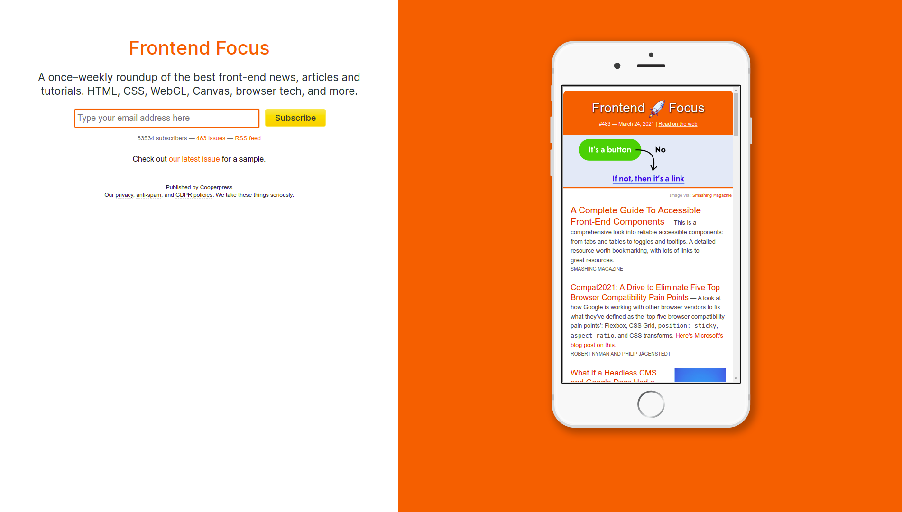
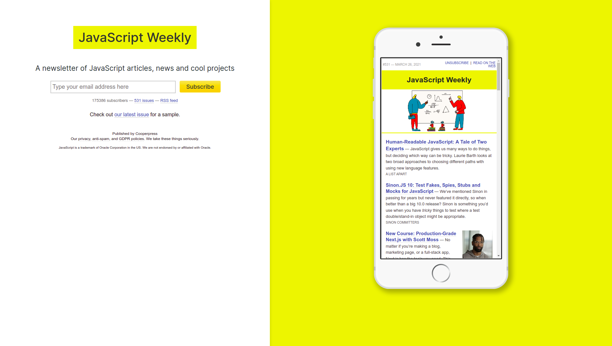

<!-- {"layout": "title"} -->
# **Epílogo**: para onde vou?
## Quais caminhos para continuar aprendendo sobre web

---
<!-- {"layout": "centered"} -->
# Roteiro

- O que vimos
- O que há além
  - _Back-ends_
  - Novos recursos da linguagem JavaScript
  - Novos recursos CSS/HTML
  - Web fora do navegador
- Como ficar informado

---
<!-- {"layout": "section-header"} -->
# O que vimos
## Retrospectiva

- Introdução à Web
- HMTL
  - Sintaxe, estrutura de documentos, tags
- CSS
  - Sintaxe, propriedades, seletores, especificidade, layout, responsive design
- JavaScript
  - Sintaxe, algoritmos, DOM, eventos, bibliotecas <!-- {ul^3:.content} --> 

---
<!-- {"layout": "section-header"} -->
# O que há além
## Novos caminhos para estudar

- _Back-ends_
- Novos recursos CSS/HTML
- Novos recursos JavaScript
- Bibliotecas da moda
- Web fora do navegaor <!-- {ul:.content} -->

---
# _Back-ends_

- Há várias opções de tecnologias. Exemplos:
  - Apache + PHP 
  - Node.js + Express
  - ASP.NET (C#) com IIS
  - Java (Servlets, JSP, JSF, etc.)
- Bancos de dados: relacionais e NoSQL. Exemplos:
  - MySQL (relacional)
  - Postgres (relacional)
  - MongoDB
  - Firebase

---
# Novos recursos CSS/HTML

- CSS
  - "Variáveis" (_custom properties_) CSS
  - Novos seletores de pseudoclasse: `:is()` e `:has()`
  - Gradientes cônicos
  - Propriedade: `aspect-ratio`
  - Propriedade: `content-visibility`
- HTML
  - Canvas: (`2d` e `webgl`)
  - Portals

---
# Novos recursos JavaScript

- Classes (para construir objetos)
- _Destructuring_
- Módulos (_ES Modules_)
- Promessas (_Promises_)
- Async / await
- Funções geradoras

---
# Bibliotecas da moda

- Para criação de _single-page applications_ (SPAs):
  - React
  - Vue
  - Angular
  - Svelte
  - Aurelia
- Para jogos
  - Phaser
  - Babylon.js
  - PlayCanvas

---
# Web fora do navegador

- WebOS (para TVs)
- Aplicações usando Electron. Exemplos:
  - Spotify
  - Discord
  - VS Code
  - Atom
- Node.js

---
# Como ficar informado?

- Há pelo menos 2 excelentes listas semanais de email

1.   <!-- {ol:.layout-split-2.no-bullets} --> <!-- {.full-width} -->
   - [Front end Focus](https://frontendfoc.us/)
2.  <!-- {.full-width} -->
   - [JS Weekly](https://javascriptweekly.com/)

---
# Por fim...

Até mais, e obrigado pelos 🐟🐠🐡

Professores:
~ Flávio Coutinho <[fegemo@cefetmg.br](mailto:fegemo@cefetmg.br)>
~ Daniel Hasan <[hasan@cefetmg.br](mailto:hasan@cefetmg.br)>

Onde: 
~ Sala 202, DECOM
~ Sala 301, DECOM

