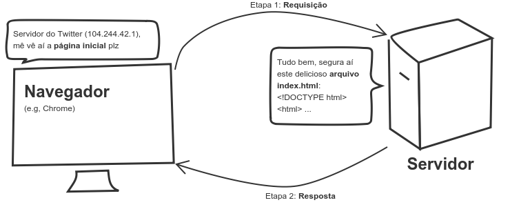
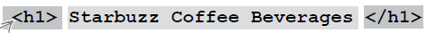
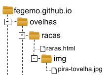

<!-- {"layout": "title"} -->
# HTML (parte 1)
## Plantas Carnívoras, Ingredientes do HTML (_tags_) e Temperando com CSS

---
<!-- {"layout": "regular"} -->
# Na última aula...

- Conversamos sobre a história da Internet e da Web
-  <!-- {.portrait.push-right} --> Vimos as proezas de Tim (Berners-Lee), o coração valente, ao criar:
  - O protocolo HTTP
  - A linguagem HTML
  - Um servidor web (CERN httpd)
  - O primeiro navegador (WorldWideWeb)
  - ~~A linguagem CSS~~ (não foi o Tim :scream:)
  - ~~A linguagem JavaScript~~ (não foi o Tim :scream:)

---
# Atividade de Hoje  <!--{style="height:1em;"}-->

Você tem um novo _hobby_: **criar plantas carnívoras**. Você encontrou um
documento solto em um antigo livro do seu tio e, depois de lê-lo, decidiu
**criar uma página web**.
<!-- {p:style="width: 50%"} -->


---
<!-- {"state":"show-active-slide-and-previous"} -->


---
<!-- {"layout": "regular"} -->
# Para isso, hoje vamos...

1. Rever o [funcionamento](#funcionamento-web) dos servidores e navegadores
1. Conhecer a [estrutura básica](#estrutura-basica-html) de um arquivo HTML
1. Aprender algumas [_tags_ HTML para texto](#tags-html):
   - parágrafos `<p>...</p>`
   - títulos `<h1>...</h1>`, ou `<h2>...</h2>` etc. (até `<h6>...</h6>`)
   - imagens ``
   - hiperlinks `<a href="">...</a>`
1. Entender um pouco de [estilo CSS](#estilo-css):
   - `color`, `background-color`
   - `margin`, `text-align`

---
<!-- {"layout": "section-header", "slideHash": "funcionamento-web"} -->
# Funcionamento da Web
## Como o navegador conversa com o servidor

- Modelo de **requisição e resposta**
  1. **Navegador** requisita uma página
  1. **Servidor** responde
- **URL**: como identificar um recurso

<!-- {ul:.content} -->

---
## O que um **navegador** faz?

- Quando o usuário "vai" até um novo endereço (URL), o navegador solicita esse
  **recurso** ao servidor
  - O **Navegador requisita** algo e **Servidor responde**

```http
GET /index.html HTTP/1.1
Host: www.twitter.com
```
 <!-- {.half-width.centered} --> <!-- {p:.no-margin} -->
```http
HTTP/1.1 200 OK
Date: Mon, 23 May 2005 22:38:34 GMT
Server: Apache/1.3.3.7 (Unix) (Red-Hat/Linux)
Content-Type: text/html; charset=UTF-8
Content-Length: 131

<!DOCTYPE html>
<html>
<head>
  <title>Twitter</title>
</head>
<body>
  Olá mundo, este é um tweet.
</body>
</html>
```

---
## O que um **navegador** faz (cont.)?

- URL: Unique **Resource** Locator
  - É o **endereço de coisas** na Internet - **páginas, imagens, arquivos**, etc.   
     <!-- {.block} -->
- Assim que a resposta é recebida, o navegador a exibe na tela, caso **consiga**
  - Por exemplo, os navegadores não conseguem exibir um arquivo .zip

---
<!-- {"layout": "section-header", "slideHash": "estrutura-basica-html"} -->
# Estrutura Básica do **HTML**
## . <!-- {style="visibility: hidden;"} -->

- Um arquivo HTML completo
  - _Tag_ `<html>...</html>`
  - _Tag_ `<head>...</head>`
  - _Tag_ `<body>...</body>`

<!-- {ul^1:.content} -->

---


---
<!-- {"state": "show-active-slide-and-previous"} -->


---
## Estrutura

- Um punhado de **tags** no texto
  - As _tags_ fazem a marcação da estrutura do texto
  - Existem dezenas de tags (umas 50? 60?) e cada uma tem um propósito e um
    resultado visual
  - A grande maioria delas precisam ser fechadas (e.g., `<p>...</p>`)
- **Indentação e espaçamento** são livres e não afetam o resultado
- Um arquivo html é _plain-text_, ou puramente textual
  - em contraposição a um arquivo binário, por exemplo

---
## A _tag_ &lt;html&gt;

- Envolve todas* as outras _tags_
  - *Exceto a _tag_ especial `<!DOCTYPE html>`
- Dentro dela, **devem existir todas e apenas**, nesta ordem:
  - `<head>...</head>`
  - `<body>...</body>`

---
## A _tag_ &lt;head&gt;

- Do inglês: cabeça
- Contém **meta-informação** sobre este arquivo `html`, por exemplo:
  - **Título da página** no topo do navegador (obrigatório)
  - **Codificação** (_encoding_) da página
  - Ícone
  - Inclusão de arquivos (`.css`, `.js`)
- Trecho de código
```html
<!DOCTYPE html>
<html>
  <head>
    <meta charset="utf-8">
    <title>Este é o título que aparece na aba</title>
    ...
  </head>
  <body>
    ...
  </body>
</html>
```

---
## A _tag_ &lt;body&gt;

- Do inglês: corpo
- Contém **todo o conteúdo da página**: _tags_ de
  - parágrafos (`<p>...</p>`)
  - títulos e subtítulos (`<h1>...</h1>`)
  - imagens (``), etc.
- Trecho de código
```html
<html>
  <head>...</head>
  <body>
    ...
  </body>
<html>
```

---
<!-- {"layout": "section-header", "slideHash": "tags-html"} -->
# Algumas _tags_ HTML
## . <!-- {style="visibility: hidden"} -->

- Anatomia de uma _tag_
- Parágrafo
- Títulos e subtítulos
- Imagens
- Hiperlinks

<!-- {ul:.content} -->

---
## Anatomia de uma _tag_



- Tags de abertura podem ter **atributos**:
  ```html
  
  ```
  - Em ``, o atributo `src="..."` aponta para a URL do arquivo
  - **Não deve haver espaço** entre seu nome e seu valor: ``

---
<!-- {"slideHash": "tag-paragrafo"} -->
## _Tag_ de **<u>Parágrafo</u>** (`<p>...</p>`)

- **Quebras de linha** são feitas automaticamente
```html
<p>
  "Um dos maiores problemas encontrados em viajar no tempo não é
  vir a se tornar acidentalmente seu próprio pai ou mãe. Não há
  nenhum problema em tornar-se seu próprio pai ou mãe com que
  uma família de mente aberta e bem ajustada não possa lidar."
</p>
```
<iframe width="100%" src="https://jsfiddle.net/fegemo/62afu86f/embedded/result,html/" allowfullscreen="allowfullscreen" frameborder="0"></iframe>

---
<!-- {"layout": "2-column-content","slideHash": "tag-titutlo"} -->
## _Tag_ de **<u>Títulos</u>** e **<u>Subtítulos</u>** (`h1`, `h2` ... `h6`)

```html
<h1>Título de 1º nível</h1>
<p>Este é o corpo da seção</p>
<h2>Subtítulo (2º nível)</h2>
<p>Este é o corpo da subseção</p>
```

<iframe width="100%" height="260" src="//jsfiddle.net/fegemo/wxd5s6be/2/embedded/result/" allowfullscreen="allowfullscreen" frameborder="0"></iframe>

- Há a possibilidade de ter **6 <u>níveis</u> de títulos**
  - Mas a quantidade de títulos é infinita

---
<!-- {"slideHash": "tag-imagem"} -->
## _Tag_ de **<u>Imagem</u>** (``)

- Para exibir imagens...
  ```html
  
  ```
    <!-- {.block.centered height="100px"} -->
- Neste exemplo, usamos **a URL da imagem hospedada em outro
  site** na Internet
  - **URLs externas** devem ser sempre absolutas (mostar o caminho completo)
- **URLs internas** (endereços, ou caminhos) podem ser **absolutas** ou **relativas**

---
<!-- {"slideHash": "end-relativo-absoluto"} -->
## Exemplo 1: Arquivo HTML e imagem **na mesma pasta**

-  <!-- {.push-right style="height: 140px;"} -->
  Arquivo HTML está em:<br>`/ovelhas/racas/raras.html`
- A imagem está em:<br>`/ovelhas/racas/pira-tovelha.jpg`
  - Podemos utilizar seu **endereço absoluto**: `/ovelhas/racas/pira-tovelha.jpg`
    ```html
    
    ```
  - Ou seu **endereço relativo**: `pira-tovelha.jpg` (relativo à página atual)
    ```html
    
    ```

---
## Exemplo 2: Imagem 1 pasta adentro

 <!-- {.push-left style="height: 140px"} -->
<!-- {.push-right style="height: 140px"} -->

- **Endereço absoluto**: `/ovelhas/racas/img/pira-tovelha.jpg`
  ```html
  
  ```
- **Endereço relativo**: `img/pira-tovelha.jpg`
  ```html
  
  ```

---
## Exemplo 3: Imagem 1 pasta acima

<!-- {.push-left style="height: 140px"} -->
<!-- {.push-right style="height: 140px"} -->

- **Endereço absoluto**: `/ovelhas/pira-tovelha.jpg`
  ```html
  
  ```
- **Endereço relativo**: `../pira-tovelha.jpg`
  ```html
  
  ```

---
## Exemplo 4: Imagem 2 pastas acima

<!-- {.push-left style="height: 140px"} -->
<!--{.push-right style="height: 140px"} -->

- **Endereço absoluto**: `/pira-tovelha.jpg`
  ```html
  
  ```
- **Endereço relativo**: `../../pira-tovelha.jpg`
  ```html
  
  ```

---
<!-- {"layout": "2-column-content"} -->
## Sumarizando: **URLs absolutas e relativas**


<!-- {p:style="width: 20%"} -->

| Endereço Absoluto          	| End. Relativo 	|
|---------------------------	|---------------	|
| /ovelhas/racas/c.jpg      	| `c.jpg`        	|
| /ovelhas/racas/xpto/d.jpg 	| `xpto/d.jpg`   	|
| /ovelhas/b.jpg            	| `../b.jpg`     	|
| /a.jpg                    	| `../../a.jpg`  	|

<!-- {table:style="width: 75%"} -->
---
<!-- {"slideHash": "tag-hiperlink"} -->
## _Tag_ de **_Hyperlink_** (`<a href="">...</a>`)

- [Link externo](http://www.google.com) (para fora da página):
  ```html
  <a href="http://www.google.com">Link externo</a>
  ```
- [Link interno](../../attachments/exemplo.zip) (para algo hospedado no
  próprio computador)
  ```html
  <a href="downloads/exemplo.zip">Link interno</a>
  ```

---
## Como o navegador decide **como vai exibir** as _tags_ html?

- Estilos padrão
  - Cor: preto
  - Fundo de tela: branco
  - Fonte: Times New Roman
- Cada navegador pode ter um estilo padrão diferente
- É possível e altamente recomendável **criar estilos próprios**
- Vamos conhecer agora uma segunda linguagem: CSS

---
<!-- {"layout": "section-header", "slideHash": "estilo-css"} -->
# Um pouco de estilo
## Conhecendo CSS - Cascading Stylesheets

- A _tag_ `<style>...</style>`
- Definindo as propriedades de:
  - Cor do texto: `color`
  - Cor do fundo: `background-color`
  - Margem (espaçamento): `margin`
  - Fonte: `font-family`

<!-- {ul^1:.content} -->

---
## Definindo o estilo

- Adicionamos um novo elemento: `<style>...</style>`
- Podemos colocá-lo no &lt;head&gt; ou no &lt;body&gt;, mas a **melhor prática é
  no cabeçalho**
  ```html
  <html>
    <head>
      <title>Título da página</title>
      <style>
        /* escrever código CSS aqui dentro */
      </style>
    </head>
    <body>
    ...
  ```

---
## Definindo o estilo (cont.)

```css
body {
  background-color: teal;
  color: white;
  margin-left: 20%;
  margin-right: 20%;
  font-family: "Arial", sans-serif;
}

h1 {
  color: yellow;
  font-family: "Courier New", monospace;
  text-align: center;
}

p {
  text-align: justify;
}

h2 {
  color: pink;
}
```

...e o resultado...

---
## Definindo o estilo (cont.)

<iframe width="100%" height="500" src="//jsfiddle.net/fegemo/ojmwh8gb/embedded/result,html,css/" allowfullscreen="allowfullscreen" frameborder="0"></iframe>

---
<!-- {"slideHash": "css-cores"} -->
## Entendendo o estilo: **cores**

- ```css
  body {
    background-color: teal;    
  }
  ```
  Define a **cor** (_color_) **do fundo** (_background_) para azul ocre (_teal_)
  - Mas também poderia ser: `orange`, `red`, `green`, `black` etc.
- ```css
  body {
    color: white;
  }
  ```
  Define a **cor do texto** como branco

---
<!-- {"slideHash": "css-margens"} -->
## Entendendo o estilo: **margens laterais**

-  <!-- {.push-right} -->
  ```css
  body {
    margin-left: 20%;
    margin-right: 20%;
  }
  ```
  Define as **margens** (espaço) laterais da página
  - Também existem: `margin-top` (cima) e `margin-bottom` (baixo)

---
<!-- {"slideHash": "css-fonte"} -->
## Entendendo o estilo: **fonte**

-  <!-- {.push-right} -->
  ```css
  body {
    font-family: "Arial", sans-serif;
  }
  ```
  Define a **fonte** do texto **da página**
- ```css
  h1 {
    font-family: "Courier New", monospace;
  }
  ```
  Define a **fonte** sendo usada para o texto de **todos `<h1>` na página**

---
<!-- {"slideHash": "css-alinhamentoTexto"} -->
## Entendendo o estilo: **alinhamento do texto**

-  <!-- {.push-right} -->
  ```css
  p {
    text-align: justify;
  }
  ```
-  <!-- {.push-right} -->
  ```css
  text-align: left; /* valor padrão */
  ```
-  <!-- {.push-right} -->
  ```css
  text-align: right;
  ```
-  <!-- {.push-right} -->
  ```css
  text-align: center;
  ```

<!--
## Entendendo o estilo (cont.)

- Coloca uma **borda** preta (_black_) com largura de 2px e pontilhada (_dotted_):
  ```css
  border: 2px dotted black;
  ```
- Altera a **fonte** para `sans-serif` (parecida com Arial):
  ```css
  font-family: sans-serif;
  ```

## Entendendo o estilo (cont.)

- Define um **espaço de preenchimento** de 10px entre a borda e o conteúdo
  ```css
  padding: 10px 10px 10px 10px;
  ```
  - `padding:` é um atalho para
    - `padding-top:`
    - `padding-right:`
    - `padding-bottom:`
    - `padding-left:`
  - Se usarmos a propriedade de atalho, definimos valores para as propriedades
    originais na ordem acima (cima, direita, baixo, esquerda)

## Mais sobre atalhos

- Os **resultados são idênticos** de se fazer:
- ```css
  padding: 10px 10px 10px 10px;
  ```
- ```css
  padding-top: 10px;
  padding-bottom: 10px;
  padding-left: 10px;
  padding-right: 10px;
  ```
- ```css
  padding: 10px;
  ```
-->
---
# Referências

1. Capítulo 1 do livro
