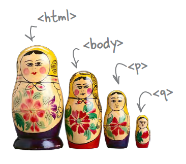

# HTML

---
## Na última aula...

- Conversamos sobre a história da Internet e da Web
- Vimos as proezas de Tim (Berners-Lee), o coração valente, ao criar
   <!-- {.portrait.push-right} -->
  - Seu primeiro protocolo (http)
  - Seu primeiro formato de arquivo (html)
  - Seu primeiro servidor http (CERN httpd)
  - Sua primeiro navegador (WorldWideWeb)

---
# Atividade de Hoje

Você tem um novo _hobby_: **criar plantas carnívoras**. Você encontrou um
documento solto em um antigo livro do seu tio e, depois de lê-lo, decidiu
**criar uma página web com seu conteúdo**.
<!--Além disso, você também tem
uma **pequena loja de sementes** dessas plantas e deseja divulgá-la em uma
página web.-->

 <!-- {.portrait} -->


---
# Para isso, hoje vamos...
- Conhecer Estrutura básica de um arquivo `html`
- Aprender Tags `html`: imagens, hiperlinks, citações, ênfase, destaque etc.
- Entender um pouco de estilo `css`: _color_, _margin_, _text-align_ etc.


---
# Funcionamento da Web


---
## O que um **navegador** faz?

- Quando o usuário "vai" até um novo endereço (URL), o navegador solicita esse
  **recurso** ao servidor
  - O **Navegador requisita** algo e **Servidor responde**

```http
GET /index.html HTTP/1.1
Host: www.twitter.com
```
 <!-- {.half-width.centered} --> <!-- {p:.no-margin} -->
```http
HTTP/1.1 200 OK
Date: Mon, 23 May 2005 22:38:34 GMT
Server: Apache/1.3.3.7 (Unix) (Red-Hat/Linux)
Content-Type: text/html; charset=UTF-8
Content-Length: 131

<!DOCTYPE html>
<html>
<head>
  <title>Twitter</title>
</head>
<body>
  Olá mundo, este é um tweet.
</body>
</html>
```


---
## O que um **navegador** faz (cont.)?

- URL: Unique **Resource** Locator
  - É o endereço de coisas na Internet - páginas, imagens, arquivos, etc.

    
- Assim que a resposta é recebida, o navegador a exibe na tela, caso **consiga**
  - Por exemplo, os navegadores não conseguem exibir um arquivo .zip

---
# Estrutura Básica do **HTML**

---


---


- Demonstração: criando uma página no "blocão"

---
## Estrutura

- Um punhado de **tags** no texto
  - As _tags_ fazem a marcação da estrutura do texto
  - Existem dezenas de tags (umas 50? 60?) e cada uma tem um propósito e um
    resultado visual
  - A grande maioria delas precisam ser fechadas (e.g., `<p>...</p>`)
- Indentação e espaçamento são livres e não afetam o resultado
- Um arquivo html é _plain-text_, ou puramente textual
  - em contraposição a um arquivo binário, por exemplo
<!-- - Questionário Maroto: [Elementos HTML básicos](https://moodle.cefetmg.br/mod/quiz/view.php?id=17713)
-->
---
## Estrutura (cont.)


---
## A _tag_ &lt;html&gt;

- Envolve todas* as outras _tags_
  - *Exceto a _tag_ especial `<!DOCTYPE html>`
- Dentro dela, **devem existir todas e apenas**, nesta ordem:
  - `<head>...</head>`
  - `<body>...</body>`

---
## A _tag_ &lt;head&gt;

- Do inglês: cabeça
- Contém **meta-informação** sobre este arquivo `html`
  - Título da página (obrigatório)
  - Descrição da página
  - Ícone
  - Inclusão de arquivos (`.css`, `.js`)
- Trecho de código

```html
<html>
  <head>
    <title>Este é o título que aparece na aba</title>
    ...
  </head>
  ...
```

---
## A _tag_ &lt;body&gt;

- Do inglês: corpo
- Contém **todo o conteúdo da página**: _tags_ de
  - parágrafos (`<p>...</p>`)
  - títulos e subtítulos (`<h1>...</h1>`)
  - imagens (``), etc.
- Trecho de código
```html
<html>
  <head>...</head>
  <body>
    ...
  </body>
<html>
```

---
## _Tag_ de Parágrafo (&lt;p&gt;...&lt;&#47;p&gt;)

- Para marcar onde um parágrafo começa e onde ele termina
  ```html
  <p>
      You'll find us right in the center of
      downtown Webville. Come join us!
  </p>
  ```
- Resultado: apenas um bloco de texto, como esperávamos
  <iframe width="100%" height="120" src="http://jsfiddle.net/fegemo/ofs1csr0/embedded/result/" allowfullscreen="allowfullscreen" frameborder="0"></iframe>  

---
## _Tag_ de Parágrafo (&lt;p&gt;...&lt;&#47;p&gt;) (cont.)

- **Quebras de linha são feitas automaticamente** dentro de um parágrafo e não
  necessariamente no mesmo lugar que você quebrou a linha no seu código fonte
```html
<p>
  "Um dos maiores problemas encontrados em viajar no tempo não é
  vir a se tornar acidentalmente seu próprio pai ou mãe. Não há
  nenhum problema em tornar-se seu próprio pai ou mãe com que
  uma família de mente aberta e bem ajustada não possa lidar."
</p>
```

---
## _Tag_ de Parágrafo (&lt;p&gt;...&lt;&#47;p&gt;) (cont.)

- Resultado: um bloco de texto com quebras de linha onde foram necessárias.
  <iframe width="100%" height="300" src="http://jsfiddle.net/fegemo/62afu86f/embedded/result,html/" allowfullscreen="allowfullscreen" frameborder="0"></iframe>

---
## _Tag_ de Seções e Subseções (h1, h2, ..., h6):

  - Para marcar seções, subseções, subsubseções...
```html
    <h1>Seção</h1>
    Este é o corpo da seção
    <h2>Subseção</h2>
    Este é o corpo da subseção
```
<iframe width="100%" height="250" src="http://jsfiddle.net/danielhasan/kndxz5kx/embedded/result/" allowfullscreen="allowfullscreen" frameborder="0"></iframe>

---
## _Tag_ de Imagem (&lt;img&gt;):

  - Para exibir imagens...
```html
    
```
{:height="30px" width="36px"}
  - Neste exemplo, você utilizou o **endereço URL** da imagem
  - Quando a imagem estiver no seu servidor (computador), podemos usar também seu endereço **absoluto** ou **relativo**
---
## Endereço Absoluto e Relativo:


  - A imagem está na mesma pasta: `/ovelhas/racas/pira-tovelha.jpg`
  - Podemos utilizar seu **endereço absoluto**: `/ovelhas/racas/pira-tovelha.jpg`
  - Ou seu **endereço relativo**: `pira-tovelha.jpg` (relativo à página atual)
    ```html
        
    ```
---
## Endereço Absoluto e Relativo:
  - Caminho do  HTML: `/ovelhas/racas/raras.html`
  - A imagem está na mesma pasta: `/ovelhas/racas/pira-tovelha.jpg`
  - Endereço Absoluto:
  ```html
     
  ```

  - Endereço Relativo:
  ```html
    
  ```        
---
## Endereço Absoluto e Relativo:

<!-- {.push-right} -->

  - A imagem está em outra pasta: `/ovelhas/racas/img/pira-tovelha.jpg`
  - **Endereço absoluto**: `/ovelhas/racas/img/pira-tovelha.jpg`
  - **Endereço relativo**: `img/pira-tovelha.jpg`
  ```html
     
  ```
---
## Endereço Absoluto e Relativo:

<!-- {.push-right} -->

  - A imagem está em outra pasta (um nível abaixo): `/ovelhas/pira-tovelha.jpg`
  - **Endereço absoluto**: `/ovelhas/pira-tovelha.jpg`
  - **Endereço relativo**: `../pira-tovelha.jpg`
  ```html
     
  ```
---
## Endereço Absoluto e Relativo:

<!-- {.push-right} -->

  - A imagem está dois níveis abaixo: `/pira-tovelha.jpg`
  - **Endereço absoluto**: `/pira-tovelha.jpg`
  - **Endereço relativo**: `../../pira-tovelha.jpg`
  ```html
  
  ```
---
## Endereço Absoluto e Relativo:

<!-- {.push-left} -->

| End. Absoluto             	| End. Relativo 	|
|---------------------------	|---------------	|
| /ovelhas/racas/c.jpg      	| c.jpg         	|
| /ovelhas/racas/xpto/d.jpg 	| xpto/d.jpg    	|
| /ovelhas/b.jpg            	| ../b.jpg      	|
| /a.jpg                    	| ../../a.jpg   	|

<!-- {table:.push-right} -->
---
## _Tag_ de **_Hyperlink_**
  - [Link para fora da página](http://www.google.com):
  ```html
  <a href="http://www.google.com">Link para fora da página</a>
  ```
  - [Link para um arquivo](../../images/flavio-avatar.jpg) que o navegador sabe
    abrir (_e.g._, uma imagem):
  ```html
  <a href="images/flavio-avatar.jpg">Link para um arquivo</a>
  ```
  - [Link para um arquivo](../../attachments/exemplo.zip) que o navegador não sabe abrir (_e.g._, `.zip`):
  ```html
  <a href="attachments/exemplo.zip">Link para um arquivo</a>
  ```


---
## Anatomia de uma _tag_


- _tag_ de fechamento: `</h1>`
  - É idêntica à _tag_ de abertura, porém com uma barra antes do nome da _tag_
- Chamamos `<TAG>CONTEÚDO</TAG>` de um **elemento** da página
- Tags de abertura podem ter **atributos**:
  ```html
  
  ```
  - Em ``, o atributo `src="..."` aponta para a URL do arquivo
  - Não deve haver espaço entre seu nome e seu valor: `` (errado!)
---
## Como o navegador decide **como vai exibir** as _tags_ html?

- Estilos padrão
  - Cor: preto
  - Fundo de tela: branco
  - Fonte: Times New Roman
- Cada navegador pode ter um estilo padrão diferente
- É possível e altamente recomendável **criar estilos próprios**
- Vamos conhecer agora uma segunda linguagem: CSS

---
# Um pouco de estilo
## Conhecendo CSS - Cascading Stylesheets

---
## Definindo o estilo

- Adicionamos um novo elemento: `<style>...</style>`
- Podemos colocá-lo no &lt;head&gt; ou no &lt;body&gt;, mas a **melhor prática é
  no cabeçalho**
```html
<html>
  <head>
    <title>Título da página</title>
    <style>

    </style>
  </head>
  ...
```

---
## Definindo o estilo (cont.)

```css
body {
  background-color: #d2b48c;
  margin-left: 20%;
  margin-right: 20%;
  border: 2px dotted black;
  padding: 10px 10px 10px 10px;
  font-family: sans-serif;
}
```

...e o resultado...

---
## Definindo o estilo (cont.)

<iframe width="100%" height="500" src="//jsfiddle.net/fegemo/9po3sd1m/2/embedded/result,html,css" allowfullscreen="allowfullscreen" frameborder="0"></iframe>

---
## Entendendo o estilo

- Define a cor (_color_) do fundo (_background_) para marrom (definido em
  hexadecimal):
  ```css
  background-color: #d2b48c;
  ```
- Define as margens laterais da página:
  ```css
  margin-left: 20%;
  margin-right: 20%;
  ```

---
## Entendendo o estilo (cont.)

- Coloca uma borda preta (_black_) com largura de 2px e pontilhada (_dotted_):
  ```css
  border: 2px dotted black;
  ```
- Altera a fonte para `sans-serif` (parecida com Arial):
  ```css
  font-family: sans-serif;
  ```

---
## Entendendo o estilo (cont.)

- Define um espaço de preenchimento de 10px entre a borda e o conteúdo
  ```css
  padding: 10px 10px 10px 10px;
  ```
  - `padding:` é um atalho para
    - `padding-top:`
    - `padding-right:`
    - `padding-bottom:`
    - `padding-left:`
  - Se usarmos a propriedade de atalho, definimos valores para as propriedades
    originais na ordem acima (cima, direita, baixo, esquerda)

---
## Mais sobre atalhos

- Os **resultados são idênticos** de se fazer:
- ```css
  padding: 10px 10px 10px 10px;
  ```
- ```css
  padding-top: 10px;
  padding-bottom: 10px;
  padding-left: 10px;
  padding-right: 10px;
  ```
- ```css
  padding: 10px;
  ```

---
# Referências

1. Capítulo 1 do livro
