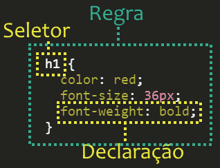
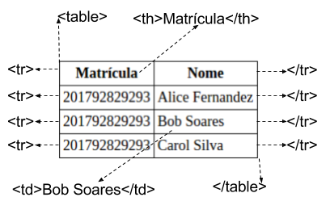

<!-- {"layout": "title"} -->
# HTML (parte 3)
## Tabelas, Tesouros :crown: e Piratas

---
<!-- {"layout": "regular"} -->
# Na última aula... (1/4)

- _Tags_ de importância:`<strong>`, `<em>`, `<mark>`, `<del>` e `<ins>`
- Listas ordenadas (`<ol>`) e não ordenadas (`<ul>`)
- Podemos **criar hiperlinks** com o elemento
  `<a href="caminho-do-recurso">nome</a>`
  - Link interno da página referenciando o `id` do elemento:
    ```html
    <a href="#banda-calypso">Ir para banda Calypso</a>
    ...
    <h2 id="banda-calypso">Calypso</a>
    ```

---
<!-- {"layout": "regular"} -->
# Na última aula... (2/4)

- Mais sobre **hiperlinks**:
  - Link para email:
    `<a href="mailto:hasan@decom.cefetmg.br">Me mande emails</a>`
  - O atributo `target` para abrir uma página em outra aba
    ```html
    <a href="http://www.pudim.com.br" target="_blank">Site legal</a>
    ```
- Alguns elementos são `inline` e outros são `block`
  - **`inline`**: não fazem quebra de linha (e.g, `<q>`, `<strong>` etc.)
  - **`block`**: fazem quebra de linha (e.g., `<blockquote>`, `<p>` etc.)

---
<!-- {"layout": "regular"} -->
# Na última aula... (3/4)

-  <!-- {.push-right} -->
  Formato de uma regra **CSS**
  - **Regra**: conjunto de declarações aplicadas em alguém
  - **Seletor**: a quem se aplica uma regra
  - **Declaração**: um par de &lt;propriedade, valor&gt;
- **Estilizando elementos um a um** utilizando o seu **id** e o seletor
  iniciando com **#**

---
<!-- {"layout": "regular"} -->
# Na última aula... (4/4)

- Colocação de bordas por meio da propriedade `border`, ou então
  `border-width`, `border-style` e `border-color`
-  <!-- {.push-right} -->
  Para **centralizar imagens**:
  ```css
  img {
    display: block;
    margin-left: auto;
    margin-right: auto;
  }
  ```

---
# Hoje veremos

1. [Tabelas simples](#tabelas-simples)
1. [Tabelas completas](#tabelas-completas)
1. [Estilizando tabelas](#estilizando-tabelas)
1. [Piratas e seus tesouros](#piratas-e-seus-tesouros) 👑

<!--
1. [HTML: Tabelas e seus elementos](#tabelas)
1. [Mais sobre bordas em **CSS**](#bordas)
1. [A propriedade `border-collapse` em tabelas](#propriedade-border-collapse)
1. [_Margin_ vs _Padding_](#margin-e-padding)
1. [Definição da largura de um elemento](#largura-de-elementos)
1. [Mais propriedades **CSS** para fontes e textos](#outras-propriedades-do-texto)
1. [Piratas e seus tesouros](#piratas-e-seus-tesouros) 👑
 -->


---
<!-- {"slideHash": "tabelas"} -->
# Tabelas

<iframe width="470" height="270" src="https://jsfiddle.net/danielhasan/nmrbhqkb/7/embedded/result/" allowfullscreen="allowfullscreen" frameborder="0"></iframe>

Nesta aula iremos:
 - fazer a estrutura desta tabela via **HTML**
 - estilizar esta tabela via **CSS**

---
## O que uma tabela possui?

<iframe width="470" height="270" src="https://jsfiddle.net/danielhasan/nmrbhqkb/7/embedded/result/" allowfullscreen="allowfullscreen" frameborder="0"></iframe>

- Que partes compõem uma tabela? <!-- {ul:.bulleted} -->
  - Linhas e colunas, sendo:
    - uma linha com o **cabeçalho**
    - última linha com o **rodapé**
  - Legenda
- Em HTML, utilizamos _tags_ para indicar os elementos de uma tabela


---
<!-- {"layout": "section-header", "slideHash": "tabelas-simples"} -->
# Tabelas simples
## Linhas e células

- Elementos:
  - `<table></table>`
  - `<tr></tr>`
  - `<td></td>` e `<th></th>`

<!-- {ul^1:.content} -->

---
<!-- {"layout": "regular", "slideHash": "tags-basicas-de-tabela"} -->
## **_Tags_ básicas** de uma Tabela

-  <!-- {.push-right} -->
  Tabelas simples são criadas com as tags:
  - **`<table>...</table>`**
  - **`<tr>...</tr>`**, linha da tabela
  - **`<td></td>`**, célula de dados
  - **`<th></th>`**, célula do cabeçalho
- A **tabela** inicia-se com `<table>` e finaliza com `</table>`
- Cada **linha** possui a _tag_ `<tr>` correspondente, finalizada com `</tr>`
- A _tag_ `<td>...</td>` armazena os dados de uma **célula** da tabela
  - Para o **cabeçalho**, ao invés de `<td>`, utiliza-se a _tag_ `<th>`
- As _tags_ `<td>` e `<th>` **devem** estar dentro de uma linha (`<tr>`)

---
<video src="../../videos/coding-simple-table.mp4" width="802" height="456" controls style="margin: 0 auto;"></video>

- Repare que, por padrão, as células `<th>` ficam em <span style="font-weight: bold;">negrito</span>

---
<!-- {"slideHash": "meclando-celulas-horizontais-e-verticais", "layout": "2-column-content"} -->
## Mesclando células **horizontais** e **verticais**


```html
<table>
  <tr>
    <th colspan="2">Pessoas</th>
  </tr>
  <tr>
    <td>2005046102</td>
    <td>Epaminondas</td>
  </tr>
</table>
```

-  <!-- {.push-right} -->
  **`colspan="X"`** faz com que aquela **célula ocupe `X` colunas**
  - Para mesclar células "para baixo", usamos **`rowspan="Y"`**, onde `Y` é o
    **número de linhas** que a célula vai ocupar
- Exemplos: de [`colspan`](https://jsfiddle.net/fegemo/o6gsb0t9/) e
  de [`rowspan`](https://jsfiddle.net/fegemo/65rvt05m/)

---
## A tabela do nosso exemplo

<iframe width="65%" height="375" src="https://jsfiddle.net/danielhasan/nmrbhqkb/17/embedded/html,result/" allowfullscreen="allowfullscreen" frameborder="0"></iframe>

- OBS: Como ainda não alteramos o **estilo**, ainda não há **borda**

---
<!-- {"layout": "section-header", "slideHash": "tabelas-completas"} -->
# Tabelas completas
## Cabeçalho, Corpo e Rodapé

- Elementos:
  - `<caption>...</caption>`
  - `<thead>...</thead>`
  - `<tbody>...</tbody>`
  - `<tfoot>...</tfoot>`

<!-- {ul^1:.content} -->

---
<!-- {"slideHash": "caption", "layout": "regular"} -->
## _Tag_ `caption` para colocar **legenda**

- Coloca uma legenda na tabela:
  ```html
  <table>
    <caption>Quadro 01: Alunos Matriculados</caption>
    <tr>
      <th>Matrícula</th><th>Nome</th>
    </tr>
    <tr>
      <td>201792829293</td><td>Alice Fernandez</td>
    </tr>
  </table>
  ```
  - Exemplo: https://jsfiddle.net/danielhasan/8tr4z959/

---
## Tabela do nosso exemplo <ins>(com caption)</ins>

<iframe width="65%" height="375px" src="https://jsfiddle.net/danielhasan/nmrbhqkb/19/embedded/html,result/" allowfullscreen="allowfullscreen" frameborder="0"></iframe>

- OBS: Como ainda não alteramos o **estilo**, ainda não há **borda**

---
<!-- {"slideHash": "tag-de-cabecalho-e-rodape", "layout": "2-column-content", "embeddedStyles": "pre.hljs { max-height: 100%; }"} -->
## _Tags_ de **cabeçalho**, **corpo** e **rodapé** da tabela

```html
<table>
  <caption>Gastos em janeiro</caption>
  <thead>
    <tr>
      <th>Descrição</th><th>Valor</th>
    </tr>
  </thead>
  <tbody>
    <tr>
      <td>Alimentação</td><td>300,00</td>
    </tr>
    <tr>
      <td>Transporte</td><td>100,00</td>
    </tr>
  </tbody>
  <tfoot>
      <tr>
        <td>Total</td><td>400,00</td>
      </tr>
  </tfoot>
</table>
```
- Exemplo: https://jsfiddle.net/danielhasan/z62vg9xq/5/
- `<thead>`, `<tbody>` e `<tfoot>` devem **marcar _as linhas_** que compõem o
  corpo, o cabeçalho e o rodapé
  - Útil para:
    - aplicarmos **estilos** diferentes no **corpo**, **cabeçalho** e
      **rodapé**
    - impressão: se a tabela for maior que a página, o cabeçalho
      aparecerá em todas as páginas

---
## Tabela do nosso exemplo <ins>(completa)</ins>

<iframe width="65%" height="375px" src="https://jsfiddle.net/danielhasan/nmrbhqkb/10/embedded/html,result/" allowfullscreen="allowfullscreen" frameborder="0"></iframe>

- ~~OBS:~~ chegou a hora de estilizar!

---
<!-- {"layout": "section-header", "slideHash": "estilizando-tabelas"} -->
# Estilizando tabelas
## Deixando-as mais atrativas

- Colocando bordas
- Propriedade de largura: `width`
- Margem e _padding_
- A propriedade `border-collapse` em tabelas
- Fontes: `font-size`, `font-style`, `font-weight` e `text-decoration`

---
<!-- {"layout": "regular", "backdrop": "oldtimes"} -->
## Colocando bordas         

- A **propriedade `border`** é um atalho para `border-width`, `border-style` e
  `border-color`
  - Exemplo (os dois são **equivalentes**):
    ```css
    p {
      border-width: 1px;    /* largura de 1 pixel */
      border-style: solid;  /* borda toda colorida */
      border-color: red;    /* cor vermelha */
    }
    ```
    ```css
    p {  /* preferimos esta forma, que é mais sucinta */
      border: 1px solid red;
    }
    ```

---
<!-- {"slideHash": "bordas"} -->
## Bordas

- De forma similar, podemos fazer com que exiba apenas a borda do
  **topo**, **direita**, **abaixo** ou **esquerda**
- Para isso, usamos:  `border-top`, `border-right`, `border-bottom` e
  `border-left`
  - ```css
    p {
      border-top: 1px solid red;
      border-bottom: 2px dotted blue;
    }
    ```
    <!-- {li:style="flex-grow: 1;"} -->
  - ::: result
    <p style="border-top: 1px solid red; border-bottom: 2px dotted blue;">Sou o mestre das bordas!</p>
    :::
    <!-- {ul^0:.layout-split-2.no-list-icon.no-padding} -->
    <!-- {li:style="flex-grow: 1;"} -->
- Também podemos usar a forma mais extensa. Por exemplo, `border-top-width`,
  `border-top-style` e `border-top-color` definem, respectivamente, a largura,
  o estilo e a cor da borda do topo

---
<!-- {"slideHash": "propriedade-border-collapse"} -->
## Colocando **bordas na tabela**

- <iframe width="65%" height="150" src="https://jsfiddle.net/danielhasan/nmrbhqkb/23/embedded/result,css,html/" allowfullscreen="allowfullscreen" frameborder="0" style="float: right;"></iframe>

  Ao adicionarmos a borda nas células de uma tabela o resultado ficaria assim:

- <iframe width="65%" height="200px" src="https://jsfiddle.net/danielhasan/nmrbhqkb/24/embedded/result,css,html/" allowfullscreen="allowfullscreen" frameborder="0" style="float: right;"></iframe>

  Para mudarmos isso, adicionamos `border-collapse: collapse` à regra CSS
  da tabela
  - Este é o **comportamento desejado** praticamente **sempre** para as bordas

---
<!-- {"slideHash": "margin-e-padding"} -->
## Margem e _Padding_

- **Padding**: Espaçamento interno: entre o texto e a borda
- **Margem**: Espaçamento externo: por fora da borda

---
## Margem e _Padding_ - Exemplo

<iframe width="65%" height="250" src="https://jsfiddle.net/danielhasan/vs1w9khr/embedded/result,css,html/" allowfullscreen="allowfullscreen" frameborder="0"></iframe>

---
<!-- {"slideHash": "largura-de-elementos"} -->
## Largura de elementos

- Podemos especificar a largura dos elementos _**block**_ por meio da
  propriedade **width**

```css
p {
  width: 100px;
}
```

<iframe width="65%"  src="https://jsfiddle.net/danielhasan/t1joy5v6/embedded/html,css,result/" allowfullscreen="allowfullscreen" frameborder="0"></iframe>

---
<!-- {"slideHash": "outras-propriedades-do-texto"} -->
## Outras propriedades CSS para texto

- `font-size`: Define o tamanho da fonte
- `font-weight`: Define a espessura da fonte.
  - Valores: `normal`, `lighter`, `bold`, `bolder` ou um número representando sua espessura
- `font-style`: Define o estilo da fonte
  - Valores: `normal` e `italic`
- `text-decoration`: Sublinha, risca ou coloca um risco acima do texto:
  - Valores: `none` (nenhum), `underline` (sublinhado), `overline` (acima do texto), `line-through` (riscado)

---
## Outras propriedades CSS para texto - Exemplo

<iframe width="65%" height="400px"  src="https://jsfiddle.net/danielhasan/x2m8fnL6/embedded/html,css,result/" allowfullscreen="allowfullscreen" frameborder="0"></iframe>


---
## Utilização do CSS para a tabela do nosso exemplo...


<iframe width="50%" height="225px" src="https://jsfiddle.net/danielhasan/nmrbhqkb/7/embedded/result,html,css/" allowfullscreen="allowfullscreen" frameborder="0"></iframe>

---
<!-- {"layout": "section-header", "slideHash": "piratas-e-seus-tesouros"} -->
# Piratas e seus Tesouros 👑
## Ajude Barba-Ruiva!

- Definindo uma imagem de fundo da página
- Ocupando toda a altura do navegador
- Textos sombreados
- Cores semitransparentes

<!-- {ul:.content} -->

---
<!-- {"backdrop": "piratas"} -->

---
<!-- {"slideHash": "piratas-instrucoes"} -->
# Gerenciador de Tesouros

1. [Baixe as imagens e o ícone](https://github.com/fegemo/cefet-front-end-pirates/archive/master.zip) que serão usados
1. Descompacte o arquivo `cefet-front-end-pirates-master.zip` na área de trabalho
1. Renomeie a pasta criada na área de trabalho para `tesouro-piratas`
1. **Crie um arquivo `index.html`** na mesma pasta e siga os passos:
   1. Faça a **estrutura básica** e coloque o ícone e a imagem de fundo
   1. Coloque o **título (`h1`) e o parágrafo**, deixando espaço para tabela
      - Estilize-os
   1. **Crie a tabela** e, por fim, estilize-a
   1. Veja [instruções detalhadas aqui](https://github.com/fegemo/cefet-front-end-pirates/blob/master/README.md)

---
<!-- {"slideHash": "imagem-de-fundo"} -->
# Imagem de fundo

```css
body {
  background-image: url(caminho-para-a-imagem);
  background-repeat: no-repeat;
  background-position: left bottom;
  background-size: cover;
}
```

- `background-image` para escolher que imagem será usada
- `background-repeat: no-repeat` para que a imagem apareça só 1x
- `background-position: left bottom` para fixar que o canto **inferior
  esquerdo** da imagem fique sempre visível
- `background-size: cover` para que a imagem **cubra todo o espaço** da tela

---
## **Ancorando** a imagem **em um canto da tela**


<!-- {p:style="margin-bottom: 0;"} -->

- Deixando um canto da imagem sempre visível com `background-position`
- Outros valores possíveis: `left top`, `center center`, `center bottom` etc.


---
## Ajustando o **tamanho da imagem**


<!-- {p:style="margin-bottom: 0;"} -->

- `background-size: cover`: imagem redimensionada para cobrir todo o espaço
- `background-size: contain`: imagem redimensionada para aparecer completamente

---
<!-- {"slideHash": "ocupando-toda-altura-navegador"} -->
## Ocupando toda a altura do navegador


---
## Ocupando toda a altura do navegador (cont.)

- **1ª tentativa**: definir a altura do elemento `body` como `100%`:
   <!-- {.push-right style="height: 134px; margin-top: 1em;"} -->
  ```css
  body {
    height: 100%;
  }
  ```
- **Jeito certo**: definir a altura **do elemento `body` <ins>e do
  `html`</ins>** como `100%`:
   <!-- {.push-right style="height: 134px; margin-top: 1em;"} -->
  ```css
  html, body {
    height: 100%;
  }
  ```

---
<!-- {"slideHash": "textos-sombreados"} -->
## Textos <span style="text-shadow: 2px 2px purple; color: hotpink;">sombreados</span>


<!-- {p:style="margin-bottom: 0;"} -->

- Colocar sombras em textos facilita sua leitura quando o texto está sobre uma
  imagem que pode ter muitas cores
  ```css
  h1 {
    text-shadow: 2px 2px black;
  }
  ```

---
<!-- {"layout": "regular", "slideHash": "cores-transparentes"} -->
## Cores semitransparentes

- É possível usar cores com transparência, que deixam
  "o que está atrás" aparecer. Por exemplo:
  - ```css
    color: rgba(255, 255, 255, 0.3); /* branco 30% opaco */
    color: rgba(255, 255, 255, 0.7); /* branco 70% opaco */
    color: rgba(255, 255, 255, 1);   /* mesmo que white */
    color: rgba(0, 0, 0, 0.5);       /* preto 50% opaco */
    color: rgba(0, 0, 255, 0.6);     /* azul 60% opaco */
    ```
    <!-- {li:style="flex-grow: 1;"} -->
  - ::: result
    - branco <!-- {li:style="color: rgba(255, 255, 255, 0.3)"} -->
    - branco <!-- {li:style="color: rgba(255, 255, 255, 0.7)"} -->
    - branco  <!-- {li:style="color: rgba(255, 255, 255, 1)"} -->
    - preto  <!-- {li:style="color: rgba(0, 0, 0, 0.5)"} -->
    - _azul_ <!-- {em:style="color: rgba(0, 0, 255, 0.6); font-style: normal;"} -->
    :::
    <!-- {ul^1:.layout-split-2.no-list-icon.no-padding} -->
    <!-- {li:style="flex-grow: 1;"} -->
    <!-- {ul^2:style="width: 100%;"} -->


---
<!-- {"layout": "regular"} -->
## Cores semitransparentes

- Também podemos fazer isso com `background-color`:
  - ```css
    p {
      /* preto 50% opaco */
      background-color: rgba(0, 0, 0, 0.5);
      color: white;
    }
    ```
    ```html
    <p>Yarrr Harrr, marujo!!</p>
    ```
    <!-- {li:style="flex-grow: 1;"} -->
  - ::: result
    <p style="background-color: rgba(0, 0, 0, 0.5); color: white;">Yarrr Harrr, marujo!!</p>
    :::
    <!-- {ul^0:.layout-split-2.no-list-icon.no-padding} -->
    <!-- {li:style="flex-grow: 1;"} -->
    <!-- {ul^1:style="width: 100%;"} -->
    - Repare que o fundo do parágrafo ficou azulado
      - ...porque o fundo do "resultado" era azul


---
# Referências

1. Capítulos 13 do livro
