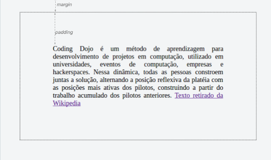

# HTML - Parte 3
---
## Aquecimento: Festa a fantasia das tags


Um grupo de elementos HTML, usando fantasia, está fazendo uma festa com a
temática "Quem sou eu?". Eles dão uma dica e você tenta adivinhar que
elemento está falando.

Baixe o [exercício][exer-who-am-i] ou pegue uma cópia com o professor.

[exer-who-am-i]: https://docs.google.com/document/d/1_l-GYO7LDB9N6LUwNT4qtxj3ij2xs3hVgp8F0ULqJD4/edit?usp=sharing
---
## Na última aula...

- Podemos **criar hiperlinks** com o elemento `<a href="caminho-do-recurso">nome</a>`
- Para **incluir imagens**, podemos usar a tag ``
- Citações são criadas com `<q>` ou `<blockquote>`
- Alguns elementos são `inline` e outros são `block`
  - **`inline`**: não fazem quebra de linha (e.g, `<q>`, `<strong>` etc.)
  - **`block`**: fazem quebra de linha (e.g., `<blockquote>`, `<p>` etc.)


---


---
## Na última aula... (cont.)

- É possível declarar regras em CSS de três formas
  1. _Inline_ (**na mesma linha**)
  ```html
  <p style="color: #fff">...</p>
  ```
  2. _Embedded_ (**embutido**)
  ```html
  <style>
    p {
      color: #fff;
    }
  </style>
  ```
  - continua...

---
## Na última aula... (cont.)
3. _Linked_ (arquivo **referenciado**)
  ```html
  <link rel="stylesheet" href="arquivo-de-estilos.css" />
  ```

---
# Hoje veremos

1. HTML: Tabelas
1. Depurando páginas web
1. Um pouco mais sobre **imagens**
1. Mapas de imagens
1. Meta _tags_
1. Codificação (_encoding_)
1. DOCTYPE (versão do HTML)

---
# Tabelas


<iframe width="50%" height="225px" src="https://jsfiddle.net/danielhasan/nmrbhqkb/7/embedded/result/" allowfullscreen="allowfullscreen" frameborder="0"></iframe>

Nesta aula iremos:
- fazer a estrutura desta tabela via **HTML**
- estilizar esta tabela via **CSS**

---
## O que uma tabela possui?

<iframe width="50%" height="225px" src="https://jsfiddle.net/danielhasan/nmrbhqkb/7/embedded/result/" allowfullscreen="allowfullscreen" frameborder="0"></iframe>


---
## O que uma tabela possui? (cont.)

<iframe width="50%" height="225px" src="https://jsfiddle.net/danielhasan/nmrbhqkb/7/embedded/result/" allowfullscreen="allowfullscreen" frameborder="0"></iframe>

  - Linhas e colunas, sendo:
    - uma linha com o **cabeçalho**
    - última linha com o **rodapé**
  - Legenda
  - Em HTML, utilizamos _Tags_ para indicar os elementos de uma tabela.

---
## _Tags_ de **Tabela**

- Tabelas são criadas com as tags:
  - **`table`**, para marcar a tabela
  - **`tr`**, linha
  - **`td`**, célula
  - `th`¹, célula do cabeçalho
  - `caption`¹, legenda
  - `thead`¹, marca as linhas do **cabeçalho**
  - `tbody`¹, marca as linhas do **corpo**
  - `tfoot`¹, marca as linhas do **rodapé**
- ¹: elementos opcionais, mas desejáveis
- [Referência sobre tabelas na Mozilla Developer Network][mdn-table]

[mdn-table]: https://developer.mozilla.org/en-US/docs/Web/HTML/Element/table

---
## _Tags_ Básicas de Tabela

[]

  - A **tabela** inicia-se com `<table>` e finaliza com `</table>`
  - Cada **linha** possui a _tag_ `<tr>` correspondente, finalizada com `</tr>`
  - A _tag_ `<td>` armazena os dados de uma **célula** da tabela
  - Para o **cabeçalho**, ao invés de `<td>`, utiliza-se a _tag_ `<th>`
  - As _tags_ `<td>` e `<th>` **devem** estar dentro de uma linha (`<tr>`)

---
## Apresentação da tabela do nosso exemplo
<iframe width="65%" height="375px" src="https://jsfiddle.net/danielhasan/nmrbhqkb/17/embedded/html,result/" allowfullscreen="allowfullscreen" frameborder="0"></iframe>

- OBS: Como ainda não aplicamos o **estilo**, ainda não possuimos **borda**
---
## __Tag__ Caption
  - Tag que define a legenda de uma tabela
    ```html
    <table>
      <caption>Quadro 01: Alunos Matriculados</caption>
      <tr>
        <th>Matrícula</th><th>Nome</th>
      </tr>
      <tr>
        <td>201792829293</td><td>Alice Fernandez</td>
      </tr>
    </table>
    ```
    - Exemplo: https://jsfiddle.net/danielhasan/8tr4z959/
---
## Apresentação da tabela (com caption) do nosso exemplo
<iframe width="65%" height="375px" src="https://jsfiddle.net/danielhasan/nmrbhqkb/19/embedded/html,result/" allowfullscreen="allowfullscreen" frameborder="0"></iframe>

- OBS: Como ainda não aplicamos o **estilo**, ainda não possuimos **borda**
---
## Tag de cabeçalho, corpo e rodapé


```html
<table>
  <caption>Gastos em janeiro</caption>
  <thead>
    <tr>
      <th>Descrição</th><th>Valor</th>
    </tr>
  </thead>
  <tbody>
    <tr>
      <td>Alimentação</td><td>300,00</td>
    </tr>
    <tr>
      <td>Transporte</td><td>100,00</td>
    </tr>
  </tbody>
  <tfoot>
      <tr>
        <td>Total</td><td>400,00</td>
      </tr>
  </tfoot>
</table>
```
- Exemplo: https://jsfiddle.net/danielhasan/z62vg9xq/5/
- `<thead>`, `<tbody>` e `<tfoot>` devem marcar as linhas de corpo, cabeçalho e rodapé, respectivamente.
  - Útil para:
    - aplicarmos **estilos** diferentes no **corpo**, **cabeçalho** e **rodapé**
    - impressão: caso a tabela seja maior que a página, o cabeçalho sera impresso em todas as páginas

---
## Utilização de corpo, cabeçalho e rodapé em nosso exemplo

<iframe width="65%" height="375px" src="https://jsfiddle.net/danielhasan/nmrbhqkb/10/embedded/html,result/" allowfullscreen="allowfullscreen" frameborder="0"></iframe>


---
<!-- {"layout": "section-header", "slideHash": "entendendo-regras-css"} -->
# Mais **regras CSS**

- Mais sobre Bordas: `border-top`, `border-down`, `border-left` e `border-right`
- A propriedade `border-collapse` em tabelas
- Propriedade de largura: `width`
- Fontes: `font-size`, `font-style`, `font-weight` e `text-decoration`

<!-- {ul:.content} -->

---
<!-- {"layout": "regular", "backdrop": "oldtimes"} -->
## Colocando bordas         

- A **propriedade `border`** é um atalho para `border-width`, `border-style` e
  `border-color`
  - Exemplo (os dois são **equivalentes**):
    ```css
    p {
      border-width: 1px;    /* largura de 1 pixel */
      border-style: solid;  /* borda toda colorida */
      border-color: red;    /* cor vermelha */
    }
    ```
    ```css
    p {  /* preferimos esta forma, que é mais sucinta */
      border: 1px solid red;
    }
    ```
---
## Bordas
- De forma similar, podemos fazer com que exiba apenas a borda do **topo**, **esquerda**, **direita** ou **abaixo**
- Para isso, usamos as propriedades  `border-top`, `border-down`, `border-left` e `border-right`

```css
p {
  border-top: 1px solid red;
  border-bottom: 2px dotted blue;
}
```
- Também podemos usar a forma mais extensa. Por exemplo, `border-top-width`, `border-top-style` e `border-top-color` definem, respectivamente, a largura, o estilo e a cor da borda do topo.
---
## Propriedade **border-collapse**
  - Ao adicionarmos a borda nas celulas de uma tabela o resultado ficaria assim:
<iframe width="65%" height="150px" src="https://jsfiddle.net/danielhasan/nmrbhqkb/23/embedded/result,css,html/" allowfullscreen="allowfullscreen" frameborder="0"></iframe>

  - Para mudarmos isso, adicionamos `border-collapse:collapse` à regra CSS da tabela:
  <iframe width="65%" height="200px" src="https://jsfiddle.net/danielhasan/nmrbhqkb/24/embedded/result,css,html/" allowfullscreen="allowfullscreen" frameborder="0"></iframe>
---
## Margem e _Padding_

- **Padding**: Espançamento entre o texto e a borda
- **Margem**: Espançamento por fora da borda
---
## Margem e _Padding_ - Exemplo
  <iframe width="65%" height="250px" src="https://jsfiddle.net/danielhasan/vs1w9khr/embedded/result,css,html/" allowfullscreen="allowfullscreen" frameborder="0"></iframe>
---
## Largura de elementos
  - Podemos especificar a largura dos elementos _**blocks**_ por meio da propriedade **width**
  ```css
      p {
        width: 100px;
      }

  ```
  <iframe width="65%"  src="https://jsfiddle.net/danielhasan/t1joy5v6/embedded/html,css,result/" allowfullscreen="allowfullscreen" frameborder="0"></iframe>
---
## Outras propriedades do texto

- `font-size`: Define o tamanho da fonte
- `font-weight`: Define a espessura da fonte.
  - Valores: `normal`, `lighter`, `bold`, `bolder` ou um número representando sua espessura
- `font-style`: Define o estilo da fonte
  - Valores: `normal` e `italic`
- `text-decoration`: Sublinha, risca ou coloca um risco acima do texto:
  - Valores: `none` (nenhum), `underline` (sublinhado), `overline` (acima do texto), `line-through` (riscado)
---
## Outras propriedades do texto - Exemplo

  <iframe width="65%" height="400px"  src="https://jsfiddle.net/danielhasan/x2m8fnL6/embedded/html,css,result/" allowfullscreen="allowfullscreen" frameborder="0"></iframe>


---
# Referências

1. Capítulos 13 do livro
