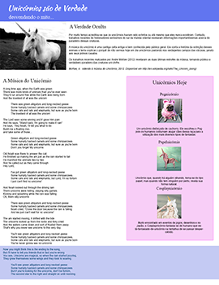
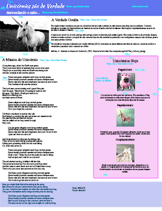
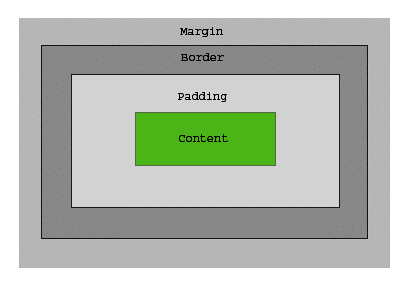

# HTML - Parte 4

---
# Roteiro

1. Conhecer a verdadeira história sobre os unicórnios
1. Conhecer `div` e `span`
1. Entender o _Box Model_
1. Flutuar conteúdo com `float`

---
# _Unicorns are real_ (Exercício)


---
## Exercício

1. Criar uma página para expor a verdade sobre os pôneis.
  - Seu amigo _designer_ criou um _layout_ no Photoshop para sua página e você
    deve criá-la de forma a reproduzir esse _layout_ na sua página `html`
  - Você pode ver o _layout_ na página seguinte
  - Você vai precisar usar novas tags e conceitos: `div`, `span`, _Box Model_ e
    `float`. Portanto, continue navegando até o final dos slides antes de
    colocar as mãos na massa ;)
---
## <abbr title="Comprehensive Layout">Comp</abbr> / <abbr title="Specifications">Specs</abbr>

[](../../images/unicorns-comp.png)
[](../../images/unicorns-specs.png)

---
## Passos para o exercício

1. Instalar o git na máquina (sugestão: https://windows.github.com/)
1. Criar um _fork_ do repositório do professor em `https://github.com/fegemo/cefet-web-unicorns`
1. Fazer o exercício e fazer _commits_ e _push_ no seu repositório
1. Enviar, via **Moodle**, o link do seu repositório até o final da aula

---
# Div e Span

---
## Div ([na MDN](https://developer.mozilla.org/en-US/docs/Web/HTML/Element/div))

- `<div></div>` é usado para agrupar outras tags e não representa nada por si só
- Pode ser usado para
  - Agrupar elementos
  - Estilo (através dos atributos `id` e `class`)
- É um elemento `block`

---
## Div ([na MDN](https://developer.mozilla.org/en-US/docs/Web/HTML/Element/div))

- Exemplo:
  - `html`
    ```html
    <div id="topo">
      <h1>Título do site</h1>
      <h2>Subtítulo</h2>
    </div>
    ```
  - `css`
    ```css
    #topo { background-color: #4400ac; }
    ```

---
## Span ([na MDN](https://developer.mozilla.org/en-US/docs/Web/HTML/Element/span))

- `<span></span>` tem exatamente a mesma função que `div`
- Porém, é um elemento `inline`
- Exemplo:
  - `html`  
    ```html
    <span class="musica">Hangover</span>:
        <span class="artista">PSY</span>
    ```
  - `css`
    ```css
    .musica { font-style: italic; }
    .artista { font-weight: bold; }
    ```

---
# O _Box Model_

---
## _Box Model_ ([na MDN](https://developer.mozilla.org/en-US/docs/Web/CSS/box_model))

- `CSS` enxerga todo elemento de conteúdo como uma "caixa"
- A "caixa" é formada por
  - Espaço do conteúdo
  - Espaço de preenchimento (`padding`)
  - Bordas (`border`)
  - Espaço externo (`margin`)

---
## _Box Model_ (cont.)



---
## _Box Model_ (cont.)

- Quando define-se a largura (`width`) ou altura (`height`) de um elemento,
  está se definindo a dimensão do **conteúdo da caixa**
- Elementos `inline` ignoram os valores de
  - `width` e `height`
  - `padding-top`, `padding-bottom`
  - `margin-top`, `margin-bottom`

---
## Alterando o _box model_

- É possível alterar o significado da `width` e `height` que damos a um elemento
   usando a propriedade `box-sizing`
  - `box-sizing: content-box`
    - `width` = largura do conteúdo
  - `box-sizing: border-box`
    - `width` = conteúdo + padding + border
  - `box-sizing: padding-box`
    - `width` = conteúdo + padding
    - [Apenas FF](http://caniuse.com/#search=padding-box)

---
# Flutuando com **float**s

<p style="text-align: right">
  <blockquote style="font-style: italic">
    "Para voar basta errar o chão"
  </blockquote>
  (Douglas Adams)
</p>

---
## Mas primeiro, vamos falar do Fluxo (_Flow_)


---
## Fluxo

- Elementos `block` de uma página são dispostos verticalmente, de cima para
  baixo
- Elementos `inline` são dispostos da esquerda para a direita, de cima para
  baixo

---
## Fluxo inline


---
## Fluxo block e inline, juntos


---
## Margens

- Quando o navegador coloca **dois elementos `inline` um ao lado do outro** e
  ambos têm **margens** laterais, o navegador **soma seus valores** (esperado)
- Quando o navegador coloca **dois elementos `block` um em cima do outro** e
  ambos têm **margens superior/inferior**, o navegador **seleciona o maior
  valor** dentre os dois (não intuitivo)

---
## Float

- Usado para alterar o fluxo tradicional da página
  - `css`  
    ```css
    img#principal {
      float: left; /* right, none */
    }
    ```
  - `html`
    ```html
    
    <p>Texto ...</p>
    ```
---
## Float (cont.)

- 
  Um elemento flutuante é removido do fluxo tradicional e
  - os elementos `block` depois dele fingem que ele não está ali
  - os elementos `inline` depois dele respeitam seu formato
---
## Float (exemplo)


- 
  Alterando a largura de um parágrafo para 200px
  ```css
  p#amazing {
    width: 200px;
  }
  ```

---
## Float (exemplo cont.)

- 
  Flutuando o parágrafo à direita
  ```css
  p#amazing {
    width: 200px;
    float: right;
  }
  ```

---
## Exemplo vivo de float

<iframe width="100%" height="450" src="http://jsfiddle.net/fegemo/7cofhyLc/embedded/html,css,result/" allowfullscreen="allowfullscreen" frameborder="0"></iframe>

---
## Cancelando o float com **clear**

- É possível parar o efeito que um elemento _float_ causa nos elementos
  seguintes (`blocks` o ignorarem e `inlines` se "moldarem" a ele)
  ```html
  
  <p id="primeiro-paragrafo">...</p>
  <p>...</p>
  <p>...</p>
  ```
  ```css
  #imagem { float: right; }
  #primeiro-paragrafo { clear: right; }
  ```

---
## Exemplo de **clear**

<iframe width="100%" height="450" src="http://jsfiddle.net/fegemo/7cofhyLc/6/embedded/html,css,result/" allowfullscreen="allowfullscreen" frameborder="0"></iframe>

---
# Referências

1. Capítulos 9 (parcial), 10 e 11 (parcial) do livro
1. Mozilla Developer Network (MDN)
