<!-- {"layout": "title"} -->
# **HTML** parte 4
## Div/Span, Box Model, Float e Desafios

---
<!-- {"layout": "2-column-content-zigzag"} -->
# Na última aula... (1/3)

- Vimos a **ferramenta do desenvolvedor** do Google Chrome
  - Usamos para **investigar erros** e **experimentar propriedades**

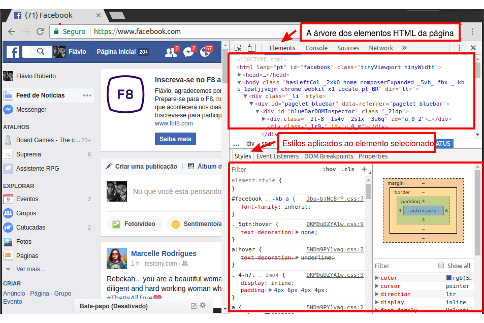 <!-- {.push-right.large-width.bordered.rounded} -->

 <!-- {.medium-width.centered.block} -->

- Podemos enxergar o HTML da página como uma "árvore" de elementos

---
<!-- {"layout": "tall-figure-right"} -->
#  <!-- {.portrait.push-right} --> Na última aula... (2/3)

<iframe width="100%" height="300" src="//jsfiddle.net/fegemo/gqgacz36/embedded/result,html,css/" allowfullscreen="allowfullscreen" frameborder="0" class="push-right"></iframe>

- CSS foi criada por Håkon Wium Lie em 1994
- Entendemos o que é **a cascata** no CSS:
  - Algumas **propriedades são herdadas** dos elementos ancestrais (_e.g._,
     cor do texto), outras não (_e.g._, a borda)

---
# Na última aula... (3/3)

- Além de selecionar por _tag_, id ou classe, há diversos **outros seletores**:

descend./filho <!-- {dl:.no-margin} -->
  ~ `p strong`: todo `<strong>` descendente de `<p>` (filho, neto etc.)
  ~ `p > strong`: todo `<strong>` filho direto de `<p>`

atributo
  ~ `img[alt]`: toda `` que tem atributo `alt="..."`
  ~ `a[href$=".html"]`: todo `<a>` apontando para um `.html` etc.

estado do link
  ~ `a:link`, `a:visited`, `a:hover`, `a:active`

negação
  ~ `img:not([alt])`: `` sem o atributo `alt`

---
<!-- {"layout": "centered"} -->
# Hoje veremos

1. [`div` e `span`](#div-e-span)
1. [O _Box Model_](#o-box-model)
1. [Revisitando o `float`](#revisitando-o-float)
1. [Desafios](#desafios)

---
<!-- {"layout": "section-header", "hash": "div-e-span"} -->
# **div** e **span**
## Agrupando outros elementos HTML

- Agrupando para estilizar
- O elemento `<div>...</div>`
- O elemento `<span>...</span>`

<!-- {ul:.content} -->

---
<!-- {"layout": "2-column-content-zigzag"} -->
# #comofaz?

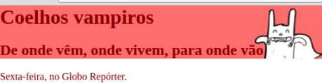 <!-- {.bordered} -->

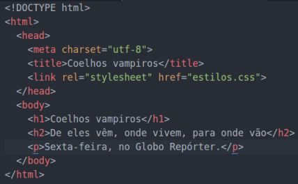 <!-- {.rounded} -->

1. E se quisermos estilizar de forma que o <u>título</u> e
  <u>subtítulo</u> ficassem **com o mesmo fundo**... <!-- {ol:.no-list-icon} -->

- ...a partir do HTML acima?  <!-- {ul:.no-list-icon} -->

---
<!-- {"layout": "2-column-content-zigzag"} -->
# 1ª tentativa

- Basta colocar o mesmo fundo tanto no `<h1>` quanto no `<h2>`!

```css
h1, h2 {
  background: url(coelho.png) #ff6d6d;
  background-repeat: no-repeat;
  background-position: right top;
}
```

- Acontece que, como são elementos diferentes, **cada um tem seu
  próprio fundo**

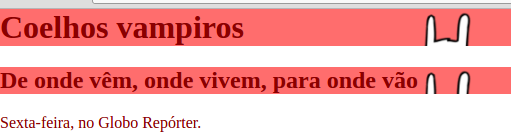 <!-- {.bordered} -->

---
<!-- {"layout": "2-column-content-zigzag"} -->
# O **jeito certo** <!-- {.underline.upon-activation} --><span class="jump upon-activation delay-800">:star2:</span>

- Colocamos os títulos **dentro de outro elemento** e o estilizamos
- Uma `<div>...</div>` pode ser usada para agrupar elementos

```html
<body>
  <div id="topo-da-pagina">  
    <h1>Coelhos Vampiros</h1>
    <h2>De onde vêm, onde vivem ...</h2>
  </div>
  <p>Sexta-feira, no Globo Repórter</p>
</body>
```

 <!-- {.bordered} -->

```css
#topo-da-pagina {
  background: url(coelho.png) #ff6d6d;
  background-repeat: no-repeat;
  background-position: right top;
}
```

---
## **Div** ([na MDN](https://developer.mozilla.org/en-US/docs/Web/HTML/Element/div))

- `<div></div>` serve para agrupar outros elementos
- Não representa nada por si só (não tem semântica)
  - Um `<p>` é um parágrafo (_i.e._, conteúdo)
  - Uma `` é uma imagem (_i.e._, conteúdo)
  - Uma `<div>` é um agrupamento de elementos
- É um elemento `block`

> É um **mecanismo genérico** que nos permite criar uma estrutura ou agrupamento
> de elementos quando não há outro elemento HTML mais apropriado, e ela pode
> **ser estilizada usando CSS** ou manipulada com JavaScript
> <cite><a href="https://www.w3.org/wiki/Generic_containers_-_the_div_and_span_elements">Containers genéricos</a> na W3C</cite>

---
<!-- {"layout": "2-column-content"} -->
## Div (exemplo)

- `html`
  ```html
  <div id="topo-da-pagina">
    <h1>Título do site</h1>
    <h2>Subtítulo</h2>
  </div>
  ```
- `css`
  ```css
  #topo-da-pagina {
    background-color: #4400ac;
    color: #fffff;
  }
  ```

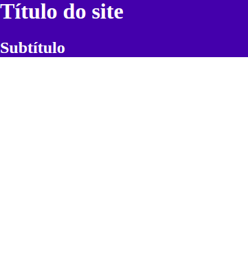 <!-- {.bordered style="margin-top: 3em"} -->

---
<!-- {"layout": "2-column-content"} -->
## Div (outro exemplo)

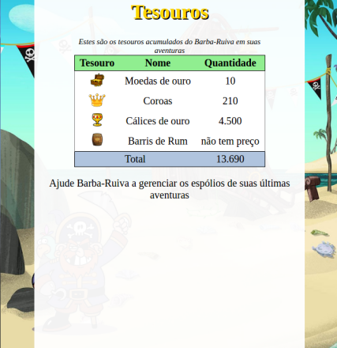 <!-- {.bordered.push-right} -->
- ```html
  <body>
  ➡️ <div id="conteudo">
        <h1>Tesouros</h1>
        <table><!-- ... --></table>
        <p>Ajude Barba-Ruiva ...</p>
  ➡️ </div>
  </body>
  ```
  ```css
  body { background: url(ilha.png) }
  #conteudo {
    background: white;
  }
  ```
  <!-- {ul:.no-list-icon.no-margin} -->

---
## **Span** ([na MDN](https://developer.mozilla.org/en-US/docs/Web/HTML/Element/span))

- `<span></span>` **tem _exatamente_ <!-- {.underline.upon-activation} -->
  a mesma função** que `div`, porém `inline`
  <!-- {.underline.upon-activation.delay-1200} -->

::: figure .figure-slides.no-margin.flex-align-center.invert-colors-dark-mode
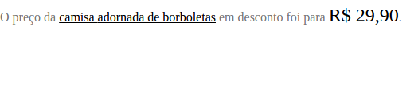 <!-- {.bullet.figure-step.bullet-no-anim} -->
 <!-- {.bullet.figure-step.bullet-no-anim} -->
:::

- Como estilizar o nome e o preço do produto? <!-- {ul:.bulleted} -->
  - Se usarmos `<div>`, vai quebrar linha (ele é `block`)
  - Então, usamos o `<span>`, que é `inline`!
    ```html
    O preço da <span class="produto">camisa adornada</span> é
    de <span class="preco">R$ 29,90</span>.
    ```

---
<!-- {"embeddedStyles": ".artista { position: relative; padding-left: 1.5em; color: #ff3399; } .artista::before { content: '🎵'; display: inline-block; position: absolute; left: 0; top: 0; width: 1em; height: 1em; color: currentColor; }"} -->
## Span (exemplo)

- ```html
  <p>
    O <span class="artista">Chimbinha</span> é rei, mas
    <span class="artista">Joelma</span> é diva intergalática.
  </p>
  ```
  ```css
  .artista {
    background: url(imgs/musica.png) no-repeat left;
    padding-left: 20px;   color: #ff3399; /* rosa choque */
  }
  ```
  ::: result
  O <span class="artista">Chimbinha</span> é rei, mas
  <span class="artista">Joelma</span> é diva
  intergalática.
  :::
  <!-- {ul:.no-list-icon} -->

---
<!-- {"layout": "section-header", "hash": "o-box-model"} -->
# O _Box Model_
## Como os elementos são "vistos" pelo navegador

- Componentes da caixa
- `width` e `height`
- Alterando o _box-model_
<!-- {ul:.content} -->

---
<!-- {"embeddedStyles": ".box-model-part {color: #333; border-radius: 4px; font-style: normal; padding: 1px 3px; } .box-model-part code { background: initial; }"} -->
## _Box Model_ ([na MDN](https://developer.mozilla.org/en-US/docs/Web/CSS/box_model))

-  <!-- {.push-right} -->
  O navegador enxerga todo elemento de conteúdo como uma "caixa"
- A "caixa" é formada por:
  - Espaço do _conteúdo_ <!-- {.box-model-part style="background: #8bb4c0;"} -->
  - Espaço de _preenchimento (`padding`)_ <!-- {em:.box-model-part style="background: #c2ce89;"} -->
  - Bordas _(`border`)_ <!-- {em:.box-model-part style="background: #fddc9a;"} -->
  - Espaço _externo (`margin`)_ <!-- {em:.box-model-part style="background: #f9cc9d;"} -->

<!-- {ul^1:style="margin-bottom: 0;"} -->

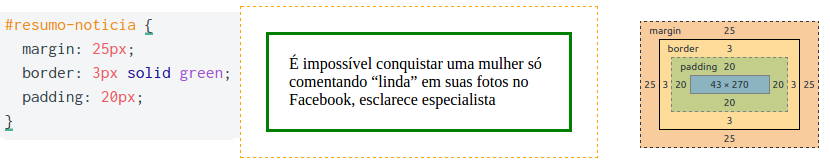 <!-- {p:.flex-align-center.no-margin.invert-colors-dark-mode} -->

---
<!-- {"layout": "centered-horizontal"} -->
## Visualizando a caixa de um elemento

<video src="../../videos/tools-box-model.mp4" height="440" controls></video>

---
## _Box Model_: **largura** e **altura**

- Quando definimos a **largura** (`width`) ou **altura** (`height`) de
  um elemento, estamos definindo o tamanho
  do _conteúdo da caixa_, <!-- {em:.box-model-part style="background: #8bb4c0;"} -->
  e não da caixa inteira

::: figure .figure-slides.flex-align-center.clean.invert-colors-dark-mode
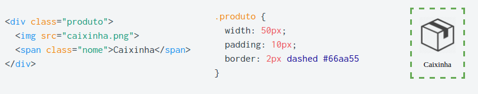<!-- {.bullet.figure-step.bullet-no-anim.rounded.bordered} -->
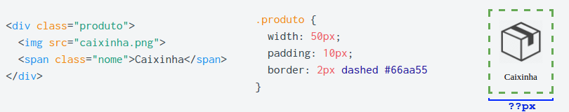<!-- {.bullet.figure-step.bullet-no-anim.rounded.bordered} -->
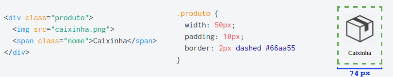<!-- {.bullet.figure-step.bullet-no-anim.rounded.bordered} -->
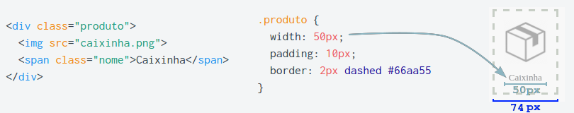<!-- {.bullet.figure-step.bullet-no-anim.rounded.bordered} -->
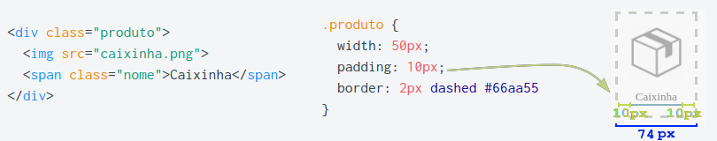<!-- {.bullet.figure-step.bullet-no-anim.rounded.bordered} -->
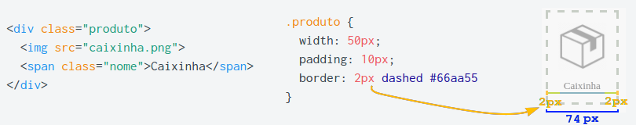<!-- {.bullet.figure-step.bullet-no-anim.rounded.bordered} -->
:::

---
<!-- {"layout": "tall-figure-right"} -->
## **Dimensionando** um elemento

::: did-you-know .push-right width: 320px; margin-right: 6px;
Elementos `inline` ignoram os valores de:
- `width`, `height`
- `margin-top`
- `margin-bottom`
:::

- Se sabemos a dimensão total de um elemento, que também contém
  `padding` e/ou `border`, como calcular seus (`width`, `height`)?
  ::: figure .figure-slides.push-right.invert-colors-dark-mode
  <!-- {.bullet.figure-step.bullet-no-anim.rounded} -->
  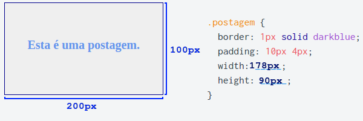<!-- {.bullet.figure-step.bullet-no-anim.rounded} -->
  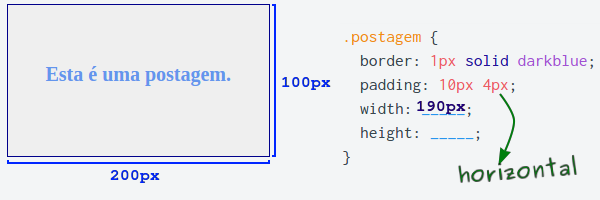<!-- {.bullet.figure-step.bullet-no-anim.rounded} -->
  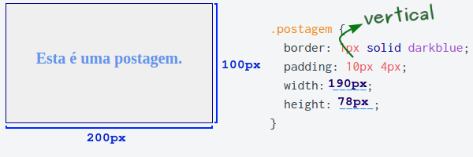<!-- {.bullet.figure-step.bullet-no-anim.rounded} -->
  :::
- Contudo, fazer essa conta "nós mesmos" pode resultar em erros... <!-- {li:.bullet} -->
  - É possível mudar isso!

---
<!-- {"layout": "2-column-content", "slideStyles": {"grid-template-columns": "1fr auto"}, "embeddedStyles": ".max-width img{max-width:100%;}"} -->
## Alterando o _box model_

- É possível alterar o significado da `width` e `height` de um elemento <!-- {ul:.no-bullets.no-padding} -->
   **usando _a propriedade `box-sizing`_** <!-- {em:.underline.upon-activation.delay-3000} -->:
  - `box-sizing: content-box` (valor padrão)
    - `width` = largura do _conteúdo_ <!-- {.box-model-part style="background: #8bb4c0;"} -->
  - `box-sizing: border-box`
    - `width` = _conteúdo_ <!-- {.box-model-part style="background: #8bb4c0;"} --> +
      _padding_ <!-- {.box-model-part style="background: #c2ce89;"} --> +
      _border_ <!-- {.box-model-part style="background: #fddc9a;"} -->
    - Esta forma é mais intuitiva :thumbsup: :thumbsup: :thumbsup: <!-- {ul^2:style="margin-bottom: 0.25em"} -->

::: did-you-know .push-right width: 284px; margin-left: 6px; padding-right: 0.5em
As **margens** do elemento formam um **espaçamento externo** e não usam
espaço dentro da caixa.
:::

::: figure .clean.span-columns.figure-slides.max-width.centered.invert-colors-dark-mode margin:0 auto; width: calc(100% - 290px); clear: both;
<!-- {.bullet.figure-step.bullet-no-anim.rounded.bordered} -->
<!-- {.bullet.figure-step.bullet-no-anim.rounded.bordered} -->
<!-- {.bullet.figure-step.bullet-no-anim.rounded.bordered} -->
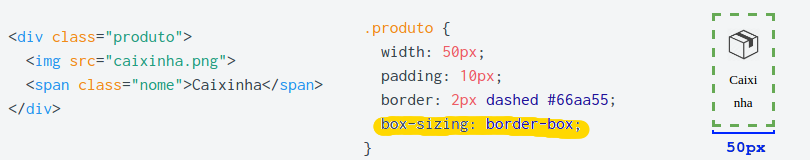<!-- {.bullet.figure-step.bullet-no-anim.rounded.bordered} -->
:::

---
<!-- {"layout": "section-header", "hash": "revisitando-o-float", "embeddedStyles": ".guia-do-mochileiro { position: fixed; bottom: -225px; left: calc(50% + 20px); transition: all 200ms ease-out; } .guia-do-mochileiro-container { cursor: help; } .guia-do-mochileiro-container:hover .guia-do-mochileiro { bottom: -10px; box-shadow: 6px 3px 6px rgba(0, 0, 0, .5), -6px 3px 6px rgba(0, 0, 0, .5); }"} -->
# Revisitando **float**

> Para voar, basta errar o chão.
> <cite>Douglas Adams no Guia do Mochileiro das Galáxias</cite>  <!-- {.guia-do-mochileiro} -->
<!-- {blockquote:.guia-do-mochileiro-container style="max-width: 42%; margin-left: 1em;"} -->

- Relembrando o fluxo estático
  - `inline` e `block`
- Relembrando o _float_
- Possíveis "problemas":
  1. Interrompendo o _float_
  1. Remoção do fluxo
<!-- {ul^1:.content} -->

---
<!-- {"layout": "centered-horizontal", "backdrop": "oldtimes"} -->
## Elementos **`block`**

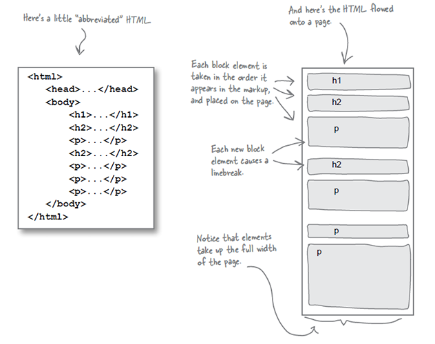 <!-- {style="max-height: 60vh"} -->
---
<!-- {"layout": "centered-horizontal", "backdrop": "oldtimes", "state": "show-active-slide-and-previous", "containerStyles": {"--show-2-slides-x-distance": "300px", "--show-2-slides-z-distance": "-150px", "--show-2-slides-rotation": "5deg"}} -->
## Elementos **`inline`**

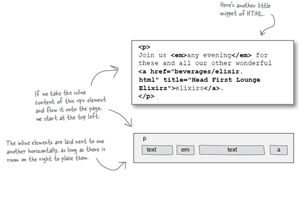 <!-- {style="max-height: 60vh"} -->

---
<!-- {"layout": "centered-horizontal", "backdrop": "oldtimes"} -->
## `block` e `inline`, juntos

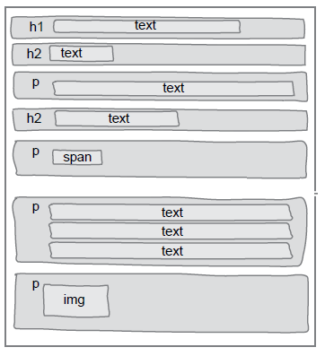 <!-- {style="max-height: 60vh"} -->

---
## Flutuando elementos com **`float`**

- ::: figure .figure-slides.push-right
  <div class="bullet figure-step bullet-no-anim">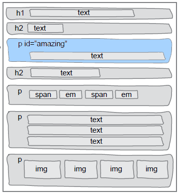<figcaption>Sem float</figcaption></div>

  <div class="bullet figure-step bullet-no-anim">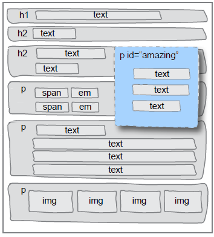<figcaption>Com float</figcaption></div>
  :::
  Flutuando o parágrafo à direita: <!-- {ul:.compact-code} -->
  ```css
  p#amazing {
    width: 200px;
    float: right;
  }
  ```
- Quem flutua é **removido do fluxo**
  - _i.e._, não ocupa mais espaço
- Elementos **<u>depois</u> do flutuante**:
  - Os `block`: passam a ignorar o elemento flutuante
  - Os `inline`: respeitam o flutuante

---
## Exemplo: **flutuando** uma imagem

<iframe width="100%" height="460" src="//jsfiddle.net/fegemo/7cofhyLc/embedded/result,html,css/dark/" allowfullscreen="allowfullscreen" frameborder="0"></iframe>

- Repare os **parágrafos** (`block`) e o **texto** dentro deles (`inline`)...

---
## Possíveis "problemas" com flutuação (1/2)


- É possível que um elemento **interrompa uma flutuação**
  - Para isso, usamos **a propriedade `clear`** no
    **elemento _interruptor_ <!-- {.underline.upon-activation.delay-2000} -->**

---
<!-- {"layout": "2-column-content"} -->
## Exemplo: **interrompendo** uma flutuação

<iframe width="100%" height="460" src="//jsfiddle.net/fegemo/vxb79m2c/embedded/result,html,css/dark/" allowfullscreen="allowfullscreen" frameborder="0"></iframe>

- A **propriedade `clear`** pode ser:
  - `left` ou `right`: interrompe apenas as flutuações à esquerda ou à direita
  - `both`: interrompe **ambos** lados
  - `none`: **não interrompe** (valor padrão)
- Neste exemplo:
  ```css
  #proximo-assunto {
    clear: right;
  }
  ```

---
<!-- {"layout": "2-column-content-zigzag"} -->
## Possíveis "problemas" com flutuação (2/2)

- Queremos colocar os preços à direita
<!-- {ul:.no-margin} -->

::: figure .figure-slides.no-margin
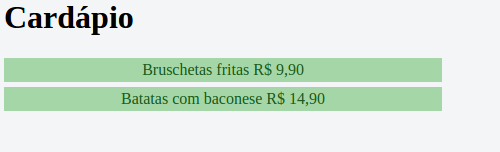 <!-- {.bullet.figure-step.bullet-no-anim} -->
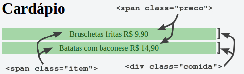 <!-- {.bullet.figure-step.bullet-no-anim} -->
:::
<!-- {figure:.no-margin} -->

- 1ª tentativa:
  ::: figure .figure-slides.no-margin
  <pre class="bullet figure-step bullet-no-anim no-margin"><code>.preco { float: right; }</code></pre>
  <pre class="bullet figure-step bullet-no-anim no-margin" style="right: 0;"><code>.preco { float: right; }
  .item  { float: left;  }</code></pre>
  :::
<!-- {ul:.no-margin.bullet} -->

::: figure .figure-slides.no-margin
 <!-- {.bullet.figure-step.bullet-no-anim} -->
 <!-- {.bullet.figure-step.bullet-no-anim} -->
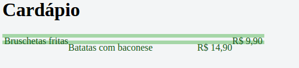 <!-- {.bullet.figure-step.bullet-no-anim} -->
 <!-- {.bullet.figure-step.bullet-no-anim} -->
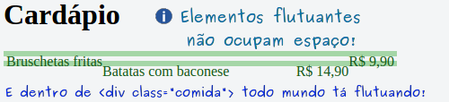 <!-- {.bullet.figure-step.bullet-no-anim} -->
:::
<!-- {figure:.no-margin.bullet} -->

- Corrigindo:
  ```css
  .preco { float: right; }
  .item  { float: left;  }
  .comida{ clear: both;  }
  ```
<!-- {ul:.no-margin.bullet} -->

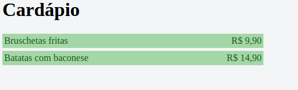
<!-- {p:.no-margin.bullet style="margin-top: 1.5em;"} -->

---
<!-- {"layout": "section-header", "hash": "desafios"} -->
# Desafios
## Atividade de hoje

- Atividade **em grupo**
- O professor projetará uma **pergunta/desafio**
- Cada grupo deverá **responder** no papel a pergunta/desafio
- O professor corrigirá e pontuará os grupos que acertarem
- O grupo que conseguir **maior pontuação será o vencedor**

<!-- {ul:.content} -->

---
<!-- {"layout": "centered"} -->
# Referências

1. Capítulos 9 (parcial), 10 e 11 (parcial) do livro
1. Mozilla Developer Network (MDN)
