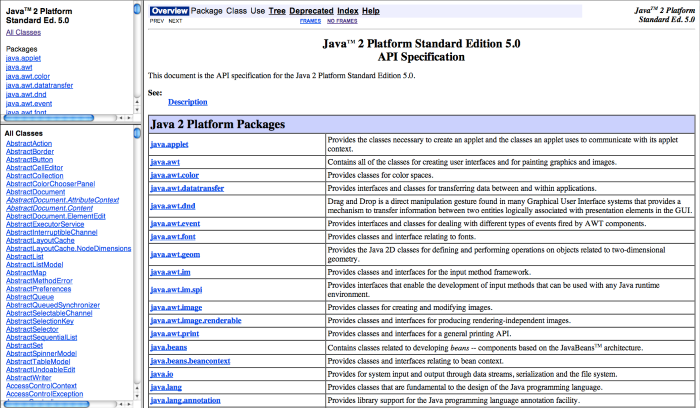

# HTML - Parte 5

---
# Roteiro

1. Conteúdo multimídia - Audio e Video
1. _Object_ e _Embed_
1. _Frames_ e _iframe_


---
# Conteúdo multimídia - Audio e Video

---
## Problema

 <!-- {.portrait} -->

- Já que temos um hipertexto (`html`), não podemos expandir o conceito para
  **hipermídia** e colocar áudio e vídeo em um documento?
  - Opção 1: colocar um link para que o usuário faça download do arquivo
  - Opção 2: usar um plugin que seja capaz de renderizar vídeo (eu escutei _flash_?)
  - Opção 3: usar os elementos de **`<audio>` e `<video>` do `html5`**

---
## Formatos de Vídeo

- Existem diversos **formatos de arquivo**:
  - Formatos (de recipiente):
    - AVI (.avi)
    - WebM (.webm)
    - MP4 (.mp4, .m4v)
    - Ogg (.ogg)
    - Flash Video (.flv)
    - ASF (.asf) <!-- {ul:.multi-column-list-2} -->
- Os formatos definem apenas **como é organizada a estrutura** de um arquivo de
  vídeo
  - Os formatos definem jeitos diferentes para se armazenar **_tracks_ de vídeo e
    de áudio**
    - Normalmente, 1 _track_ de vídeo e 2 de áudio (para som estéreo)
  - O conteúdo precisa ser codificado usando um **algoritmo CODEC**

*[CODEC]: Coder-Decoder*

---
## **CODEC**s de Vídeo e Áudio

*[CODEC]: Coder-Decoder**

- Alguns CODECs de vídeo são:
  1. H.264, ou MPEG-4 _part_ 10
  1. Theora
  1. VP8
- Para áudio, também há vários CODECs disponíveis. Alguns são:
  1. MP3 (.mp3), ou MPEG-3 _Audio Layer_
  1. AAC (.aac), ou _Advanced Audio Layer_
  1. Vorbis (.ogg, .mp4, .mkv)

---
## O elemento **video**

- Para exibir um vídeo, o `html5` propõe um novo elemento que funciona de forma
  similar ao elemento de imagem:
  ```html
  <video src="videos/fendadobiquini.mp4"></video>
  ```
- Resultado:

  <video src="../../videos/fendadobiquini.mp4" width="320" height="240"></video>

---
## Querida, onde está o controle?

- O atributo `controls` associa um conjunto de controles ao `<video />`
  ```html
  <video src="videos/fendadobiquini.mp4" controls></video>
  ```
- Resultado:

  <video src="../../videos/fendadobiquini.mp4" width="320" height="240" controls></video>

---
## Opções (atributos) de **video**

- `controls`, para um conjunto de controles
- `width="px"`, `height="px"`, para as dimensões (vídeo não é redimensionado)
- `autoplay`, para começar a executar o vídeo assim que a página carregar
- `preload="none|metadata|auto"`, para começar a baixar o vídeo assim que a
  página carregar
- `loop`
- `muted`
- `poster="http://..."`, `url` de uma imagem para ser mostrada antes do vídeo
  ser "tocado"

---
## Suporte dos navegadores por formato

- Na data de hoje (07/Abr/15), as versões mais recentes dos principais navegadores
  suportam em conjunto apenas o formato **H.264, ou MPEG-4 _part_ 10**
- Porém, versões um pouco menos recentes não suportam **um mesmo formato de vídeo** em conjunto
- Assim, usamos uma outra forma do elemento `<video>`:
  ```html
  <video width="320" height="240" controls>
    <source src="f.mp4"  type="video/mp4; codecs=avc1.42E01E,mp4a.40.2">
    <source src="f.webm" type="video/webm; codecs=vp8,vorbis">
    <source src="f.ogv"  type="video/ogg; codecs=theora,vorbis">
    Seu navegador não suporta o elemento <code>video</code>.
  </video>
  ```

---
## Suporte **hoje**

<div class="caniuse" data-feature="webm"></div>
<div class="caniuse" data-feature="mpeg4"></div>
<div class="caniuse" data-feature="ogv"></div>

---
## Em caso de navegadores antigos

- Você pode colocar uma mensagem
  ```html
  <video src="f.ogv">
    Seu navegador não suporta o elemento <code>video</code>.
  </video>
  ```
- Ou, melhor ainda, usar _flash_ como _fallback_
  ```html
  <video>
    <source src="f.ogv" type="video/ogg; codecs=theora,vorbis">
    <object data="f.swf" type="application/x-shockwave-flash">
    </object>
  </video>
  ```

---
## Audio

- `<audio>` funciona **exatamente** da mesma forma que `<video>`
- [Referência na MDN](https://developer.mozilla.org/en-US/docs/Web/HTML/Element/audio)

  

---
# _Object_ e _Embed_

---
## _Object_ e _Embed_

- Elementos `<object></object>` ou `<embed></embed>` são elementos de versões
  antigas do `html`
- Usados para referenciar objetos externos
  - Comuns para plugins: java _applets_, _flash_, _adobe pdf_ etc.
- Um dos objetivos do `html5` é não precisar mais de plugins &rarr;
  `<object>`, `<embed>`

---
## Exemplo de _object_

- Incluindo um arquivo _flash_:
  ```html
  <object data="a.swf" type="application/x-shockwave-flash">
  </object>

  <!-- com parametros -->
  <object data="a.swf" type="application/x-shockwave-flash">
    <param name="foo" value="bar">
  </object>
  ```

---
# _Frames_ e _iframe_

---
## _Frames_

- Eram uma forma para dividir a tela do navegador em várias páginas

  

---
## _Frames_ (cont.)

- Podem ainda funcionar, mas os navegadores estão removendo suporte a eles
- Sua utilidade era:
  1. Criar barras de rolagem "dentro" da página
  1. Permitir a reutilização de arquivos e o carregamento de apenas partes da
     tela
- Tornou-se obsoleto porque:
  1. A propriedade `overflow` do `CSS` possibilita a criação de barras de
     rolagem em qualquer elemento `block`
  1. A reutilização de arquivos pode ser feita no servidor por meio de
     geração dinâmica de `html` ou então com atualizações parciais da tela via
     AJAX

---
## Sintaxe dos _frames_ (for fun :)

```html
<html>
<head>
  <title>Java Platform SE 7 </title>
</head>
<frameset cols="20%,80%" title="Documentation frame">
<frameset rows="30%,70%" title="Left frames">
  <frame src="o.html" name="lista" title="All Packages">
  <frame src="a.html" name="pacote" title="...">
</frameset>
<frame src="s.html" name="classFrame" title="...">
<noframes>
  Navegador não suporta frames.
</noframes>
</frameset>
</html>
```

---
## _iframe_

- Apesar da iminente remoção dos _frames_, seu primo rico ainda prospera:
  `<iframe></iframe>`
- Em vez de definir uma divisão da página (`frameset`), apenas embutimos um
  segundo arquivo suportado pelo navegador dentro do primeiro

---
## Exemplo de _iframe_

```html
<!-- url do cefet campus II no gmaps -->
<iframe src="http://..." width="400" height="300"></iframe>
```

<iframe src="https://www.google.com/maps/embed?pb=!1m18!1m12!1m3!1d1875.3254574531459!2d-43.99946155000001!3d-19.939110099999997!2m3!1f0!2f0!3f0!3m2!1i1024!2i768!4f13.1!3m3!1m2!1s0xa6965ceade4c53%3A0x4980bb6236578f78!2sCEFET-MG+-+Campus+II!5e0!3m2!1spt-BR!2sbr!4v1414043575197" width="400" height="300" frameborder="0" style="border:0"></iframe>

---
## Exemplo loucão

<iframe width="50%" height="50%" src="http://fegemo.github.io/cefet-web/classes/html5/#23"></iframe>

---
## Usos legítimos e atuais do _iframe_

- Colocar um vídeo do youtube na página
- Colocar um mapa do google/bing maps
- Colocar um player de música do soundcloud
- Colocar código html/css/js do jsfiddle.com
- Colocar um _widget_ de previsão do tempo

---
## Usos não tão legais do _iframe_

- Colocar um sistema dentro do outro
  - Exemplo: [agências de viagem](http://www.alpsturismo.com.br/index.asp)
- Criar barras de rolagem

---
# Referências

1. Capítulo 5 do livro online diveintohtml5.info
1. Capítulo 12 do livro
1. Mozilla Developer Network (MDN)
