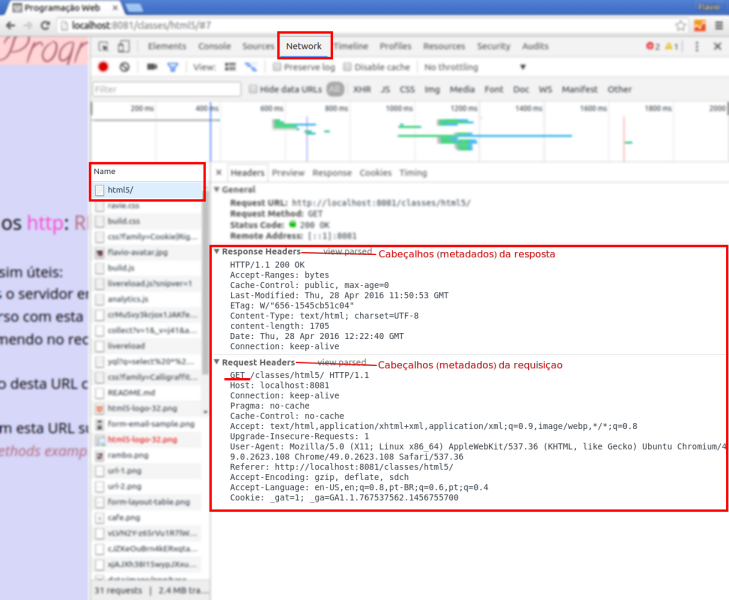
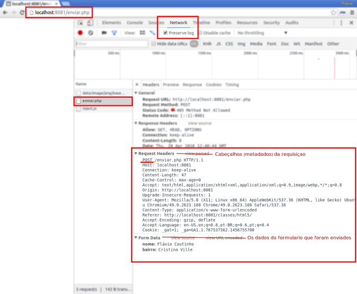
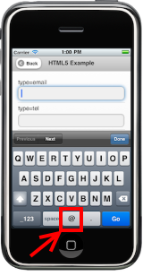
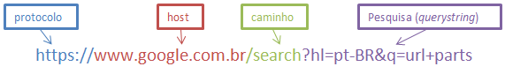
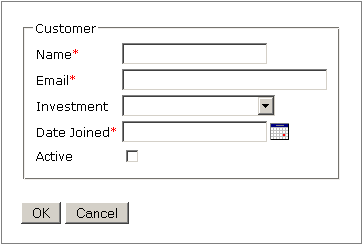

# HTML - Parte 5

## Formulários e Monstros

---
# Roteiro

1. Como os formulários funcionam
1. Elementos de **dados**
1. Elementos de **ação**
1. Métodos de envio: GET ou POST?
1. Validação
1. Exercício: O que é o que é?

---
# Como funcionam os formulários

---
## Motivação

- Até agora, vimos que o protocolo `http` usa um modelo de requisição e
  resposta, em que um navegador (cliente) solicita recursos (e.g., páginas,
  imagens) para um servidor e o servidor responde com o conteúdo do arquivo
  - Ou seja, aparentemente apenas o servidor pode enviar conteúdo
- Assim, como fazer se quisermos solicitar informação dos usuários?
  - Isso seria o **cliente enviando (_uploading_) informações para
    o servidor**...

---
## Métodos **http**

- Lembre-se que o `http` é a língua com que um navegador conversa com
  um servidor
- Sendo assim, o `http` possui vários métodos (também chamados de "verbos") e
  alguns deles **permitem o envio de informações por parte do cliente**
  - O método que vimos até agora se chama `GET`
  - Um exemplo de requisição `GET`:
    ```
    GET /en-US/docs/Web/CSS/animation HTTP/1.1
    Host: developer.mozilla.org
    ```
  - No próximo slide, veja uma requisição GET e resposta do navegador

---


---
## Outros Métodos **http**: [RFC2616](http://tools.ietf.org/html/rfc2616#section-9)

- Os mais comuns (~97% das requisições na web):
  - **`GET`**: "me vê o ~~documento~~ recurso com esta URL"
    - Servidor responde enviando o conteúdo do documento + metadados sobre ele
  - **`POST`**: "envie estes
    dados para a ~~página~~ recurso com esta URL"
    - Usado para enviar informações do cliente para o servidor

---
## Outros Métodos **http**: [RFC2616](http://tools.ietf.org/html/rfc2616#section-9) (cont.)

- Os mais _hipsters_, ainda assim úteis:
  - **`HEAD`**: igual ao `GET`, mas o servidor envia apenas os
    metadados
  - **`DELETE`**: "exclua o recurso com esta URL"
  - **`PATCH`**: "aplique um remendo no recurso desta URL com o que estou enviando"
  - **`PUT`**: "atualize o recurso desta URL com o que estou lhe enviando"
  - **`OPTIONS`**: "o recurso com esta URL suporta quais verbos?"
- Veja [_Where to find HTTP methods examples_](http://stackoverflow.com/questions/765565/where-to-find-http-methods-examples)
  no StackOverflow

---
## Exemplo de formulário

- Um formulário tipicamente usado para contato:
  ```html
  <form action="/enviar.php" method="POST">
    <label>Seu nome: <input name="nome"></label><br>
    <label>Seu bairro: <input name="bairro"></label>
    <input type="submit" value="Enviar">
  </form>
  ```
- Resultado:
  <form action="/enviar.php" method="POST">
    <label>Seu nome: <input name="nome"></label><br>
    <label>Seu bairro: <input name="bairro"></label>
    <input type="submit" value="Enviar">
  </form>
  
  - Clique em "Enviar" e perceba que **o navegador navegou para o
    endereço `/enviar.php`**


---


---
## Como montar um formulário

- Usa-se o elemento `<form></form>` com alguns `<input>`
- **Atributos** do `<form></form>`:
  - **`method="..."`** pode ter o valor `POST` ou `GET` e <u>altera o
    método `http`</u> a ser usado para fazer a requisição quando o formulário for
    submetido
  - **`action="..."`** aponta para qual ~~arquivo~~ recurso a
    requisição `POST` ou `GET`será feita
  - **`enctype="..."`** descreve como os dados do formulário são
    <u>codificados</u> para serem transmitidos em uma requisição `http`:
      1. `application/x-www-form-urlencoded`, **formato padrão**
      1. `multipart/form-data`, para envio (_upload_) de arquivos
      1. `text/plain`, desencorajado - apenas para _debug_

---
## Como funciona o exemplo

- Os dados de um formulário só são **enviados** quando o **botão de submissão
  é ativado**
  - `<input type="submit" value="Enviar">`, ou
  - `<button type="submit">Enviar</button>` (a partir do HTML5)
    - `<button>Enviar</button>` também dá, porque `type="submit"` é o padrão

---
## Como funciona o exemplo

- Quando ocorre a submissão, o navegador realiza uma requisição `http` usando
  um método (atributo `method` do `form`) para um endereço
  (atributo `action` do `form`):
  ```
  POST /enviar.php HTTP/1.1
  Host: fegemo.github.io

  nome=Flavio&bairro=Cristina%20Ville
  ```
  - Repare que os dados são enviados como uma _string_ de pares de nome
    e valor concatenados com o sinal &amp;
  - **!!** Os nomes dos campos ("nome" e "bairro") advêm do atributo
    `name` dos `input`s (e não do atributo `id`)

---
## No servidor, como receber os dados?

- Cenas dos próximos capítulos... mas:
  - O servidor web pode ser configurado para "escutar" por requisições `POST`,
    além de apenas `GET`
  - Quando chega uma requisição `POST`, ela vêm com um **_payload_ de dados**:
    - Uma requisição `POST` tem conteúdo (o _payload_), além dos metadados
  - Ao tratar uma requisição `POST` no servidor, você pode usar o _payload_
    para o que quiser, _e.g._:
    - Cadastrar um usuário no banco de dados
    - Enviar um email
    - Alterar a descrição de um produto no banco de dados etc.

---
# Elementos de **dados**

---
## Caixa de texto

- _Markup_:
  ```html
  <input name="palavra" type="text" placeholder="Digite...">
  <input name="palavra">
  <input>
  ```
  - `type="text"` é o valor padrão para o `input`
  - `placeholder="um texto..."` define um texto de ajuda
- Resultado:

  <input type="text" placeholder="Digite...">

---
## Rótulos

- Tipicamente atribuímos rótulos (`<label></label>`) aos campos (`input`)
  - Podemos clicar nos rótulos e o foco será movido para dentro do `input`
    a ele associado
  - Há duas formas de associação
    ```html
    <label for="cidade">Cidade: </label><input name="cidade">
    <!-- ...ou... -->
    <label>Cidade: <input name="cidade"></label>
    ```
    - Resultado:
      <div><label>Cidade: <input name="cidade"></label></div>

---
## Caixa de texto para **e-mail** 

- 
  Idêntico à caixa de texto, porém o navegador espera um e-mail válido
- _Markup_:
  ```html
  <label>Remetente:
    <input name="remetente" type="email">
  </label>
  ```
  - Em _smartphones_, os navegadores mudam o _layout_ do teclado colocando
    "@" em posições mais fáceis, por exemplo
- Resultado:
  <div><label>Remetente:
    <input name="remetente" type="email">
  </label></div>

---
## Outros semelhantes à caixa de texto 

- Pesquisa
  `<input type="search">`: <input type="search">
- URL
  `<input type="url">`: <input type="url">
- Telefone
  `<input type="tel">`: <input type="tel">

---
## Checkbox

- _Markup_:
  ```html
  <label>
    <input name="emails" type="checkbox" value="sim">Inscrever?
  </label>
  ```
  - **!!** Se não colocarmos um `<label></label>`, o usuário precisará
    clicar exatamente na caixinha
- Resultado:
  <div><label>
    <input type="checkbox">Inscrever?
  </label></div>
- Atributos:
  - `checked`, para deixar marcado
    ```html
    <input name="..." type="checkbox" checked>
    ```

---
## Radio (escolha dentro de um grupo)

- _Markup_:
  ```html
  <label>
    <input name="cor" type="radio" value="azul">Azul
  </label>
  <label>
    <input name="cor" type="radio" value="verde">Verde
  </label>
  ```
- Resultado:
  <div><label>
    <input name="cor" type="radio" value="azul">Azul
  </label>
  <label>
    <input name="cor" type="radio" value="verde">Verde
  </label></div>
- Repare que apenas uma cor pode ser escolhida - porque os dois `input` têm o
  mesmo `name`

---
## Select (lista de opções)

- _Markup_:
  ```html
  <label for="sabor">Sabor da pizza:</label>
  <select name="sabor" id="sabor">
    <option value="marg">Marguerita</option>
    <option value="muzza" selected>Muzzarela</option>
  </select>
  ```
- Resultado:
  <label for="sabor">Sabor da pizza:</label> <select name="sabor" id="sabor">
    <option value="marg">Marguerita</option>
    <option value="muzza" selected>Muzzarela</option>
  </select>
- Atributos
  - `selected`, para o `option`, para deixar selecionado
  - `multiple`, para o `select`, para permitir mais de um `option`
---
## Data e Hora 

- _Markup_
  ```html
  <input type="date"> <!-- exemplo -->
  <input type="datetime">
  <input type="datetime-local">
  <input type="month">
  <input type="week">
  <input type="time">
  ```
- Resultado:

  <input type="date">

---
## Números 

- _Markup_:
  ```html
  <input type="number" step="0.5"><br>
  <input type="range" min="0" max="100" step="1">
  ```
- Resultado:

  <input type="number" step="0.5" size="4"><br>
  <input type="range" min="0" max="100" step="1">

---
## Cores 

- _Markup_:
  ```html
  Cor: <input type="color">
  ```
- Resultado:

  Cor: <input type="color">

---
## Outros elementos de dados

| Tipo               	| Markup                  	| Exemplo                 	|
|--------------------	|-------------------------	|-------------------------	|
| Seleção de arquivo 	| `<input type="file">`     | <input type="file">     	|
| Campo de senha     	| `<input type="password">`	| <input type="password"> 	|
| Texto oculto       	| `<input type="hidden">`	  |                          	|
| Texto multi-linha   | `<textarea></textarea>`   | <textarea></textarea>     |

---
# Elementos de **ação**


---
## Botões de submissão

- Quando acionados, enviam (`submit`) os dados para o endereço
  especificado pelo atributo `action` do formulário
- Existem duas formas para criar a marcação
  - `input`
    ```html
    <input type="submit" value="Enviar">
    ```
  - `button`
    ```html
    <button type="submit">Enviar</button><!-- HTML5 -->
    <button>Enviar</button><!-- HTML5 -->
    ```

---
## Outros botões

- Botões para voltar os campos do formulário a seus valores iniciais
  ```html
  <input type="reset" value="Limpar">
  <button type="reset">Limpar</button><!-- HTML5 -->
  ```
- Botões que não fazem nada, mas podem ter algum comportamento associado
  (via javascript)

  ```html
  <input type="button" value="Ver detalhes">
  <button type="button">Ver detalhes</button><!-- HTML5 -->
  ```

---
## Outros botões (cont.)

- Botão de imagem
  - Serve para submeter e para enviar as coordenadas da imagem onde o usuário
    clicou
    ```html
    <input type="image" src="images/cafe.png">
    ```
  - Resultado:
    <div><input type="image" src="../../images/cafe.png"></div>
- **!!** Este é um elemento HTML muito antigo e estranho - quase não vemos
  isto atualmente


---
# Validação

---
## Validação automática

- De acordo com o tipo do campo de dados, o navegador se encarrega de validar
  se o conteúdo está de acordo com o domínio **antes do formulário ser
  submetido**
- Por exemplo, digite um e-mail inválido e tente enviar o formulário abaixo:
  - <form action="javascript:void(0);">
      <label>Digite seu e-mail: <input type="email"></label> <button>Enviar</button>
    </form>
- Para previnir essa validação, basta acrescentar um parâmetro ao formulário:
  ```html
  <form novalidate>
    ...
  </form>
  ```

---
## Atributos para validação

- Campo obrigatório: atributo `required`
  ```
  <input type="text" required> <button>Enviar</button>
  ```
  <form action="javascript:void(0);">
    <input type="text" required> <button>Enviar</button>
  </form>
- Expressão regular do domínio: atributo `pattern`
  ```html
  <!-- 3 a 5 dígitos -->
  <input type="text" pattern="[0-9]{3,5}">
  ```
  <form action="javascript:void(0);">
    <input type="text" pattern="[0-9]{3,5}"> <button>Enviar</button>
  </form>

---
## Outros atributos

- **`placeholder="..."`**, para mostrar um texto explicativo quando estiver vazio
- **`maxlength="..."`**, para definir o limite de caracteres
- **`autofocus`**, para receber o foco quando a página for carregada
- **`disabled`**, para proibir edições

---
# **GET** ou **POST**?
---
## Método de um formulário

- É possível usar `GET` para enviar um formulário
- Contudo, em vez dos dados do formulário serem enviados no _payload_
  da requisição, eles são colocados na própria URL, em uma estrutura
  chamada _query string_:
  - Partes de uma URL
    
    
    - Repare que a _query string_ é a parte que começa com o símbolo de `?`
      (interrogação)
    - Ela é formada por um conjunto de `nome=valor`, separados pelo símbolo
      &amp; ("e" comercial)

---
## Formulário usando **GET**

- _Markup_ usando `GET`:
  ```html
  <form action="/enviar.php" method="GET">
    <label>Seu nome: <input name="nome"></label><br>
    <label>Seu bairro: <input name="bairro"></label>
    <button>"Enviar"</button>
  </form>
  ```
- Resultado:
  <form action="/enviar.php" method="GET">
    <label>Seu nome: <input name="nome"></label><br>
    <label>Seu bairro: <input name="bairro"></label>
    <button>Enviar</button>
  </form>
  
  - Envie o formulário e repare que, em vez de ir para a página `/enviar.php`,
    fomos para **/enviar.php?nome=XXX&bairro=YYY**

---
## Quando usar **GET** ou **POST**?

| Característica             	| GET                       	| POST                      	|
|----------------------------	|---------------------------	|---------------------------	|
| **Visibilidade**           	| Dados visíveis ao usuário 	| Dados "ocultos"           	|
| **Segurança**               | Menos seguro                | Mais seguro                 |
| Restrição de tamanho       	| Tamanho da URL (~2048)    	| Sem restrição             	|
| Restrição de tipo de dados 	| Apenas ASCII              	| Sem restrição             	|
| Botão voltar               	| Ok                        	| Dados serão ressubmetidos 	|
| Ad. aos favoritos          	| Ok                        	| Não é possível            	|
| Histórico do navegador     	| Parâmetros são salvos     	| Parâmetros não são salvos 	|

---
# Exercício: O que é o que é?

- O que é terrível, verde, come pedras e mora debaixo da terra??

---
## Exercício

- <div style="float: right; width: 120px; height: 160px; background-image: url('../../images/terrivel-eating-big.png')"></div>
  Conheça o <span style="font-family: 'Ravie', serif; text-shadow: 2px 2px rgb(102, 102, 102)">Incrível <span style="color: #00FF21">Monstro Verde</style> que Come Pedras e Mora Debaixo da Terra</span>
- Objetivo:
  1. Dar comida para o terrível monstro verde (etc. etc.)
  1. Entender o funcionamento de um formulário web
  1. Entender a diferença entre os métodos http GET e POST

---
## Enunciado

O terrível monstro verde (etc. etc.) está com fome e você deve dar comida para
ele. Ele acaba de ir para a superfície e para que ele não comece a comer
pessoas, você deve dar a ele seu segundo alimento preferido: pedras.

Para isso, você deve ir até onde ele está e enviar algumas pedras para ele.
Atualmente, ele está neste endereço: http://terrivel.herokuapp.com/monster.
Para dar comida a ele, você deve encomendá-las a partir de um formulário html.

---
## Enunciado (cont.)

- Para fazer sua encomenda, você deve **criar uma página com um formulário web**
  especificando o seu pedido. Ele deve conter as seguintes informações:
  - `num_pedras`, [0, &infin;[, &isin; N (quantidade de pedras)
  - `tam_pedras`, [1, 7], sendo 3 o padrão (tamanho das pedras)
    - são permitidos valores decimais a cada 0,5 (e.g.: 1, 1,5, 2)
  - `nome`, para dar um apelido carinhoso ao seu monstro
    - deve conter apenas letras, maiúsculas ou minúsculas

---
## Enunciado (cont.)

- Você também deve fornecer informações adicionais, como:
  - `corCeu1`, a cor do céu
  - `corCeu2`, outra cor para o céu (fazendo um degradê)
  - `tipo_pedras`, {`'marroada'`, `'ametista'`, `'topazio'`, `'espinela'`}
  - `tipo_pedras_sortidas`, {`não`, `sim`}

---
## Enunciado (cont.)

- Você deve usar os **elementos de formulários que mais se aproximem** do
  tipo de dados que você precisa representar, _e.g._,
  - `<input type="cor">` para as cores do céu
- O formulário deve ter **validação de acordo com o domínio de cada campo**
- O _layout_ do formulário é livre, mas pode ser semelhante ao da figura
  do próximo slide

---
## _Layout_ dos elementos do formulário



- Uma opção é usar
  - `display: table;`
  - `display: table-row;`
  - `display: table-cell;`

---
## Entrega

1. Você deve criar um **repositório no GitHub com o nome `web-terrivel`**
  contendo os arquivos (.html, .css, .js) usados para criar seu formulário
1. Também deve estar **na raiz o seu repositório** 3 arquivos de imagem:
  1. `formulario.png`, tela do seu formulário
  1. `terrivel-get.png`, uma tela mostrando um envio do formulário via GET
  1. `terrivel-post.png`, uma tela mostrando um envio do formulário via POST
1. Submeter o endereço do repositório no **Moodle**

---
# Referências

1. Capítulo _"A Form of Madness"_ do livro online diveintohtml5.info
1. Capítulo 14 do livro
1. Mozilla Developer Network (MDN)
