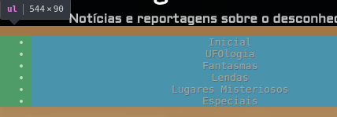

<!-- {"layout": "title"} -->
# **HTML** parte 5
## Divitite e tags semânticas, especificidade,<br>pseudo-coisas e Assombrações :ghost:

---
<!-- {"layout": "centered-horizontal"} -->
# Na última aula <small>(1/3)</small>

- **Propriedade `display`** e valores `inline`, `block`, `inline-block` e `none`
  <iframe width="510" height="320" src="https://jsfiddle.net/fegemo/2gfkyrrh/3/embedded/result,html,css/" allowfullscreen="allowfullscreen" frameborder="0" class="push-right bordered rounded"></iframe>
- Também há outros valores:
  - `table`, `table-row`, `table-cell` etc.
  - `flex` e `inline-flex`
  - `grid` e `inline-grid`

---
# Na última aula <small>(2/3)</small>
- Propriedades do **Flexbox**: <!-- {ul^0:.full-width.no-margin} -->
  - No elemento pai:  <!-- {ul^0:.layout-split-2} -->
    - `display: flex` <!-- {li^1:style="flex: 1"} -->
    - `flex-direction: row | column`
    - `justify-content: flex-start | flex-end | center | space-around | space-between`
  - Nos elementos filhos: <!-- {li^0:style="flex: 1"} -->
    - `align-self: flex-start | flex-end | center`
    - `order: numero`

<iframe width="100%" height="300" src="https://jsfiddle.net/fegemo/f5odrgk9/embedded/result,html,css/" allowfullscreen="allowfullscreen" allowpaymentrequest frameborder="0"></iframe>

---
# Na última aula <small>(3/3)</small>

- Propriedades do **grid**: <!-- {ul^0:.full-width.no-margin} -->
  - No elemento pai: <!-- {ul^0:.layout-split-2} -->
    - `display: grid` <!-- {li^1:style="flex: 1"} -->
    - `grid-template-rows`
    - `grid-template-columns`
  - Nos elementos filhos: <!-- {li^0:style="flex: 1"} -->
    - `grid-row: inicio / fim`
    - `grid-column: inicio / fim`

<iframe width="100%" height="300" src="https://jsfiddle.net/fegemo/sqtdb95x/embedded/result,html,css/" allowfullscreen="allowfullscreen" allowpaymentrequest frameborder="0"></iframe>

---
<!-- {"layout": "centered"} -->
# Hoje veremos...

1. [Divitite - doença e cura com **_tags_ semânticas**](#divitite-e-tags-semanticas)
1. [Especificidade de seletores](#especificidade-de-seletores)
1. [_Pseudo-classes_ e _pseudo-elements_](#pseudo-classes-e-pseudo-elements)
1. [Assombrações](#assombracoes) :ghost:

---
<!-- {"layout": "section-header", "hash": "divitite-e-tags-semanticas"} -->
# _Tags_ Semânticas
## Curando a divitite

Motivação
  ~ SEO e Acessibilidade na Web

Doença
  ~ a **divitite**

Cura
  ~ **_tags_ semânticas**
<!-- {dl:.content} -->

---
# SEO e Acessibilidade na Web

SEO
  ~ Sigla para _Search Engine Optimization_, ou Otimização para Motores de Busca
  ~ É um conjunto de técnicas para **aumentar a possibilidade de um site
    aparecer no topo** dos resultados do **Google** (e outros motores de busca)

Acessibilidade
  ~ Possibilidade de uma pessoa consumir conteúdo das páginas web independente
    de condições físicas
  ~ Pessoas cegas usam um programa especial (o **"leitor de tela"**) que **lê o
    código HTML em voz alta** para elas

*[SEO]: Search Engine Optimization*

---
<!-- {"backdrop": "divitite"} -->

---
## Divitite

- Sintomas
  - Um acúmulo grande de elementos `div` e `span` aninhados
- Muitas páginas Web usam `div`/`span` da seguinte forma:
  ```html
  <div id="header">...</div>
  <div id="footer">...</div>
  <div class="article">...</div>
  <span class="time">...</div>
  <div id="navigation">...</div>
  ```


---
## A cura da Divitite: **_tags_ semânticas**

- O dr. HTML5  <!-- {.emoji} -->
  propôs elementos idênticos às `divs`/`spans`, mas que **possuem
  sentido para o navegador**. Por exemplo:
  ```html
  <header></header>   <!-- em vez de <div id="header"></div> -->
  <footer></footer>   <!-- em vez de <div id="footer"></div> -->
  <article></article> <!-- em vez de <div id="article"></div> -->
  <time></time>       <!-- em vez de <span id="time"></span> -->
  <nav></nav>         <!-- em vez de <div id="navigation"></div> -->
  ```

---
<!-- {"hash": "elementos-semanticos"} -->
## Elementos semânticos <small>(1/3)</small>

- [`<main></main>`](http://www.w3.org/wiki/HTML/Elements/main) `(block)`
  - Conteúdo principal da página
- [`<header></header>`](http://www.w3.org/wiki/HTML/Elements/header) `(block)`
  - Cabeçalho da página ou de seções (`section`) ou artigos (`article`)
- [`<footer></footer>`](http://www.w3.org/wiki/HTML/Elements/footer) `(block)`
  - Análogo ao `header`, porém recomendado para que contenha informação típica
    de um rodapé de página
- [`<article></article>`](http://www.w3.org/wiki/HTML/Elements/article)
  `(block)`
  - Um componente "completo" (ou auto-contido) da página
    - Em um blog, seria um _post_
    - Em uma loja, seria um produto

---
## Elementos semânticos <small>(2/3)</small>

- [`<section></section>`](http://www.w3.org/wiki/HTML/Elements/sectionhtml)
  `(block)`
  - Uma seção lógica da página, tipicamente contendo um título
- [`<nav></nav>`](http://www.w3.org/wiki/HTML/Elements/nav) `(block)`
  - Uma seção da página que contenha _links_ de navegação
  - Exemplos:
    - O menu principal da página
    - Tabela de conteúdo (TOC) com
      _links_ internos

*[TOC]: Table of Contents*

---
## Elementos semânticos <small>(3/3)</small>

- [`<aside></aside>`](http://www.w3.org/wiki/HTML/Elements/aside) `(block)`
  - Uma seção de conteúdo periférico na página
  - Exemplos:
    - Barras laterais
    - _Widgets_ periféricos
    - Conteúdo à parte do principal
- [`<time></time>`](http://www.w3.org/wiki/HTML/Elements/time) `(inline)`
  - Representa uma data e/ou horário
- [`<mark></mark>`](http://www.w3.org/wiki/HTML/Elements/mark) `(inline)`
  - Representa uma marcação no texto
    (tipo <mark style="background-color: yellow">caneta marcadora</mark>)

---
## Exemplo de uso - Elementos semânticos

  <iframe width="98%" height="600" src="//jsfiddle.net/fegemo/oy82x4tu/embedded/result,html,css/" allowfullscreen="allowfullscreen" frameborder="0" class="rounded bordered block centered"></iframe>

---
## Elementos semânticos **pré-HTML5**

[`<address></address>`](http://www.w3.org/wiki/HTML/Elements/address) <!-- {dl:.width-30.full-width} -->
~ para endereços

[`<abbr title=""></abbr>`](http://www.w3.org/wiki/HTML/Elements/abbr)
~ para abreviações

[`<blockquote></blockquote>`](http://www.w3.org/wiki/HTML/Elements/blockquote)
~ para citação em bloco

[`<q></q>`](http://www.w3.org/wiki/HTML/Elements/q)
~ para citação em linha

[`<cite></cite>`](http://www.w3.org/wiki/HTML/Elements/cite)
~ para referência

[`<code></code>`](http://www.w3.org/wiki/HTML/Elements/code)
~ para código fonte

[`<kbd></kbd>`](http://www.w3.org/wiki/HTML/Elements/kbd)
~ para teclas do teclado

[`<figure></figure>`](http://www.w3.org/wiki/HTML/Elements/figure)
~ imagem, tabela ou gráfico

[`<figcaption></figcaption>`](http://www.w3.org/wiki/HTML/Elements/figcaption)
~ legenda de imagem, tabela ou gráfico

---
<!-- {"layout": "section-header", "hash": "especificidade-de-seletores"} -->
# Especificidade de seletores
## Aplicando regras

- Mais de uma regra definindo a mesma propriedade
- Regras de especificidade
- CoutoSan Especificator(tm)
<!-- {ul:.content} -->

---
## Motivação

- Dadas <u>mais de uma regra CSS definindo a mesma propriedade</u> para
  um elemento, qual prevalece?
  - Como determinar qual a cor do elemento?
    ```html
    <style>
      h4 { color: black; }
      h4 { color: white; }      
    </style>

    <h4>Arthur Dent</h4> <!-- qual a cor de Arthur Dent? -->
    ```

---
## Mais Difícil...

```html
<style>
  .destaque { color: red; }
  #titulo   { color: green; }
  h4        { color: blue; }
</style>

<h4 id="titulo" class="destaque">Ford Prefect</h4>
```
- E agora??
- Os **3 seletores <u>se aplicam</u>** ao elemento! <!-- {ul:.bulleted} -->
  - Mas com **prioridades diferentes**
  - (↑) mais específico o seletor da regra → (↑) maior sua prioridade
    - Neste caso, <h4 style="display: inline; color: green;">Ford Prefect (`green`)</h4>

---
## Regras gerais de especificidade

Regra 1 <!-- {dl:.bulleted} -->
  ~ Cada seletor tem uma **pontuação de especificidade**

Regra 2
  ~ Se dois seletores selecionam o mesmo elemento, mas com pontuações
    diferentes, ganha aquele com pontuação maior

Regra 3
  ~ Se dois seletores selecionam o mesmo elemento e têm a mesma
    pontuação, ganha o que foi declarado por último

Regra 4
  ~ Estilo Inline &gt;&gt; Arquivo Externo e Incorporado

Regra 5
  ~ ID &gt;&gt; classe e atributo &gt;&gt; tag

---
## Cálculo da **pontuação de especificidade**

- [Especificação na W3C sobre _CSS3 Selectors_](http://www.w3.org/TR/css3-selectors/#specificity)
- Algoritmo: <!-- {ul:style="margin-bottom: 0"} -->

**A** <!-- {dl:.width-10.full-width} -->
~ Contar o número de IDs no seletor

**B**
~ Contar o número de classes, atributos e pseudo-classes no seletor

**C**
~ Contar o número de _tags_ e pseudo-elementos no seletor

.
~ Concatenar os três números (**ABC**)

- ```css
  #posts-recentes .post.novidade > h2 {
    /* id: 1, classes: 2, tag: 1 */
    /* pontuação: 121 */
  }
  ```
  <!-- {ul:.no-bullets.no-padding.no-margin.full-width.compact-code} -->

---
<!-- {"layout": "2-column-content"} -->
## Exemplos e Exercício

1. Exemplos:
   ```css
   /* seletor { propriedades }  abc */
   li { }                    /* 001 */
   .destaque { }             /* 010 */
   li.destaque { }           /* 011 */

   #rodape { }               /* 100 */
   #rodape #logo { }         /* 200 */

   a[href^="www"] { }        /* 011 */
   tr:hover { }              /* 011 */
   .curiosidade::before { }  /* 011 */

   ul li { }                 /* 002 */
   ul > li { }               /* 002 */
   h1, h2 { }           /* 001, 001 */
   ```
   <!-- {ol:.no-padding.no-bullets.no-margin.compact-code} -->

- <!-- {ul:.no-bullets.no-margin.no-padding.compact-code} -->
  Qual é a cor do texto?
  ```html
  <style>
    #a .b .c { color: red; }
    .d .e .f { color: green; }
    .g .h #i { color: blue; }
  </style>
  <p id="a" class="d g">
      <strong class="b e h">
          <em id="i" class="c f">Texto</em>
      </strong>
  </p>
  ```
  - [Resposta](https://jsfiddle.net/fegemo/bw1xt1az/) no JSFiddle


---
<!--
{
  "layout": "centered-horizontal",
  "hash": "specificator-tabajara",
  "scripts": ["../../scripts/classes/spec-tabajara.min.js"],
  "styles": ["../../styles/classes/spec-tabajara.min.css"]
}
-->

## **CoutoSan™** Specificity  <!-- {.emoji.portrait.bordered style="margin-left: 0.5em"} --> <!-- {.emoji.portrait.bordered} -->

<article id="spec-tabajara">
  <div>
    <input type="text" id="spec-tabajara-input" placeholder="Digite um seletor aqui...">
  </div>
  <div>
    <button id="spec-tabajara-button">Calcular</button>
  </div>
  <div>
    <div class="spec-class">
      <div id="spec-tabajara-output-a" class="spec-output">0</div>
      <div>(a) IDs</div>
    </div>
    <div class="spec-class">
      <div id="spec-tabajara-output-b" class="spec-output">0</div>
      <div>(b) Classes, atributos e pseudo-classes</div>
    </div>
    <div class="spec-class">
      <div id="spec-tabajara-output-c" class="spec-output">0</div>
      <div>(c) Elementos, pseudo-elementos</div>
    </div>
  </div>
</article>

---
<!-- {"layout": "section-header", "hash": "pseudo-classes-e-pseudo-elements"} -->
# _Pseudo-classes_ e _Pseudo-elements_
## Mais alguns seletores

_Pseudo-class_
  ~ permitem **selecionar** elementos em **diferentes situações**

_Pseudo-element_
  ~ permitem **estilizar** certas **partes de elementos**
<!-- {dl:.content} -->

---
<!-- {"classes": "compact-code-more"} -->
## _Pseudo-**classes**_

- Indicam um estado (situação) de um elemento. Exemplos:
  ```css
  .link-para-comprar:hover { /* :hover (mouse em cima), mas tbm há :active, :visited... */
    text-decoration: underline;
  }
  ```
- Algumas das _pseudo-classes_ mais comuns:
  - `:focus` contém o foco
  - `:hover` mouse em cima
  - `:first-child` é o último filho
  - `:last-child` é o último filho
  - `:not()` exceto que
  - `:nth-child()` é o n-ésimo filho
  - `:nth-of-type()` n-ésimo filho de tag
  - `:checked` caixa marcada <!-- {ul:.multi-column-list-2} -->
- [Lista com todas](https://developer.mozilla.org/en-US/docs/Web/CSS/Pseudo-classes)
  na MDN

---
## Exemplos _com pseudo-**classes**_

- Estilização de links: <!-- {ul:.compact-code-more.horizontal-list.no-bullets.no-padding.full-width style="justify-content: space-around"} -->
  ```css
  a:link {
    text-decoration: none;
    color: cornflowerblue;
  }
  a:visited {
    color: gray;
  }
  a:hover {
    text-decoration: underline;
  } 
  a:active {
    color: darkred;
  }
  ```
  ::: result
  <style>
  .a:link {
    text-decoration: none;
    color: cornflowerblue;
  }
  .a:visited {
    color: gray;
  }
  .a:hover {
    text-decoration: underline;
  } 
  .a:active {
    color: darkred;
  }
  </style>
  [Site do Pudim](http://www.pudim.com.br) <!-- {.a} -->
  :::
- Realçando o foco:
  ```css
  *:focus {
    outline: 3px dashed yellow;
  }
  ```
  ::: result .b
  <style>
  .b *:focus {
    outline: 3px solid yellow;
  }
  .b input {
    width: 8em;
  }
  .b label, .b input {
    font-size: 0.75em;
  }
  .b label {
    display: block;
  }
  </style>
  <label>Digite seu nome: <input></label>
  <label>Digite seu email <input type="email"></label>
  <label>Digite a senha <input type="password"></label>
  <label>Confirme a senha <input type="password"></label> 
  :::
- Pegando 1º de tipo:
  ```css
  article:nth-of-type(1) {
    width: 100%;
  }
  article:not(:nth-of-type(1)) {
    width: 50%;
  }
  ```
  ::: result .c max-width: 320px; display: flex; flex-wrap: wrap;
  <style>
  .c article {
    font-size: 0.5em;
    border: 1px solid gray;
    margin-bottom: 0.75em;
    box-shadow: 3px 3px 8px #0003;
  }
  .c h3 {
    font-size: 1.25em;
  }
  .c p {
    font-size: 1em;
    line-height: 1;
    text-align: left;
  }
  .c article:nth-of-type(1) {
    width: 100%;
  }
  .c article:not(:nth-of-type(1)) {
    width: 50%;
  }  
  .c article:not(:nth-of-type(1)) p {
    height: 1em;
    overflow: hidden;
    text-overflow: ellipsis;
    line-height: 1;
    white-space: nowrap;
  }
  </style>
  <article><h3>Primeira manchete</h3><p>Esta é a primeira nóticia e ela fala sobre os animais que estão enjaulados no zoológico da asa leste da cidade de Itapecerica da Serra.</p></article>
  <article><h3>Segunda manchete</h3><p>Esta é a segunda nóticia e ela fala sobre os animais que estão enjaulados no zoológico da asa leste da cidade de Itapecerica da Serra.</p></article>
  <article><h3>Terceira</h3><p>Esta é a terceira nóticia e ela fala sobre os animais que estão enjaulados no zoológico da asa leste da cidade de Itapecerica da Serra.</p></article>
  :::


---
## _Pseudo-**elements**_ <!-- {.alternate-color} -->

- Indicam partes de um elemento. Exemplos:
  ```css
  p::selection {
    color: white;
    background-color: hotpink;
  }
  ```
  <style>
    .different-selection::selection { background-color: hotpink; color: white; }
  </style>
  `<p>`<span class="different-selection">Me selecione, bem aqui &larr;</span>`</p>`
- Pode-se usar tanto `::pseudo-element` quanto `:pseudo-element`

---
<!-- {"layout": "2-column-content"} -->
## _Pseudo-**elements**_ comuns <!-- {.alternate-color} -->

- Os _pseudo-elements_ mais comuns:
  - `::selection` - seleção de texto
  - `::placeholder` - descrição de `input`
  - **`::before` - conteúdo "pré-conteúdo"**
  - **`::after` - conteúdo "pós-conteúdo"**
  - `::first-letter` - primeira letra
  - `::first-line` - primeira linha
- [Lista com todos](https://developer.mozilla.org/en-US/docs/Web/CSS/Pseudo-elements)
  na MDN

1. Exemplo de `::first-letter`: <!-- {ol:.no-bullets.no-padding.compact-code} -->
   ```css
   p:first-of-type::first-letter {
      float: left;
      font-size: 5em;
      line-height: 0.6em;
      padding-top: 0.1em;
   }
   ```
   ::: result .d
   <style>
    .d p {
      text-align: left;
    }
    .d p:first-of-type::first-letter {
      float: left;
      font-size: 5.5em;
      line-height: 0.6em;
      padding-top: 0.1em;
    }
   </style>
   Esta é a primeira nóticia e ela fala sobre os animais que estão enjaulados no zoológico da asa leste da cidade de Itapecerica da Serra.
   :::

---
<!-- {"hash": "exemplo-de-before"} -->
## Exemplo de **::before**

- Por exemplo, como colocar um texto de "Novidade!" antes de cada notícia?
  ```css
  .novidade::before {
    content: "Novidade!";
    display: inline-block;
    background: orange; /* ... */
  }
  ```
  - Resultado:
    <iframe width="100%" height="120" src="//jsfiddle.net/fegemo/76wdcLao/embedded/html,result,css/" allowfullscreen="allowfullscreen" frameborder="0" class="bordered rounded"></iframe>

---
<!-- {"layout": "section-header", "hash": "assombracoes"} -->
# Assombrações 👻
## Faça o **Blog Assombrado**

- Atividade de hoje
- Transformando uma lista em **um menu**
<!-- {ul:.content} -->

---
<!-- {"backdrop": "assombrado"} -->

---
# Atividade de Hoje

- Completar a página inicial do "Blog Assombrado"
- [Baixe os arquivos][assombrado-seminal] contendo o HTML e faça os exercícios
  - O resultado final tem que ser semelhante ao [desta imagem](../../images/assombrado.jpg)
  - Leia as instruções detalhadas no arquivo `README.md`. No geral:
    1. Converter as `<div>`s e `<span>`s em _tags_ semânticas
       - Pode haver algumas que não possuem _tags_ semânticas
    1. Estilizar o menu principal
    1. Colocar "Novidade!" antes dos 2 posts mais recentes

[assombrado-seminal]: https://github.com/fegemo/cefet-front-end-assombrado/archive/master.zip

---
<!-- {"hash": "transformando-lista-em-menu"} -->
## Transformando uma lista em **um menu**

- É muito comum que um site tenha um "menu principal" que é uma **lista de itens
  na horizontal** <!-- {.underline.upon-activation} -->. #comofaz?
  1.  <!-- {.push-right} --> **Tirar
     o `padding-left`** da `<ul>` ➡️
  1. Transformar **`<li>`s em `inline-block`** ou **usar flexbox para a `<ul>`** <!-- {strong:.alternate-color} --> 🌟
  1. Tirar "bolinha" dos itens:
     <!-- {li:.compact-code} -->
     ```css
     #menu-principal {
       list-style-type: none;
     }
     ```
  1. Colocar um espacinho pequeno entre os `<li>`
  1. Estilizar `<li>` ou `<a>` no estado de `:hover` indicando ser "clicável"
  1. Preencher (`padding`) os links em `<li>` para aumentar área "clicável"

---
<!-- {"layout": "centered"} -->
# Referências

- Capítulo 12 do livro
- [Capítulo _semantics_](http://diveintohtml5.info/semantics.html) do livro
  diveintohtml5.org
- [Propriedade **display** na MDN](https://developer.mozilla.org/en-US/docs/Web/CSS/display)
- [Propriedade **visibility** na MDN](https://developer.mozilla.org/en-US/docs/Web/CSS/visibility)
- [Propriedade **opacity** na MDN](https://developer.mozilla.org/en-US/docs/Web/CSS/opacity)
