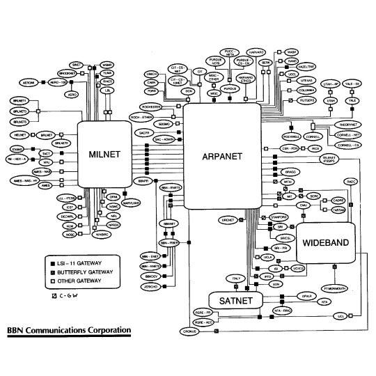
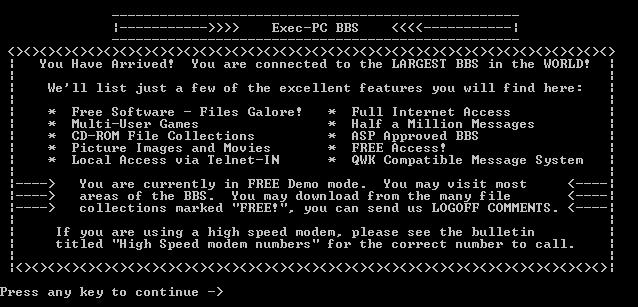
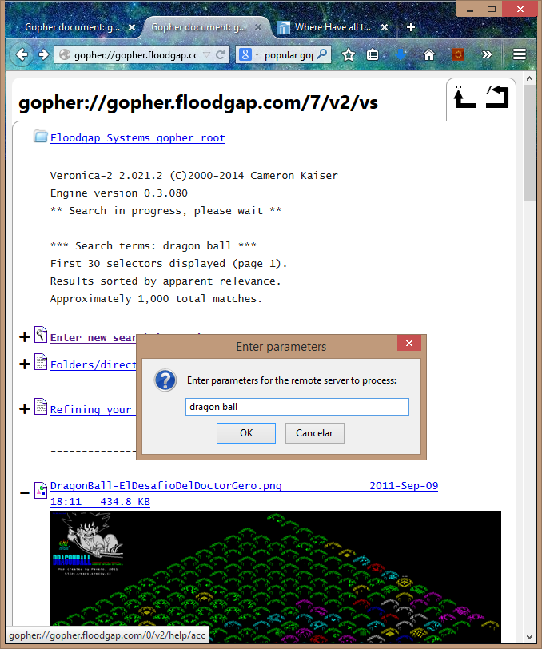
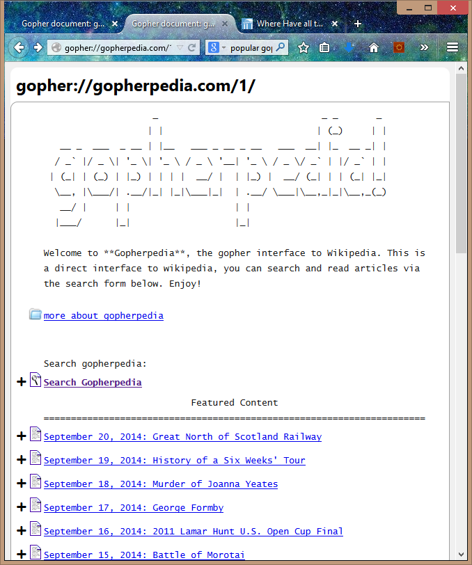
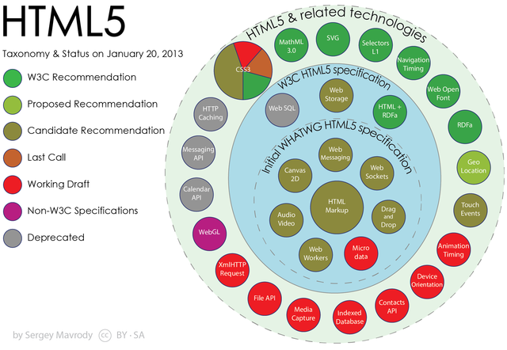
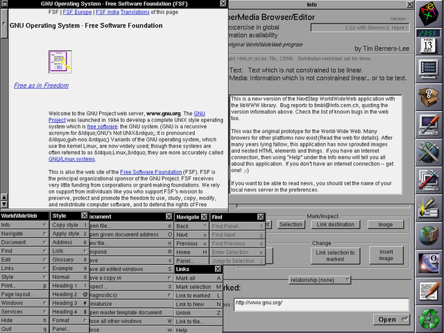
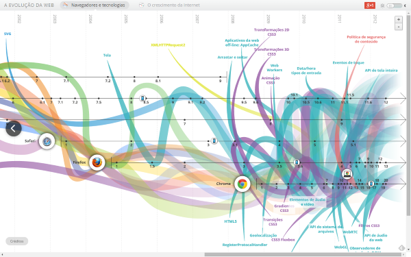

# História da Web


---
## Alguns personagens

<ul class="list-horizontal">
  <li>
    <figure class="portrait">
      
      <figcaption>**Larry Roberts**, "pai" da ARPANET</figcaption>
    </figure>
  </li>
  <li>
    <figure class="portrait">
      
      <figcaption>**Vint Cerf**, "pai" dos protocolos TCP/IP</figcaption>
    </figure>
  </li>
  <li>
    <figure class="portrait">
      
      <figcaption>**Bob Kahn**, "pai" dos protocolos TCP/IP</figcaption>
    </figure>
  </li>
  <li>
    <figure class="portrait">
      
      <figcaption>**Tim Berners-Lee**, "pai" da Web</figcaption>
    </figure>
  </li>
</ul>

---
## Linha do Tempo

<dl>
  <dt>1969</dt><dd>Larry Roberts estabelece 1º link da **ARPANET**</dd>
</dl>

---
## ARPANET

Havia **pouquíssimos computadores** com capacidade de pesquisa nos EUA e muitos
pesquisadores que deveriam ter acesso a eles estavam **geograficamente
separados**.
_(Charles Herzfeld, diretor da ARPA)_

- _Advanced Research Projects Agency Network_ (ARPANET)
- Uma das primeiras redes baseadas em trocas de pacotes
- A primeira rede a utilizar a família de protocolos TCP/IP

---
22:30 de 29 de Outubro de 1969:

<div class="bubble-chat" style="height: 300px; overflow: auto; border: 1px solid gray; background-color: #eda">
  <div class="narration">We set up a telephone connection between us and the
    guys at SRI... We typed the L and we asked on the phone:</div>
  <div class="bubble bubble-left">
    <div class="bubble-author bubble-author-0">Kleinrock</div>
    <div>"Do you see the L?"</div>
  </div>
  <div class="bubble bubble-right">
    <div class="bubble-author bubble-author-1">Guys at SRI</div>
    <div>"Yes, we see the L," came the response.</div>
  </div>
  <div class="narration">We typed the O, and we asked,</div>
  <div class="bubble bubble-left">
    <div class="bubble-author bubble-author-0">Kleinrock</div>
    <div>"Do you see the O."</div>
  </div>
  <div class="bubble bubble-right">
    <div class="bubble-author bubble-author-1">Guys at SRI</div>
    <div>"Yes, we see the O."</div>
  </div>
  <div class="narration">Then we typed the G, and the system crashed...
    Yet a revolution had begun...
</div>
</div>


_Fonte: [Estradas e Encruzilhadas da História da Internet (inglês)][roads-crossroads]_

[roads-crossroads]: http://www.netvalley.com/cgi-bin/intval/net_history.pl?chapter=1

---
À partir de 1969 e durante a década de 1970, a ARPANET cresceu e se conectou com
várias outras grandes redes.



---
Contudo, **a falta de padrão de protocolos** de rede impedia o avanço.
Além disso, **os protocolos em vigência deixavam a REDE como responsável pela
confiabilidade**.

---
## Linha do Tempo (1/2)

<dl>
  <dt class="bullet-old">1969</dt><dd class="bullet-old">Larry Roberts
    estabelece 1º link da **ARPANET**</dd>
  <dt>1974</dt><dd>Bob Kahn e Vint Cerf **especificam os protocolos
    TCP/IP**</dd>
  <dt>1983</dt><dd>Bob Kahn e Vint Cerf implantam a **família de protocolos
    TCP/IP na ARPANET**</dd>
  <dt>1974 - 1990</dt><dd>Outras **grandes redes se conectaram a ARPANET**
    (CSNET, NIPRNET, SPAN, NSN, ESNet, NSFNET, MILNET, SATNET, WIDEBRAND)</dd>
</dl>

---
## Linha do Tempo (2/2)

<dl>
  <dt>1988 - 1989</dt><dd>Surgimento dos primeiros provedores de acesso ao
    público geral (ISP), dando forma à **Internet** (_case-sensitive_)</dd>
  <dt>1992</dt><dd>O governo americano permitiu a conexão da Internet com
    outras redes que não eram exclusivamente de pesquisa</dd>
  <dt>**1989 - 1993**</dt><dd>Tim Berners-Lee **cria a WWW** em CERN
    (_European Organization for Nuclear Research_) e a deixa aberta ao público
    geral</dd>
</dl>

---
# Mas se a Web surgiu apenas em 1989, o que era a Internet antes dela?

<figure class="portrait">
  
</figure>

---
## A era Pré-web

- Correio eletrônico (E-mail, ~1965)
- BBS (_Bulletin Board System_, 1978), Usenet (1980), FTP (1985)
- WAIS, Archie, Veronica (mecanismos de busca)
- Gopher (1991)

---
<figure>
  
  <figcaption>Cliente de E-mail ELM (1986)</figcaption>
</figure>

---
<figure>
  
  <figcaption>Cliente de E-mail Pine (1989)</figcaption>
</figure>

---
<figure>
  
  <figcaption>BBS Koala Country (1989)</figcaption>
</figure>

---
<figure>
  
  <figcaption>BBS Exec-PC (1982)</figcaption>
</figure>

---
<figure>
  <figcaption>Usenet GNUs</figcaption>
  
</figure>

---
<figure>
  <figcaption>Gopher de Jospeh Maistre</figcaption>
  
</figure>

---
<figure>
  <figcaption>Uma busca em gopher por Veronica</figcaption>
  
</figure>

---
<figure>
  <figcaption>Tela do Gopherpedia</figcaption>
  
</figure>

---
## A era Pré-web

- O que mais se aproximava de **troca organizada de documentos** era o
  **Gopher**
- Contudo, o Gopher previu a informação de forma hierárquica
- A _World Wide Web_ (WWW), proposta por Tim Berners-Lee, estipulou um formato
  de teia
- [Questionário Maroto!!](https://moodle.cefetmg.br/mod/quiz/view.php?id=17587)

---
# A Teia do Mundo Inteiro

---
## Surgimento da Web

- Como um pesquisador no CERN, Tim percebeu a necessidade dos físicos de
  compartilhar informação e a falta de máquinas ou formatos comuns
- Em 1989, Tim escreveu uma proposta: _"a large hypertext database with typed
  links"_
- Candidatos a nomes:
  - _Information Mesh_
  - _The Information Mine_
  - _Mine of Information_
  - _World Wide Web_

---
## A Web

- Ao final de 1990, Tim havia escrito:
  - _HyperText Transfer Protocol_ (HTTP)
  - _HyperText Markup Language_ (HTML)
  - o primeiro navegador ou _web browser_ (WorldWideWeb)
  - o primeiro software servidor HTTP ([CERN httpd][first-http-server])
  - o primeiro servidor Web (http://info.cern.ch)

[first-http-server]: http://www.w3.org/Daemon/User/

---
# HTML

Se estamos viajando no hiperespaço e escrevemos um texto

<figure class="portrait">
  
</figure>

Ele se torna um hipertexto?

---
## Tim, o coração valente, tinha uma dúvida

Quero que **qualquer pessoa**, em **qualquer computador** (arquitetura, sistema
operacional, rede), em qualquer lugar, consiga** visualizar documentos um do
outro**.

Mais que isso, os documentos podem **referenciar um ao outro não necessariamente
de forma hierárquica**. E quero que eles possam conter imagens, tabelas, títulos
e outras coisas legais.

---
## HyperText Markup Language (HTML)

- Hipertexto (1965) é um texto estruturado que usa links (hiperlinks) entre nós
  contendo outros hipertextos
- Hipertextos podem conter elementos extra-textuais (figuras, tabelas etc.)

---
## HyperText Markup Language (HTML)

- É um formato de arquivo (`.html`) em texto simples (_plain-text_) em que
  seleciona-se **um texto e marca-se suas partes dando a ele estrutura**

  Texto puro:
  ```html
Este é um texto com itálico.
  ```

  Texto html:
  ```html
Este é um texto com <em>itálico</em>.
  ```
---
## Um arquivo `html` completo

```
&lt;!doctype html&gt;
&lt;html&gt;
&lt;head&gt;
  &lt;title&gt;An Example Page&lt;/title&gt;
&lt;/head&gt;
&lt;body&gt;
  Hello World, this is a very simple HTML document.
&lt;/body&gt;
&lt;/html&gt;
```


---
## HTML

- Versões
  - 1993: HTML 1.0
  - 1995: HTML 2.0
  - 1997: HTML 3.2
  - 1997: HTML 4.0
  - 2008 - 2014: **HTML 5**
- Alternativas
  - 2000: XHTML 1.0
  - 2001: XHTML 1.1

---
[][html5-apis-diagram]

[html5-apis-diagram]: http://commons.wikimedia.org/wiki/File:HTML5-APIs-and-related-technologies-by-Sergey-Mavrody.png#mediaviewer/File:HTML5-APIs-and-related-technologies-by-Sergey-Mavrody.png

---
# Navegadores

---
## Tim, o coração valente, tinha uma dúvida

Agora que especifiquei um formato de arquivo robusto, preciso de um **programa
que seja capaz de renderizar** seu conteúdo e permitir a **navegação** de um
arquivo html para outro.

---


---
## Linha do tempo dos navegadores

 - [Evolução da Web][evolution-of-web]



[evolution-of-web]: http://www.evolutionoftheweb.com/

---
# Servidores Web

---
## Tim, o coração valente, tinha uma dúvida

Até agora, consigo visualizar os arquivos `.html` no meu computador, usando um
navegador. Mas quero poder acessar **arquivos de qualquer um que se disponha a
deixar o computador ligado**, em qualquer parte do mundo.

---
## Servidores Web

- É o programa que **roda** em um computador **24/7** e conversa com os
  navegadores
- **Atendem solicitações** de download de arquivos e **entregam as respostas**
- Funções
  - armazenar, processar e entregar páginas web para clientes
  - receber dados de clientes (upload, formulários)
  - gerar páginas html dinamicamente

---
## Servidores Web

- Exemplos:
  - Apache
  - Tomcat
  - Nginx
  - IIS (_Internet Information Services_)

---
# HTTP

---
## Tim, o coração valente, tinha uma dúvida

Quero poder **transmitir** essas páginas web de um servidor para meu navegador.

Tenho o protocolo TCP/IP à minha disposição, mas preciso **transmitir mais do
que apenas o conteúdo dos arquivos**. Por exemplo, como faço caso o arquivo
solicitado não exista? **Em que língua** que o servidor web e o navegador vão
**conversar**?

---
## HTTP

- É um protocolo na camada de aplicação
- Fundação da comunicação de dados na WWW
- Modelo requisição -> resposta
- Verbos: [GET, POST, PUT, DELETE, PATCH etc.]

---
### O cliente faz uma requisição

```
GET /index.html HTTP/1.1
Host: www.example.com
```

---
### O servidor web responde

```
HTTP/1.1 200 OK
Date: Mon, 23 May 2005 22:38:34 GMT
Server: Apache/1.3.3.7 (Unix) (Red-Hat/Linux)
Last-Modified: Wed, 08 Jan 2003 23:11:55 GMT
ETag: "3f80f-1b6-3e1cb03b"
Content-Type: text/html; charset=UTF-8
Content-Length: 131
Accept-Ranges: bytes
Connection: close

&lt;!doctype html&gt;
&lt;html&gt;
&lt;head&gt;
  &lt;title&gt;An Example Page&lt;/title&gt;
&lt;/head&gt;
&lt;body&gt;
  Hello World, this is a very simple HTML document.
&lt;/body&gt;
&lt;/html&gt;
```

---
## HTTP

- Versões
  - 1991: v0.9
  - 1996: v1.0
  - 1997-1999: v1.1
- Alternativas
  - 2009: SPDY
  - 2014: HTTP/2

---
# Referências

- [Antes da Web: A Internet em 1991 (inglês)][before-the-web]
- [Estradas e Encruzilhadas da História da Internet (inglês)][roads-crossroads]
- [Primeiro servidor web][first-web-server]
- [Evolução da Web][evolution-of-web]

[before-the-web]: http://www.zdnet.com/blog/networking/before-the-web-the-internet-in-1991/834
[roads-crossroads]: http://www.netvalley.com/cgi-bin/intval/net_history.pl?chapter=1
[first-web-server]: http://info.cern.ch
[evolution-of-web]: http://www.evolutionoftheweb.com/
