<!-- {"layout": "title"} -->
# **JavaScript** parte 0
## Tipos de Dados, Variáveis, Estrutura Sequencial, Condicionais, Iterações e Funções

---
# Na última aula (1/2)

- Quando **mais de uma regra CSS se aplica**, uma delas prevalece
  - O navegador calcula uma pontuação de especificidade (**`abc`**<!--{strong:.alternate-color}-->) do seletor
    de cada regra:
    - **`a`**<!--{strong:.alternate-color}-->: quantidade de **ids** no seletor
    - **`b`**<!--{strong:.alternate-color}-->: quantidade de **classes, atributos e pseudo-classes** no seletor
    - **`c`**<!--{strong:.alternate-color}-->: quantidade de **pseudo-elementos** no seletor
  - Quanto maior esse número, maior a precedência da regra ser aplicada

---
## Na última aula (2/2)
- Exemplo: qual a cor do `<h2>` que seja filho direto de alguém com as classes `.post` e `.novidade` que, por sua vez, esteja dentro de um `#posts-recentes`? <!-- {ul:.bulleted} -->
  ```css
  /* id: 1, classes: 2, tag: 1; pontuação: 121 */
  #posts-recentes .post.novidade > h2 {
    color: blue;
  }
  /* id: 0, classes: 0, tag: 1; pontuação: 001 */
  h2 {
    color: green;
  }
  ```
  - Azul!

---
# Atividade de hoje

1. O objetivo é começar a usar JavaScript
1. [Baixe os arquivos][js0]. Você deve abrir a página web no navegador e seguir as instruções

 <!-- {p:.centered style="perspective: 900px"} --> <!-- {.cool-rotation-x style="max-width: 100%"} -->

[js0]: https://github.com/fegemo/cefet-front-end-js0/archive/master.zip

---
<!-- {"layout": "centered"} -->
# Hoje veremos...

1. [Tipos de dados, Variáveis e Funções](#tipos-de-dados-variaveis-e-funcoes)
1. [Condicionais, Vetores e Estruturas de Repetição](#condicionais-vetores-e-estruturas-de-repeticao)
1. [Mais sobre funções e Métodos úteis](#mais-sobre-funcoes-e-metodos-uteis)

---
<!-- {"layout": "section-header", "hash": "tipos-de-dados-variaveis-e-funcoes"} -->
# Tipos de Dados, Variáveis e Funções
## Elementos da Linguagem JavaScript

- Tipos de dados
- Declarando variáveis
- Criando funções
<!-- {ul:.content} -->

---
#  <!-- {.push-right style="max-width: 75px"} --> O que é JavaScript?

- Possui sintaxe parecida com C, C++, Java
  - JavaScript **não é Java**
  - Ter "Java" no nome foi apenas uma **jogada de marketing** na época
- Suporta os estilos de programação **orientada a objetos** e **funcional**
- Existem diferentes tipos de dados (como em C, C++, Java)
  - Mas não é necessário definir os tipos das variáveis
  - Os tipos são automaticamente inferidos
- É uma linguagem dinâmica
  - Uma variável pode ter um tipo agora, mas mudar para outro depois
- Usa programação assíncrona dirigida por **eventos**

---
<!-- {"layout": "2-column-content"} -->
## <span style="font-family: 'Amatica SC',cursive;">hello-world.js</span> e imprimindo no console

- Um arquivo HTML pode incluir um arquivo .js <!-- {ul:.bullet.compact-code-more} -->
  ```html
  <!DOCTYPE html>
  <html>
  <head>
    <title>...</title>
  </head>
  <body>
    <!-- ... -->
    <script src="hello-world.js"></script>
  </body>
  </html>
  ```
  ```js
  // imprime no console do navegador
  console.log('Hello world');

  // abre uma janelinha infernal
  window.alert('Sou das trevas');
  ```

1. Um arquivo JavaScript incluído por um HTML é **baixado e executado linha a linha** <!-- {ol:.bullet.compact-code-more style="margin-left: auto;"} -->
2. Para testar escrevemos no console do navegador com
   ```js
   console.log('.......');
   ```
3. Também pode abrir uma janelinha
   ```js
   window.alert('......');
   ```
   - ...mas não faça isto, jovem, porque essa janelinha é muito chata ;)

---
<!-- {"hash": "criando-variaveis-com-let"} -->
# Declarando **variáveis** (com `let`)

- Usamos a palavra-chave `let` para criar variáveis:
  ```js
  let alunosMatriculados = 20;    // isto aqui é um comentário
  let qtdeHorasAula = 66.5;       /* aqui também (de bloco) */
  let nomeAula = 'js0';
  ```
- Não é necessário (nem possível) informar o seu **tipo de dado**
  - Em JavaScript o tipo é **inferido automaticamente**
- `let` pode ser lido como "seja", tipo assim:
  > seja uma variável '`nomeAula`'
  com o valor '`js0`'

---
<!-- {"layout": "2-column-content", "hash": "const-e-var"} -->
## Outras formas de declarar variáveis `(const/var)`

- Usamos a palavra-chave `const` para criar variáveis que **sempre apontam para o mesmo valor** <!-- {ul:.compact-code-more} -->
  ```js
  const fruta = 'abacate';
  fruta = 'pera';
  // Uncaught TypeError:
  //   Assignment to constant variable.
  ```
  - É uma boa prática usar `const` sempre que se sabe que a variável não receberá um novo valor

1. **Usávamos** (passado, _old_, não use) a palavra-chave `var`:  <!-- {ol:.compact-code-more.no-bullets} -->
   ```js
   var vegetal = 'batata';
   ```
   - Similar ao `let` mas tem alguns problemas:
     - Não possui escopo de bloco, mas de função
     - Pode ser usada até mesmo antes da declaração
   - Era a única forma até ~2012
   - Encontra-se códigos antigos na Web usando `var`

---
# Fracamente tipada e dinâmica

- Em JavaScript, não é necessário declarar o tipo das variáveis:
  ```js
  let nota = 10;            // tipo numérico
  let aluno = 'Adamastor';  // tipo string
  ```
  - Dizemos que JavaScript é **fracamente tipada**
- Em JavaScript podemos mudar o tipo de uma variável no meio do caminho (exceto se usando `const`):
  ```js
  let nota = 10;            // nota é númerico
  nota = 'Dó';              // agora virou string
  ```
  - Dizemos que JavaScript é **dinâmica**

---
<!-- {"layout": "2-column-content", "hash": "tipos-de-dados"} -->
## Tipos de dados

- Há seis **tipos primitivos** de dados:
  - `1. Boolean` <!-- {.tipo-js.tipo-boolean} -->
  - `2. Number` <!-- {.tipo-js.tipo-number} -->
  - `3. String` <!-- {.tipo-js.tipo-string} -->
  - `4. Null` <!-- {.tipo} -->
  - `5. Undefined` <!-- {.tipo} -->
  - `6. Symbol`  <!-- {style="height: 1em;"} -->  <!-- {code:.tipo} --> <!-- {ul:.multi-column-list-2} -->
- Um **tipo composto** de dados:
  `7. Object` <!-- {.tipo-js.tipo-object} -->
  - Há outros derivados de `Object`...
  - Veremos `Object` e seus tipos derivados em próximas aulas

1. Para verificar o tipo de uma variável, usamos `typeof` <!-- {.compact-code-more} -->
   ```js
   let vacinou = true;
   console.log(typeof vacinou);
   // imprime "boolean"

   let nota = 10;
   console.log(typeof nota);
   // imprime "number"

   let aluno = 'Adamastor';
   console.log(typeof aluno);
   // imprime "string"

   let inimigo = {
     vida: 100,
     nome: 'Slime'
   };
   console.log(typeof inimigo); // impr. "object"
   ```

---
<!-- {"layout": "2-column-content", "hash": "os-tipos-boolean-e-number"} -->
## <span>O tipo **1. Boolean** <!-- {.tipo-js.tipo-boolean} --></span> <span>O tipo **2. Number** <!-- {.tipo-js.tipo-number} --></span> <!-- {h2:style="display:flex;justify-content:space-between"} -->

1. O tipo **Boolean** <!-- {.tipo-boolean} --> armazena um valor verdadeiro ou falso. Exemplo: <!-- {ol:.bullet.compact-code-more.no-bullets} -->
   ```js
   let abelhinhaEstaVoando = true;
   let modoEscuro = false;
   let maioridade = idade >= 18;
   ```


- **Apenas 1 tipo numérico** 64bits <!-- {ul:.bullet.compact-code-more.no-bullets} --> <!-- {.tipo-number} -->
  - <small>(equivalente ao `double` de C/Java)</small>
  - Não há um tipo específico para números inteiros
- Exemplos de variáveis com números:
  ```js
  let a = 5;
  let b = 5.674;            // 5 vírgula 674
  let c = a + b;            // 10.674
  let d = 2 ** 4;           // 16 (2 elevado a 4)
  let e = Math.sqrt(25);    // 5 (raiz quadrada de 25)
  let f = Math.random();    // [0,1] - algo entre 0 e 1
  ```

---
<!-- {"hash": "o-tipo-string"} -->
## O tipo **3. String** <!-- {.tipo-js.tipo-string} -->

- **Representa um texto** <!-- {.tipo-string} --> codificado em UTF-8
- Não existe o tipo `char` como em C/C++ e Java, apenas _string_ :wink:
- Usamos aspas **simples** ou duplas
  ```js
  "Abc" === 'Abc'   // simples é mais legal!! mas basta ser consistente
  ```
- Possui uma propriedade chamada `length` com o seu comprimento:
  ```js
  console.log('Cachorro'.length); // 8
  ```
- Exemplos:
  ```js
  let aranhas = 'fofofauna';
  const caminhoVideo = 'videos/a.mp4';
  const nomeCompleto = primeiro + ' ' + ultimo;
  ```

---
## Manipulando Strings

- É possível **concatenar** (juntar, colar) para criar novas strings: <!-- {ul:.bulleted} -->
  ```js
  console.log('c' + 'a' + 't');   // imprime 'cat'
  ```
- Podemos acessar cada caractere usando colchetes:
  ```js
  const capitalDeMG = 'Betim';
  console.log(capitalDeMG[0]);    // imprime 'B'
  ```
- Strings possuem métodos, [vários deles](https://developer.mozilla.org/en-US/docs/Web/JavaScript/Reference/Global_Objects/String) (veremos mais). Exemplos:
  ```js
  'barba negra'.toUpperCase() === 'BARBA NEGRA'
  'Mississippi'.indexOf('ss') === 2
  'Orinoco'.replace('noco', '') === 'Ori'
  '$'.repeat(3) === '$$$'
  ```

---
<!-- {"hash": "operadores", "embeddedStyles": ".less-padding ul li{padding-left:0em;list-style-type:none}"} -->
# Operadores

- Aritméticos <!-- {ul^0:.less-padding} --> <!-- {li^0:.bullet} -->
  - **`+`** soma&nbsp;&nbsp;&nbsp;**`-`** subtração
  - **`*`** multiplicação
  - **`**`** exponenciação
  - **`/`** divisão
  - **`%`** resto da divisão
  - **`++`** incremento&nbsp;&nbsp;&nbsp;**`--`** decremento
- Atribuição <!-- {li^0:.bullet} -->
  - **`=`** simples&nbsp;&nbsp;&nbsp;**`+=  /=  %=`** composta
- Relacionais (comparação) <!-- {li^0:.bullet} -->
  - **`==`** igualdade
  - **`===`** igualdade forte (!!)
  - **`!=`** desigualdade
  - **`!==`** desigualdade forte  (!!)
  - **&lt;  &lt;=** menor/menor igual
  - **&gt;  &gt;=** maior/maior igual
- Lógicos <!-- {li^0:.bullet} -->
  - **`!`** não&nbsp;&nbsp;&nbsp;**`&&`** e&nbsp;&nbsp;&nbsp;**`||`** ou <!-- {ul^4:.multi-column-list-2} -->

---
## O que significa `===` (igualdade forte)?

- Se compararmos '1' com 1 (uma **string** <!-- {.tipo-string} --> com um **number** <!-- {.tipo-number} -->) usando `==`: <!-- {ul:.bulleted-0} -->
  ```js
  console.log('1' == 1);    // imprime true
  ```
  - A comparação `==` tenta converter um elemento no tipo do outro e depois
    compara
  - Neste caso, converte `1` em `'1'` e só então compara
- Para que essa conversão não aconteça, usamos `===` :thumbsup::
  ```js
  console.log('1' === 1);   // imprime false
  ```
  - Mais rápido para o computador, porque ele não faz a conversão
  - Prefira esta forma!! :wink:

---
<!-- {"hash": "o-objeto-math"} -->
## O objeto `Math`

- Além dos operadores matemáticos (_e.g._, `+, -, /, *`), existem
  outras funções matemáticas acessíveis via o objeto `Math`:
  ```js
  const pi = Math.PI;           // a constante pi
  let a = Math.sin(1);          // seno de 1 radiano
  let b = Math.cos(pi);         // cosseno de pi radianos
  let c = Math.pow(5, 2);       // 5 elevado a 2
  let d = Math.sqrt(100);       // raiz quadrada de 100
  let e = Math.random();        // nº aleatório entre [0, 1]
  let f = Math.round(0.5);      // arredonda p/ inteiro mais próximo (1)
  let g = Math.floor(0.5);      // arredonda p/ baixo ("chão": 0)
  let h = Math.ceil(0.5);       // arredonda p/ cima ("teto": 1)
  ```
  - Todos os métodos do [objeto Math na MDN][math-mdn]

[math-mdn]: https://developer.mozilla.org/pt-BR/docs/Web/JavaScript/Reference/Global_Objects/Math

---
<!-- {"layout": "2-column-content-zigzag", "embeddedStyles": ".push-code-right pre{float:right;}", "hash": "declarando-e-invocando-funcoes"} -->
# Declarando e invocando **funções**


- Funções são **declaradas** usando a palavra-chave `function` <!-- {style="float:initial"} --> + nome + parâmetros + corpo ➜
  - Há outras formas, como funções anônimas (veremos depois) e funções seta

```js
// DECLARA a função dizOla()
function dizOla() {
  console.log('olá queridão');
}
```

```js
// INVOCA a função dizOla()
dizOla();  
```
- Funções são **invocadas** (chamadas) por seu nome, seguido de parênteses

---
<!-- {"layout": "2-column-content-zigzag", "classes": "compact-code", "embeddedStyles": "#parametros{width:40%;}#parametros+pre{width:56%;}"} -->
## Declarando **parâmetros para funções**

- Os parâmetros ficam entre os parênteses e separados por vírgula: <!-- {li:.push-code-right} --> <!-- {ul:#parametros.bulleted.no-margin} -->
  - Não é necessário declarar o tipo do parâmetro - apenas o nome

```js
function dizOla(nome, pronome) {
  console.log('olá ' + pronome + ' ' + nome);
}
```

```js
dizOla('enfermeira', 'srta.');
// imprime 'olá srta. enfermeira'
dizOla('jujuba', '');
// imprime 'olá  jujuba'
dizOla();
// imprime 'olá undefined undefined'
```  

- Para invocar a função ← <!-- {li:.bulleted} -->
  - Dá pra chamar uma função sem passar valores para os argumentos.
    Nesse caso, o parâmetro tem valor `undefined`

---
# Valor de **retorno** de funções

- A função pode retornar um valor explicitamente: <!-- {ul:.bulleted-0} -->
- <!-- {li:.code-split-2.compact-code-more} -->
  ```js
  function elevaAoCubo(numero) {            
    return numero ** 3;             
  }
  elevaAoCubo(2);     // retorna 8
  elevaAoCubo(3);     // retorna 27
  ```
  ```js
  function hipotenusa(cateto1, cateto2) {
    let somaQuadrados = cateto1 ** 2 + cateto2 ** 2;
    return Math.sqrt(somaQuadrados);
  }
  hipotenusa(3, 4);   // retorna 5
  ```
- Toda função sempre retorna um valor, mesmo sem `return`.
  Se não houver a palavra-chave, a função tem um `return undefined` implícito
- <!-- {li:.code-split-2.compact-code-more} -->
  ```js
  function imprimeNome(primeiro, ultimo) {
    console.log(primeiro + ' ' + ultimo);
  }
  // retorna undefined
  ```
  ```js
  function imprimeNome(primeiro, ultimo) {
    console.log(primeiro + ' ' + ultimo);
    return undefined;
  }
  ```
- São idênticas ↑ ⬈

---
<!-- {"hash": "regras-de-legibilidade-e-nomenclatura-1"} -->
## Regras de legibilidade e nomenclatura (1/2)

1. Nomes de funções e variáveis com **notação camelo** 🐪 sem acentuação: <!-- {ol:.full-width.bulleted} -->
2. <!-- {.code-split-2.compact-code} -->
   ```js
   let ultimoNome = '';    🐪 ✅✅✅
   ```
   ```js
   function removeVideo() {}   🐪 ✅✅✅
   ```
2. <!-- {.code-split-2.compact-code} -->
   ```js
   let ultimo_nome = '';   👎
   let UltimoNome = '';    👎
   let últimonome = '';    ❌
   let último nome = '';   ❌❌❌
   ```
   ```js
   function remove_video() {}  👎
   function RemoveVideo() {}   👎
   function removevídeo() {}   ❌
   function remove vídeo() {}  ❌❌❌
   ```
1. Sempre **indente o código**:
2. <!-- {.code-split-2.compact-code} -->
   ```js
   function total(preco, qtde) {   ✅✅✅
     if (confirmado) {
       return preco * qtde;
     }
     return 0;
   }
   ```
   ```js
   function total(preco, qtde) {   👎👎👎
   if (confirmado) {
   return preco*qtde;
   }
   return 0;
   }
   ```

---
<!-- {"hash": "regras-de-legibilidade-e-nomenclatura-2"} -->
## Regras de legibilidade e nomenclatura (2/2)

- **Nomes de variáveis e funções** devem ser bem **descritivos**: <!-- {ul:.push-code-left.compact-code-more.full-width.bulleted} -->
  1. ```js
     let numeroAlunos;  ✅
     let nAlunos;       👎
     ```
     Evite abreviações desnecessárias <!-- {li:style="clear:both;"} --> <!-- {ol:.no-bullets} -->
  2. ```js
     let aluno = 'Bob';  ✅
     let a = 'Amarílio'; 👎
     ```
     Evite nomes com apenas 1 letra <!-- {li:style="clear:both;margin-top: 1.25em;"} -->
  3. ```js
     let notaAluno = 10; ✅
     let numero = 10;    👎
     let temp = '...';   👎
     ```
     Evite nomes genéricos <!-- {li:style="clear:both;margin-top: 1.25em;"} -->
- Respeite **espaçamentos para dar arejamento** ao código: <!-- {li:style="clear:both"} -->
- <!-- {.code-split-2} -->
  ```js
  const dano = 5;                                   ✅
  let hp -= dano * 0.6;
  ```
  ```js
  const dano=5;                                     👎
  let hp-=dano*0.6;
  ```
- <!-- {.code-split-2} -->
  ```js
  let beleza = 10;                                  ✅
  function vestir(acessorio) {
    if (acessorio === 'laço') {
      beleza += 10;
    }
  }
  ```
  ```js
  let beleza=10;                                    👎
  function vestir  (acessorio){
    if(acessorio==='laço'){
      beleza+=10;
    }
  }
  ```

---
<!-- {"layout": "section-header", "hash": "condicionais-vetores-e-estruturas-de-repeticao"} -->
# Condicionais, Vetores e Repetição
## _Arrays_, for, while e variações

- Condicionais
- Vetores
- For
    - Tradicional
    - For of
    - forEach
- While/Do while
<!-- {ul^1:.content} -->

---
<!-- {"layout": "2-column-content", "hash": "if-else", "classes": "compact-code"} -->
## **if/else** (condicionais)

```js
if (hora < 12) {
  manha = true;
} else {
  manha = false;
}

if (nome === 'Robervaldo') { 
  conceito = 'A';
} else if (nome === 'Ana') {
  conceito = 'B';
} else {
  conceito = 'C';
}

if (estouComSono)
  dormir(); // mas evite omitir { }
```

- Dentro dos parênteses colocamos uma expressão que avalia para `true` ou `false`. Ex:
  - `nome === 'Ana'`
  - `ano < 2000`&nbsp;&nbsp;`ano % 4 === 0`
  - `!jaEstudei`
  - `hp > 0 && (balas || granada)`
- Com apenas 1 comando no `if`/`else`, é possível omitir as chaves (como em C/C++, Java)
  - Contudo, é uma má ideia

---
## **Operador ternário** (condicionais)

- Quando temos um `if/else` "simples", pode ser mais legível fazer a verificação em 1 linha com **o operador ternário ?:**
- <!-- {.code-split-2} -->
  ```js
  if (armaduraForte) {
    hp -= 10;
  } else {
    hp -= 50;
  }
  ```
  ```js
  // mesmo código, em 1 linha
  hp -= armaduraForte ? 10 : 50;
  ```
- Formato:
  ```js
  CONDICAO_TESTE ? VALOR_SE_TRUE : VALOR_SE_FALSE;
  ```

---
<!-- {"layout": "2-column-content", "hash": "switch"} -->
## **switch** (condicionais)

```js
let corDoSite = 'black';
switch (climaAgora) {
    case 'ensolarado':
      corDoSite = 'yellow';
      break;
    
    case 'nublado':
    case 'chuvoso':
      corDoSite = 'gray';
      break;

    default:
      corDoSite = 'white';
      break;
}
```

- Palavra-chave `switch` +  ( + expressão + )
- Um ou mais `case` + valor para a expressão
- Sequência de comandos
- Palavra-chave `break` para sair
  - (pode ser omitida para continuar)
- Caso `default` para pegar outros valores (equivalente ao `else`)

---
<!-- {"hash": "vetores"} -->
# Vetores

- Vetores (ou _arrays_) armazenam uma sequência de valores: <!-- {ul:.bulleted-0.compact-code} -->
  ```js
  let notas = [10, 4, 7, 8, 8];
  let cores = ['azul', 'verde'];
  let animais = []; // <- vetor vazio
  ```
- ```js
  console.log(notas.length);  // impr. 5
  console.log(cores.length);  // impr. 2
  ```
  Assim como _string_, um vetor tem um **comprimento** (propriedade `length` <!-- {style="float:none"} -->): <!-- {li:.push-code-right style="margin-top: 0.25em;"} -->
- Em JavaScript, vetores são heterogêneos
  - Os itens dos vetores **não** precisam ter o mesmo tipo
    ```js
    let listaDeCoisas = ['Aew', 35, true, [], 'outra string'];
    ```

---
<!-- {"elementStyles": { "h2 + pre": "overflow: hidden; width: 100%;"}} -->
## **Usando** vetores

```js
let listaDeCoisas = ['Aew', 35, true, [], 'outra string'];
```

- Indexação: usa-se os símbolos `[` e `]` para acessar um item do _array_ <!-- {ul:.bulleted} -->
  ```js
  console.log(listaDeCoisas[1]);      // imprime 35
  listaDeCoisas[0] = '';              // altera primeiro elemento
  console.log(listaDeCoisas[0]);      // imprime string vazia
  ```
- _Arrays_ possuem métodos, [vários](https://developer.mozilla.org/en-US/docs/Web/JavaScript/Reference/Global_Objects/Array) (veremos outros mais adiante):
  ```js
  let frutas = [];                    // cria um array vazio
  frutas.push('kiwi');                // coloca 'kiwi' no array
  console.log(frutas);                // imprime ['kiwi']
  ```

---
# **for** <small>(forma tradicional)</small>

- <!-- {ul:no-margin} -->
  ::: did-you-know .push-right width:240px;
  Em JavaScript há pelo menos 3 formas diferentes de fazer um `for`. Esta é a **tradicional** mas as outras mais fáceis até.
  :::
  Forma tradicional com `for (inicio; condicao; incremento)`:
  ```js
  for (let i = 0; i < 10; i++) {
    console.log(i);               // 0, 1, 2 ... 9
  }
  ```
- Percorrendo items de um _array_:
  ```js
  let cores = ['azul', 'rosa'];
  for (let i = 0; i < cores.length; i++) {
    console.log(cores[i]);        // azul, rosa
  }
  ```

---
<!-- {"layout": "2-column-content", "hash": "for-formas-mais-legais"} -->
# **for** <small>(formas **mais legais**)</small>

1. **For of**: `for (let item of array)` :thumbsup:: <!-- {ol:.no-bullets} -->
   ```js
   let cores = ['azul', 'rosa'];
   for (let cor of cores) {
     console.log(cor);
     // azul, rosa
   }
   ```
- **For each**: `array.forEach` :thumbsup:: <!-- {ul:.no-bullets} -->
  ```js
  let cores = ['azul', 'rosa'];
  cores.forEach(function(cor) {
    console.log(cor);
    // azul, rosa
  });
  ```

---
<!-- {"layout": "2-column-content"} -->
# while/do..while

- Condição **primeiro** <!-- {ul:.no-bullets} -->
  ```js
  let i = 1;
  while (i !== 10) {
    console.log(i);
    i++;
  }
  ```
1. Condição **depois** <!-- {ol:.no-bullets} -->
   ```js
   let i = 0;
   do {
     i++;
     console.log(i);
   } while (i !== 10);
   ```

---
<!-- {"layout": "section-header", "hash": "mais-sobre-funcoes-e-metodos-uteis"} -->
# Mais sobre funções, Métodos úteis
## Mais coisas legais

- Função atribuída a variável
- Função como parâmetro
- Métodos comuns de strings
- Métodos comuns de vetores
<!-- {ul:.content} -->

---
# Mais sobre funções

- Em JavaScript as **funções são super flexíveis**
  1. Função "tradicional" (já vimos)
  1. Função anônima (próximo slide)
  1. Função seta (próxima aula)
- Variáveis podem apontar para funções
- Podemos passar funções como parâmetro para outra função

---
<!-- {"layout": "2-column-content"} -->
## Função **anônima** (atribuída a **variável**)

1. Declaração de função "tradicional": <!-- {ol:.no-bullets} -->
   ```js
   function dizOla(nome) {
     console.log('olá ' + nome);
   }
   dizOla('submundo');
   ```
   - `function` + nome + (params)

- Criar uma **função <u>anônima</u>** e **atribuí-la a uma variável**: <!-- {ul:.no-bullets} -->
  ```js
  let dizOla = function(nome) {
    console.log('olá ' + nome);
  };
  dizOla('submundo');          
  ```
  - Funciona da mesma forma

---
## Passando **função como parâmetro**

- ```js
  function estudar(aluno, fnAprender) {
    console.log(aluno + ' aprendeu ' + fnAprender()); 
  }
  ```
  Vamos criar uma função que recebe outra como parâmetro →→→ <!-- {ul:.compact-code-more.bulleted} --> <!-- {li:.push-code-right} -->
- Ao chamar `estudar(...)` devemos passar uma função no segundo argumento <!-- {li:style="clear:both"} -->
- Neste exemplo, dependendo do que foi estudado, o aluno aprende coisas diferentes:
  ```js
  function lerHarryPotter() {                       function lerOlavoCarvalho() {
    return 'criatividade';                            return '?'; 
  }                                                 }
  let lerDarcyRibeiro = function() {
    return 'sociologia';
  }

  ```
- Agora vamos invocar a função `estudar(...)`:
  ```js
  estudar('André', lerHarryPotter);   // 'André aprendeu criatividade'
  estudar('Luiz', lerDarcyRibeiro);   // 'Luiz aprendeu sociologia'
  estudar('Jair', lerOlavoCarvalho);  // 'Jair aprendeu ?'
  ```

---
## Função vs Método

Função
~ sozinha no mundo, **ninguém é dono** dela
~ exemplo: todas as que vimos

Método
~ nasceu de algum objeto, ele **tem dono**
~ ex: as funções das strings, dos vetores (e outros)

- <!-- {ul:.full-width} -->
  <!-- {.code-split-2} -->
  ```js
  // 'dobra' é uma função
  function dobra(n) {
    return 2 * n;
  }
  let nota = 5;
  dobra(nota);
  ```
  ```js
  // sqrt() é método de Math
  nota = Math.sqrt(25);

  // toLowerCase() é método
  // das strings
  'HaNa MonTAna'.toLowerCase();
  ```

---
<!-- {"hash": "metodos-comuns-de-strings-1"} -->
## **Métodos** comuns de **strings** (1/3)

Toda string possui vários métodos diferentes que podemos invocar

`texto.length`
  ~ não é um método, mas retorna quantos caracteres
  ~ `'trem'.length === 4`

`texto[i]`
  ~ não é um método, mas retorna o i-ésimo caractere
  ~ `'trem'[3] === 'm'`

`texto.toLowerCase()`
  ~ método que retorna tudo em minúsculas
  ~ `'Doug'.toLowerCase() === 'doug'`

`texto.toUpperCase()`
  ~ método que retorna tudo em maiúsculas
  ~ `'Doug'.toUpperCase() === 'DOUG'`
  
---
<!-- {"hash": "metodos-comuns-de-strings-2"} -->
## **Métodos** comuns de **strings** (2/3)

`texto.trim()`
  ~ método que remove espaços em branco ao redor
  ~ `' mosca  '.trim() === 'mosca'`

`t.indexOf(trecho)`
  ~ método que retorna a posição do `trecho` no `texto` (ou -1)
  ~ `'Thanos'.indexOf('os') === 4`

`t.substr(ini, tam)`
  ~ método que retorna um trecho dado início e tamanho
  ~ `'Pronto'.substr(0, 2) === 'Pr'`

`t.includes(trecho)`
  ~ método que verifica se texto contém o trecho
  ~ `'Hakuna'.includes('ku') === true`
  
`t.split(separad)`
  ~ método que retorna um vetor de trechos
  ~ `'Banana'.split('a') === ['B', 'n', 'n']`

---
<!-- {"hash": "metodos-comuns-de-strings-3"} -->
## **Métodos** comuns de **strings** (3/3)

`t.startsWith(trech)`
  ~ método que verifica se começa com o trecho
  ~ `'Hakuna'.startsWith('Ha') === true`

`t.endsWith(trecho)`
  ~ método que verifica se termina com o trecho
  ~ `'Hakuna'.endsWith('na') === true`

`t.replace(tr, novo)`
  ~ método que substitui um trecho por algo novo
  ~ (apenas primeira ocorrência)
  ~ `'ana'.replace('a', 'e') === 'ena'`

`t.replaceAll(tr, n)`
  ~ método que substitui um trecho por algo novo
  ~ (todas as ocorrências)
  ~ `'ana'.replaceAll('a', 'e') === 'ene'` <!-- {dl:style="margin-bottom: 0"} -->

- [Lista de métodos de string na MDN](https://developer.mozilla.org/pt-BR/docs/Web/JavaScript/Reference/Global_Objects/String) <!-- {ul:.no-margin} -->

---
<!-- {"layout": "2-column-content"} -->
## Exemplos que usam métodos de strings (1/2)

- Função que verifica se nome tem menos que 10 caracteres <!-- {ul:.bulleted.compact-code-more} -->
  ```js
  function temMenosDe10(nome) {
    return nome.length < 10;
  }
  temMenosDe10('Donarudo Torampu');
  // false
  ```
- Função que verifica se primeiro nome tem menos que 10 caracteres
  ```js
  function primeiroNomeMenos10(nome) {
    const cadaNomeSeparado = nome.split(' ');
    const primeiroNome = cadaNomeSeparado[0];
    return temMenosDe10(primeiroNome);
  }
  primeiroNomeMenos10('Donarudo Torampu');
  // true
  ```
1. Função que verifica se uma URL começa com https <!-- {ol:.bulleted.compact-code-more} -->
   ```js
   function comecaComHttps(url) {
     return url.startsWith('https');
   }
   comecaComHttps('http://omo.com.br');
   // false
   ```
1. Função que remove todas as ocorrências de um caractere em um texto
   ```js
   function removeCaractere(texto, caractere) {
     return texto.replaceAll(caractere, '');
   }
   ```

---
<!-- {"classes": "compact-code-more"} -->
## Exemplos que usam métodos de strings (2/2)

- Pega uma frase e se a última letra de cada palavra (com mais do que 1 letra) terminar em 'a' ou 'o', substitui por 'x' <!-- {ul:.bulleted} -->
  ([no jsfiddle](https://jsfiddle.net/fegemo/Lgwv6yne/)) <!-- {target="_blank"} -->
- <!-- {.code-split-2} -->
  ```js
  function alteraFinalzinhoPalavras(frase) {
    let palavras = frase.split(' ');
  ```
  ```js

  // 1. divide a frase em um vetor de palavras
  ```
- <!-- {.code-split-2} -->
  ```js
    for (let i = 0; i < palavras.length; i++) {
      palavras[i] = palavras[i].trim();
  ```
  ```js
  // 2. para cada palavra
  // 2.1. remove espaços em branco ao redor da palavra
  ```
- <!-- {.code-split-2} -->
  ```js
      if (palavras[i].length <= 1) continue;
  ```
  ```js
  // 2.1. verifica se tamanho > 1
  ```
- <!-- {.code-split-2} -->
  ```js
      if (palavras[i].endsWith('o') || 
          palavras[i].endsWith('a')) {
        const ateUltimaLetra = palavras[i].length - 1;
        
        palavras[i] = 
          palavras[i].substr(0, ateUltimaLetra) + 'x';
      }
    }
  ```
  ```js
  // 2.2. verifica se termina 'a' ou 'o'

  // 2.2.1. pega posição antes da última letra

  // 2.2.2. substitui última letra da palavra por 'x'


  ```
- <!-- {.code-split-2} -->
  ```js
    return palavras.join(' '); 
  }
  ```
  ```js
  // remonta a frase, juntando o vetor de palavras
  // colocando um espaço entre cada uma
  ```

---
<!-- {"hash": "metodos-comuns-de-vetores-1"} -->
## **Métodos** comuns de **vetores** (1/3)

- Assim como as strings, os vetores também possuem vários métodos úteis
  
  `vetor.length`
    ~ não é método, mas retorna tamanho do vetor
    ~ `[5].length === 1`

  `vetor[i]`
    ~ não é método, mas retorna i-ésimo elemento
    ~ `[3, 10][0] === 3`
    ~ ```js
      let letras = ['x'];
      letras[0] = 'y';
      ```

---
<!-- {"hash": "metodos-comuns-de-vetores-2"} -->
## **Métodos** comuns de **vetores** (2/3)

`vetor.push(elem)`
  ~ método que insere `elem` ao final do vetor
  ~ `['a'].push('b') === ['a', 'b']`

`vetor.pop()`
  ~ método que remove último elemento
  ~ `['a', 'b'].pop() === ['a']`

`vetor.indexOf(elem)`
  ~ método que retorna o índice do elemento no vetor (ou -1)
  ~ `[5,6,7].indexOf(5) === 0`
  ~ `[5,6,7].indexOf(2) === -1`

---
<!-- {"hash": "metodos-comuns-de-vetores-3"} -->
## **Métodos** comuns de **vetores** (3/3)

`vetor.reverse()`
  ~ método que inverte a ordem dos elementos
  ~ `[1,2,3].reverse() === [3,2,1]`

`vetor.sort()`
  ~ método que coloca os elementos em ordem
  ~ `[8,1,-6].sort() === [-6,1,8]`
  ~ `['f', 'b'].sort() === ['b', 'f']`

`vetor.join(spacer)`
  ~ método que retorna uma string juntando os elementos
  ~ `['fl', 'rb'].join(' ') === 'fl rb'`
  ~ `['fl', 'rb'].join('+') === 'fl+rb'`

- [Lista de métodos comuns de vetores na MDN](https://developer.mozilla.org/pt-BR/docs/Web/JavaScript/Reference/Global_Objects/Array)

---
<!-- {"layout": "2-column-content", "classes": "compact-code-more"} -->
## Exemplos com métodos de vetores (1/2)

- Função que soma todos os elementos do vetor <!-- {ul:.bulleted} -->
  ```js
  function soma(valores) {
    let total = 0;
    for (let n of valores) {
      total += n;
    }
    return total;
  }
  ```
- Função que retorna um vetor com os quadrados
  ```js
  function quadrados(valores) {
    let resultado = [];
    for (let n of valores) {
      resultado.push(n ** 2);
    }
    return resultado;
  }
  ```

1. Função que busca por um elemento específico <!-- {ol:.bulleted} -->
   ```js
   function busca(vetor, elem) {
     return vetor.indexOf(elem);
   }
   ```
1. Função que adiciona no vetor apenas se elemento ainda não estiver nele
   ```js
   function adicionaSemDuplicar(vetor, elem) {
     if (busca(vetor, elem) === -1) {
       vetor.push(elem);
     }
   }
   ```

---
<!-- {"classes": "compact-code-more"} -->
## Exemplos com métodos de vetores (2/2)

- Função que imprime uma matriz n x n de números <!-- {ul:.full-width.bulleted} --> ([no jsfiddle](https://jsfiddle.net/fegemo/f0uc4qyx/)) <!-- {target="_blank"} -->
- <!-- {.code-split-2} -->
  ```js
  function imprimeMatriz(matriz) {
    let resultado = '';
  ```
  ```js
  
  
  ```
- <!-- {.code-split-2} -->
  ```js
    for (let i = 0; i < matriz.length; i++) {
      resultado += '| ';
      for (let j = 0; j < matriz[i].length; j++) {
  ```
  ```js
  // 1. para cada linha
  // começou a linha
  // 2. para cada coluna
  ```
- <!-- {.code-split-2} -->
  ```js
        resultado += matriz[i][j] + ' ';
      }
      resultado += '|\n';
    }
  ```
  ```js
  // 3. imprime o elemento (i,j)

  // acabou a linha, coloca paredinha |
  
  ```
- <!-- {.code-split-2} -->
  ```js
    console.log(resultado);
  }
  ```
  ```js
  // e quebra linha \n

  ```
- <!-- {.code-split-2} -->
  ```js
  
  imprimeMatriz([[1,2],[3,4]])
  ```
  ```js
  // | 1 2 |
  // | 3 4 |
  ```

---
<!-- {"layout": "centered"} -->
# Referências

1. Capítulo 2 do livro "JavaScript: The Good Parts"
1. Mozilla Developer Network (MDN)

---
<!-- {"layout": "main-point", "state": "emphatic", "hash": "erros-comuns"} -->
# Erros comuns durante a prática

---
## 01. Falhar no **arejamento** <!-- {h2:.bullet} -->

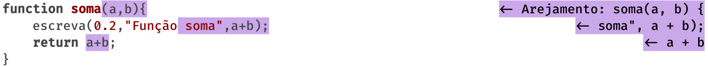 <!-- {.full-width} --> <!-- {p:.bullet} -->
 <!-- {.full-width} -->
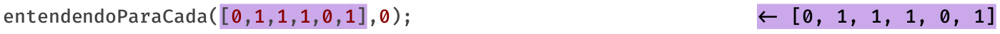 <!-- {.full-width} -->
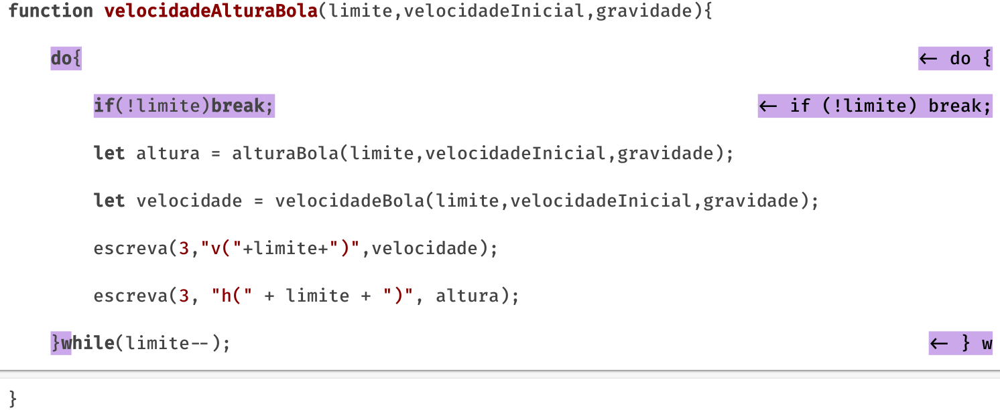 <!-- {.full-width} -->

---
## 02. Falhar na **indentação** <!-- {h2:.bullet} -->

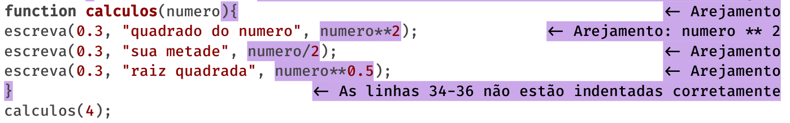 <!-- {.full-width} --> <!-- {p:.bullet} -->
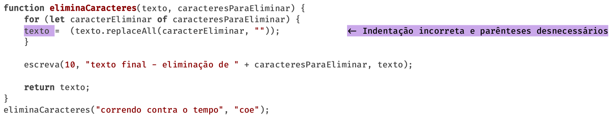 <!-- {.full-width} -->

---
## 03. Nomes de variáveis **sem significado** <!-- {h2:.bullet} -->

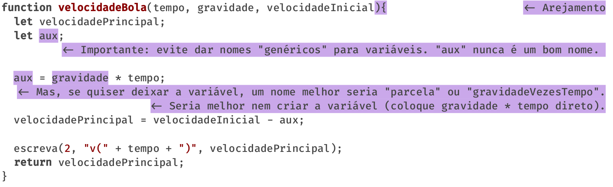 <!-- {.full-width.bullet} -->

---
## 04. Nomes de variáveis **específicos demais** <!-- {h2:.bullet} -->

 <!-- {.full-width.bullet} -->

---
## 05. Esquecer **`console.log`, `alert`** <!-- {h2:.bullet} -->

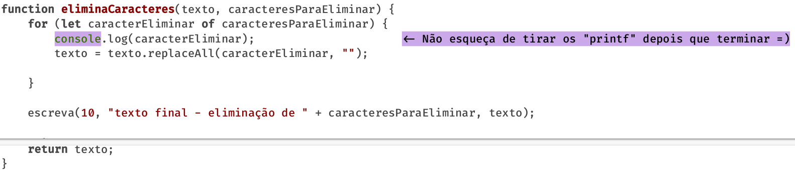 <!-- {.full-width.bullet} -->

---
## 06. Esquecer que **vetor começa de 0** <!-- {h2:.bullet} -->

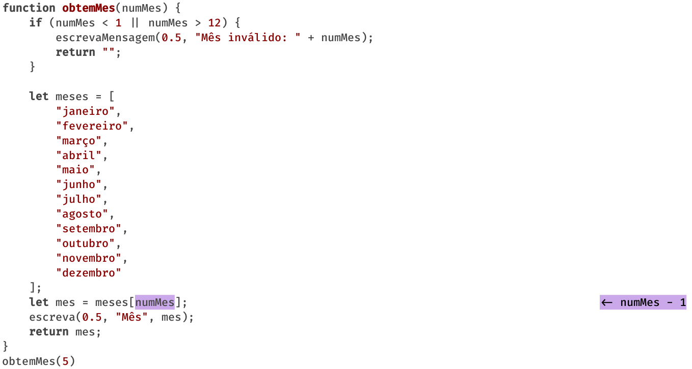 <!-- {.full-width.bullet} -->

---
## 07. Desnecessário **passar tamanho** do vetor <!-- {h2:.bullet} -->

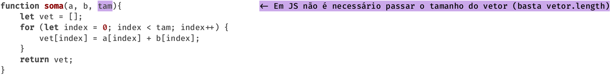 <!-- {.full-width.bullet} -->

---
## 08. Deixar de **parametrizar** <!-- {h2:.bullet} -->

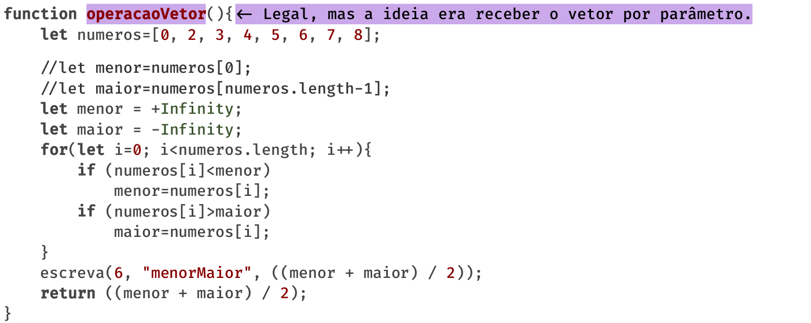 <!-- {.full-width.bullet} -->

---
## 09. Esquecer de **retornar o resultado** <!-- {h2:.bullet} -->

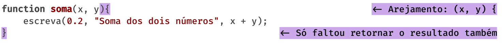 <!-- {.full-width.bullet} -->


