<!-- {"layout": "title"} -->
# **JavaScript** parte 1
## Inclusão, Mais tipos de dados,<br>Clicando em botões e Resolvendo equações :chart_with_upwards_trend:

---
# Na última aula (1/3)

- JavaScript:
  1. Variáveis: **let**, **const** e var 🗡❌ _(tipos de dados são inferidos)_
  1. Tipos:
     - `1. Boolean` <!-- {.tipo-js.tipo-boolean} -->
     - `2. Number` <!-- {.tipo-js.tipo-number} -->
     - `3. String` <!-- {.tipo-js.tipo-string} -->
     - `4. Null` <!-- {.tipo-js} -->
     - `5. Undefined` <!-- {.tipo-js} -->
     - `6. Symbol` <!-- {.tipo-js} -->
     - `7. Object` <!-- {.tipo-js.tipo-object} --> <!-- {ul^0:.multi-column-list-4.no-bullets} -->
  2. Operadores:
     - Aritméticos `+ - / * ** % ++ --`
     - De atribuição `= += -= *= /=`
     - Relacionais `== === != !== < <= > >=`
     - Lógicos `! && ||` <!-- {ul:.multi-column-list-2} -->
  3. O objeto Math:
     ```js
     Math.sqrt(), Math.random(), Math.PI, Math.round()...
     ```

---
<!-- {"classes": "compact-code-more"} -->
## Na última aula (2/3)

- Funções: <!-- {ul:.full-width} -->
  - <!-- {.code-split-2} -->
    ```js
    // tradicional
    function nomeCompleto(nome, sobre) {
      return nome + ' ' + sobre;
    }
    ```
    ```js
    // anônima em variável
    const nomeCompleto = function(nome, sobre) {
      return nome + ' ' + sobre;
    }
    ```
  - Invocação da mesma forma: `nomeCompleto('Mijaro', 'Nomuro')`
- Condicionais:
  - <!-- {.code-split-3} -->
    ```js
    if (nota >= 8) {
      console.log('show');
    } else if (nota >= 6) {
      console.log('bom');
    } else if (nota >= 4) {
      console.log('melhorar');
    } else {
      console.log('🔴');
    }
    ```
    ```js
    // operador ternário
    // condicional
    let vivo = 
            hp > 0 ? 'sim' : 'não';
    
    
    
    
    
    ```
    ```js
    switch (clima) {
      case 'ensolarado':
        cor = 'yellow';
        break;
      case 'chuvoso':
        gotas = true; // vazar
      default:
        cor = 'gray';
    }
    ```

---
<!-- {"classes": "compact-code-more"} -->
## Na última aula (3/3)

- Vetores <!-- {ul:.bulleted.full-width} -->
- <!-- {.code-split-2} -->
  ```js
  let radios = [106.1, 105.1, 98.3];
  let cores = ['azul', 'verde'];
  ```
  ```js
  let animais = [];         // <- vetor vazio
  animais.push('dogue');    // ['dogue']
  ```
- Repetição
- <!-- {.code-split-3} -->
  ```js
  // tradicional
  for(let i=0; i<cores.length;i++){
    console.log(cores[i]);
  }
  // impr. azul, verde
  ```
  ```js
  // for of                      👍
  for (let cor of cores) {
    console.log(cor);
  }
  // impr. azul, verde
  ```
  ```js
  // forEach                     👍
  cores.forEach(function(cor) {
    console.log(cor);
  });
  // impr. azul, verde
  ```
- Vários métodos de ↓ strings e de vetores ⤥
- <!-- {.code-split-2} -->
  ```js
  'Hannah'.toLowerCase() === 'hannah'
  'Ovo'.replace('O', 'Ou') === 'Ouvo'
  'BR4512348ZY'.substr(0, 2) === 'BR'
  'Charmander'.indexOf('arma') === 4
  ```
  ```js
  radios.push(92.5);      // insere no final
  radios.pop();           // remove do final
  cores.unshift('verm');  // insere no início
  cores.shift();          // remove do início
  ```

---
<!-- {"embeddedStyles": ".html-tree { margin: 0 auto; } .html-tree img { max-height: 320px; }"} -->
# Em alguma aula anterior <!-- {style="padding-bottom: 0.2em"} -->
## O HTML visto como uma árvore

::: figure .figure-slides.clean.html-tree
 <!-- {.bullet.figure-step.bullet-no-anim} -->
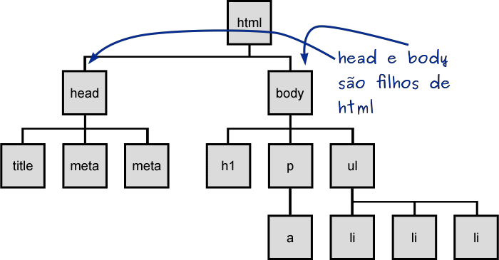 <!-- {.bullet.figure-step.bullet-no-anim} -->
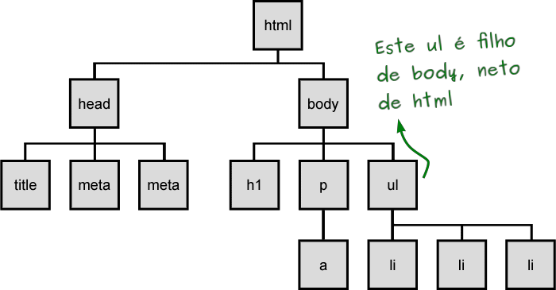 <!-- {.bullet.figure-step.bullet-no-anim} -->
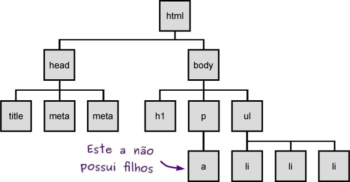 <!-- {.bullet.figure-step.bullet-no-anim} -->
:::

---
<!-- {"layout": "centered"} -->
# Hoje veremos...

1. [Resolvendo Equações!](#resolvendo-equacoes)
1. [Inserindo JavaScript na página](#inserindo-javascript-na-pagina)
1. [Mais tipos de dados](#mais-tipos-de-dados)
1. [Clicando em um botão](#clicando-em-um-botao)

---
<!-- {"layout": "section-header", "hash": "resolvendo-equacoes"} -->
# Resolvendo Equações!
## ~~para roubar na prova~~

- Atividade de hoje
- Elementos HTML para:
  - Entrada de números (`<input>`)
  - Rótulos (`<label>...</label>`)
  - Botão (`<button>...</button>`)
<!-- {ul^1:.content} -->

---
<!-- {"backdrop": "matematica"} -->

---
# Atividade de hoje

1. O objetivo é começar a usar JavaScript _nas páginas_
1. Você deve criar código JavaScript para calcular as raízes reais de uma
   **equação de segundo grau** na forma `ax² + bx + c = 0`
1. [Baixe os arquivos][matematica-seminal]. Instruções detalhadas estão no
   arquivo README.
1. Será necessário utilizar novos elementos HTML:
   - Campo de entrada de dados numéricos
   - Rótulo (ou _label_)
   - Botão

[matematica-seminal]: https://github.com/fegemo/cefet-front-end-math/archive/master.zip

---
<!-- {"fullPageElement": "#input-video", "playMediaOnActivation": {"selector": "#input-video" }} -->

<video src="//fegemo.github.io/cefet-front-end-large-assets/videos/pastel-parte-1.mp4" controls id="input-video"></video>

---
<!-- {"hash": "campo-de-entrada-numerica"} -->
## **Campo de entrada** de dados numéricos

- Usuários podem digitar valores em elementos `<input type="...">`: <input>
- Há vários tipos, como `text`, `date`, `number`
  - Hoje vamos usar **o `type="number"`**:
    ```html
    <input type="number" id="qtde-de-pasteis" value="4">
    ```
    ::: result
    <input type="number" value="4">
    :::
  - É possível estilizá-los para, por exemplo, definir a largura:
    ```css
    input[type="number"] {  /* apenas <input>s do tipo "number" */
      width: 40px;
    }
    ```
<!-- {ul^0:.bulleted} -->

---
## **Entrada** de dados numéricos - **atributos** <!-- {.underline.upon-activation} -->

- Existem alguns atributos do `<input type="number">`:
  - `value="..."`: **valor inicial**
    ::: result
    <input type="number" value="4" style="width: 4em;"> \<input type="number" **value="4"**\>
    :::
  - `min="..."`, `max="..."`: valor **mínimo/máximo** permitido
    ::: result
    <input type="number" min="3" max="5" style="width: 4em;"> \<input type="number" **min="3" max="5"**\>
    :::
  - `step="..."`: **quanto aumentar/diminuir** ao clicar nas setinhas
    ::: result
    <input type="number" step="0.2" style="width: 4em;"> \<input type="number" **step="0.2"**\>
    :::
<!-- {ul^0:.bulleted} -->

---
## **Rótulo** para o campo de entrada

- Além do campo de entrada de dados, é comum colocarmos um texto indicando
  o que deve ser colocado nele, tipo: <label>Pastéis: <input type="number" value="4" style="width: 2em;"></label>
  - Chamamos isso de **rótulo, ou _label_** e usamos `<label>...</label>`
  - Quando clicado, **o rótulo move o foco** para o `<input>`
  - É necessário especificar a que `<input>` ele se refere e isso pode ser feito de duas formas:
    1. ```html
       <label>Pastéis: <input type="number" value="4"></label>   <!-- dentro -->
       ```
    1. ```html
       <label for="qtde-de-pasteis">Pastéis:</label>   <!-- usando label for -->
       <input type="number" value="4" id="qtde-de-pasteis">        <!-- e id -->
       ```

---
<!-- {"hash": "botoes-de-acao"} -->
## **Botões** de ação

- É possível criar botões com o elemento `<button>texto</button>`, em que:
  - `texto` é o que aparece dentro do botão:
    ```html
    <button id="delicia">Sou um delicioso botão</button>
    ```
    ::: result
    <button>Sou um delicioso botão</button> - mas não acontece nada?!
    :::
  - Para atribuir comportamento ao clique do botão, **é necessário usar
    JavaScript!**
    ```js
    let botaoDeliciaEl = document.querySelector('#delicia');
    botaoDeliciaEl.addEventListener('click', function() {
      console.log(':3');
    });     // veremos como isso funciona!!
    ```

---
<!-- {"layout": "section-header", "hash": "inserindo-javascript-na-pagina"} -->
# Inserindo JavaScript na página
## . <!-- {style="opacity: 0"} -->

- Três formas de inclusão:
  1. arquivo externo
  2. embutido
  3. _inline_
<!-- {ul:.content} -->

---
## Três formas de inclusão

- O navegador executa o código assim que vê o elemento `<script></script>` e
  faz _download_ do arquivo apontado
- **Há 3 formas para incluir**:
  1. **Arquivo externo** :thumbsup::thumbsup::thumbsup:
     ```html
       ...  <!-- dentro do HEAD -->
       <script src="executa-no-inicio.js"></script>
     </head>
     <body>
       ...
       <!-- última coisa antes de fechar /BODY -->
       <script src="executa-no-fim-da-pagina.js"></script>
     </body>
     ```

---
## Inclusão em páginas

2. Código embutido :thumbsdown:
   ```html
   <script>
     // código javascript aqui, dentro do HTML
   </script>
   ```
   - Evitar isto, para não ferir o **princípio da separação
     de responsabilidades** entre as 3 linguagens da Web
3. *Inline* :thumbsdown::thumbsdown::thumbsdown:
   ```html
   <button onclick="javascript: window.alert('papagaio');">Mensagem</button>
   ```
   - Além de ferir o **princípio**, não tem como reaproveitar o mesmo código
     para outros elementos

<!-- {ol:.bulleted} -->

---
## **Sumário** de inclusão de JavaScript

| Código   | Quando executa?                                       | Reaproveitamento                   | Fica no cache? | Boa prática? |
|----------|-------------------------------------------------------|------------------------------------|:--------------:|:------------:|
| Externo  | Assim que o navegador vê a inclusão e baixa o arquivo | **Máximo**: entre todas as páginas | **Sim**        | **Sim**      |
| Embutido | Assim que o navegador vê o `<script>...</script>`     | Médio: apenas dentro da página     | Não            | Não          |
| _Inline_ | Quando acontece o evento (eg, `click`)                | Nenhum                             | Não            | Não          |

<!-- {table:.aero-rows} -->

---
## **Onde colocar** `<script src="..."></script>`?

- Pode ser colocado em qualquer lugar da página
  - <!-- {.code-split-2.compact-code-more} -->
    <!-- {ul^0: style="padding-left: 0"} -->
    - Os mais comuns:
      1. Ao final do `<head>` (logo antes de fechá-lo com `</head>`)
      2. Ao final do `<body>` (logo antes de fechá-lo com `</body>`)
    ```html
      ...  <!-- dentro do HEAD -->
      <script src="executa-no-inicio.js"></script>
    </head>
    <body>
      ...
      <!-- última coisa antes de fechar /BODY -->
      <script src="executa-no-fim.js"></script>
    </body>
    </html>
     ```
- Aonde colocar então?
  - Prefira ao final do `<body>`
  - Um arquivo JavaScript pode atrasar o desenho da página
  - Se atrasar depois que já a desenhou, o usuário nem percebe 👍


---
<!-- {"fullPageElement": "#inclusion-video", "playMediaOnActivation": {"selector": "#inclusion-video" }} -->

<video src="//fegemo.github.io/cefet-front-end-large-assets/videos/pastel-parte-2.mp4" controls id="inclusion-video"></video>

---
<!-- {"layout": "section-header", "hash": "mais-tipos-de-dados"} -->
# Mais tipos de dados
## Os primitivos e o complexo

- `1. Boolean` <!-- {.tipo-js.tipo-boolean} --> 👀 já vimos
- `2. Number` <!-- {.tipo-js.tipo-number} --> 👀 já vimos
- `3. String` <!-- {.tipo-js.tipo-string} --> 👀 já vimos
- `4. Null`  <!-- {.tipo-js} --> ⬅
- `5. Undefined` <!-- {.tipo-js} --> ⬅
- `6. Symbol` <!-- {.tipo-js style="color: gray;"} --> [🌐 Symbols? É de comer?][symbol] <!-- {.bullet target="_blank" style="font-size: .75em; color: white"} -->
- `7. Object` <!-- {.tipo-js.tipo-object} --> ⬅

<!-- {ul:.bullet.no-bullets} -->

[symbol]: https://medium.com/trainingcenter/javascript-symbols-decifrando-o-mist%C3%A9rio-383e359e64e3
---
## O tipo `4. Null` <!-- {.tipo-js} -->

- Tecnicamente um tipo, mas na prática contém apenas 1 valor: `null`
- ```js
  let x = null;
  console.log(typeof x);    // imprime null
  ```
  Usamos quando uma variável **não tem um valor aplicável naquele momento** <!-- {li:.push-code-right} -->
  
## O tipo `5. Undefined` <!-- {.tipo-js} -->

- Parecido com Null, possui apenas 1 valor: `undefined`
- ```js
  let x;
  console.log(typeof x);    // imprime undefined
  ```
  É o tipo padrão de **variáveis que não foram associadas a nenhum valor** <!-- {li:.push-code-right} -->

---
<!-- {"classes": "compact-code"} -->
## O tipo `7. Object` <!-- {.tipo-js.tipo-object} -->

- É um **"saquinho" de propriedades**: <!-- {ul:.push-code-right.full-width} -->
  ```js
  let jogador = {
    pontos: 1420,
    vidas: 2
  };
  console.log(jogador.pontos);
  // imprime 1420
  ```  
  - Propriedade: (**nome → valor**)
    - Nome: uma String
    - Valor: qualquer coisa, exceto `undefined`
- No exemplo, o objeto tem 2 propriedades: <!-- {li^0:.bullet} -->
  1. Nome: `pontos`, valor: `1420`
  1. Nome: `vidas`, valor: `2`
- Para acessar as propriedades, há 2 formas: <!-- {li:.bullet} -->
  - <!-- {.code-split-2} -->
    ```js
    // notação ponto
    console.log(jogador.vidas);
    ```
    ```js
    // notação colchete
    console.log(jogador['vidas']);
    ```

---
## Objetos conhecidos

- ::: did-you-know .push-right width: 250px;
  Quando um objeto tem uma **propriedade que é uma função**, chamamos ela de **método**.
  :::
  Há vários objetos comuns que usamos no dia a dia: `Math`, `console`, `window`. Exemplos:
  - O objeto `Math` possui uma propriedade:
    - ```js
      Math.PI
      ```
      (PI → 3.14159) (cujo valor é `Number`) <!-- {.tipo-js.tipo-number} -->      
  - O objeto `console` possui uma propriedade
    - ```js
      console.log
      ```
      (log → function() {...})
  - O objeto `window` possui uma propriedade
    - ```js
      window.alert
      ```
      (alert → function() {...})
- E se quisermos criar nossos próprios objetos? #mcfaz? <!-- {li:.bullet} -->

<!-- {ul^3:.bulleted-0.push-code-right-without-clearing.compact-code-more} -->


---
<!-- {"classes": "compact-code"} -->
## Criando um objeto <small>(2 formas)</small>

1. Na **forma literal**: <!-- {ol:.bulleted-0} --> 
   ```js
   let jogador = {             // forma mais expressiva, curta e sexy 😎
     pontos: 1420,             // propriedades separadas por vírgula
     vidas: 2
   };
   ```
   ```js
   let jogador = {};           // um objeto vazio: { }
   jogador.pontos = 1420;      // criou jogador.pontos com valor 1420
   jogador.vidas = 2;          // criou jogador.vidas
   ```
   - Novas propriedades podem ser atribuídas mesmo após sua criação! <!-- {li:.bullet} -->
2. Na **forma do operador `new`**: <!-- {strong:.alternate-color} -->
   - <!-- {li:.code-split-2} -->
     ```js
     let jogador = new Object();
     jogador.pontos = 1420;
     jogador.vidas = 2;
     ```
     - Contudo, desta forma sempre cria-se um objeto vazio e deve-se preenchê-lo

---
<!-- {"layout": "2-column-content"} -->
## Objetos dentro de objetos

```js
let voo = {
    companhia: 'Gol',
    numero: 815,
    decolagem: {
        IATA: 'SYD',
        horario: '2004-09-22 14:55',
        cidade: 'Sydney'
    },
    chegada: {
        IATA: 'LAX',
        horario: '2004-09-23 10:42',
        cidade: 'Los Angeles'
    }
};
```
- Aqui existem 3 objetos:
  - O **`voo`**, com as propriedades:
     - `companhia`
     - `numero`
     - **`decolagem`**
     - **`chegada`**
  - `decolagem` e `chegada` são objetos por si mesmos

---
<!-- {"layout": "2-column-content"} -->
## **Métodos** de objetos <!-- {.alternate-color} -->

```js
const loja = {
  livros: [       // prop. é um vetor
    'macunaíma',
    'torre negra'
  ],
  dinheiro: 500,  // propri. é number
  
  // método vender
  vender: function() { // p. é função
    this.dinheiro += 15;
  } 
};

loja.vender(); // loja.dinheiro = 515
loja.vender(); // loja.dinheiro = 530
```

- O **<u>valor</u> de uma propriedade** pode ser uma **função**
  - Nesse caso, chamamos ela de **método** <!-- {.alternate-color} -->
  - Todo método tem acesso ao próprio objeto com o ponteiro `this`
  - Objetos com métodos formam o princípio do conceito de **Orientação a Objetos**


---
## Outros tipos, baseados em `Object` <!-- {.tipo-js.tipo-object} -->

- Existem **outros tipos complexos**, que são **baseados em `Object`**: <!-- {.tipo-js.tipo-object} -->
  
  `Date`
    ~ Por exemplo, para imprimir o horário atual no console:
      ```js
      let agora = new Date();
      console.log(agora);     //Sun Jan 17 2021 18:11:46...
      ```
  
  `Function`
    ~ (sim! funções são objetos em JavaScript)
  
  `Array`
    ~ (vetores também são objetos)

  `SeuProprioTipo`™
    ~ (é possível criar novos tipos também)

---
<!-- {"layout": "section-header", "hash": "clicando-em-um-botao"} -->
# Clicando em um botão
## Dando comportamento à página

- Conhecendo o DOM
- Selecionando um elemento
- Criando um evento de clique
<!-- {ul:.content} -->

---
# Nosso plano...

- Para fazer algo acontecer quando um botão for pressionado, precisamos,
  em JavaScript:
  1. Criar uma **função com o código que será executado** quando o botão
     for clicado
  1. **Recuperar o elemento HTML** do botão e colocá-lo em uma variável
  1. Atribuir a função ao **evento de clique** do botão
- Já sabemos criar funções ([tradicionais][js0-funcoes-tradicionais] e [anônimas][js0-funcoes-anonimas]), então vamos para o item 2...
  
[js0-funcoes-tradicionais]: http://localhost:8081/classes/js0/#declarando-e-invocando-funcoes
[js0-funcoes-anonimas]: http://localhost:8081/classes/js0/#mais-sobre-funcoes-e-metodos-uteis

---
<!-- {"hash": "conhecendo-o-dom"} -->
# Conhecendo o DOM

- O DOM é uma **visão dos elementos** HTML da página **como uma árvore**:
- <!-- {.code-split-2.compact-code} -->
  ```html
  <!DOCTYPE html>
  <html>
  <head>
    <title>HTML</title>
  </head>
  <body>
    <!-- Add your content here -->
  </body>
  </html>
  ```
  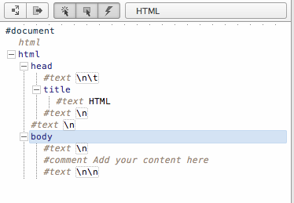
- DOM: _Document Object Model_
  - É a versão "viva" do código HTML da página 
*[DOM]: Document Object Model*

---
## O objeto **document**

- O objeto `document` dá acesso ao **Document Object Model**, ou DOM
- Por exemplo, para pegar um elemento a partir de seu `id` e colocá-lo em
  uma variável:
  ```js
  let botaoDeliciaEl = document.querySelector('#botao-delicia');
  ```
  - Agora é possível fazer várias coisas com o botão, como:
    1. **Associar um evento de clique**
       - Veja nos próximos slides
    1. Pegar ou alterar seus atributos
    1. Alterar seu texto
    1. Alterar seu estilo

---
<!-- {"hash": "recuperando-elemento-dom"} -->
# Selecionando um elemento

- A função `document.querySelector(seletor)` permite que, a partir de um código
  JavaScript, recuperemos um elemento do DOM
  - Ela recebe um único **argumento** que é um **seletor CSS**. Exemplo:
    ```js
    let logoEl = document.querySelector('#logomarca');
    let tabelaEl = document.querySelector('#tesouros-pirata');
    let principalEl = document.querySelector('main');
    ```
    - Ela retorna um elemento HTML que pode ser alterado
  - Também existe `document.querySelectorAll(seletor)` (repare o **`all`**),
    que retorna mais de um elemento, mas veremos ele depois

---
<!-- {"hash": "evento-clique"} -->
# Criando um evento de clique

- Para **executar alguma coisa quando um botão** (ou qualquer elemento, na verdade)
  **é clicado**, precisamos **registrar uma função para ser chamada** quando um
  clique for feito nele:
  ```js
  // recupera o elemento do botão no DOM
  let botaoDeliciaEl = document.querySelector('#botao-delicia');

  // atrela uma função ao evento de 'click' do botão
  botaoDeliciaEl.addEventListener('click', function() { /* ... */ });
  ```
  - Chamamos essa função de **_callback_**

---
## Exemplo de _callback_

- Uma _callback_ é só um nome especial para quando uma função passada
  como argumento:
  ```js
  // recupera o elemento do botão no DOM
  let botaoDeliciaEl = document.querySelector('#botao-delicia');

  // atrela uma callback ao evento de 'click' do botão
  botaoDeliciaEl.addEventListener('click', function() {
    alert('O botão delícia foi clicado!!');
    // pode fazer várias coisas aqui
  });
  ```

---
## Implementando a função **antes**

- É possível implementar a função **antes da linha onde ela é atribuída ao
  evento** de clique:
  ```js
  // define a função 'mostraMensagem'
  function mostraMensagem() {
    alert('O botão delícia foi clicado!!');
  }

  // atrela uma função ao evento de 'click' do botão
  botaoDeliciaEl.addEventListener('click', mostraMensagem);
  ```
  - Isso costuma deixar o código mais legível e organizado :thumbsup:

---
<!-- {"hash": "valor-do-input"} -->
# Usando o valor de um `input`

- Para **_pegar_ <!-- {.underline.upon-activation.delay-600} --> o valor** <!-- {ul:.bulleted} -->
  digitado em um `<input>`:
  ```js
  let qtdePasteisEl = document.querySelector('#qtde-de-pasteis');
  let quantidade = qtdePasteisEl.value;
  console.log(quantidade);    // imprime valor que estava no input
  ```
- Para **_definir_ <!-- {.underline.upon-activation.delay-1800} --> o valor**
  mostrado no `<input>` usando JavaScript:
  ```js
  let qtdePasteisEl = document.querySelector('#qtde-de-pasteis');
  qtdePasteisEl.value = 25;
  ```

---
<!-- {"fullPageElement": "#writing-video", "playMediaOnActivation": {"selector": "#writing-video" }} -->

<video src="//fegemo.github.io/cefet-front-end-large-assets/videos/pastel-parte-3.mp4" controls id="writing-video"></video>

---
<!-- {"layout": "centered"} -->
# Referências

1. Capítulo 2 do livro "Javascript: The Good Parts"
1. Mozilla Developer Network (MDN)

---
<!-- {"layout": "main-point", "state": "emphatic", "hash": "erros-comuns"} -->
# Erros comuns durante a prática

---
## 01. Falhar na **indentação** e **arejamento** (1/2) <!-- {h2:.bullet} -->

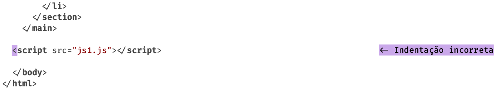 <!-- {.full-width.dashed} --> <!-- {p:.bullet} -->
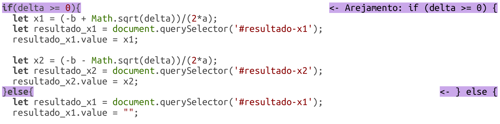 <!-- {.full-width.dashed} -->

---
## 01. Falhar na **indentação** e **arejamento** (2/2)

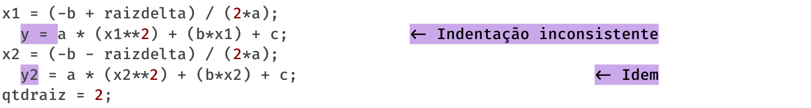 <!-- {.full-width.dashed} --><!-- {p:.bullet} -->
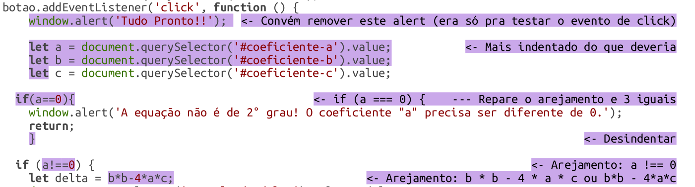 <!-- {.full-width.dashed} -->

---
## 02. Código com **baixa legibilidade** <!-- {h2:.bullet} -->

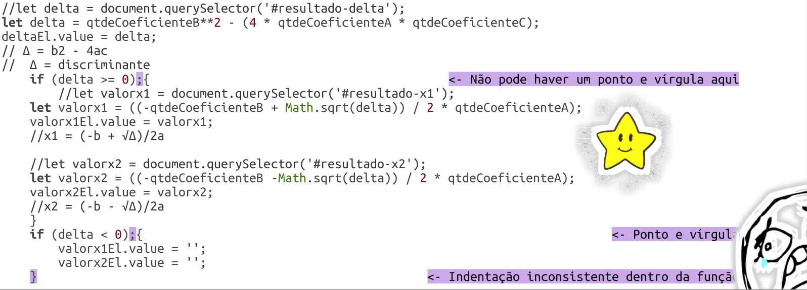 <!-- {.full-width} --><!-- {p:.bullet} -->

---
## 03. Esquecer **`alert`** ou **`console.log`** <!-- {h2:.bullet} -->

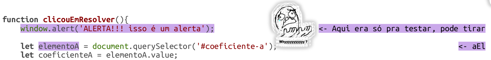 <!-- {.full-width} --><!-- {p:.bullet} -->

---
## 04. Nome **genérico para arquivo** <!-- {h2:.bullet} -->

 <!-- {.full-width.dashed} --><!-- {p:.bullet} -->
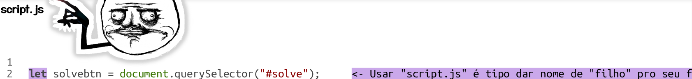 <!-- {.full-width.dashed} -->
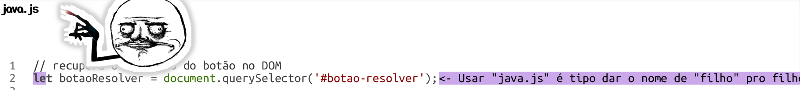 <!-- {.full-width.dashed} -->
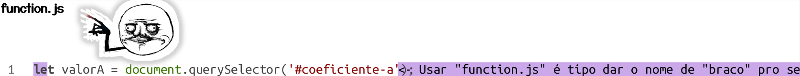 <!-- {.full-width.dashed} -->

---
<!-- {"layout": "2-column-content-zigzag"} -->
## 05. **Sufixo "El"** para certas variáveis <!-- {h2:.bullet} -->

❌ <!-- {style="text-align: right; margin-right: 1em"} -->

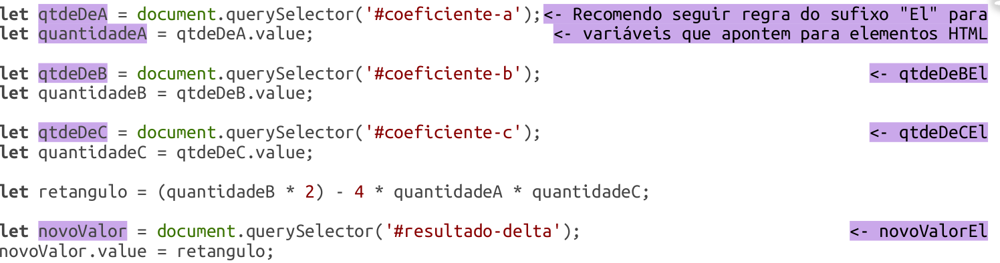 <!-- {.full-width} -->

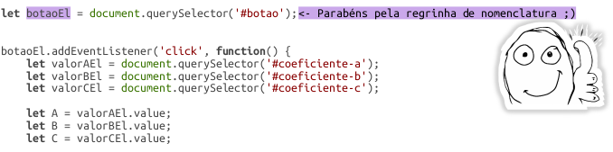 <!-- {.full-width} -->

✅