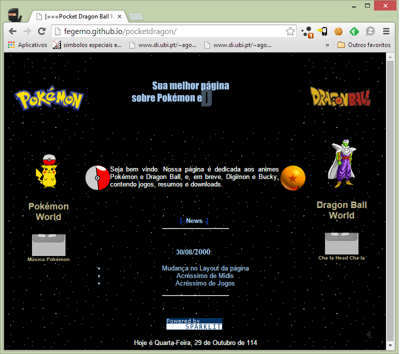

<!-- {"layout": "title"} -->
# Javascript - Parte 1
## História, Características e Delícias da linguagem

---
<!-- {"layout": "regular"} -->
# Roteiro

1. História
1. Características da linguagem
1. Como usar em páginas web
1. Operadores
1. Variáveis
1. Tipos de dados
1. _Statements_
1. Funções

---
# História

1989 - 1993 <!-- {.bullet-old} -->
  ~ Tim Berners-Lee cria a WWW em CERN (*European Organization for
    Nuclear Research*) e a deixa aberta ao público geral <!-- {dd:.bullet-old} -->

1994 <!-- {.bullet-old} -->
  ~ Håkon propõe uma linguagem para dar conta da responsabilidade de
    alterar a aparência de páginas web chamada CSS <!-- {dd:.bullet-old} -->

1995 (maio)
  ~  <!-- {.portrait.push-right} -->
    Brendan Eich, funcionário do Netscape, criou (em 10 dias!!) uma
    linguagem para alterar páginas web dinamicamente - o _Mocha_

1995 (setembro)
  ~ _LiveScript_ (novo nome) é lançado com a versão beta do Netscape 2.0

1995 (dezembro)
  ~ Nome alterado para JavaScript na versão 2.0 oficial para
    aproveitar a fama do Java

---
## História (cont.)

1996 (agosto)
  ~ Microsoft adota o JavaScript sob o nome de JScript no navegador
    Internet Explorer 3.0

1996 (novembro)
  ~ A Netscape submeteu o JavaScript para a
    _Ecma international_ para padronização. A especificação recebeu o nome de
     _ECMAScript_

1997 (junho)
  ~ A _Ecma International_ publicou a primeira versão, o ECMA-262

1998
  ~ Versão 2 do ECMAScript

1999 (junho)
  ~ Versão 3 do ECMAScript

2009
  ~ Versão 5 do ECMAScript

2013 - 2018
  ~ Versões 6-9
     <!-- {style="height: 1em;"} -->
    do ECMAScript, que mudaram de nome para **es2015**, **es2016**, **es2017**
    e **es2018** respectivamente


*[ECMA]: European Computer Manufacturers Association*
*[Ecma]: European Computer Manufacturers Association*

---
## JavaScript nos anos 90

[](http://fegemo.github.io/pocketdragon/)

---
# Características da linguagem

---
## O que é Javascript?

- Linguagem imperativa, com tipagem dinâmica, interpretada
- Há um interpretador embutido em cada navegador:
  - Chrome &#8594; V8
  - Firefox &#8594; SpiderMonkey
  - Opera &#8594; Carakan &#8594; V8 (2013)
  - Safari &#8594; SquirrelFish
  - Internet Explorer &#8594; Chakra
  - Edge &#8594; Chakra

---
## O que é Javascript?

- Linguagem **orientada a objetos**, com características funcionais
- Programação dirigida por **eventos**
- Sintaxe parecida com C, C++, C# e Java
  - Javascript **não** é Java
  - Ter "Java" no nome foi uma jogada de marketing da Netscape
- Memória auto-gerenciada (_garbage collector_)
- _case-sensitive_

---
# Como usar em uma página Web

---
## Três formas de inclusão

- O navegador executa o código assim que vê o elemento `<script></script>` e
  faz _download_ do arquivo apontado
- **Há 3 formas para incluir** (tipo CSS):
  1. **Externa** :thumbsup:
     ```html
       ...  <!-- dentro do HEAD -->
       <script src="executa-no-inicio.js"></script>
     </head>
     <body>
       ...
       <!-- última coisa antes de fechar /BODY -->
       <script src="executa-no-fim-da-pagina.js"></script>
     </body>
     ```

---
## Inclusão em páginas

2. Embutida :thumbsdown:
   ```html
   <script>
     // código javascript aqui
   </script>
   ```
3. *Inline* :thumbsdown::thumbsdown::thumbsdown:
   ```html
   <button onclick="javascript: alert();">Mensagem</button>
   ```

---
# Operadores

- Semelhantes aos de C, Java e C#:
  - Aritméticos
    - **`+`** soma
    - **`-`** subtração
    - **`*`** multiplicação
    - **`/`** divisão
    - **`%`** resto da divisão
    - **`++`** incremento
    - **`--`** decremento
  - Atribuição
    - **`=`** simples
    - **`+=  /=  %=`** composta
  - Relacionais
    - **`==`** igualdade
    - **`===`** igualdade forte
    - **`!=`** desigualdade
    - **`!==`** desigualdade forte
    - **&lt;  &lt;=** menor/menor igual
    - **&gt;  &gt;=** maior/maior igual
  - Lógicos
    - **`!`** não
    - **&amp;&amp;** e
    - **`||`** ou

<!-- {ul^4:.multi-column-list-2} -->

---
# Variáveis

---
## Sintaxe

- Criamos variáveis com as palavras-chave `let`
   <!-- {style="height: 1em;"} -->
  `const`  <!-- {style="height: 1em;"} -->
  ou `var` :thumbsdown:
  ```js
  let alunosMatriculados = 20;  // escopo de bloco
  const qtdeHorasAula = 66.5;   // escopo de bloco, valor constante
  var nomeAula = 'js1';         // escopo de função
  ```


---
## **Nomes válidos** para variáveis

- <pre style="float: right; font-size: 0.75em; color:#111; background: #ddd; border-radius: 10px; padding: 20px">
    abstract native new null goto
    boolean break byte return long with
    case catch char class const continue
    debugger default delete do double while
    else enum export extends var volatile void
    false final finally float for function
    if implements import in instanceof int interface
    package private protected public
    short static super switch synchronized
    this throw throws transient true try typeof
  </pre>
  Nomes de variáveis devem:
  - **Começar com $, \_** ou qualquer caractere unicode que represente
    uma **letra**
  - Quaisquer combinações do conjunto anterior, mais caracteres unicode
    que representem números e alguns tipos de pontuação
    - [Validador de nomes](https://mothereff.in/js-variables) de
      variáveis JavaScript


---
# Tipos de dados

---
## Tipos de dados

- Como dito, Javascript é **fracamente tipada** ou **dinâmica**
  - Não é necessário declarar o tipo, ele é reconhecido dinamicamente
    ```js
    let nota = 10;            // tipo numérico
    let aluno = 'Adamastor';  // tipo string
    ```
  - Uma mesma variável pode ter tipos diferentes em momentos diferentes
    ```js
    let nota = 10;            // nota é númerico
    let nota = 'Dó';          // agora virou string
    ```
    - Isso é uma boa prática?

---
## Tipos de dados (cont.)

- Seis tipos de dados **primitivos**:
  - `Boolean`
  - `Number`
  - `String`
  - `Null`
  - `Undefined`
  - `Symbol`  <!-- {style="height: 1em;"} --> <!-- {ul:.multi-column-list-3} -->
- Um tipo **complexo**
  - `Object`
  - Há outros derivados de `Object`...
- Podemos usar o operador `typeof` para determinar o tipo de uma variável:
  ```js
  let nota = 10;
  console.log(typeof nota);   // imprime number
  let nota = 'Dó';
  console.log(typeof nota);   // imprime string
  ```

---
## Boolean

- Representa uma entidade lógica e pode ter dois valores:
  - `true`
  - `false`
- Exemplo:
  ```js
  let isPlaying = true;   // poderia ser false
  // ...
  if (isPlaying) {
    // ...
  }
  ```

---
## Number

- Em JavaScript **há apenas um tipo numérico**: 64bits (precisão dupla)
- Não há um tipo para representar inteiros
  - 1 e 1.0 são o mesmo valor
- Na forma de **constante literal**, pode ser expressado assim:
  ```js
  5
  5.674     // 5 vírgula 674
  4e2       // 4 vezes 10 elevado a 2 (400)
  25e-2     // 25 vezes 10 elevado a -2 (0.25)
  ```

---
## Number (cont.)

- Valores especiais
  - `NaN` - _not a number_
    - Retornado em operações ilegais (_e.g._, `Math.sqrt(-1)`)
  - `Infinity` (_e.g._, `1/0`)
- Números têm métodos, por exemplo:
  - [`toPrecision`][toPrecision], retorna uma string com o **número arredondado com o certo número de casas decimais** (e.g., `Math.PI.toPrecision(5)`)
  - [`toFixed`][toFixed], retorna uma string com o número arredondado com certo número de casas decimais **em formato decimal** (e.g., `Math.PI.toFixed(5)`)

[toFixed]: https://developer.mozilla.org/en-US/docs/Web/JavaScript/Reference/Global_Objects/Number/toFixed
[toPrecision]: https://developer.mozilla.org/en-US/docs/Web/JavaScript/Reference/Global_Objects/Number/toPrecision
[toExponential]: https://developer.mozilla.org/en-US/docs/Web/JavaScript/Reference/Global_Objects/Number/toExponential

---
## String

- **Cadeia de caracteres**
- Não existe o tipo "caractere" :wink:
  - Seria apenas uma string com 1 caractere
- Forma literal: áspas **simples** ou duplas
  ```js
  "Abc" === 'Abc'   // simples é mais legal!!
  ```
- Propriedade `length`
  ```js
  console.log('Cachorro'.length); // 8
  ```

---
## String (cont.)

- **Strings são imutáveis** (como String em Java), mas criar novas strings é
  simples via concatenação:
  ```js
  console.log('c' + 'a' + 't');   // imprime 'cat'
  ```
- Strings têm métodos, [vários deles](https://developer.mozilla.org/en-US/docs/Web/JavaScript/Reference/Global_Objects/String)
  - Exemplos:
    ```js
    'barba negra'.toUpperCase() === 'BARBA NEGRA'
    'Mississippi'.indexOf('ss') === 2
    'Orinoco'.replace('noco', '') === 'Ori'
    'a'.repeat(3) === 'aaa'
    ```

---
## Null

- O tipo Null contém apenas um valor
  - `null`
- Usado quando uma variável **não tem um valor aplicável àquele momento**
  ```js
  let x = null;
  console.log(typeof x);    // imprime null
  ```

---
## Undefined

- O tipo Undefined é o tipo atribuído a **variáveis que não foram associadas a
  nenhum valor**
- Tem um único valor
  - `undefined`
- Exemplo:
  ```js
  let x;
  if (typeof x === 'undefined') {
    // será executado :3
  }
  ```

---
## Object

- <pre style="float: right; margin: 0 1em 1em 1em; padding: 0.25em 1em;"><code>let jogador = {
    pontos: 1420,
    vidas: 2
  };</code>
  </pre>
  É um **"container" de propriedades**
  - Propriedade: (**nome &#8594; valor**)
    - Nome: qualquer string ou symbol
    - Valor: qualquer valor Javascript exceto `undefined`
- É como se cada objeto fosse um dicionário (Java, C#), só que as chaves
  devem sempre ser strings ou symbols
- ~~Não existem classes~~ Hoje existem classes em JS
  - Mas um objeto pode "herdar" de outro (!!!)
- Novas propriedades podem ser atribuídas mesmo após a instanciação (!!!)

---
## Instanciando um Object de 2 formas

- Forma literal (preferida :thumbsup:):
  ```js
  let jogador = {             // forma mais expressiva, curta e sexy
    pontos: 1420,             // propriedades separadas por vírgula
    vidas: 2
  };
  ```
  ```js
  let jogador = {};           // um objeto vazio: { }
  jogador.pontos = 1420;      // criou jogador.pontos com valor 1420
  jogador.vidas = 2;          // criou jogador.vidas
  ```

---
## Instanciando um Object (cont.)

- Forma usando operador `new` (menos legal¹ :thumbsdown:):
  ```js
  var jogador = new Object();
  jogador.pontos = 1420;
  jogador['vidas'] = 2;       // é possível usar a notação obj['prop'] também
  ```
  - ¹ Menos legal: o operador `new` tem um funcionamento um pouquinho diferente
    do tradicional... veremos mais adiante

---
<!-- {"layout": "2-column-content"} -->
## Objetos dentro de objetos

```js
let voo = {
    companhia: 'Gol',
    numero: 815,
    decolagem: {
        IATA: 'SYD',
        horario: '2004-09-22 14:55',
        cidade: 'Sydney'
    },
    chegada: {
        IATA: 'LAX',
        horario: '2004-09-23 10:42',
        cidade: 'Los Angeles'
    }
};
```
- Aqui existem 3 objetos:
  - O **`voo`**, com as propriedades:
     - `companhia`
     - `numero`
     - **`decolagem`**
     - **`chegada`**
  - `decolagem` e `chegada` são objetos por si mesmos

---
## Outros tipos

- O Javascript possui **outros tipos complexos, que são baseados em Object**:
  - `Function` (sim! funções são objetos)
  - `RegExp` (expressão regular)
  - `Array`

---
# Arrays

- Arrays são vetores unidimensionais, **heterogêneos**
- Os itens dos vetores **não** precisam ter o mesmo tipo
  ```js
  const listaDeCoisas = ['Aew', 35, true, [], 'outra string'];
  ```
- Propriedades:
  - `length`
    ```js
    console.log(listaDeCoisas.length);  // imprime 5
    ```

---
## Arrays (cont.)

- Indexação: usa-se os símbolos `[` e `]` para acessar um item do array
  ```js
  console.log(listaDeCoisas[1]); // imprime 35
  listaDeCoisas[0] = '';
  console.log(listaDeCoisas[0]); // imprime string vazia
  ```
- Arrays possuem métodos, [vários](https://developer.mozilla.org/en-US/docs/Web/JavaScript/Reference/Global_Objects/Array):
  ```js
  var frutas = [];
  frutas.push('kiwi', 'maçã', 'banana');
  console.log(frutas.length); // 3
  ```
---
## Métodos de Arrays

- Inserindo e removendo elementos
  ```js
  frutas.push('mamão');         // insere 'mamão' no final
  frutas.pop();                 // remove o último ('mamão')
  frutas.unshift('tangerina');  // insere 'tangerina' no início
  frutas.shift();               // remove o primeiro ('tangerina')
  ```
- E alguns outros:
  ```js
  frutas.reverse()              // inverte a ordem dos itens
  frutas.sort();                // ['banana', 'kiwi', 'maçã']
  frutas.splice(2, 1);          // Remove 1 elemento, a partir do 3º
  ```

---
# _Statements_

---
## if/else

- Similar a C, Java
  ```js
  if (hora < 12) {
    manha = true;
  } else {
    manha = false;
  }
  ```
  ```js
  if (nota === 3)      { conceito = 'C'; }
  else if (nota === 4) { conceito = 'B'; }
  else if (nota === 5) { conceito = 'A'; }
  else                 { conceito = 'D'; }
  ```

---
## for

- Forma tradicional :thumbsdown::
  ```js
  for (let i = 0; i !== 10; i++) {
    console.log(i);   // 0, 1, 2 ... 9
  }
  ```
- Percorre items do objeto (indesejada):
  ```js
  const cores = ['azul', 'rosa', 'branco'];
  for (let i in cores) {
    console.log(cores[i]);  // azul, rosa, branco
  }
  ```

---
## for (cont.)

- Forma modernosa (funcional) :thumbsup::thumbsup::
  ```js
  const cores = ['azul', 'rosa', 'branco'];
  cores.forEach(function(cor) {
    console.log(cor);   // azul, rosa, branco
  });
  ```
- Forma moderníssima  <!-- {style="height: 1em;"} --> :thumbsup::thumbsup::
  ```js
  const cores = ['azul', 'rosa', 'branco'];
  for (let cor of cores) {
    console.log(cor);   // azul, rosa, branco
  }
  ```

---
<!-- {"layout": "2-column-content"} -->
## while/do..while

- Condição **primeiro**
  ```js
  let i = 1;
  while (i !== 10) {
    console.log(i);
    i++;
  }
  ```
1. Condição **depois**
   ```js
   let i = 0;
   do {
     i++;
     console.log(i);
   } while (i !== 10);
   ```

---
# Funções

---
## Funções (cont.)

- São declaradas usando a palavra `function`:
  ```js
  function add(a, b) {
    return a + b;
  }
  add(2,5);   // retorna 7
  ```
  ```js
  // Constante 'add' que armazena uma função (anônima) que soma dois números
  const add = function(a, b) {
    return a + b;
  };
  add(3,6);   // retorna 9
  ```

---
## Parâmetros

- Uma função declara que parâmetros ela utiliza, **mas ela pode ser chamada
  <u>com mais ou menos argumentos</u>** (!!!)
  ```js
  function votar(governador, presidente) {
    console.log(governador);
    console.log(presidente);
  }

  votar('pink', 'cérebro');               // imprime os dois
  votar('mickey');                        // imprime mickey e undefined
  votar('gohan', 'goku', 'kuririn');      // imprime apenas os sayajins
  ```
  - E se eu quiser o Kuririn?

---
## Parâmetros (cont.)

- Toda função tem acesso a um objeto `arguments` que contém **todos os valores
  passados como argumentos** na chamada da função:
  ```js
  media();          // NaN
  media(1);         // 1
  media(5, 15);     // 10
  function media() {
    for (var i = 0, acum = 0; i !== arguments.length; i++) {
      acum += arguments[i];
    }
    return acum / arguments.length;
  }
  ```

---
## Funções (cont.)

- **Funções** podem ser definidas **dentro de outras funções**
  - As funções internas tem acesso ao escopo das externas (_closure_)
- Quando uma função é armazenada em uma propriedade de um objeto, **chamamos
  ela de <u>método</u>**:
  ```js
  let passaro = {
    nome: 'Abelardo',
    voando: false;
    voar: function() {
      // pegar impulso e saltar
    }
  };
  passaro.voar();     // chamando o método
  ```

---
## Métodos

- Um **objeto especial chamado `this`** é disponibilizado para os métodos e são
  uma referência ao objeto "dono" do método
  ```js
  let passaro = {
    nome: 'Abelardo',
    voando: false;
    voar: function() {
      this.voando = true;   // uso do 'this' é obrigatório
    }
  };
  ```

---
## Valor de retorno

- Uma função (ou método) **sempre retorna um valor**
- Se não houver um `return` na função, esse valor é `undefined`
  - Mas em certas circunstâncias, também pode ser o valor de `this`

---
## Escopo do `var`

- Escopo em linguagens de programação são uma **definição de visibilidade
  e tempo de vida de variáveis e parâmetros**
- Variáveis declaradas com `var` são **visíveis em todo lugar dentro da
  função** onde foram declarados:
  ```js
  function construir(tipo) {
    if (tipo === 'casa') {
      var imovel = new Casa();
    }
    return imovel;
  }
  construir('casa');          // Ok, retorna a casa
  ```


<!--
## Funções são objetos

1. Funções são objetos, então podem ser usadas em variáveis, objetos e arrays
  ```js
  var operacoes = [add, subtract, multiply];
  operacoes[0](4, 5);   // retorna 9
  ```


## Funções são objetos (cont.)

1. Elas podem ser passadas como parâmetro ou retornadas de outras funções
  ```js
  function currifica(f, parametro1) {
    return function(parametro2) {
      return f(parametro1, parametro2);
    }
  }
  var add1 = currifica(add, 1);
  add1(10);     // retorna 11;
  ```


## Funções são objetos (cont.)

1. Como elas são objetos, elas podem ter propriedades ou mesmo métodos
  ```js
  function fibonacci(n) {
    if (fibonacci.cache[n]) return fibonacci.cache[n];
    else {
      var f = fibonacci(n-1) + fibonacci(n-2);
      fibonacci.cache[n] = f;
      return f;
    }
  }
  fibonacci.cache = { 1: 1,  2: 1 };
  ```
-->
---
# Referências

1. Capítulo 2 do livro "Javascript: The Good Parts"
1. Mozilla Developer Network (MDN)
