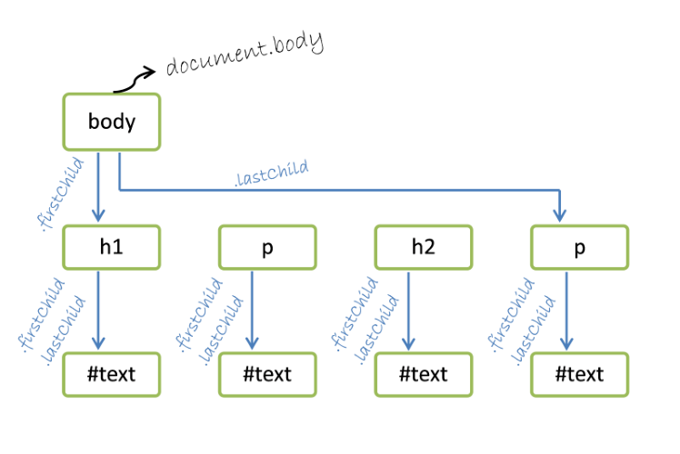
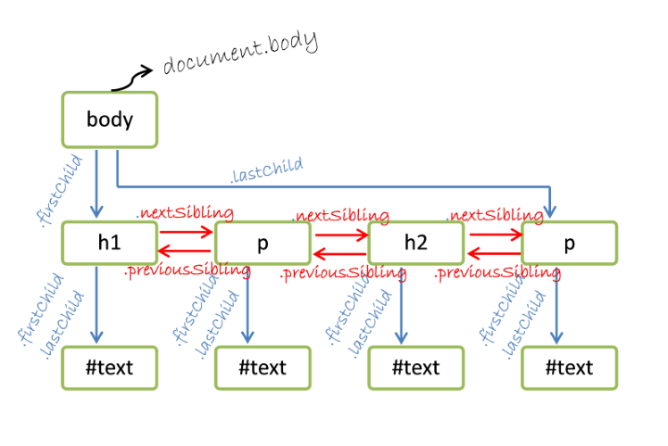
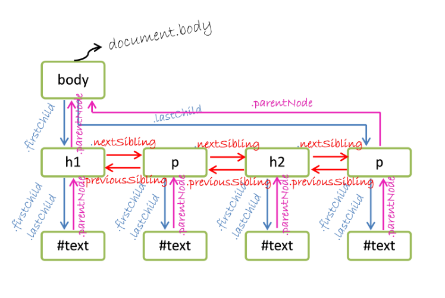
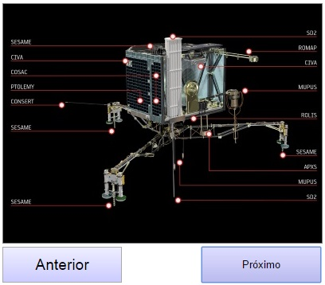
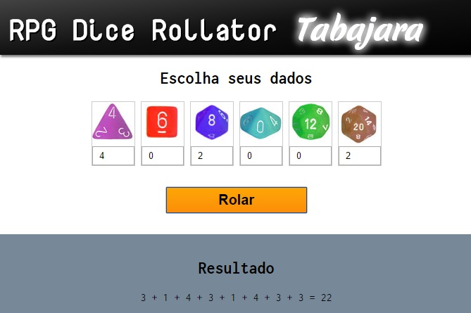

# Javascript - Parte 2

---
# Roteiro de hoje

1. Javascript no navegador
1. O DOM
1. Eventos
1. Exercícios

---
# Javascript no navegador

---
## O objeto global: **window**

- O navegador **expõe um único objeto** por janela (ou por frame, ou por
  iframe) chamado `window`
- Ele possui informações e utilidades sobre a janela (frame, iframe) corrente.
  Exemplos:
  ```js
  window.alert('mensagenzinha feia');  // retorna undefined
  window.confirm('janela pedindo confirmacao'); // true, false
  window.prompt('escreva seu nome, champz', 'b. verde'); // string
  ```
  ```js
  // url, título, opções
  window.open('/popup.html', 'Enquete', 'resizable,scrollbars');
  ```

---
## Momento interativo

- Vamos testar essas funções do objeto `window`
  1. Abra as ferramentas de desenvolvedor do seu navegador (<kbd>F12</kbd>
     ou <kbd>Ctrl+Shift+I</kbd>)
  1. Na aba console, digite `window`, depois ponto ("`.`") e veja a
     quantidade de propriedades do objeto
  1. Execute o comando para abrir uma janela com [a página do pudim](http://opudim.com.br)
     - Se a nova janela não abrir, provavelmente ela foi bloqueada pelo
       navegador ;)

---
## O objeto global: **window** (cont.)

- Mais algumas utilidades de **window**
  ```js
  window.setTimeout(f, 200);   // chama daqui a 200ms, 1x. retorna id
  window.setInterval(f, 1000); // chama a cada 1s, forever. retorna id
  window.clearTimeout(id);
  window.clearInterval(id);
  ```
  ```js
  window.eval('window.alert("eval is evil!");'); // nao fazer em casa
  ```

---
## Objetos notáveis dentro de **window**

- Além de utilidades, o objeto `window` também possui outros objetos muito
  importantes
  - **`window.document`**
   - Acesso à estrutura `html` da página
  - `window.navigator`
    - Acesso a características do navegador
  - `window.console`
    - Objeto de acesso à saída de terminal
  - `window.history`
    - Funções de manipulação do histórico da página (botões Voltar/Avançar)

---
## Objetos notáveis dentro de **window** (cont.)

- Mais alguns objetos:
  - `window.Math`
    - Funções matemáticas
  - `window.JSON`
    - Funções de conversão entre string e
      <abbr title="Javascript Object Notation">JSON<abbr>
  - `window.localStorage`
    - Cache de informações locais à página
  - `window.sessionStorage`
    - Cache com duração de apenas uma sessão
  - `window.location`
    - Informações acerca do endereço da página

---
## Convenção

- Como o objeto `window` é o único objeto que o navegador expõe para os
  scripts, **podemos acessar suas propriedades sem usar `"window."`**.
  Por exemplo:
  ```js
  window.console.log('Nintendo pwns Sony');
  ```
  É o mesmo que:
  ```js
  console.log('Nintendo pwns Sony');
  ```
- Vamos falar muito agora sobre **`window.document`**, ou apenas `document`

---
# O DOM


---
## O objeto **document**

- O objeto `document` dá acesso ao **Document Object Model**, ou DOM
- <p>O DOM é uma representação da estrutura dos elementos html na forma de
  árvore</p>
  
  <pre style="float:right;width:50%;margin:0;"><code class="hljs lang-html">&lt;!DOCTYPE html&gt;
  &lt;html lang="en"&gt;
  &lt;head&gt;
  &lt;title&gt;HTML&lt;/title&gt;
  &lt;/head&gt;
  &lt;body&gt;
  &lt;!-- Add your content here--&gt;
  &lt;/body&gt;
  &lt;/html&gt;</code></pre>
  <div style="clear:both;"></div>

---
## <abbr title="Document Object Model">DOM</abbr>

- Cada elemento do DOM é chamado de **nó** (_node_) (em referência à
  estrutura de árvore)
- O tipo de cada elemento "herda" de um tipo chamado `HTMLElement`
- É possível acessar os atributos html dos elementos
  - id
    ```js
    console.log(botaoAzul.id);
    ```
  - classes, etc.
    ```js
    console.log(botaoAzul.className);   // className -- class
    ```

---
## Buscando nós na árvore

- Há diversas formas para se recuperar nós específicos da árvore
  ```js
  document.getElementById(id);    // HTMLElement ou null
  document.getElementsByTagName(nomeDaTag); // HTMLCollection
  document.getElementsByClassName(classe);  // HTMLCollection
  document.getElementsByName(nome);  // HTMLElement ou null
  ```
- Exemplo:
  ```js
  var botao = document.getElementById('botao-compartilhar');
  botao.onclick = function() { /* ... */ };
  ```

---
## Buscando nós em uma sub-árvore

- É possível fazer consultas a nós a partir de uma sub-árvore:
  ```js
  no.getElementsByTagName(nomeDaTag);
  no.getElementsByClassName(classe);
  ```
- Exemplo: recuperar todas as imagens com a classe `icone` dentro do menu de
  navegação
  ```js
  var navegacao = document.getElementById('menu-principal');
  var icones = navegacao.getElementsByClassName('icone');
  ```

---
## Caminhando pela árvore

- É possível fazer um caminhamento pela árvore toda ou começando a partir de
  um nó específico
  - Por exemplo: você pode querer visitar todos os nós para excluir textos
    proibidos ('XXX', 'Aécio', 'Dilma', 'calor')
- Se for necessário percorrer a árvore, pode-se usar **apontadores para filhos,
  pais e irmãos de cada nó**
  ```js
  no.firstChild;        // primeiro filho
  no.lastChild;         // último filho
  no.childNodes;        // array de filhos
  no.nextSibling;       // próximo irmão
  no.previousSibling;   // irmão anterior
  no.parentNode;        // nó pai
  ```

---
## Ponteiros entre nós

<figure style="position: relative;width:100%;height:500px;">
  
  
  
</figure>

---
## Exemplo: imprimindo o nome das _tags_

```js
function caminhaNoDOM(no, visitaNo) {
  visitaNo(no);
  no = no.firstChild;
  while (no) {
    caminhaNoDOM(no, visitaNo);
    no = no.nextSibling;
  }
}

function imprimeNomeDaTag(no) {
  // apenas imprime o nome da tag (e.g., BODY, H1, P)
  console.log(no.tagName);
}

// chama o algoritmo de caminhamento com a função de visita
// imprimindo o nome da tag corrente
caminhaNoDOM(document.body, imprimeNomeDaTag);
```

---
## Criando elementos dinamicamente

- É possível criar elementos dinamicamente, de duas formas:
  1. Instanciando elementos e os adicionando à árvore
    ```js
    var conteudo = document.getElementById('conteudo');
    var dado = document.createElement('img');
    dado.src = 'images/d12.png';
    conteudo.appendChild(dado);
    ```
  1. Definindo a propriedade de `innerHTML` de um elemento da árvore para uma
     string descrevendo uma estrutura `html`
    ```js
    var conteudo = document.getElementById('conteudo');
    conteudo.innerHTML = '';
    ```

---
## Criando elementos dinamicamente (cont.)

- Além de `no.appendChild(elemento)`, também é possível incluir novos elementos
  na árvore usando:
  ```js
  no.insertBefore(novoElemento);   // novoElemento vira irmão de no
  no.replaceChild(novo, antigo);   // novo vira filho de no e
                                   // exclui o elemento antigo
  ```
- Para remover um elemento da árvore
  ```js
  no.removeChild(elemento);
  ```

---
## Alterando atributos dos nós

- É possível alterar atributos dos nós:
  ```html
  <a href="/contato" title="" id="link-contato">
  ```
  ```js
  var lingua = 'port';
  var texto = {
    'port': 'Página de Contato',
    'ingl': 'Contact Us'
  }
  var linkContato = document.getElementById('link-contato');
  linkContato.title = texto[lingua];
  ```

---
## Alterando o estilo de elementos

- Há 3 formas para alterar o estilo de elementos:
  1. Alterando a propriedade `class`
    ```js
    elemento.className = 'selecionado titulo';  // 2 classes
    ```
  1. Adicionando ou removendo classes individuais
    ```js
    no.classList.add('selecionado');  // adiciona .selecionado
    no.classList.remove('oculta');    // remove .oculta
    ```
  1. Alterando a propriedade `style`
    ```js
    botao.style.width = '80%';        // define largura como 80%
    botao.style.paddingTop = '2px';   // padding-top vira paddingTop
    ```

---
## Nomes das propriedades de estilo em JS

- Repare a mudança das propriedades CSS para JS:
  ```js
  botao.style.backgroundColor = '#ccc';
  ```
- CSS &#8594; Javascript
  - `background-color` &#8594; `backgroundColor`
  - `border-radius` &#8594; `borderRadius`
  - `font-size` &#8594; `fontSize`
  - `list-style-type` &#8594; `listStyleType`
  - `z-index` &#8594; `zIndex`

---
# Eventos

---
## Eventos

- Eventos são atrelados a nós específicos e causam a invocação de uma função
  "manipuladora" (_event handler_ ou apenas _handler_)
- Eventos de mouse
  <ul class="multi-column-list-4">
    <li>`click`</li>
    <li>`dblclick`</li>
    <li>`mousedown`</li>
    <li>`mouseup`</li>
    <li>`mousemove`</li>
    <li>`mouseover`</li>
    <li>`mouseout`</li>
  </ul>
- Eventos de entrada
  <ul class="multi-column-list-4">
    <li>`change`</li>
    <li>`blur`</li>
    <li>`focus`</li>
    <li>`keydown`</li>
    <li>`keyup`</li>
    <li>`reset`</li>
    <li>`submit`</li>
  </ul>

- (Muitos) outros tipos: [Eventos na MDN](https://developer.mozilla.org/en-US/docs/Web/Events)

---
## _Event handlers_

- Há basicamente três formas de atribuir _handlers_ a eventos
  - Forma clássica
    ```js
    button.onclick = function(e) { /*...*/ };
    ```
    - Foi a única forma por muitos anos
    - Permite apenas um _handler_ por tipo de evento
  - Forma Internet Explorer 6-8:
    ```js
    button.attachEvent('onclick', function(e) { /*...*/ });
    ```
  - Forma W3C (**é a que devemos usar**)
    ```js
    button.addEventListener('click', function(e) { /*...*/ }, false);
    ```

---
## Forma adequada para criar _event handlers_

- Já que a forma W3C passou a ser implementada no IE apenas à partir de v9.0, a forma mais adequada para incluir _event handlers_ é:
  ```js
  function adicionarManipuladorEvento(no, tipo, f) {
    if (no.addEventListener) {
      no.addEventListener(tipo, f, false);
    } else if (no.attachEvent) {
      no.attachEvent('on' + tipo, f);
    } else {
      no['on' + tipo] = f;
    }
  }
  ```
- Mas para nossas aulas, o professor liberou `addEventListener` =)

---
# Eventos: tópicos avançados

---
## _Event Bubbling_ (Borbulhas de Amor)

- Quando um evento é disparado em um elemento (e.g., clique), não apenas ele
  mas os _handlers_ do mesmo tipo de todos os ancestrais do elemento são
  acionados
- Isso é chamado de _event bubbling_
- Exemplo vivo: [http://jsfiddle.net/fegemo/r61r5sLy/3/](http://jsfiddle.net/fegemo/r61r5sLy/)
  - Repare que há 3 `divs`, uma dentro da outra e cada uma tem um
    _click handler_

---
## Por que borbulhar?

- Considere que você tem 100 objetos arrastáveis (_drag'n'drop_)
  - Você pode colocar um _handler_ em cada um (100x)
  - Ou você pode colocar o _handler_ no container deles (1x) e usar a informação
    do evento (e.target) para saber qual objeto arrastável foi clicado


---
## Cancelando a bolha

- Um _handler_ deve cancelar o borbulhamento do evento caso queira que ele pare
  de borbulhar. Utiliza-se `e.stopPropagation()`:
  ```js
  function fechaPainelModal(e) {
    // "fecha" (torna invisível) o painel modal
    modal.style.display = 'none';
    // evita que o clique no botão fechar seja processado pelos
    // handlers de cliques dos elementos ancestrais  
    e.stopPropagation();
  }
  botaoFechar.addEventListener('click', fechaPainelModal);
  ```
- Exemplo vivo: [http://jsfiddle.net/fegemo/r61r5sLy/3/](http://jsfiddle.net/fegemo/r61r5sLy/)

---
## Impedindo a ação padrão

- Elementos de entrada (`input`) e alguns outros elementos possuem
  **ações padrão**. Por exemplo:
  - Botão `submit` &#8594; envia o formulário
  - Botão `reset` &#8594; limpa os campos preenchidos
- É possível cancelar a ação padrão usando `e.preventDefault()`:
  ```js
  function validaFormulario(e) {
    if (nome === '' || senha === '') {
      // Houve erros no formulário. Impedir o envio
      e.preventDefault();
    }
  }
  botaoEnviar.addEventListener('submit', validaFormulario);
  ```

---
# Exercícios

- Hoje temos 3 exercícios. Os dois primeiros podem ser feitos em um editor
  _online_,  como o [jsfiddle](http://jsfiddle.net/) ou [codepen](http://codepen.io/).
- Você deve "entregá-los" pelo Moodle, postando o _link_ para seus exercícios
  (sejam eles repositórios no GitHub ou códigos no _jsfiddle_ ou no _codepen_)

---
## Exercício 1

- Acesse o [código base no jsfiddle](http://jsfiddle.net/fegemo/umq0bgre/)
- Você deve criar um código em Javascript para fazer os botões "+" expadirem
  ou retrairem o texto dos parágrafos, de acordo com o contexto
  - Uma classe CSS `.expandido` contém as propriedades necessárias para que
    o parágrafo seja exibido de forma completa.
  
---
## Exercício 2

- Crie uma galeria de imagens similar à exibida abaixo.




---
## Exercício 2 (cont.)

- Funcionamento
  - Botões mostram a próxima imagem ou a anterior
  - Quando chegar na última imagem, voltar para a primeira
- Ponto de partida: http://jsfiddle.net/fegemo/bL5b2xnn/
  - Você deve criar um _fork_ no jsfiddle e entregar o link via Moodle
- Dikentinhas:
  - Você pode fazer de pelo menos 2 formas:
    1. Ter apenas uma `` e trocar o `src` dela para o da imagem corrente
    1. Ter uma `` para cada imagem exibidas numa linha e transladar de
       acordo com a imagem corrente

---
## Exercício 3 - <span style="font-family: monospace">Dice Rollator <span style="font-family: cursive">Tabajara</span></span>



---
## Exercício 3 - <span style="font-family: monospace">Dice Rollator <span style="font-family: cursive">Tabajara</span></span> (cont.)

- Crie o _Dice Rollator Tabajara_, um sistema de rolagem de dados
  - [Repositório no GitHub](https://github.com/fegemo/cefet-web-dice-rollator) para fazer seu fork
- Há dados de 4, 6, 8, 10, 12 e 20 lados
- O usuário escolhe a quantidade de dados que quer jogar, de cada tipo
- Ao apertar o botão "Rolar", os resultados devem aparecer na parte de baixo da
  página

---
## Dicas para o exercício 3

- Você não precisa fazer nenhuma alteração nos arquivos CSS e HTML, apenas no
  arquivo JS (principal.js)
- Para obter um número aleatório entre 0 e 1:
  ```js
  var resultado = window.Math.random(); // ou Math.random();
  ```
  - Para obter um número inteiro, de 1 a `maximo`:
    ```js
    var resultado = Math.ceil(Math.random() * maximo);
    ```

---
# Referências

- Livro "Javascript: The Good Parts" (Douglas Crockford)
- [Mozilla Developer Network](https://developer.mozilla.org/)
