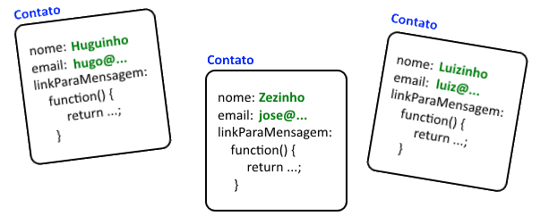
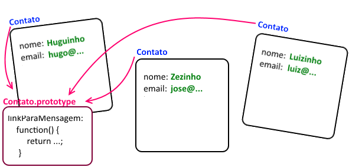
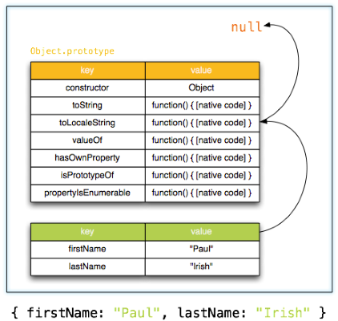

# Javascript - Parte 3

---
# Roteiro

1. Criando objetos
1. Funções Construtoras (ou classes)
1. Herança
   - Pseudo-clássica
1. Padrões de projeto
   - `this`, `that` 
   - _`new` enforcer_
   - _single-`var`_
   - _Revealing Module_
   - IIFE

*[IIFE]: Immediately Invoked Function Expression*

---
## Java (ou C#) _vs_ Javascript

| Java              | Javascript        |
|-------------------|-------------------|
| Fortemente tipada | Fracamente tipada |
| Estática          | Dinâmica          |
| Clássica          | Prototípica       |
| Classes           | Funções           |
| Construtores      | Funções           |
| Métodos           | Funções           |

---
# Criando Objetos

---
## Instanciação de Objetos

- Como visto anteriormente, Javascript possui um tipo de dados complexo `Object`
- Podemos instanciar objetos de duas formas:
  1. Literal
     ```js
     var carro = {};
     ```
  1. Operador `new`
     ```js
     var carro = new Object();
     ```

---
## Instanciação de Objetos (cont.)

- Um objeto é simplesmente um _container_ de propriedades (nome: valor)
  ```js
  var carro = {
    cor: 'vermelho',
    codigoCor: '#ff0000',
    fabricante: {
      nome: 'Fiat',
      origem: 'Itália'
    }
  };
  ```

---
## Acesso a propriedades

- Para acessar propriedades de objetos, também há duas formas:
  1. Via `.`
     ```js
     console.log(carro.cor);    // vermelho
     ```
  1. Via indexação
     ```js
     console.log(carro['cor']); // vermelho
     ```
     - Em termos de LP, temos **reflexão** de graça :)
- Acesso a propriedades inexistentes retorna `undefined`:
  ```js
  console.log(carro.potencia);  // undefined
  ```

---
## Acesso a propriedades (cont.)

- O operador  `||` pode ser usado para a definição de valores padrão:
  ```js
  var potencia = carro.potencia || 1000;
  ```
- Tentativa de acesso de propriedades de um valor `undefined` lançará um erro:
  ```js
  console.log(carro.potencia);            // undefined
  console.log(carro.acessorios.volante);  // lança "TypeError"
  ```
- O erro pode ser prevenido usando-se o operador &&:
  ```js
  console.log(carro.acessorios && carro.acessorios.volante);
  // undefined
  ```

---
## Alterando propriedades

- Para alterar o valor de uma propriedade já existente, usamos o operador
  de atribuição (`=`)
  ```js
  carro.cor = 'verde';
  ```
- Para **criar uma nova propriedade**, usamos o operador de atribuição
  **da mesma forma**:
  ```js
  carro.peso = 900;
  ```

---
## Referências a objetos

- Objetos são "transportados" por referência e nunca copiados
  ```js
  var outroCarro = carro;
  outroCarro.cor = 'prata';
  console.log(carro.cor);       // prata
  ```
  ```js
  var a = {}, b = {}, c = {};
  console.log(a == b);          // false
  console.log(b == c);          // false
  console.log(a == c);          // false
  ```

---
## Construção de objetos por **construtor**

- Mas existe uma terceira forma, em que podemos criar e inicializar o objeto.
  Nessa forma, criamos uma **função construtora** que vai instanciar e
  inicializar objetos:
  ```js
  function Moto(modelo, dono) {
    this.modelo = modelo;     // Lembre que 'this' dentro de um
    this.dono = dono;         // objeto aponta para ele mesmo
  }
  var moto1 = new Moto('Kawasaki', 'Ninja Jiraya');
  var moto2 = new Moto('Harley Davidson', 'Lula Molusco');
  ```

---
## Construção de objetos por **construtor** (cont.)

- Uma função construtora (ou **construtor**) é apenas uma função.
  - Porém ela usa a referência `this` para definir propriedades de um
    objeto novinho que está sendo criado
  - Tipicamente, **o nome de toda função construtora começa com letra
    maiúscula** (convenção). _E.g._:
    ```js
    function Leguminosa(nome, calorias) {   // legal!
      // this.nome = nome
      // ...
    }
    function verdura(nome, calorias) {   // funciona, mas evite
      //...
    }
    ```

---
## Construção de objetos por **construtor** (cont.)

- Se, além de propriedades de dados (`modelo`, `dono` etc.), colocarmos também
  alguns métodos, podemos falar que temos algo muito semelhante a uma
  **classe** das linguagens OO "tradicionais"
  ```js
  function Moto(modelo, dono) {
    /* ... */
    this.toString = function() {
      return this.modelo + ' do(a) ' + this.dono;
    };
  }
  var motoca = new Moto('Honda Biz', 'Rubinho');
  console.log(motoca.toString());     // Honda Biz do Rubinho
  ```

---
## Exemplo: Lista de contatos

- Considere um código para inicializar uma lista de contatos da seguinte forma:
  ```js
  function Contato(nome, email) {
    this.nome = nome;
    this.email = email;
    this.linkParaMensagem = function() {
      return 'mailto:' + this.email;
    };
  }

  // continua no próximo slide
  ```

---
## Exemplo: Lista de contatos (cont.)

- (continuando o código...)
  ```js
  var lista = [
    new Contato('huguinho', 'hugo@gmail.com'),
    new Contato('zezinho', 'jose@gmail.com'),
    new Contato('luizinho', 'luiz@gmail.com')
  ];
  ```

---
## Exemplo: Lista de contatos (cont.)

- Se pudéssemos examinar a memória alocada, veríamos:

  
  - Repare que o código do método é repetido a cada instância
    - Podemos melhorar isso, se tivermos como definir **o método
      `linkParaMensagem` a nível da classe**, ao invés de fazê-lo
      na instância

---
## Exemplo: Lista de contatos (cont.)

- De fato, é possível definir um **método a nível da classe** usando-se uma
  propriedade chamada `prototype`
  ```js
  function ContatoV2(nome, email) {
    this.nome = nome;
    this.email = email;
  }
  ContatoV2.prototype.linkParaMensagem = function() {
    return 'mailto:' + this.email;
  };
  ```

---
## Exemplo: Lista de contatos (cont.)

- Se usarmos a classe `ContatoV2` para alocar a lista de contatos, teremos:

  
  - Mas como isso funciona?

---
## O **Prototype** (protótipo)

- Todo objeto possui uma propriedade especial chamada `prototype` de onde ele
  **pode herdar propriedades**
  - Podemos visualizar isso ao criarmos um objeto vazio e verificar que ele já
    tem algumas propriedades:
    ```js
    var novo = {};
    console.log(novo.toString());     // [object Object]
    ```
    - Isso acontece porque todo objeto que instanciamos na forma literal
      tem seu `prototype` apontado para um objeto que possui algumas
      propriedades (e.g., `toString`)

---
## O **Prototype** (cont.)



---
## Métodos de classe (estáticos)

- É possível definir um método (propriedades em geral) que pertence à classe e
  não tem acesso aos dados das instâncias (similar ao método estático de Java)
  ```js
  ContatoV2.ordenarContatos = function() { /* ... */ };
  ```
  - É diferente do **método a nível de classe**
    ```js
    ContatoV2.prototype.linkParaMensagem = function() { };
    ```

---
# Funções Construtoras (classes)

---
## Funções em Javascript (recordando)

- Funções são objetos (invocáveis)
- Definimos na forma literal:
  ```js
  function fibonacci(n) {
    return n < 3 ? 1 : fibonacci(n-1) + fibonacci(n-2);
  }
  ```
  - Possui 4 partes:
    1. A palavra `function`
    1. Um nome (opcional em certos casos)
    1. Lista de parâmetros
    1. Corpo

---
## Prototype

- Sendo objetos, as funções também possuem uma propriedade `prototype` que
  aponta para um objeto "global" `Function.prototype`

---
## Invocação de funções (como função)

- Há 4 formas distintas para se invocar uma função
  1. Como uma função
  1. Como um método
  1. Como um construtor
  1. Com `apply` ou `call`
- Informação **insanamente** importante:
  - O objeto para onde `this` aponta varia em cada uma das 4 formas

---
## Invocação de funções (como **função**)

1. Como uma **função** propriamente dita
  - Quando a função não está associada a um objeto
    ```js
    function soma(a, b) {
      return a + b;
    }
    soma(40, 2);      // invocação. Retorna 42
    var s = soma;
    s(21, 21);        // invocação. Retorna 42
    ```
    - O valor de `this` é **sempre** definido para o objeto global `window`
      - Isto foi um erro de projeto da linguagem

---
## Invocação de funções (como **método**)

1. Como um **método**
  - Quando a função é uma propriedade de um objeto
    ```js
    var contador = {
      valor: 0,
      incrementa: function(qtde) {
        this.valor += (typeof qtde === 'number' ? qtde : 1);
      }
    }
    contador.incrementa();    // invocação
    contador.incrementa(10);  // invocação
    ```
    - O valor de `this` aponta para a instância do objeto dono do método
      invocado

---
## Invocação de funções (como **método** vs **função**)

- Uma consequência do erro de projeto mencionado:
  ```js
  var calculadora = {
    valor: 1,
    multiplica: function(fator) {     // invocação de método
      var soma = function(parcela) {  // invocação de função
        this.valor += parcela;  // `this` aponta para `window`
      }
      var v = this.valor;
      for (; fator !== 1; fator--) { soma(v); }
    }
  };
  calculadora.multiplica(5);          // 1 x 5
  console.log(calculadora.valor);     // imprime 1. Por quê?
  ```

---
## Invocação de funções (como **método** vs **função** cont.)

- O que aconteceu no exemplo anterior:
  - O valor de `this` dentro de `calculadora.multiplica` aponta para a
    instância do objeto calculadora, como esperado
  - Porém, dentro de `soma`, `this` passa a apontar para `window`, que não tem
    uma variável `valor`
- Mas não desanime: dá pra consertar!

---
## Padrão de projeto: **this**, **that**

- Para resolver o problema, podemos salvar a referência de `this` que aponta
  para a instância da calculadora e usá-la em `soma`:
  ```js
  var calculadora = {
    valor: 1,
    multiplica: function(fator) {
      var that = this;
      var soma = function(parcela) {
        that.valor += parcela;  // that aponta para a instância
      }
      var v = this.valor;
      for (; fator !== 1; fator--) { soma(v); }
    }
  };
  ```

---
## Invocação de funções (como **construtor**)

- Quando uma função é invocada, **precedida pelo operador `new`**, dizemos que
  a função é um **construtor**:
  ```js
  function Contato(nome) {
    this.nome = nome;
  }
  var presidente = new Contato('Seu Adamastor');  // construt.
  ```
  - Por causa do **operador `new`, três coisas acontecem**:
    1. Um **objeto "em branco"** é criado e seu **`prototype` é o mesmo do
      da função**
    1. O valor de **`this`** dentro da função **aponta para o novo objeto**
    1. Se não houver `return`, **`this` é retornado** automaticamente

---
## _Caveat_ da invocação por **construtor**

- Se uma função construtora é invocada sem o operador `new`, _shit will happen_
  - Veja por quê:
    ```js
    function Contato(nome) {
      this.nome = nome;
    }
    var presidente = Contato('Seu Custódio');   // invoc. função
    ```
    - Ao final do código acima, temos que:
      1. `window.nome === "Seu Custódio"`
      1. `presidente === undefined`

---
## Padrão de projeto: **new enforcer**

- Podemos **detectar** se o construtor foi invocado **sem o `new`** e
  então reinvocar o construtor adequadamente:
  ```js
  function Contato(nome) {
    if (this === window) {
      return new Contato(nome);
    }
    this.nome = nome;
  }
  ```
  - Simplão!

---
## Invocação de funções (com **apply ou call**)

- `Function.prototype` tem dois métodos chamados `apply` e `call`
  - Ou seja, toda função tem acesso a eles
- Os dois métodos possibilitam a invocação da função usando um **valor
  arbitrário para `this`** e um **conjunto de argumentos**
  - Exemplos:
    ```js
    function ola(nome, profissao) {
      return 'Me chamo ' + nome + ' e sou ' + profissao;
    }
    ola('Joao', 'Storm Trooper');               // inv. função
    ola.apply(null, ['Alexandre', 'Rebelde']);  // apply
    ola.call(null, 'Astolfo', 'Sith');          // call
    ```

---
## Uso interessante de **apply** ou **call**

- [_Monkey-patching_](http://en.wikipedia.org/wiki/Monkey_patch): incluir um
  comportamento a uma função já existente sem prejudicar seu funcionamento
  - Código de um site:
    ```js
    var carrinho = {
       adicionarProduto(idProduto, qtde, preco) { /* ... */ }
    };
    ```
  - Código do malvado programador javascript no console:
    ```js
    var original = carrinho.adicionarProduto;
    carrinho.adicionarProduto = function(id, qtde, preco) {
      original.call(carrinho, id, qtde, 0.05);    // U.U
    }
    ```

---
## Escopo de variáveis

- Javascript tem apenas escopo de função - não há escopo de bloco
  - Ou seja, uma variável definida, e.g., dentro de um `if` é visível
    completamente dentro da função que contempla esse `if`:
    ```js
    function acabouMinhaCriatividade(n) {
      if (true) {
        var resultado = 'rá!';
      }
      console.log(resultado); // 'rá!'
    }
    ```

---
## Escopo - funcionamento

- Quais são os valores de `a`, `b` e `c` após `bar()`?
  ```js
  var foo = function () {
    var a = 3, b = 5;
    var bar = function () {
      var b = 7, c = 11;
      a += b + c;
    };
    bar();
  };
  ```
- [Marotex: Escopos](https://moodle.cefetmg.br/mod/quiz/view.php?id=18345)

<!--
- Resposta:
  ```js
  a = 21;  b = 5; c = undefined;
  ```
-->

---
# Padrões de Projeto
---
## PdP: **single var** (1/2)

- Como só existe escopo de função, optamos por deixar isso claro e declarar
  todas as variáveis usadas dentro da função logo em seu início
  ```js
  function fib(n) {
    var valor1 = 0; var valor2 = 1; var aux;
    while(n-- != 0) {
      aux = valor1;
      valor1 = valor2;
      valor2 += aux;
    }
    return valor1;
  }
  ```

---
## PdP: **single var** (2/2)

- Melhor ainda, como todos os `var` estão no topo da função, podemos
  economizar uns _bytes_ e usar apenas um `var`
  ```js
  function fib(n) {
    var valor1 = 0,     // single-var!
        valor2 = 1,
        aux;
    while(n-- != 0) {
      aux = valor1;  valor1 = valor2;  valor2 += aux;
    }
    return valor1;
  }
  ```

---
# Herança

---
## Forma **pseudo-clássica**

```js
var Mamifero = function(nome) {
  this.nome = nome;
};

Mamifero.prototype.diz = function (  ) {
  return this.fala || '';
};
```
```js
var mamiferoGenerico = new Mamifero('mamifero');
mamiferoGenerico.diz();     // ''
```

---
## Forma **pseudo-clássica** (cont.)

```js
var Gato = function(nome) {
  this.nome = nome;
  this.fala = 'Miau';
}
Gato.prototype = new Mamifero();
```
```js
var gato = new Gato('Tom');
gato.diz();                 // 'Miau'
```

---
## Outras formas (vide Crockford, 2005)

- Herança "prototípica"
- Herença funcional

---
# Escopo

---
## Problema de escopo em Javascript

- Sabemos que apenas funções delimitam escopo
- Tudo o que é criado fora de uma função é associado ao objeto `window` (!!!)
  ```html
  <script>
    var umBoizinho = 'verde';
    console.log(window.umBoizinho);   // verde
  </script>
  ```
- Isso causa uma grande **poluição do escopo (_namespace_) global**

---
## Resolvendo a poluição

- Podemos criar funções com o único objetivo de não poluir o _namespace_ global
- Vamos colocar o código dentro de uma função e executá-la imediatamente
  - Este é o padrão de projeto <abbr title="Immediately Invoked Function Expression">IIFE</abbr>

---
## Padrão de Projeto: _Immediately Invoked Function Expression_

- Tentativa 1:
  ```html
  <script>
    function a() {
      var umBoizinho = 'verde';
      console.log(window.umBoizinho);   // undefined
    }
    a();
  </script>
  ```
  - Problema: poluímos com `a`

---
## Padrão de Projeto: _Immediately Invoked Function Expression_ (cont.)

- Tentativa 2, certeira:
  ```html
  <script>
  (function() {
    var umBoizinho = 'verde';
    console.log(window.umBoizinho);   // undefined (yay)
  })();
  </script>
  ```

---
# Referências

1. Capítulos 3, 4 e 5 do livro "Javascript: The Good Parts"
1. Capítulos 9 e 10 do livro "Head First: JavaScript"
1. Mozilla Developer Network (MDN)
1. [Como prototypes funcionam](http://yehudakatz.com/2011/08/12/understanding-prototypes-in-javascript/)
1. [Entendendo prototypes](http://javascriptweblog.wordpress.com/2010/06/07/understanding-javascript-prototypes/)
