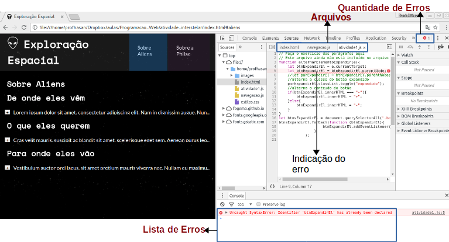

<!-- {"layout": "title"} -->
# Javascript (parte 3)
## ???

<!--
// objeto window
// alterando estilos (.style)
// inserindo elementos dinamicamente -->

---
<!-- {"layout": "regular"} -->
# Na última aula... (1/4)
## Tipos de dados
- **Null**: Usado quando uma variável não tem um valor aplicável naquele momento
- **Undefined**: é o tipo atribuído a variáveis que não foram associadas a nenhum valor
---
# Na última aula... (2/4)
## Tipos de dados Object
```js
let voo = {
    companhia: 'Gol',
    numero: 815,
    decolagem: {
        IATA: 'SYD',
        horario: '2004-09-22 14:55',
        cidade: 'Sydney'
    }
};
```

---
<!-- {"layout": "regular"} -->
## Na última aula... (3/4)

- Manipulação e Acesso por meio de um **for tradicional**:
```js
      let cores = ['azul', 'rosa'];
      for (let i = 0; i < cores.length; i++) {
        console.log(cores[i]);        // azul, rosa
      }
```
---
## Na última aula... (4/5)
- Usando `for (let item of array)`  <!-- {style="height: 1em;"} --> :thumbsup::
   ```js
   let cores = ['azul', 'rosa'];
   for (let cor of cores) {
     console.log(cor);
     // azul, rosa
   }
   ```
- Usando `array.forEach` :thumbsup::
  ```js
  let cores = ['azul', 'rosa'];
  cores.forEach(function(cor) {
    console.log(cor);
    // azul, rosa
  });
  ```
---
<!-- {"layout": "regular"} -->
##  Na última aula... (5/5)

- O `document.querySelectorAll` retorna **todos** que forem selecionados
- 
  <!-- {.push-right style="width: 250px"} -->
  É possível alterar o **conteúdo** de um elemento com `elemento.innerHTML`:
  <iframe width="250" height="130" src="//jsfiddle.net/fegemo/wLp3kv59/embedded/result/" allowfullscreen="allowfullscreen" frameborder="0" class="push-right" style="clear: right;"></iframe>
  <iframe width="250" height="153" src="//jsfiddle.net/fegemo/wLp3kv59/embedded/html/" allowfullscreen="allowfullscreen" frameborder="0" class="push-right" style="clear: right;"></iframe>

  ```js
  let contador = 0,
    contadorEl = document.querySelector('#contador');
  // quando clicado, (1) conta e (2) altera conteúdo
  contadorEl.addEventListener('click', function() {
    contador++;                       // (1) conta
    contadorEl.innerHTML = contador;  // (2) altera
  });
  ```

---
# Hoje veremos

1. [História do Javascript](#historia-javascript)
1. [O objeto global: **window**](#o-objeto-global-window)
1. [Criação e Remoção de Elementos Dinamicamente](#criacao-remocao-dinamica)
1. [Eventos de mouse](#eventos-mouse)
1. [Depuração de Javascript](#depuracao-javascript)


---
<!-- {"slideHash": "historia-javascript"} -->
# História do Javascript

---
# História

1989 - 1993 <!-- {.bullet-old} -->
  ~ Tim Berners-Lee cria a WWW em CERN (*European Organization for
    Nuclear Research*) e a deixa aberta ao público geral <!-- {dd:.bullet-old} -->

1994 <!-- {.bullet-old} -->
  ~ Håkon propõe uma linguagem para dar conta da responsabilidade de
    alterar a aparência de páginas web chamada CSS <!-- {dd:.bullet-old} -->

1995 (maio)
  ~  <!-- {.portrait.push-right} -->
    Brendan Eich, funcionário do Netscape, criou (em 10 dias!!) uma
    linguagem para alterar páginas web dinamicamente - o _Mocha_

1995 (setembro)
  ~ _LiveScript_ (novo nome) é lançado com a versão beta do Netscape 2.0

1995 (dezembro)
  ~ Nome alterado para JavaScript na versão 2.0 oficial para
    aproveitar a fama do Java

---
## História (cont.)

1996 (agosto)
  ~ Microsoft adota o JavaScript sob o nome de JScript no navegador
    Internet Explorer 3.0

1996 (novembro)
  ~ A Netscape submeteu o JavaScript para a
    _Ecma international_ para padronização. A especificação recebeu o nome de
     _ECMAScript_

1997 (junho)
  ~ A _Ecma International_ publicou a primeira versão, o ECMA-262

1998
  ~ Versão 2 do ECMAScript

1999 (junho)
  ~ Versão 3 do ECMAScript

2009
  ~ Versão 5 do ECMAScript

2013 - 2018
  ~ Versões 6-9
     <!-- {style="height: 1em;"} -->
    do ECMAScript, que mudaram de nome para **es2015**, **es2016**, **es2017**
    e **es2018** respectivamente


*[ECMA]: European Computer Manufacturers Association*
*[Ecma]: European Computer Manufacturers Association*

---
## JavaScript nos anos 90

[](http://fegemo.github.io/pocketdragon/)


---
<!-- {"layout": "section-header", "slideHash": "o-objeto-global-window"} -->
# O objeto global: **window**
## .

- O que é o objeto `window`
- Algumas funções básicas
- Propriedades importantes de `window`

<!-- {ul:.content} -->

---
## O objeto global: **window**

- O navegador **expõe um único objeto** por janela chamado `window`
- Ele possui informações e utilidades sobre a janela corrente.
  Exemplos:
  ```js
  window.alert('mensagenzinha feia');                   // retorna undefined
  window.confirm('janela pedindo confirmacao');         // true, false
  window.prompt('escreva seu nome, champz', 'b. verde');// string
  ```
  ```js
  // url, título, opções
  window.open('/popup.html', 'Enquete', 'resizable,scrollbars');
  ```

---
## O objeto global: **window** (cont.)

- Mais algumas utilidades de **window**
  ```js
  function assustaUsuario() {
    window.alert('Boo!');
  }
  window.setTimeout(assustaUsuario, 200);   // chama daqui a 200ms, 1x
  window.setInterval(assustaUsuario, 1000); // chama a cada 1s, forever
  ```
  ```js
  window.eval('window.alert("eval is evil!");');    // nao fazer em casa
  ```

---
## Objetos notáveis dentro de **window**

- Além de utilidades, o objeto `window` também possui outros objetos muito
  importantes:
  - **`window.document`**
    - Acesso à estrutura `html` da página (o DOM)
  - `window.navigator`
    - Acesso a características do navegador
  - `window.console`
    - Objeto de acesso à saída de terminal
  - `window.history`
    - Funções de manipulação do histórico da página (botões Voltar/Avançar)

*[DOM]: Document Object Model*

---
## Objetos notáveis dentro de **window** (cont.)

- Mais alguns objetos:
  - `window.Math`
    - **Funções matemáticas**
  - `window.JSON`
    - Funções de conversão entre string e JSON
  - `window.localStorage`
    - _Cache_ de informações locais à página
  - `window.sessionStorage`
    - _Cache_ com duração de apenas uma sessão
  - `window.location`
    - Informações acerca do endereço da página

*[JSON]: JavaScript Object Notation*

---
## Convenção

- Como o objeto `window` é o único objeto que o navegador expõe para os
  scripts, **podemos acessar suas propriedades <u>sem usar
  `"window."`</u>** :scream:.
  Por exemplo:
  ```js
  window.console.log('Nintendo pwns Sony');
  ```
  É o mesmo que:
  ```js
  console.log('Nintendo pwns Sony');    // sucesso!!
  ```
- Vamos falar muito agora sobre **`window.document`**, ou apenas **`document`**


---
<!-- {"layout": "section-header", "slideHash": "criacao-remocao-dinamica"} -->
# Manipulação de Elementos em JS
## Criação e remoção de elementos HTML via JavaScript

- createElement
- insertBefore
- replaceChild
- innerHTML

<!-- {ul:.content} -->

---
## Criando elementos dinamicamente

- É possível criar elementos dinamicamente, de duas formas:
  1. Instanciando elementos e os adicionando à árvore:
     ```js
     let conteudoEl = document.querySelector('#conteudo');
     let dadoEl = document.createElement('img');
     dado.src = 'images/d12.png';
     conteudo.appendChild(dado);
     ```
  1. Definindo a propriedade de `innerHTML` de um elemento da árvore para uma
     string descrevendo uma estrutura `html`:
     ```js
     let conteudoEl = document.querySelector('#conteudo');
     conteudoEl.innerHTML = '';
     ```

---
## Criando elementos dinamicamente (cont.)

- Além de `no.appendChild(elemento)`, também é possível incluir novos elementos
  na árvore usando:
  ```js
  no.insertBefore(novoEl);            // novoEl vira irmão de 'no'
  no.replaceChild(novoEl, antigoEl);  // novoEl vira filho de 'no' e
                                      // exclui o elemento antigo
  ```
- Para remover um elemento da árvore
  ```js
  no.removeChild(paraRemoverEl);
  ```
---
<!-- {"layout": "section-header", "slideHash": "eventos-mouse"} -->
# Eventos
## Eventos de mouse

  - Event handlers
  - Eventos de clique
  - Eventos ao arrastar o mouse
  <!-- {ul:.content} -->

---

## Eventos

  - Eventos são **atrelados a nós específicos** e causam a invocação de uma função
    "manipuladora" (_event handler_ ou apenas _handler_)
  - Eventos de mouse:
    - `click`
    - `dblclick`
    - `mousedown`
    - `mouseup`
    - `mousemove`
    - `mouseover`
    - `mouseout` <!-- {ul:.multi-column-list-4}-->

---
## _Event handlers_

- Há 2 formas de atribuir _handlers_ a eventos
  - Forma clássica (e feia :thumbsdown:)
      ```js
      button.onclick = function(e) { /*...*/ };
      ```
      - Foi a única forma por muitos anos
      - Permite apenas um _handler_ por tipo de evento
  - Forma bacana :thumbsup::
      ```js
      button.addEventListener('click', function(e) { /*...*/ });
      ```
---
## Eventos de clique: **click** vs **mousedown** vs **mouseup**

  - **mousedown**: evento invocado ao **apertar** o botão do mouse
  - **mouseup**: evento invocado ao **soltar** o botão  do mouse
  - **click**: após ter sido efetuado o click no mouse
  - Exemplo:

<iframe width="400" height="300" src="https://jsfiddle.net/danielhasan/xxemf1eq/embedded/html,js,result/" allowfullscreen="allowfullscreen" frameborder="0"></iframe>
---
## Eventos ao arrastar o mouse: **mouseover** vs **mousemove** vs **mouseout**

Eventos invocados quando:
  - **mouseover**: o mouse **entra** no elemento
  - **mousemove**: o mouse **se movimenta** no elemento
  - **mouseout**: ao **sair** do elemento
  - Exemplo:

<iframe width="400" height="300" src="https://jsfiddle.net/danielhasan/mjrg81fh/embedded/html,js,result/" allowfullscreen="allowfullscreen" frameborder="0"></iframe>

---
## _Event Bubbling_ (Borbulhas de Amor)

  - Quando um evento é disparado em um elemento (e.g., clique), não apenas ele
    mas **os _handlers_ do mesmo tipo <u>de todos os ancestrais do elemento</u>
    também são acionados**
  - Isso é chamado de **_event bubbling_**
  - Exemplo vivo: [http://jsfiddle.net/fegemo/r61r5sLy/3/](http://jsfiddle.net/fegemo/r61r5sLy/)
    - Repare que há 3 `divs`, uma dentro da outra e cada uma tem um
      _click handler_

---
## Por que borbulhar?

  - Considere que você tem 100 objetos arrastáveis (_drag'n'drop_)
    - Você pode colocar um _handler_ em cada um (100x)
    - Ou você pode colocar o _handler_ no container deles (1x) e usar a informação
      do evento (`evt.target`) para saber qual objeto arrastável foi clicado


---
## Cancelando a bolha
  - Um _handler_ deve cancelar o borbulhamento do evento caso queira que ele pare
    de borbulhar. Utiliza-se `e.stopPropagation()`:
    ```js
    function fechaPainelModal(e) {
      // "fecha" (torna invisível) o painel modal
      modal.style.display = 'none';
      // evita que o clique no botão fechar seja processado pelos
      // handlers de cliques dos elementos ancestrais  
      e.stopPropagation();
    }
    botaoFechar.addEventListener('click', fechaPainelModal);
    ```
  - Exemplo vivo: [http://jsfiddle.net/fegemo/r61r5sLy/3/](http://jsfiddle.net/fegemo/r61r5sLy/)
---
<!-- {"layout": "section-header", "slideHash": "depuracao-javascript"} -->
# Depuração
## Como depurar códigos Javascript

- A aba source
- Erros comuns
- Investigando  Elementos que não foram alterados como previsto
- Depuração passo-a-passo
<!-- {ul:.content} -->

---
# Depuração
- Além de **CSS** e **HTML** podemos depurar o **Javascript** de uma página (exemplo no Chrome):


---
# Erros comuns (1/2)
  - "Uncaught SyntaxError: Identifier 'x' has already been declared"
    - Declarou mais de uma vez a mesma variável.
    ```js
      let x = 1;
      let x = 3;//erro
    ```
  - "Uncaught ReferenceError: parExpandirEl is not defined":
    - Acessou uma variável antes de inicializá-la
    ```js
      function alternarElementoExpandir(){
        parExpandirEl.classList.toggle("expandido");
      }
    ```
---
# Erros comuns (2/2)

  - "Uncaught TypeError: btnsExpandirEl.addEventListener is not a function":
    - O objeto não possui esta função
    ```js
      let btnsExpandirEl = document.querySelectorAll(".botao-expandir-retrair");
      btnsExpandirEl.addEventListener("",alternarElementoExpandir);
    ```

---
# Investigando "um elemento não foi alterado (via JS) como era previsto"

<video src="//fegemo.github.io/cefet-front-end-large-assets/videos/propriedade-nao-alterada.mp4"></video>

---
# Depurando passo-a-passo (1/2)

<video src="//fegemo.github.io/cefet-front-end-large-assets/videos/passo-a-passo.mp4"></video>
---
# Depurando passo-a-passo (2/2)

<video src="//fegemo.github.io/cefet-front-end-large-assets/videos/passo-a-passo-2.mp4"></video>
---
# Referências

- Livro "Javascript: The Good Parts" (Douglas Crockford)
- [Mozilla Developer Network](https://developer.mozilla.org/)
