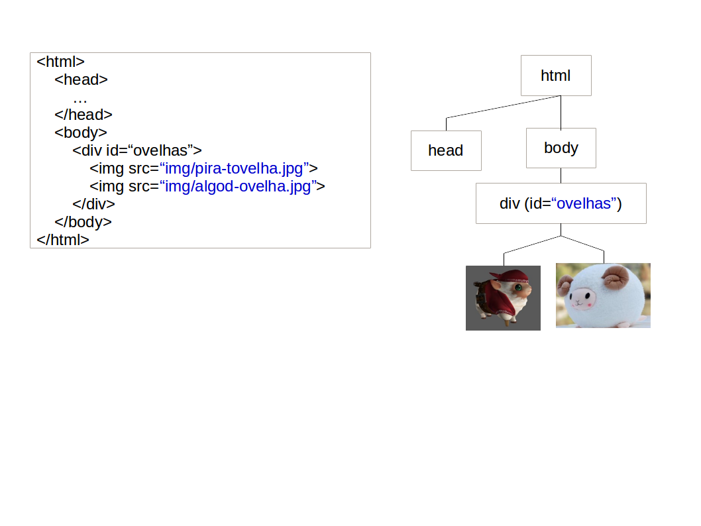
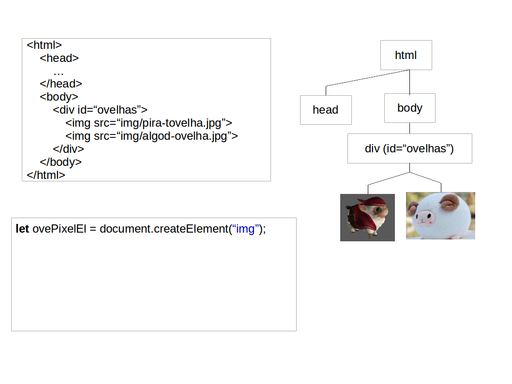
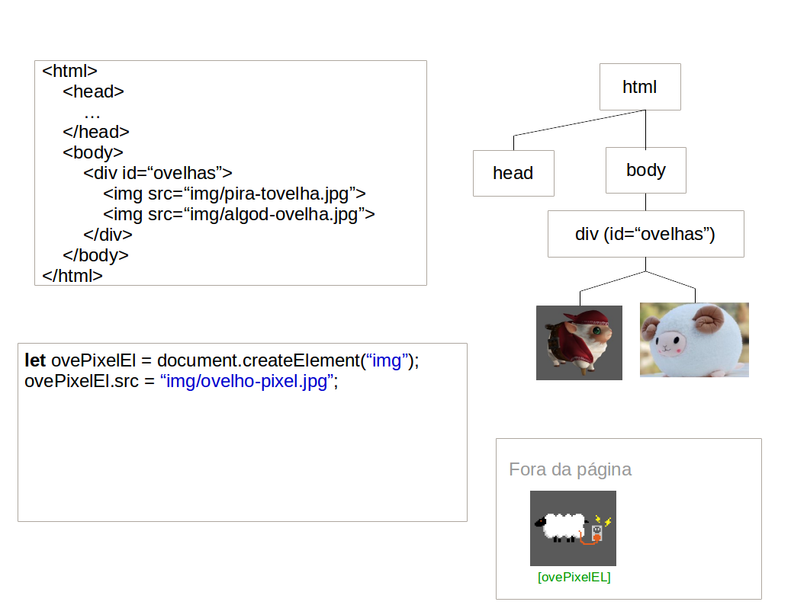
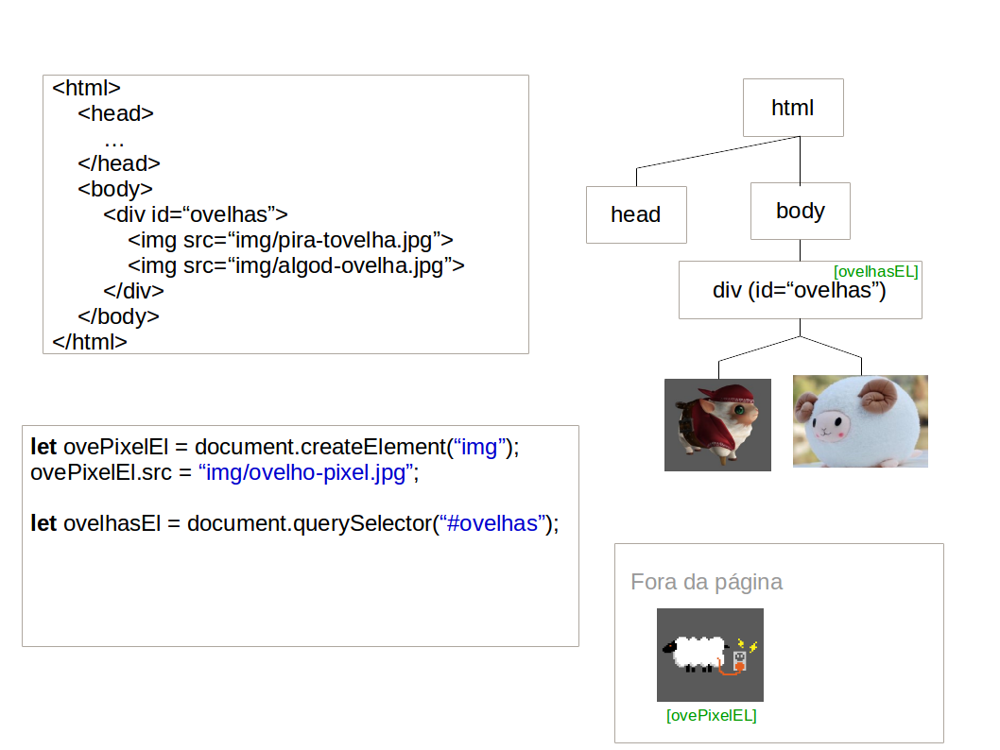
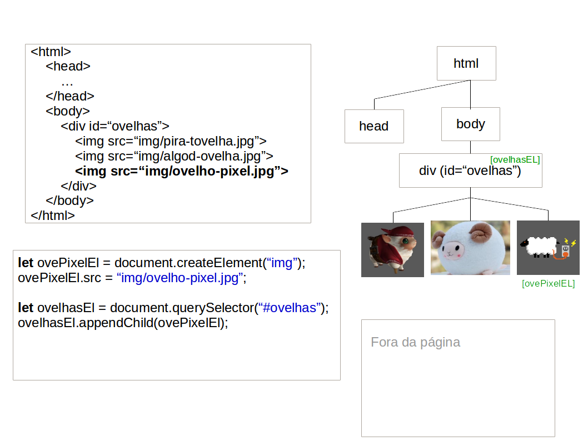
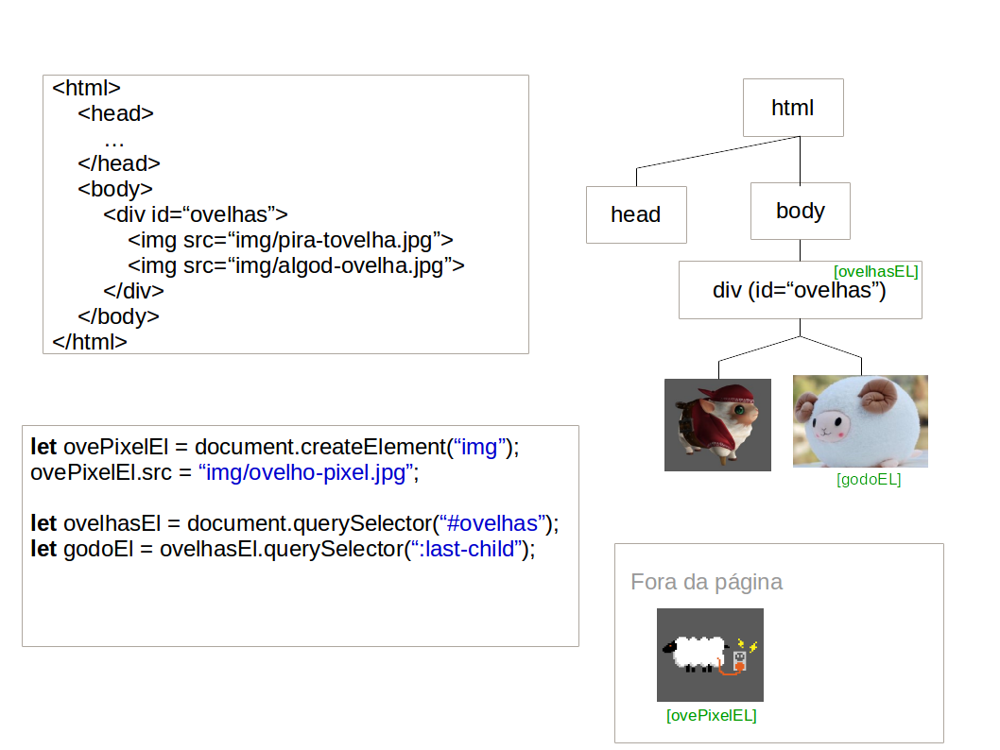
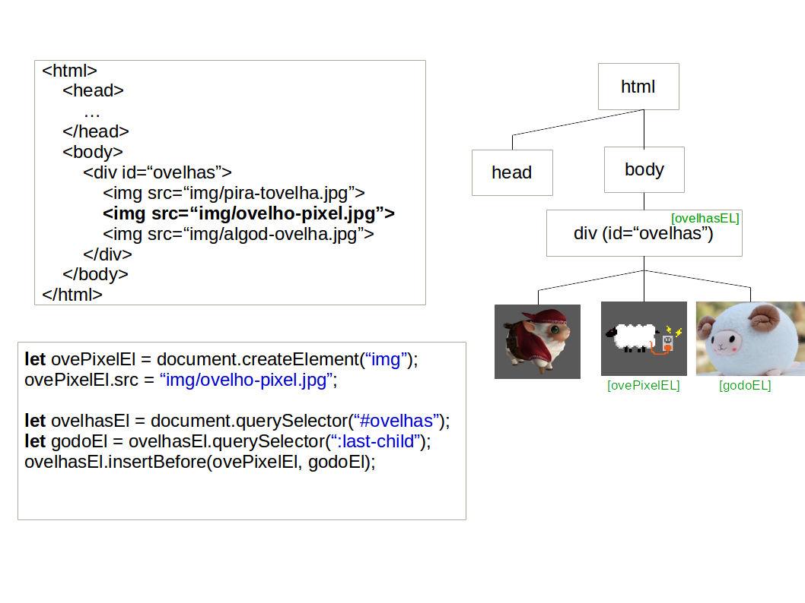
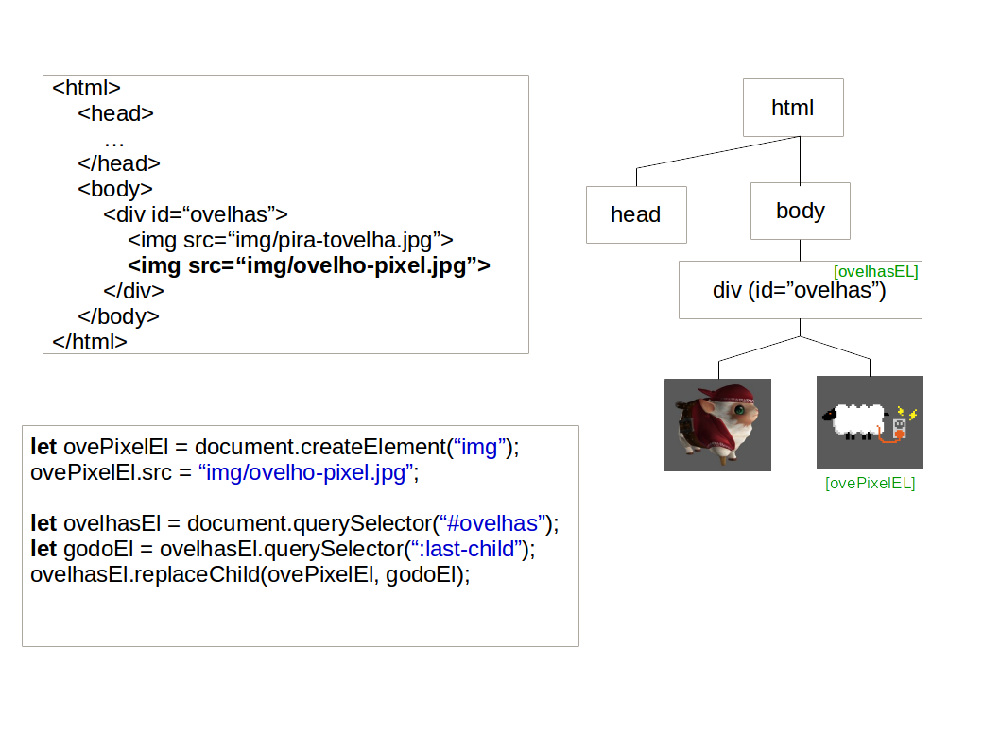
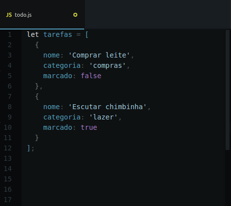

<!-- {"layout": "title"} -->
# **JavaScript** parte 4
## Usando objetos, Criando elementos HTML<br>e a Lista de Tarefas :notebook:

---
# Na última aula... (1/3)
## Transformações <!-- {h1:style="padding-bottom: 0.15em"} -->

- **Translação**: faz um deslocamento do objeto no espaço
  - `translate(x,y)`
  - `translateX(x)`
  - `translateY(y)`
  - `translateZ(z)`<!-- {ul:.multi-column-list-4}-->
- **Escala**: faz um dimensionamento do objeto
  - `scale(x,y)`
  - `scaleX(x)`
  - `scaleY(y)`
  - `scaleZ(z)` <!-- {ul:.multi-column-list-4}-->
- **Rotação**: altera o ângulo do sistema de coordenadas do objeto
  - `rotate(ang)`,
  - `rotateZ(ang)`
  - `rotateX(ang)`
  - `rotateY(ang)`<!-- {ul:.multi-column-list-4}-->

---
<!-- {"layout": "2-column-content"} -->
# Na última aula... (2/3) <!-- {h1:style="padding-bottom: 0.15em;"} -->

- Usando transição, perspectiva e mudando a origem da transformação (`transform-origin`): <!-- {ul:.span-columns} -->

```css
.porta {
  transform-origin: left center;
  transition: transform ease 600ms;
}
.porta:hover {
  transform: rotateY(-95deg);
}
```

<iframe width="470" height="240" src="//jsfiddle.net/fegemo/2bcLx47t/embedded/result,html,css/" allowfullscreen="allowfullscreen" frameborder="0" class="push-right"></iframe>

---
<!-- {"classes": "compact-code-more"} -->
# Na última aula... (3/3) <!-- {h1:style="padding-bottom: 0.15em; margin-bottom: 0;"} -->
## Animação <!-- {h1:style="padding-bottom: 0.15em"} -->

Especificada no CSS3, `animation` e `@keyframes` possibilitam o uso de
 animações de propriedades CSS de forma similar a `transition` <!-- {p:style="margin-top: 0; margin-bottom: 0.15em;"} -->
 ```html
 
 ```
 ```css
 #urso {
   position: relative;
   animation: flutuando .5s ease-in-out 0s infinite alternate;
 }
 @keyframes flutuando {
   from { top: 0;     }
   to   { top: -30px; }
 }
 ```
<style>
.urso-flutuante {
 position: relative;
 animation: urso-flutuando .5s ease-in-out 0s infinite alternate;
 transition: opacity 200ms ease-out;
}
.urso-flutuante:hover {
 opacity: 0.25;
}
@keyframes urso-flutuando {
 from { top: 0;     }
 to   { top: -30px; }
}
 </style>

 <div style="position: absolute; bottom: 2em; right: 1em; margin-top: -75px; margin-left: -75px;">
 
 </div>

---
<!-- {"layout": "centered"} -->
# Roteiro

1. [Usando objetos em JavaScript](#usando-objetos-em-javascript)
1. [Criando elementos HTML dinamicamente](#criando-elementos-html-dinamicamente)
1. [Lista de Tarefas](#lista-de-tarefas) :notebook:
   - Exemplo 1: [Albums de música](#albums-de-musica)
   - Exemplo 2: [Agenda telefônica](#agenda-telefonica)

---
<!-- { "layout": "section-header", "hash": "usando-objetos-em-javascript"} -->
# Usando objetos em JavaScript
## Saquinhos de propriedades

- Revisando:
  - O tipo _Object_
  - Instanciando objetos
- Vetores de objetos
- Quando usar objetos <!-- {ul^1:.content} -->

---
<!-- {"backdrop": "oldtimes"} -->
## Conforme vimos: O tipo **_Object_**

- É um **"saquinho" de propriedades**: <!-- {ul:.push-code-right} -->
  ```js
  let jogador = {
    pontos: 1420,
    vidas: 2
  };
  console.log(jogador.pontos);
  // imprime 1420
  ```  
  - Propriedade: (**nome → valor**)
    - Nome: uma String
    - Valor: qualquer coisa, exceto `undefined`
- No exemplo, o objeto tem 2 propriedades:
  1. Nome: `pontos`, valor: `1420`
  1. Nome: `vidas`, valor: `2`
- Novas propriedades podem ser atribuídas mesmo após sua criação

---
<!-- {"backdrop": "oldtimes"} -->
## Conforme vimos: Instanciando um _Object_

- Na forma literal:
  ```js
  let jogador = {             // forma mais expressiva, curta e sexy
    pontos: 1420,             // propriedades separadas por vírgula
    vidas: 2
  };
  ```
  ```js
  let jogador = {};           // um objeto vazio: { }
  jogador.pontos = 1420;      // criou jogador.pontos com valor 1420
  jogador.vidas = 2;          // criou jogador.vidas
  ```

---
## Instanciando um _object_ **usando `new`**

- Além da forma literal, podemos criar objetos vazios usando a palavra `new`:
  ```js
  let jogador = new Object(); // isto é equivalente a
  jogador.pontos = 1420;      // "let jogador = {};"
  jogador.vidas = 2;
  ```
  - `Object` é uma função (que estamos invocando)
  - Essa função está construindo um novo objeto
  - Portanto, dizemos que **estamos usando uma <u>função construtora</u>**

---
<!-- {"layout": "2-column-content", "backdrop": "oldtimes"} -->
## Conforme vimos: Objetos dentro de objetos

```js
let voo = {
    companhia: 'Gol',
    numero: 815,
    decolagem: {
        IATA: 'SYD',
        horario: '2004-09-22 14:55',
        cidade: 'Sydney'
    },
    chegada: {
        IATA: 'LAX',
        horario: '2004-09-23 10:42',
        cidade: 'Los Angeles'
    }
};
```
- Aqui existem 3 objetos:
  - O **`voo`**, com as propriedades:
     - `companhia`
     - `numero`
     - **`decolagem`**
     - **`chegada`**
  - `decolagem` e `chegada` são objetos por si mesmos

---
<!-- {"layout": "2-column-content", "hash": "vetores-de-objeto", "slideStyles": {"grid-template-columns": ".32fr .68fr"}} -->
## Vetores de Objetos <!-- {.compact-code} -->

```js  
let jogadores = [      
  {
    nome: 'Yoda',
    pontos: 1420
  },
  {
    nome: 'Leia',
    pontos: 3010
  },
  {
    nome: 'Luke',
    pontos: 5600
  }
];

```
- Como qualquer outro tipo, podemos fazer um vetor de _Objects_:
- Posteriormente, **podemos percorrer o vetor**:
  ```js
  for (let i = 0; i < jogadores.length; i++) {
    console.log('Nome: ' + jogadores[i].nome);
    console.log('Pontos: ' + jogadores[i].pontos);
  }
  ```
  - Também podemos usar
    [`for of` e `vetor.forEach()`](../js2/#for-formas-preferiveis)
    sem problemas!

---
<!-- {"layout": "2-column-content", "hash": "passando-vetores-como-argumentos", "slideStyles": {"grid-template-columns": ".55fr .45fr"}, "classes": "compact-code-more"} -->
## Passando objetos como argumentos

- Podemos passar objetos como **argumentos para funções**
- A função é declarada como **recebendo 1 parâmetro** :arrow_lower_right:
  - Não definimos o tipo do parâmetro!
- Chamamos ela passando um **objeto como argumento** :arrow_lower_right:
- Para um **vetor** percorremos chamando a função para o
  i-ésimo item :arrow_lower_right: <!-- {ul^1:.bulleted} -->

```js
let jogadores = [
  { nome: 'Yoda', pontos: 1420 },
  { nome: 'Leia', pontos: 3010 },
  { nome: 'Luke', pontos: 5600 }
];

function passouDeFase(player) {
  // a função recebe 1 parâmetro,
  // que demos o nome de player
  player.pontos += 1000;
}

// podemos chamar a função para 1 jogador:
passouDeFase(jogadores[0]);   // Yoda

// ...ou para todos eles, percorrendo o vetor:
for (let i = 0; i < jogadores.length; i++) {
  passouDeFase(jogadores[i]);
}


// equivalente, porém super-mega-ultra
// ELEGANTE, usando vetor.forEach:
jogadores.forEach(passouDeFase);  // 🌟🌟🌟
```

---
<!-- {"layout": "2-column-content"} -->
## Quando usar objetos?

- Usamos objetos para:
  1. **Agrupar informações** correlacionadas
  1. **Reduzir** o número de **parâmetros**
  1. Trabalhar com **vários objetos semelhantes**
     - Em um vetor
     ```js
     let macunaima = { /* ... */ },
      mentecapto = { /*... */ };
     let biblioteca = [   // (3)
       macunaima, mentecapto];
     ```
```js
// poderíamos fazer assim: 👎
let autorDoLivro = 'Mário de Andr.',
  nomeDoLivro = 'Macunaíma',
  anoDoLivro = 1928;

// mas assim é melhor (1): 👍
let livro = {
  autor: 'Mário de Andrade',
  nome: 'Macunaíma',
  ano: 1928
};

function incluiNaBiblioteca(livro) {
  // (2) ...
}
```

---
<!-- {"layout": "section-header", "hash": "criando-elementos-html-dinamicamente"} -->
# **Criando Elementos** HTML Dinamicamente <!-- {h1:style="padding-top: 0"} -->
## Criando e removendo elementos na página

- De **2 formas** diferentes:
  1. Criando **elemento por elemento**
     - `createElement`
     - `insertBefore`
     - `replaceChild`
     - `appendChild`
  1. **HTML dentro de uma string**:
     - `innerHTML`
- Além disso, podemos:
  - **remover elementos**: `removeChild`<!-- {ul^3:.content} -->

---
## Criando elementos dinamicamente

- É possível criar elementos dinamicamente, de duas formas:
  1. Definindo a propriedade de **`innerHTML` de um elemento** da árvore
     para **uma string descrevendo uma estrutura HTML** (já vimos):
     ```js
     let listaEl = document.querySelector('#lista-de-dados');
     listaEl.innerHTML = '<li></li>';
     ```
  1. Instanciando elementos e os adicionando ao DOM, que é feito em
     3 passos (detalhados a seguir):
     ```js
     // 1. Solicitamos ao document a criação de um elemento
     // 2. Configuramo-lo (atributos, id, classes etc.)
     // 3. Inserimo-lo na árvore
     ```

---
<!-- {"classes": "compact-code-more"} -->
# Instanciação de elementos HTML

- A função **document.createElement** cria um elemento HTML <!-- {ul:.compact-code.bulleted-0} -->
  - Devemos especificar a _tag_ do elemento que iremos criar
- Exemplo - criação de uma imagem:
  ```js
  // 1. Solicitamos ao document a criação de um elemento
  let ovelhaEl = document.createElement('img');       // cria uma 
  // 2. Configuramo-lo (atributos, id, classes etc.)
  ovelhaEl.src = 'images/ovelho-pixel.png';           // 
  ovelhaEl.classList.add('raca');                     // 
  ```
  - Resultado:
    ```HTML
    
    ```
- **Atenção**: você **criou** o elemento, mas <u>**ainda não
  o adicionou**</u> na árvore

---
## Inserção do elemento na árvore DOM

- Para vincularmos um elemento criado, precisamos conhecer quem será seu
  **pai**
- Logo após, podemos adicionar o elemento usando um dos seguintes comandos:
  1. `appendChild`: será o filho mais à direita
  1. `insertBefore`: será o filho que vem logo antes de outro
  1. `replaceChild`: substituirá um filho existente

```js
let containerEl = document.querySelector('#ovelhas');
let novaOvelhaEl = document.createElement('img');
novaOvelhaEl.src = 'img/ovelho-pixel.png';
containerEl.appendChild(novaOvelhaEl);
```

---
## Vinculação na árvore DOM com **(1) `appendChild`**

::: figure .figure-slides.clean.flex-align-center.medium-width.invert-colors-dark-mode
<!-- {.full-width.bullet.figure-step.bullet-no-anim} -->
<!-- {.full-width.bullet.figure-step.bullet-no-anim} -->
<!-- {.full-width.bullet.figure-step.bullet-no-anim} -->
<!-- {.full-width.bullet.figure-step.bullet-no-anim} -->
<!-- {.full-width.bullet.figure-step.bullet-no-anim} -->
:::

---
## Vinculação na árvore DOM com **(2) `insertBefore`**

::: figure .figure-slides.clean.flex-align-center.medium-width.invert-colors-dark-mode
<!-- {.full-width.bullet.figure-step.bullet-no-anim} -->
<!-- {.full-width.bullet.figure-step.bullet-no-anim} -->
<!-- {.full-width.bullet.figure-step.bullet-no-anim} -->
:::

---
## Vinculação na árvore DOM com **(3) `replaceChild`**

::: figure .figure-slides.clean.flex-align-center.medium-width.invert-colors-dark-mode
<!-- {.full-width.bullet.figure-step.bullet-no-anim} -->
<!-- {.full-width.bullet.figure-step.bullet-no-anim} -->
<!-- {.full-width.bullet.figure-step.bullet-no-anim} -->
:::

---
## Resumindo: `appendChild`, `insertBefore` e `replaceChild`


<!-- {p:.medium-width.centered} -->
<!-- {.full-width} -->

---
## **Inserindo texto** nos elementos

- Podemos colocar texto nos elementos de 2 formas: <!-- {ul:.compact-code} -->
  1. Usando `document.createTextNode('texto aqui')`:
     ```js
     let bodyEl = document.querySelector('body');
     let pEl = document.createElement('p');
     let txtEl = document.createTextNode('Olá parágrafo!'); // <--
     bodyEl.appendChild(pEl);                   // põe o parágrafo em <body>
     pEl.appendChild(txtEl);                    // põe o texto no <p>
     ```
  1. Usando `elemento.innerHTML` (👍 mais _easy_):
     ```js
     let bodyEl = document.querySelector('body');
     let pEl = document.createElement('p');
     bodyEl.appendChild(pEl);                   // põe o parágrafo em <body>
     pEl.innerHTML = 'Olá parágrafo!';          // define o innerHTML do <p>
     ```

---
<!-- { "hash": "remocao-de-elementos"} -->
# Remoção de Elementos

- Usamos `containerEl.removeChild(el)` ou, para remover todos, `innerHTML`:  <!-- {ul:.compact-code} -->
  ```html
  <main>
    
  </main>
  ```
  ```js
  let mainEl = document.querySelector('main');
  let imgEl = document.querySelector('#urso');

  mainEl.removeChild(imgEl);      // remove a 
  // ou...
  mainEl.innerHTML = '';          // remove tudo o que estiver em <main></main>
  ```

---
<!-- {"layout": "section-header", "hash": "lista-de-tarefas"} -->
# Lista de Tarefas :notebook:
## Saiba o que procrastinar a seguir

- Atividade de hoje
  - Exercício 1
  - Exemplo: albums de música
  - Exercício 2
  - Exemplo: lista telefônica
<!-- {ul:.content} -->

---
<!-- {"backdrop": "lista-de-tarefas"} -->

---
# Lista de Tarefas :notebook:

- Crie um sisteminha de gerenciamento de tarefas :notebook:
  - [Baixe os arquivos][todos] e veja as instruções
    detalhadas no arquivo `README.md`
- Há 2 atividades:
  1. Inserir elementos HTML para as tarefas pré-existentes no vetor `itensTodo`
  1. Permitir o usuário inserir novas tarefas

[todos]: https://github.com/fegemo/cefet-front-end-todo/archive/master.zip

---
## Exercício 1

-  <!-- {.push-right} -->
  Já existem 2 tarefas no arquivo JavaScript `tarefas.js`
  - Mas a página não está mostrando elas na lista de tarefas
- Neste exercício, você deve criar uma função `insereTarefaNaPagina` que
  recebe **01 objeto representando 01 tarefa** (repare o singular) como
  parâmetro e cria os respectivos elementos HTML para mostrar essa
  tarefa na página

---
<!-- { "hash": "albums-de-musica"} -->
## Exemplo: Albums de música

<iframe width="100%" height="550" src="//jsfiddle.net/fegemo/s1p824jd/embedded/result,html,js/" allowfullscreen="allowfullscreen" frameborder="0" class="bordered rounded"></iframe>

---
## Exercício 2

- Agora você deve permitir que o usuário insira uma nova tarefa
  1. No clique do botão:
     1. Crie um objeto que representa a nova tarefa
     1. Coloque esse objeto no vetor `tarefas`
     1. Chame a função `insereTarefaNaPagina`, passando o objeto
        da nova tarefa como argumento
     1. Opcionais:
        1. Limpe o `value` do campo de texto para que o usuário possa
           inserir a próxima tarefa
        1. Mova o foco da aplicação de volta para o campo de texto
           chamando `campoDeTextoEl.focus()`

---
<!-- { "hash": "agenda-telefonica"} -->
## Exemplo: Agenda telefônica

<iframe width="100%" height="550" src="//jsfiddle.net/fegemo/zrmpjaLg/embedded/result,html,js/" allowfullscreen="allowfullscreen" frameborder="0" class="bordered rounded"></iframe>
