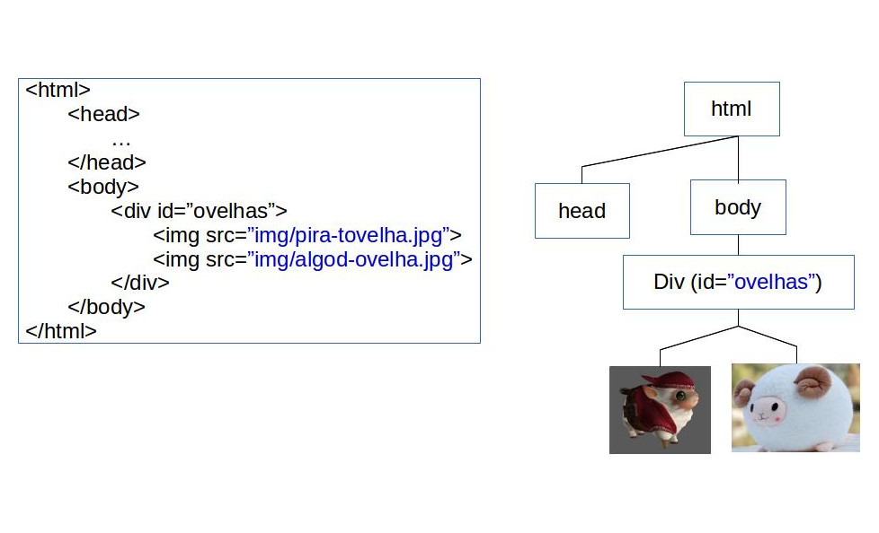
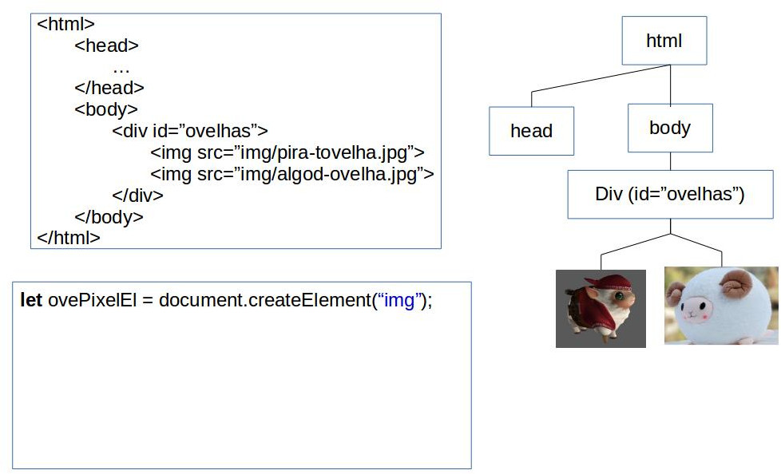
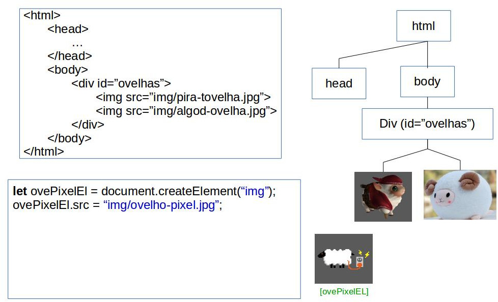
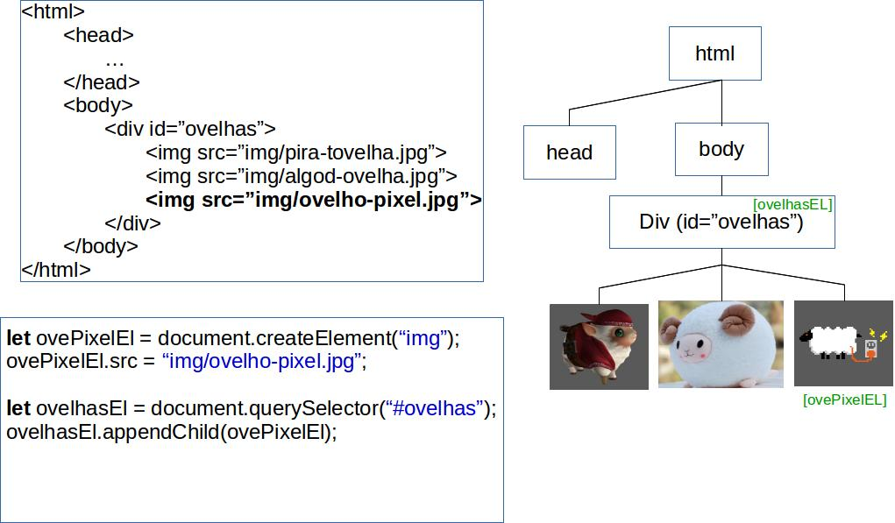
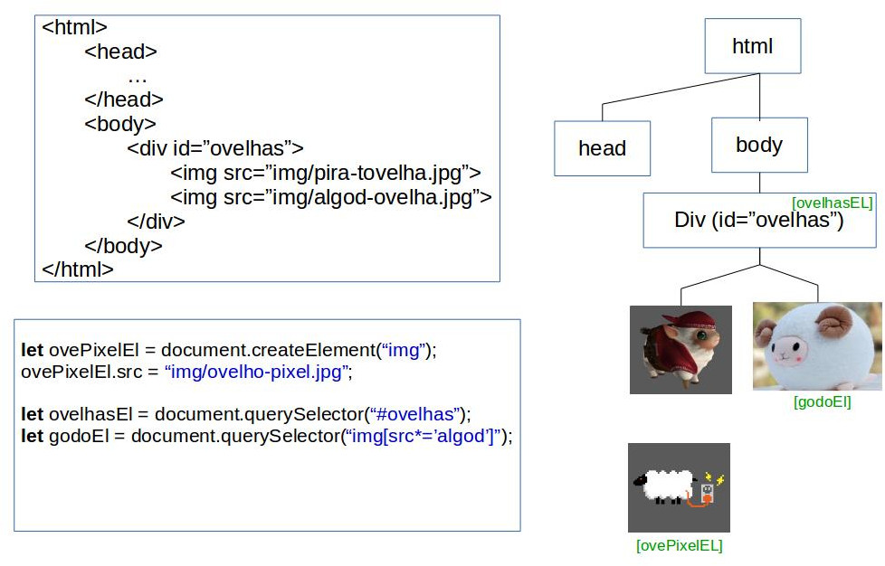
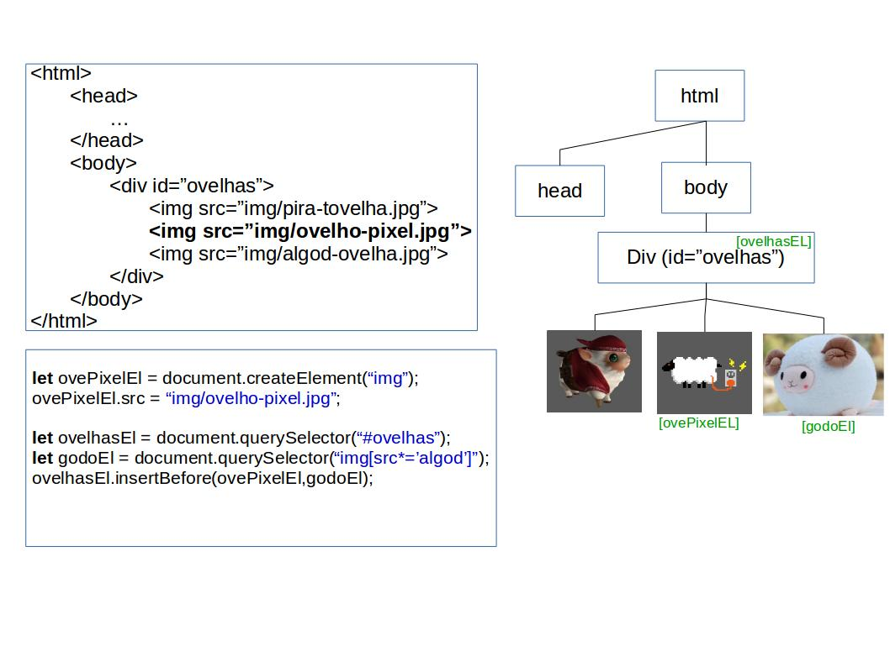
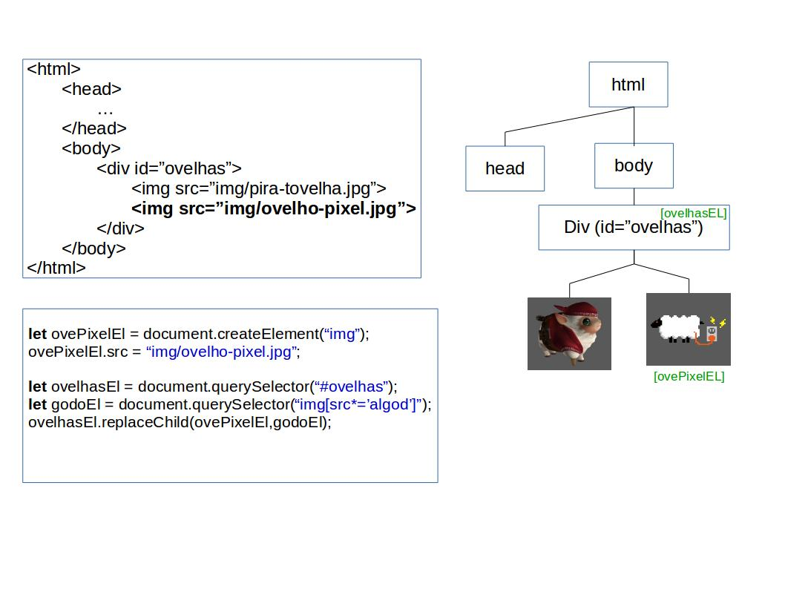
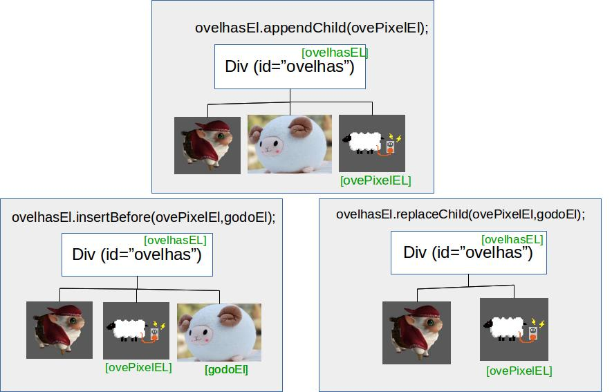

# Javascript (parte 4)
## Objetos, criação e remoção de elementos HTML dinamicamente
---
# Na última aula... (1/3)
## Transformação
- **Translação**: faz um deslocamento do objeto no espaço
  - `translate(x,y)`
  - `translateX(x)`
  - `translateY(y)`
  - `translateZ(z)`
  - `translate3d(x,y,z)` <!-- {ul:.multi-column-list-3}-->
- **Escala**: faz um dimensionamento do objeto
  - `scale(x,y)`
  - `scaleX(x)`
  - `scaleY(y)`
  - `scaleZ(z)`
  - `scale3d(x,y,z)` <!-- {ul:.multi-column-list-3}-->
- **Rotação**: altera o ângulo do sistema de coordenadas do objeto
  - `rotate(ang)`
  - `rotateZ(ang)`
  - `rotateX(ang)`
  - `rotateY(ang)`
  - `rotate3d(x,y,z,ang)`<!-- {ul:.multi-column-list-3}-->
---
# Na última aula... (2/3)
## Transição


- Utilizando transição, perspectiva e mudando a origem da transformação (`transform-origin`):

  <iframe width="470" height="240" src="//jsfiddle.net/fegemo/2bcLx47t/embedded/result,html,css/" allowfullscreen="allowfullscreen" frameborder="0" class="push-right"></iframe>

  ```css
  .porta {
    transform-origin: left center;
    transition: transform ease-in-out 600ms;
  }
  .porta:hover {
    transform: rotateY(-95deg);
  }
  ```

---
# Na última aula... (3/3)
## Animação

Especificada no CSS3, `animation` e `@keyframes` possibilitam o uso de
 animações de propriedades CSS de forma similar a `transition`
 ```html
 
 ```
 ```css
 #urso {
   position: relative;
   animation: flutuando .5s ease-in-out 0s infinite alternate;
 }
 @keyframes flutuando {
   from { top: 0;     }
   to   { top: -30px; }
 }
 ```
<style>
.urso-flutuante {
 position: relative;
 animation: urso-flutuando .5s ease-in-out 0s infinite alternate;
 transition: opacity 200ms ease-out;
}
.urso-flutuante:hover {
 opacity: 0.25;
}
@keyframes urso-flutuando {
 from { top: 0;     }
 to   { top: -30px; }
}
 </style>
 <div style="position: absolute; top: 50%; left: 50%; margin-top: -75px; margin-left: -75px;">
 
 </div>
---
# Roteiro

1. [Objeto Javascript](#objeto-javascript)
1. [Criando elementos dinamicamente](#criando-elementos-dinamicamente)
1. [Exemplo de uso (Criação de elementos + form)](#form-mais-criacao-elemento)

---
<!-- { "slideHash": "objeto-javascript"} -->
# Conforme vimos: O tipo _Object_


- É um **"saquinho" de propriedades**: <!-- {ul:.push-code-right} -->
  ```js
  let jogador = {
    pontos: 1420,
    vidas: 2
  };
  console.log(jogador.pontos);
  // imprime 1420
  ```  
  - Propriedade: (**nome → valor**)
    - Nome: uma String
    - Valor: qualquer coisa, exceto `undefined`
- No exemplo, o objeto tem 2 propriedades:
  1. Nome: `pontos`, valor: `1420`
  1. Nome: `vidas`, valor: `2`
- Novas propriedades podem ser atribuídas mesmo após sua criação

---
## Conforme vimos: Instanciando um _Object_

- Na forma literal:
  ```js
  let jogador = {             // forma mais expressiva, curta e sexy
    pontos: 1420,             // propriedades separadas por vírgula
    vidas: 2
  };
  ```
  ```js
  let jogador = {};           // um objeto vazio: { }
  jogador.pontos = 1420;      // criou jogador.pontos com valor 1420
  jogador.vidas = 2;          // criou jogador.vidas
  ```


---
<!-- {"layout": "2-column-content"} -->
## Conforme vimos: Objetos dentro de objetos

```js
let voo = {
    companhia: 'Gol',
    numero: 815,
    decolagem: {
        IATA: 'SYD',
        horario: '2004-09-22 14:55',
        cidade: 'Sydney'
    },
    chegada: {
        IATA: 'LAX',
        horario: '2004-09-23 10:42',
        cidade: 'Los Angeles'
    }
};
```
- Aqui existem 3 objetos:
  - O **`voo`**, com as propriedades:
     - `companhia`
     - `numero`
     - **`decolagem`**
     - **`chegada`**
  - `decolagem` e `chegada` são objetos por si mesmos
---
## Vetores de Objetos

- Como qualquer outro tipo, podemos fazer um vetor de Objetos:
```js  
  let jogadores = [{
                      nome: "Yoda",pontos: 1420,vidas: 2
                    },
                    {
                        nome: "Leia",pontos: 3420,vidas: 5
                    },
                    {
                        nome: "Luke", pontos: 5420, vidas: 7
                    }];
```

- Posteriormente, podemos percorrer seus resultados:

```js
  for(let i = 0 ; i<jogadores.length ; i++){
    console.log("Nome: "+jogadores[i].nome+"  vidas: "+jogadores[i].vidas);
  }
```

---
<!-- {"layout": "section-header", "slideHash": "criando-elementos-dinamicamente"} -->
# **Criando** elementos dinamicamente <!-- {h1:style="padding-top: 0"} -->
## Criando e removendo elementos HTML

- De **2 formas** diferentes:
  1. Criando **elemento por elemento**
     - `createElement`
     - `insertBefore`
     - `replaceChild`
     - `appendChild`
  1. **HTML dentro de uma string**:
     - `innerHTML`
- Além disso, podemos:
  - **remover elementos**: `removeChild`<!-- {ul^2:.content} -->

---
<!-- {"layout": "regular"} -->
## Criando elementos dinamicamente

- É possível criar elementos dinamicamente, de duas formas:
  1. Definindo a propriedade de `innerHTML` de um elemento da árvore para uma
   string descrevendo uma estrutura `html` (conforme já vimos):
   ```js
   let conteudoEl = document.querySelector('#conteudo');
   conteudoEl.innerHTML = '';
   ```
  1. Instanciando elementos e os adicionando à árvore do DOM (veremos a seguir)


---
# Instanciação de elementos HTML
## Claúsula **create**
- A claúsula **create** cria um elemento HTML
- Devemos especificar a _Tag_ do elemento que iremos criar
- Exemplo - criação de uma imagem
  ```js
  let imgEl = document.createElement('img');
  imgEl.src = 'images/d12.png';
  ```
  - Resultado:
  ```HTML
    
  ```
- **Atenção**: Você **criou** o elemento, porém **não o adicionou** na árvore DOM
  - Ou seja, ele ainda não faz parte da página

---
## Vinculação do elemento na árvore DOM

  - Para vincularmos um elemento criado, primeiramente teremos que buscar o **pai** do elemento
  - Logo após, podemos adicionar o elemento usando um dos seguintes comandos:
    - `appendChild`
    - `insertBefore`
    - `replaceChild`

```js
let conteudoEl = document.querySelector('#conteudo');
let dadoEl = document.createElement('img');
dado.src = 'img/pira-tovelha.png';
conteudo.appendChild(dado);
```
---
## Vinculação do elemento na árvore DOM (appendChild)

::: figure .figure-slides.clean
<!-- {.medium-width.centered .bullet.figure-step.bullet-no-anim} -->
<!-- {.medium-width.centered .bullet.figure-step.bullet-no-anim} -->
<!-- {.medium-width.centered .bullet.figure-step.bullet-no-anim} -->
<!-- {.medium-width.centered .bullet.figure-step.bullet-no-anim} -->
<!-- {.medium-width.centered .bullet.figure-step.bullet-no-anim} -->
:::
---
## Vinculação do elemento na árvore DOM (insertBefore)
::: figure .figure-slides.clean
<!-- {.medium-width.centered .bullet.figure-step.bullet-no-anim} -->
<!-- {.medium-width.centered .bullet.figure-step.bullet-no-anim} -->
<!-- {.medium-width.centered .bullet.figure-step.bullet-no-anim} -->
:::
---
## Vinculação do elemento na árvore DOM (replaceChild)
::: figure .figure-slides.clean
<!-- {.medium-width.centered .bullet.figure-step.bullet-no-anim} -->
<!-- {.medium-width.centered .bullet.figure-step.bullet-no-anim} -->
<!-- {.medium-width.centered .bullet.figure-step.bullet-no-anim} -->
:::

---
## Vinculação do elemento na árvore DOM - Resumindo...

<!-- {.medium-width.centered } -->

---
## Criando nodos de texto
```js
let bodyEl = document.querySelector("body");
let pEl = document.createElement("p");
let txtEl = document.createTextNode("Olá parágrafo!");

bodyEl.appendChild(pEl);
pEl.appendChild(txtEl);

```
ou
```js
let bodyEl = document.querySelector("body");
let pEl = document.createElement("p");
pEl.innerHTML = "Olá parágrafo!"

```
---
# Remoção de Elementos
```html
  <main>
    
  </main>
```
```js
let mainEl = document.querySelector("main");
let imgEl = document.querySelector("#urso");

mainEl.removeChild(imgEl);

```
---
<!-- { "slideHash": "form-mais-criacao-elemento"} -->
## Exemplo: Forms + Criação de elementos dinamicamente
  <iframe width="500" height="400" src="//jsfiddle.net/fegemo/zrmpjaLg/embedded/result,html,js/" allowfullscreen="allowfullscreen" frameborder="0"></iframe>
