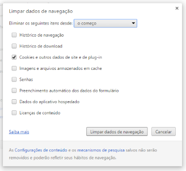
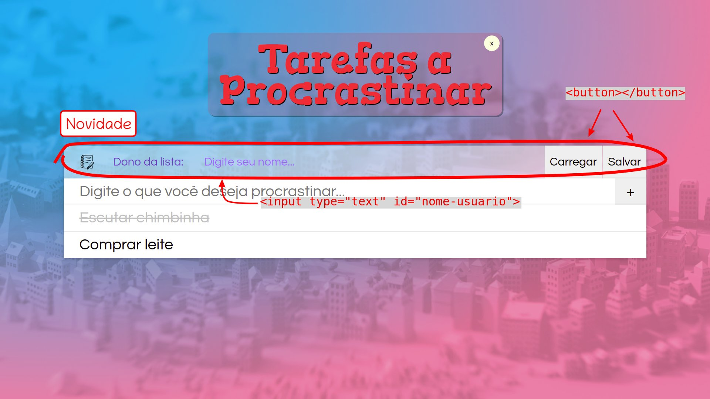
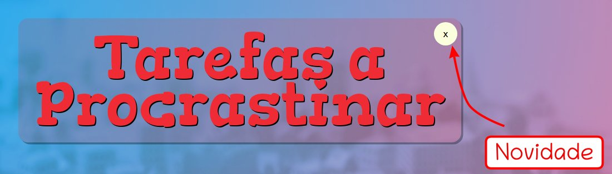

<!-- {"layout": "title"} -->
# **JavaScript** parte 5
## Web Storage, JSON e a Lista de Tarefas :notebook: x2

---
<!-- {"layout": "2-column-content-zigzag"} -->
# Na última aula... (1/4)

- Na forma literal :arrow_right::
  - Preferiemos ela, por ser mais curta e simples

```js
let jogador = {
  pontos: 1420,
  vidas: 2
};
```

```js
let jogador = new Object();
jogador.pontos = 1420;
jogador.vidas = 2;
```

- :arrow_left: Usando o operador `new`: <!-- {ul:style="list-style: none;"} -->
  - Equivalente a `let jogador = {}`
  - Dizemos que **estamos usando uma <u>função construtora</u>**

---
<!-- {"layout": "2-column-content", "slideStyles": {"grid-template-columns": ".55fr .45fr"}, "classes": "compact-code-more"} -->
# Na última aula... (2/4)

- Podemos passar objetos como **argumentos para funções**
- A função é declarada como **recebendo 1 parâmetro** :arrow_right:
- Chamamos ela passando um **objeto como argumento** :arrow_right:
- Para um **vetor** percorremo-lo chamando a função para o
  i-ésimo item :arrow_lower_right: <!-- {ul^1:.bulleted} -->


```js
let jogadores = [
  { nome: 'Yoda', pontos: 1420 },
  { nome: 'Leia', pontos: 3010 }
];

function passouDeFase(player) {
  // a função recebe 1 parâmetro,
  // que demos o nome de player
  player.pontos += 1000;
}

// podemos chamar a função para 1 jogador:
passouDeFase(jogadores[0]);   // Yoda

// ...ou para todos eles, percorrendo o vetor:
for (let i = 0; i < jogadores.length; i++) {
  passouDeFase(jogadores[i]);
}

// ELEGANTE, usando vetor.forEach:
jogadores.forEach(passouDeFase);  // 🌟🌟🌟
```

---
# Na última aula... (3/4) <!-- {h1:style="margin-bottom: 0; padding-bottom: 0.15em;"} -->
## Inserção do elemento na árvore DOM <!-- {h1:style="padding-bottom: 0.15em"} -->

- Para vincularmos um elemento criado, precisamos conhecer seu **pai**
- Então, inserimos o elemento usando um dos seguintes comandos:
  1. `appendChild`: será o filho mais à direita
  1. `insertBefore`: será o filho que vem logo antes de outro
  1. `replaceChild`: substituirá um filho existente

```js
let containerEl = document.querySelector('#ovelhas');
let novaOvelhaEl = document.createElement('img');
novaOvelhaEl.src = 'img/ovelho-pixel.png';
containerEl.appendChild(novaOvelhaEl);
```

---
# Na última aula... (4/4) <!-- {h1:style="margin-bottom: 0.15em; padding-bottom: 0"} -->


<!-- {p:.medium-width.centered} -->
<!-- {.full-width} -->

---
<!-- {"layout": "centered"} -->
# Roteiro

1. [Usando o Web Storage](#usando-o-web-storage)
   1. Salvando para sempre com o [`localStorage`](#local-storage)
   1. Salvando temporariamente com o [`sessionStorage`](#session-storage)
1. Lista de Tarefas :notebook: x2 ([parte 1](#lista-de-tarefas-parte-1))
1. [O formato JSON](#o-formato-json)
1. Lista de Tarefas :notebook: x2 ([parte 2](#lista-de-tarefas-parte-2))


---
<!-- {"layout": "section-header", "hash": "usando-o-web-storage"} -->
# Usando o <br>**Web Storage**
## Salvando dados na página

- Por que e o que salvar?
- O Web Storage
  - `localStorage`
  - `sessionStorage`
<!-- {ul^1:.content} -->

---
# **Por que** e **o que** salvar?

- As nossas páginas podem querer salvar várias coisas:
  1. Exemplo: Moodle
     - **Motivo**: manter preferências do usuário sobre a interface
     - **O que salvar?** o que está aberto/fechado, a língua etc
  1. Exemplo: Slides da aula
     - **Motivo**: mostrar o "tutorial" apenas 3x
     - **O que salvar?** quantas vezes já mostrou o tutorial
  1. Exemplo: Trello
     - **Motivo**: guardar um "rascunho" que ainda não foi salvo
     - **O que salvar?** o conteúdo digitado pelo usuário

---
<!-- {"fullPageElement": "#moodle-video", "playMediaOnActivation": {"selector": "#moodle-video" }} -->

<video src="//fegemo.github.io/cefet-front-end-large-assets/videos/local-storage-moodle.webm" controls id="moodle-video"></video>

---
<!-- {"fullPageElement": "#trello-video", "playMediaOnActivation": {"selector": "#trello-video" }} -->

<video src="//fegemo.github.io/cefet-front-end-large-assets/videos/local-storage-trello.webm" controls id="trello-video"></video>

---
## O Web Storage

- O Web Storage permite páginas **armazenarem dados <u>
  no navegador</u>**
  - _storage_ === armazenamento
- Existem dois sabores:
  1. `localStorage`, salva os dados <u>"para sempre"</u>
  1. `sessionStorage`, salva <u>apenas "durante a sessão"</u>
- Os dados são salvos **apenas no próprio navegador** <!-- {li^0:.note} -->
  - Isto é, se você abrir a página em <u>outro</u> navegador ou computador,
    ainda não existem dados salvos

---
<!-- {"hash": "local-storage"} -->
## `localStorage` e `sessionStorage`

- Ambos nos permitem **armazenar valores dentro de _Strings_** <!-- {ul:.bulleted} -->
- Cada item armazenado é composto por **uma chave (nome) e um valor**
  - Exemplo (salvando):
    ```js
    window.localStorage.setItem('personagem', 'Jake');
    window.localStorage.setItem('quest', 'Salvar a Jujuba');
    ```
    - Lembre-se: ~~`window.`~~`localStorage`
  - Exemplo (recuperando):
    ```js
    let nome = localStorage.getItem('personagem');    // retorna "Jake"
    let objetivo = localStorage.getItem('quest');     // retorna "Salvar a Jujuba"
    ```

---
<!-- {"layout": "2-column-content"} -->
## **localStorage**

- O navegador **armazena permanentemente**, ou até que o usuário limpe: <!-- {ul.bulleted} -->
     <!-- {img:.push-right style="max-height: 200px"} -->
1. É possível inspecionar o que foi salvo na aba _Application_:

   <video src="../../videos/local-storage-hora-aventura.webm" controls preload width="482" height="262"></video>

---
## Exemplo de uso do **localStorage** <small>(1/2)</small>

- Um evento de clique em um botão que **faz o menu aparecer e desaparecer**:
  ```js
  // ...
  botaoMenuEl.addEventListener('click', function() {
    let menuEl = document.querySelector('#menu'),
      isExpandido = menuEl.classList.toggle('expandido');

    // isExpandido = true ou false
    localStorage.setItem('menu-esta-expandido', isExpandido);
  });
  ```
  - (continua no próximo slide)

---
## Exemplo de uso do **localStorage** <small>(2/2)</small>

- Após a página ter sido carregada (ex, um _script_ ao final do _body_):
  ```js
  let devoExpandirMenu = localStorage.getItem('menu-esta-expandido');

  if (devoExpandirMenu === 'true') {        // lembre-se: tudo é salvo como String
    let menuEl = document.querySelector('#menu');
    menuEl.classList.add('expandido');
  }
  ```
  - Ou seja, expande o menu se o usuário o havia deixado expandido antes

---
## Principais métodos do **localStorage**

- Salvar alguma coisa: <!-- {ul:.full-width} -->
  ```js
  localStorage.setItem('chave', 'valor');
  ```
- Recuperar um item a partir de sua chave:
  ```js
  localStorage.getItem('chave');
  ```
- Excluir um item:
  ```js
  localStorage.removeItem('chave');
  ```

---
<!-- {"hash": "session-storage"} -->
## **sessionStorage**

- Exata mesma funcionalidade do `localStorage`, porém o navegador armazena
  as informações apenas enquanto o **usuário está "em uma sessão"**
  - Uma sessão é encerrada:
    1. Com o usuário digitando outro endereço na barra
    1. O navegador fechando
    1. O usuário navegando para outro domínio naquela mesma janela/aba
- Os métodos do `sessionStorage` são os mesmos do `localStorage`

---
<!-- {"layout": "section-header", "hash": "lista-de-tarefas-parte-1"} -->
# Lista de Tarefas :notebook: x2
## Voltando à atividade, parte 1

- O que mudou no código
- Atividade, parte 1
<!-- {ul:.content} -->

---
<!-- {"layout": "2-column-content", "slideStyles": {"grid-template-columns": "7fr 3fr"}} -->
## O que mudou?

 <!-- {.full-width} -->

- Um novo `<input>` para o nome do "dono da lista"
- Botões para `#salvar` e `#carregar` os dados

---
## Atividade, parte 1

- Os exercícios 1, 2 e desafio 1 (semana passada) **estão feitos**:
  - **[Exercício 1]** <!-- {.alternate-color} --> Carregar o vetor `tarefas`
  - **[Exercício 2]** <!-- {.alternate-color} --> Inserir nova tarefa
  - **[Desafio 1]**: <!-- {.alternate-color} --> Inserir nova tarefa no topo
- Agora você deve [baixar o código atualizado][codigo-seminal-lista-tarefasx2]
  e fazer **o Exercício 3**
  - [Enunciado completo][enunciado-lista-tarefasx2]
  - Resumão: implemente os botões `#salvar` e `#carregar` para armazenar e
    recuperar quem é o dono da lista de tarefas
     <!-- {.full-width} -->

[codigo-seminal-lista-tarefasx2]: https://github.com/fegemo/cefet-front-end-todo/archive/master-webstorage.zip
[enunciado-lista-tarefasx2]: https://github.com/fegemo/cefet-front-end-todo/blob/master-webstorage/README.md

---
## Atividade, parte 1 (cont.)

- Agora, faça o **Exercício 4**, que é **<u>tentar</u> salvar** também o vetor
  de tarefas quando clicarem em `#salvar`
- Antes de tentar recuperar as tarefas no `#carregar`, **use a ferramenta
  do desenvolvedor** e veja o que foi salvo...
  - Era o que você esperava?
  - Para corrigir isso, volte aos slides/vídeos da aula

**Atenção**: Não avance os slides até fazer o exercício 4
<!-- {p:.note} -->

<!-- Tentativa de usar o bespokeProceed... preciso deixá-lo mais robusto para
que ele dê feedback ao usuário (positivo e negativo) e também que ele
use comentários JSON em vez de input[type=hidden] -->

<input type="hidden" class="bespoke-proceed-condition" value="[ { &quot;operation&quot;: &quot;containsIgnoreCase&quot;, &quot;operands&quot;: [&quot;#recuperando-vetor-tarefas&quot;, &quot;[object Object]&quot;], &quot;feedbackId&quot;: &quot;#proceder-recuperando-vetor-tarefas&quot; } ]">

- O que foi salvo em vez do vetor: <input type="text" id="recuperando-vetor-tarefas" maxlength="50" class="bespoke-proceed-input">


---
<!-- {"hash": "formato-de-armazenamento", "backdrop": "shiny"} -->
## Formato de armazenamento

- Como dito, o Web Storage armazena **apenas _Strings_**
  - Mas seria útil armazenar **objetos complexos**. Por exemplo:
    ```js
    // ao clicar em 'salvar'
    let jogo = { fase: 4, vidas: 5, jogador: 'Ariosvaldo' };
    localStorage.setItem('meu-save', jogo);

    // ao clicar em 'carregar'
    jogo = localStorage.getItem('meu-save');  // jogo = "[object Object]"
    ```
  - Precisamos de uma forma para **representar o objeto dentro de
    uma String**... tipo assim:
    ```js
    localStorage.setItem('meu-save', 'propriedades: fase = 4, vidas = 5...');
    ```

---
<!-- {"hash": "representando-objetos-em-strings", "classes": "compact-code-more"} -->
## Representando objetos em _Strings_

- Na verdade, o JavaScript sabe **serializar e desserializar** objetos em
  _Strings_, usando um formato que se chama JSON
    - JSON é _JavaScript Object Notation_
- Salvando:
  ```js
  // Usamos JSON.stringify(objeto)
  localStorage.setItem('estado-do-jogo', JSON.stringify(jogo));
  // Salvou a string: {"fase":4,"vidas":5,"jogador":"Ariosvaldo"}"
  ```
- Recuperando:
  ```js
  let jogo = localStorage.getItem('estado-do-jogo');
  jogo = JSON.parse(jogo);  // Usamos JSON.parse(stringComUmObjeto)
  ```
- Agora você já pode fazer o **Exercício 5** :3 <!-- {li:.note} -->

*[JSON]: JavaScript Object Notation*

---
<!-- {"layout": "section-header", "hash": "o-formato-json"} -->
# O formato **JSON**
## Representando dados

- O que é JSON
- Descrição do formato
- JSON no navegador
<!-- {ul:.content} -->

---
## O que é JSON: _JavaScript Object Notation_

- É um formato criado **para representar dados** <!-- {ul:.bulleted} -->
- Baseado na **notação literal de objetos** do JavaScript
- Pode ser usado para troca de informação entre programas escritos em
  diversas linguagens
  - Podemos escrever o formato dentro de uma String
  - Podemos fazer um programa enviar dados nesse formato pr'outro
  - Podemos ter arquivos `.json`. Exemplo:
    `produto.json`
    ```json
    {
      "identificador": 44235,
      "nome": "Caixinha de fósforo",
      "quantidade": 3
    }
    ```

---
## Descrição do formato JSON

- O formato possui seis tipos de valores:
  - Objetos
  - Arrays
  - `String`
  - `Number`
  - `Boolean`
  - `null` <!-- {ul:.multi-column-list-4} -->
- Um objeto JSON é como um objeto JavaScript: um _container_ de
  propriedades (nome, valor)
  - Um **nome de propriedade** é sempre uma **_String_ entre <u>áspas
    duplas</u>**
  - Um valor pode ser de qualquer tipo dos listados acima


---
## JSON no navegador

- O objeto `window` possui o objeto `JSON` que contém métodos de conversão
  do formato JSON entre _string_ e objetos JavaScript
  - De JavaScript para _string_ (serialização):
    ```js
    JSON.stringify({ nome: 'Flavio', sobrenome: 'Coutinho' });  // JSON.stringify
    // retorna '{"nome":"Flavio","sobrenome":"Coutinho"}'
    ```
  - De _string_ para JavaScript (desserialização):
    ```js
    let banco = JSON.parse('{"nome":"Itaú","codigo":"341"}');   // JSON.parse
    console.log(banco.nome);
    // imprime Itaú
    ```

---
<!-- {"layout": "section-header", "hash": "lista-de-tarefas-parte-2"} -->
# Lista de Tarefas :notebook: x2
## Voltando à atividade, parte 2

- Atividade, parte 2
<!-- {ul:.content} -->


---
## Atividade, parte 2

- Agora que você já sabe como salvar representar um _Object_ dentro de uma
  _String_, você pode salvar objetos no `localStorage`/`sessionStorage`
  ```js
  let frutas = [
    { nome: 'Morango', calorias: 20 },
    { nome: 'Banana', calorias: 45 }
  ];
  localStorage.setItem('minhas-frutas', JSON.stringify(frutas));
  ```
- E, para recuperar:
  ```js
  let frutasComoString = localStorage.getItem('minhas-frutas');
  frutas = JSON.parse(frutasComoString);
  ```

---
## Atividade, parte 2 (cont.)

- No **Exercício 5**, você deve salvar e carregar a lista de tarefas do
  usuário, no mesmo momento que salva/carrega o nome do dono da lista
-  <!-- {.push-right style="max-width: 450px"} -->
  No **Desafio 1**, você deve implementar o botão `#minimizar` que
  minimiza/restaura a logomarca
  - Para isso, simplesmente alterne a classe `.minimizado` em `#marca`
  - Além disso, você deve guardar no `sessionStorage` se a `#marca` está
    minimizada ou não
  - Quando a página for carregada, você deve verificar o `sessionStorage`
    para ver se precisa minimizar a logomarca (_i.e._, colocar a classe)

---
<!-- {"layout": "centered"} -->
# Referências

1. Capítulo 12 do livro "Head First: JavaScript"
1. Apêndice E do livro "JavaScript - The Good Parts"
1. Mozilla Developer Network (MDN)
