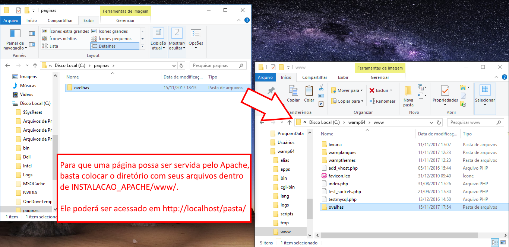

# Introdução a servidores Web

---
# O que veremos hoje

1. O que é um servidor
   - Ideia:
     1. Colocar um slide da primeira aula falando sobre servidor Web
     1. Mostrar que, da forma como temos feito (sem servidor), a página só pode ser vista por quem tem os arquivos, no próprio computador
     1. Mostrar que é necessário ter um computador servindo os arquivos para quem quiser acessar. Quando uma pessoa acessa esse servidor ela está baixando esses arquivos para o próprio computador (em uma pasta temporária do navegador)
     1. Falar que esse servidor pode simplesmente entregar os arquivos (html, css, js), ou então fazer algum tipo de processamento (ie, executar um programa) que vá gerar ou alterar esses arquivos antes de entrega-los
     1. Falar que existem vários servidores web e várias linguagens para escrever esses programas que são executados pelo servidor
1. O servidor Apache
   - Ideia:
     1. Falar que é o servidor mais usado desde que foi criado (96-97)
     1. Tem um desempenho muito bom para conseguir atender a vários computadores acessando um site ao mesmo tempo
     1. Tem suporte a várias linguagens para se escrever programas, mas a mais tradicionalmente usada é PHP
     1. Funciona no linux e no windows
     1. Mostrar funcionando (eg, a animacao) de como colocar um site estático (apenas html, css, js) no Apache
1. PHP: PHP Hypertext Preprocessor
   - Ideia:
     1. Falar que é uma linguagem (a mais usada em conjunto com o apache) para escrever programas no servidor para preprocessar HTML
     1. Mostrar um arquivo .php bem básico, falando que ele é um arquivo html, mas com as tags especiais <?php ?> que são onde podemos escrever o código em PHP
     1. Mostrar um exemplo de um código que, a partir de um array de *entidades* (pensar em algo que não tenha relacionamentos, mas que não seja o *tesouro* que vamos usar na prática), constrói uma tabela ou uma lista não ordenada em HTML
       - Acho que este código pode demonstrar: echo, variáveis, arrays, iteração, if/else (caso array esteja vazio, não criar a <ul></ul>)
     1. Mostrar o resultado no navegador pra verem que o arquivo index.html baixado não possui nenhuma tag PHP (porque elas foram executadas pelo Apache no atendimento à requisição)
     1. Formalizar (bem de leve) o que foi usado no exemplo: echo, variáveis, arrays, iteração, if/else
1. MySQL
   - Ideia
     1. Motivar que queremos armazenar dados em um local central, que possa ser acessível a partir de qualquer lugar (eg emails do Gmail, produtos do Submarino, posts em um blog)
     1. Introduzir o conceito de SGBD, já falando que o MySQL é um bastante usado, gratuito, multiplataforma etc.
     1. Conceito de tabela como uma coleção de registros, conceito de registro, com exemplo
     1. Apresentar a linguagem SQL com alguns exemplos envolvendo SELECT, INSERT e DELETE, sem dar muitos detalhes
     1. Falar que podemos usar um banco de dados pra armazenar a lista de *entidades* e mostrar os comandos PHP para isso
1. Piratas e seus Tesouros :crown: x2
   1. Instalando Apache, MySQL e PHP
   1. A Atividade

*[PHP]: PHP Hypertext Preprocessor*

---

---

::: figure .figure-slides
 <!-- {.bullet.figure-step.bullet-no-anim} -->
 <!-- {.bullet.figure-step.bullet-no-anim} -->
 <!-- {.bullet.figure-step.bullet-no-anim} -->
 <!-- {.bullet.figure-step.bullet-no-anim} -->
:::
