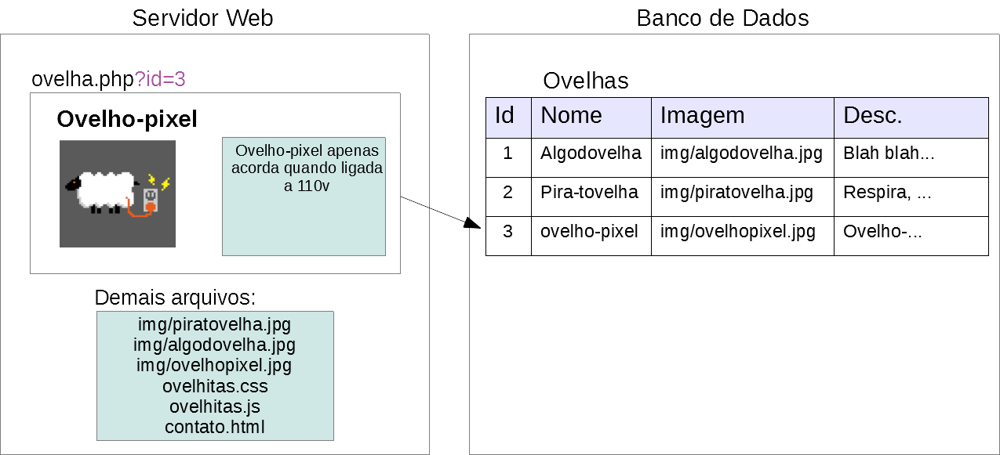
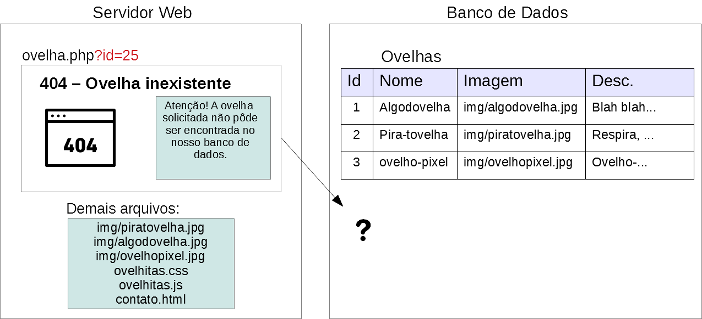

<!-- {"layout": "title"} -->
# Introdução a servidores Web
## Apache, PHP, MySQL e os piratas :crown: x2

---
# O que veremos hoje

1. [O que é um servidor](#servidor-web)
	 - [O servidor Apache](#servidor-apache)
1. [PHP: PHP Hypertext Preprocessor](#php)
1. [Bancos de dados](#bancos-de-dados) e o MySQL
1. [Piratas e seus Tesouros](#tesouros-de-piratas-dinamicos) :crown: x2

*[PHP]: PHP Hypertext Preprocessor*

---
<!-- {"layout": "section-header", "slideHash": "servidor-web"} -->
# Servidor Web
## O que come, onde vive

- Como fizemos até hoje?
- O que faz um servidor Web?
- Página estática vs página dinâmica
- Servidor Apache

<!-- {ul:.content} -->

---
<!-- {"layout": "regular"} -->
## Como fizemos até agora

- Nas práticas
	- Foram criados arquivos (HTML, CSS, etc) e, os mesmos, foram exibidos no
    navegador
	- Os arquivos de um computador não podiam ser visualizados em outro
- Para disponibilizar para demais computadores, precisamos de um serviço que:
	- **Mantenha** os arquivos
	- A partir de um **requisiçäo**, **envie** os arquivos solicitados
	- **Controle** os determinados erros que poderiam ocorrer
		- Página inexistente, falta de permissão
- Para isso, usaremos um **servidor Web** e nos comunicaremos por meio do
  **protocolo HTTP**

---
<!-- {"layout": "regular", "backdrop": "oldtimes"} -->
## Relembrando, o protocolo **HTTP**

- É um **protocolo de redes** na camada de aplicação
  > Conjunto de regras bem definidas descrevendo como
  > entidades se comunicam.
  - É a **"língua falada" pelo navegador e pelo servidor web**
- Modelo requisição &rarr; resposta
  ::: figure .figure-slides.no-margin
   <!-- {.bullet.figure-step.bullet-no-anim} -->
   <!-- {.bullet.figure-step.bullet-no-anim} -->
  :::

---
<!-- {"layout": "regular-block", "backdrop": "oldtimes"} -->
## **Navegador requisita** algo e **Servidor responde**

```http
GET /index.html HTTP/1.1
Host: www.twitter.com                         # exemplo: requisição para www.twitter.com
```
```http
HTTP/1.1 200 OK                               # exemplo: resposta
Date: Mon, 23 May 2005 22:38:34 GMT
Server: Apache/1.3.3.7 (Unix) (Red-Hat/Linux)
Content-Type: text/html; charset=UTF-8
Content-Length: 131

<!DOCTYPE html>
<html>
<head><title>Twitter</title></head>
<body>
  Olá mundo, este é um tweet.
</body>
</html>
```

---
::: figure .figure-slides.full-width-slides
 <!-- {.bullet.figure-step.bullet-no-anim} -->
 <!-- {.bullet.figure-step.bullet-no-anim} -->
 <!-- {.bullet.figure-step.bullet-no-anim} -->
 <!-- {.bullet.figure-step.bullet-no-anim} -->
:::


---
<!-- {"layout": "regular"} -->
## O que faz um servidor Web?

- O servidor Web **precisa**:
  1. Saber "falar" o protocolo HTTP para atender as requisições
  1. Conhecer o sistema de arquivos do SO para entregar arquivos solicitados
		 (JS, HTML, CSS, imagens etc.)
- O servidor Web **pode** (opcional... alguns fazem, outros não):
  1. Executar algum arquivo escrito em alguma linguagem de programação
  1. Permitir a geração dinâmica de arquivos HTML (_e.g._, usando PHP)
  1. Permitir a recepção de arquivos (_e.g._, cliente fazendo _upload_)
  1. Entender outros protocolos além de HTTP: HTTPS, FTP, etc.
  1. Gerenciar conexões simultâneas de vários "solicitantes"

*[SO]: Sistema Operacional*

---
<!-- {"layout": "regular"} -->
## Páginas HTML **estáticas** vs páginas **dinâmicas** <!-- {.alternate-color} -->

Pág. **estáticas**
	~ O servidor simplesmente entrega um arquivo .html da forma como ele foi
		criado pelo programador
	~ É o que temos feito

Pág. **dinâmicas** <!-- {.alternate-color} -->
	~ Podem exibir um conteúdo diferente, dependendo:
		- Usuário que está logado
		- Parâmetros de entrada
		- Além disso, elas podem exibir conteúdo que está armazenado
			em um **banco de dados**
	~ É o que vamos fazer hoje!

---
<!-- {"layout": "2-column-content"} -->
## Site das ovelhas: páginas **estáticas**

<!-- {style="height: 50vh;"} -->

- Exemplo:
	- Existe um arquivo `index.html` para a página inicial
	- +1 arquivo `.html` para cada raça
		- `algodovelha.html`
		- `piratovelha.html`
		- `ovelho-pixel.html`
	- Problema: precisa-se <u>repetir muito código</u> HTML entre uma página e outra

---
<!-- {"layout": "regular"} -->
## Site das ovelhas: páginas **dinâmicas** <!-- {.alternate-color} -->

::: figure .figure-slides.clean
 <!-- {.bullet.figure-step.bullet-no-anim style="max-width: 100%"} -->
 <!-- {.bullet.figure-step.bullet-no-anim style="max-width: 100%"} -->
 <!-- {.bullet.figure-step.bullet-no-anim style="max-width: 100%"} -->
 <!-- {.bullet.figure-step.bullet-no-anim style="max-width: 100%"} -->
 <!-- {.bullet.figure-step.bullet-no-anim style="max-width: 100%"} -->
:::

---
<!-- {"layout": "regular"} -->
## O que é uma **URL**?

- URL: Unique **Resource** Locator
  - É o **endereço de coisas** na Internet - **páginas, imagens, arquivos**, etc.   
     <!-- {.block} -->
		- Também pode haver `#alguma-coisa` ao final da _query string_
		- Essa parte é denominada _hash_, ou _fragment_
- A **_query string_** pode ser usada para identificar o que se deseja
	mostrar - por exemplo, o código identificador da ovelha
- O _back-end_ pode usar a _query string_ para fazer uma busca no
	banco de dados e retornar informações


*[URL]: Unique Resource Locator*

---
<!-- {"layout": "regular"} -->
## Servidores Web

- Exemplos de Servidores Web:
	1. **Apache**
	1. Tomcat
	1. JBoss
	1. IIS
	1. Nginx
	1. **http-server** <!-- {strong:.alternate-color} --> <!-- {ol:.multi-column-list-3} -->
- Vejamos um exemplo de servidor web que simplesmente envia arquivos
	estáticos (`.html`, `.js`, `.css`, imagens etc.):
	```
	http-server .
	```
- Além de servir arquivos estáticos, eles podem executar _scripts_ (programas)
	em diversas outras linguagens:
	- PHP, Python, Java, ASP .NET etc.
- A esses programas, que executam em um servidor web, damos o nome de
	**_back-end_** (digamos, a "parte oculta" de um site)

---
<!-- {"layout": "regular", "slideHash": "servidor-apache"} -->
## **Apache**

- O servidor web mais utilizado desde 1995
- Tipicamente (mas não exclusivamente) usado associado à linguagem PHP
- Motivos para seu sucesso:
  1. Projeto altamente modularizado e configurável
  1. Gratuito
  1. Extensível
  1. Bom desempenho
  1. Multi-plataforma (Pode ser executado tanto no Linux quanto no Windows)

---
<!-- {"layout": "section-header", "slideHash": "php"} -->
# PHP
## Hypertext Preprocessor

- Sintaxe Básica
- Condicionais
- Estrutura de Repetição
- Vetores

<!-- {ul:.content} -->

---
<!-- {"layout": "regular"} -->
## PHP - Hypertext Preprocessor

- É uma linguagem amplamente usada
- É executada **no servidor** para preprocessar e gerar HTML dinamicamente
- O código PHP é tipicamente mesclado ao HTML
	- Mas existem formas mais organizadas
- Assim, todo código PHP deve iniciar por `<?php` e finalizar com `?>`

```php
...
<body>
  <h1>Produto: <?php echo produto["nome"]; ?></h1>
</body>
</html>
```

---
<!-- {"layout": "2-column-content", "slideHash": "for-formas-preferiveis"} -->
## PHP - Sintaxe Básica

1. `echo`: exibe no HTML o que for passado como parametro. Exemplo, arquivo `index.php`:
```php
<html>
<head>...</head>
<body>
  <?php echo "<p>Olá Mundo</p>"; ?>
</body>
</html>
```
- O servidor irá ler `index.php`, processá-lo e enviar ao navegador o
	seguinte código HTML:
```html
<!DOCTYPE html>
<html>
<head>...</head>
<body>
  <p>Olá Mundo</p>
</body>
</html>
```

---
<!-- {"layout": "regular"} -->
## PHP - **Variáveis**

- Variáveis não precisam ser declaradas
- Toda a variável inicia-se com o caractere `$`
- Exibir a variável no HTML: `echo` (tipo `printf` do C)
- Para concatenação de strings, usa-se o ponto `.`
- Com aspas duplas, o PHP faz substituição das variáveis na string:
  ```php
  <?php
    $a = 1;
    echo $a; //imprime: 1
    echo "resultado: " . $a;  // imprime: resultado: 1
    echo "resultado: $a";     // imprime: resultado: 1
    echo 'resultado: $a';     // imprime: resultado: $a
  ?>
  ```

---
<!-- {"layout": "regular"} -->
## PHP - **Condicionais**

- Condicionais possuem a sintaxe similar ao JavaScript:
  ```php
  <?php
    $a = 1;
    $b = rand(); // rand(): retorna um número inteiro aleatório
    echo "b: $b";  
    if ($a > $b) {
      echo "'a' é maior que 'b'!";
    } else {
      echo "'b' é maior ou igual a 'a'!";
    }
  ?>
  ```

---
<!-- {"layout": "regular"} -->
## PHP - Estrutura de repetição - **for**

- Também possui a sintaxe similar ao JavaScript
  ```php
  <?php $numero = rand(2,9); 			// aleatório entre 2 e 9 	?>
  <h1>Tabuada do <?php echo $numero ?></h1>
  <ul>
  <?php
    for($i = 1; $i < 10; $i++) {
      $resultado = $i * $numero;
      echo "<li>$i x $numero = $resultado</li>";
    }
  ?>
  </ul>
  ```

---
<!-- {"layout": "regular"} -->
## PHP - Estrutura de repetição - **while**

```php
<?php $numero = rand(2,9); 			// aleatório entre 2 e 9 	?>
<h1>Tabuada do <?php echo $numero ?></h1>
<ul>
<?php
  $i = 1;
  while($i < 10) {
    $resultado = $i * $numero;
    echo "<li>$i x $numero = $resultado</li>";
    $i++;
  }
?>
</ul>
```

---
<!-- {"layout": "regular"} -->
## PHP - **Vetores** (_Arrays_)

- Inicialização:
  ```php
  <?php $frutas =  array("kiwi","morango","uva");?>
  ```
- Percorrendo o _array_:
  ```php
  <?php
    echo("<ul>");
    for ($i = 0; i < count($frutas); $i++) {
      echo("<li>{$frutas[$i]}</li>");
    }
    echo("</ul>");
  ?>
  ```
	- para imprimirmos um valor do _array_ em uma string, colocar chaves
- A função `count` retorna o tamanho do _array_

---
<!-- {"layout": "regular"} -->
## PHP - Vetores (cont.)

- _Arrays_ em PHP são, na verdade, **mapas ordenados**:
	- mapeiam uma *chave* a um *valor*
- Exemplo:
  ```php
  <?php
    $personagem = array(nome => "luke",
                        pontos => 123);

    $personagem["pontos"] += 100;

		echo("O personagem {$personagem['nome']} possui {$personagem['pontos']}");
  ?>
  ```
	- São parecidos com os objetos em JavaScript!

---
<!-- {"layout": "section-header", "slideHash": "bancos-de-dados"} -->
# Bancos de Dados

- Por que centralizar dados?
- SGBDs
- Entidades e Relacionamentos
- Tabelas e Registros
- Cláusula SELECT
- PHP e MySQL

<!-- {ul:.content} -->

---
<!-- {"layout": "regular"} -->
## Centralizando dados

- Servidores são úteis para **centralizar dados**, para, por exemplo:
	- salvar/ler mensagens de um bate-papo;
	- apresentar/escrever e-mails;
	- exibir/escrever posts de um blog;
	- exibir e registrar compras de produtos de um site de compra.
- Para centralizar, temos que armazenar estes dados em:
	- Arquivos ou
	- Bancos de Dados
- Bancos de dados armazenam os seus dados de uma forma:
	- mais **estruturada**
	- favorecendo o **uso por muitos usuários**

---
<!-- {"layout": "regular"} -->
## **S**istema de **G**erenciamento de **B**anco de **D**ados

- **SGBD**: É um conjunto de ferramentas para gerenciar *bancos de dados*
- São exemplos de SGBDs:
	- **MySQL**
	- Postgres
	- Oracle
	- MS SQL Server <!-- {ul:.multi-column-list-4} -->
- Usaremos o **MySQL** por ser gratuito, multiplataforma
	e popular
	 <!-- {style="max-width: 100%"} -->

*[SGBD]: Sistema de Gerenciamento de Banco de Dados

---
<!-- {"layout": "regular"} -->
## Entidades e Relacionamentos

- Um banco de dados é formado um conjunto de *entidades* com *relacionamentos*
- Entidades podem ser abstratas ou concretas:
	- Pessoa, Carro, Alimento, Pedido, Transação Bancária
- Cada entidade pode ter **relacionamentos** com outras:
	- Uma **pessoa** faz diversas **transações bancárias**
	- Um **carro** possui uma **pessoa** que é seu dono
	- Uma **pessoa** pode fazer diversos **pedidos de compra**
- Em SGBDs, *entidades* são representadas por **tabelas** <!-- {.alternate-color} -->

---
<!-- {"layout": "regular"} -->
## Tabelas e registros

- Uma entidade é representada por uma ou mais **tabelas** em um banco de dados
- Tais tabelas possuem um conjunto de **registros**
- Na tabela, cada linha é um **registro** e cada coluna é um **campo**
	que descreve aquela entidade


---
<!-- {"layout": "regular"} -->
## SQL - Structured Query Language

- Dado que temos um conjunto de tabelas, precisamos de uma linguagem para:
	- Manipular e Pesquisar nos registros
	- Criar, alterar a estrutura das tabelas
	- Conceder e retirar permissões
	- etc...
- Para isso, foi criado o **SQL** que é uma linguagem padrão que a maioria dos SGBDs adotam (com algumas adaptações)
- Na aula de hoje, iremos aprender a consultar uma tabela usando a cláusula **SELECT**


---
<!-- {"layout": "regular"} -->
## SQL - Cláusula **SELECT**


---
<!-- {"layout": "regular"} -->
## SQL - Cláusula **SELECT** - Exemplo (1/3)

- Seleciona todas as colunas e registros da tabela `RACA_OVELHA`


---
<!-- {"layout": "regular"} -->
## SQL - Cláusula **SELECT** - Exemplo (2/3)

- Seleciona o nome de todas as raças de ovelha (i.e. tabela `RACA_OVELHA`)


---
<!-- {"layout": "regular"} -->
## SQL - Cláusula **SELECT** - Exemplo (3/3)

- Seleciona o nome e alimento preferido de todas as raças de ovelha (i.e. tabela `RACA_OVELHA`) em que a expectativa de vida é menor que 5 anos


---
<!-- {"layout": "regular"} -->
## PHP e MySQL - Exemplo

- Para usarmos o MySQL no PHP precisamos conectar ao MySQL:
  ```php
  <?php
    // faz a conexão com o banco de dados
    $db = mysqli_connect("localhost", "root", "123456", "piratas");
    $db->set_charset("utf8");
    // verifica se a conexão funcionou...
    if (!$db) {
      // encerra a execução do script php, dando um erro
      $descricaoErro = "Erro! Detalhes: " . mysqli_connect_error();
      die($descricaoErro);
    }
  ?>
  <!DOCTYPE html>
  ```

---
<!-- {"layout": "regular"} -->
## PHP e MySQL - Exemplo (cont.)

- Logo após, podemos fazer uma consulta, por exemplo, exibindo todas as raças de ovelha.
  ```php
  <?php
    $sql = "SELECT nome, alimento_preferido FROM raca_ovelha";
    $result = $db->query($sql); //db é a conexao obtida
    if ($result->num_rows > 0) {
      echo("<ul>");
      while($linha = $result->fetch_assoc()) {
        $html = "<li>Ovelhas da raça <strong>{linha['nome']}</strong>";
        $html .= "gostam de {linha['alimento_preferido']} </li>"
        echo($html);
      }	  
      echo("</ul>");
    } else {
      echo("<p>Não existem ovelhas cadastradas</p>");
    }
  ?>
  ```


---
<!-- {"layout": "section-header", "slideHash": "tesouros-de-piratas-dinamicos"} -->
# Piratas Dinâmicos
## Barba-Ruiva + Apache, PHP e MySQL

- Instalando Apache, PHP e MySQL
- Atividade de hoje

<!-- {ul:.content} -->

---
<!-- {"backdrop": "piratas-php"} -->

---
<!-- {"layout": "regular"} -->
## Instalando Apache, PHP e MySQL

- **<u>Pergunte ao professor</u> se é necessário instalar algo** nos
  laboratórios
  - É provável que já esteja tudo funcionando... de qualquer forma, leia sobre
    como fazê-lo
- Podemos instalar (a) cada software separadamente ou (b) um pacote que
  instala todos de uma vez _(mais fácil)_
  - (a) Visite os sites oficiais: [Apache][apache], [MySQL][mysql], [PHP][php]
  - (b) [WAMP][wamp] (para Windows), [LAMP][lamp] (para Linux)
    ou [XAMPP][xampp] (ambos)
- Ao instalar, lembre-se apenas de **<u>anotar o usuário</u> (normalmente
  'root') <u>e senha</u> escolhidos para o MySQL**

*[WAMP]: Windows, Apache, MySQL e PHP*
*[LAMP]: Linux, Apache, MySQL e PHP*

[apache]: https://httpd.apache.org/download.cgi
[mysql]: https://www.mysql.com/downloads/
[php]: http://php.net/downloads.php
[wamp]: http://www.wampserver.com/en/
[lamp]: https://howtoubuntu.org/how-to-install-lamp-on-ubuntu
[xampp]: https://www.apachefriends.org/pt_br/index.html

---
<!-- {"layout": "regular"} -->
## Atividade de hoje

 <!-- {.push-left style="width: 45%;"} -->
<!-- {.push-right style="width: 45%;"} -->

- Torne a página dos tesouros do Barba-Ruiva em uma página dinâmica usando
  o Apache, PHP e um banco de dados MySQL
- Veja o enunciado completo no Moodle

---
# Referências

1. [Site do Apache](http://apache.org)
1. [Guia PHP](http://php.net/manual/pt_BR/langref.php)
2. [Guia MySQL](https://dev.mysql.com/doc/refman/5.7/)
