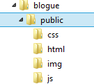

# Server Side - Parte 3

---
# Roteiro

1. Continuando nosso servidor web <abbr title="Do it yourself">DIY</abbr>
1. O _framework_ Express.js
1. Geração dinâmica de HTML

---
# Continuando nosso servidor web

---
## Um servidor web não muito útil

- Na última aula, criamos um servidor Web que retornava sempre o mesmo arquivo
  para quaisquer requisições
  ```js
  var http = require('http'),
      fs = require('fs');

  var server = http.createServer(function (req, res) {
    res.writeHead(200, { 'content-type': 'text/plain' });
    fs.createReadStream(process.argv[3]).pipe(res);
  })

  server.listen(process.argv[2]);
  ```

---
## Um servidor web útil

- Alterado, este servidor retorna arquivos **baseados na URL**:
  ```js
  var http = require('http'), fs = require('fs'), u = require('url');
  var server = http.createServer(function (req, res) {
    var caminho = __dirname + u.parse(req.url).path,
        stream = fs.createReadStream(caminho);
    stream.on('error', function() {
      res.writeHead(404); res.end('Not Found');
    });
    stream.on('open', function() {
      res.writeHead(200, { 'content-type': 'text/plain' });
      stream.pipe(res);
    });
  }).listen(8080);
  ```

---
## Problema: _MIME types_

- O protocolo HTTP define um cabeçalho chamado _Content-Type_, que deve conter
  o tipo <abbr title="Multipurpose Internet Mail Extensions">MIME</abbr> do
  arquivo: texto, HTML, imagem, CSS etc.
  - Exemplos:
    1. `text/plain`
    1. `text/html`
    1. `image/png`
    1. `video/webm`
    1. `application/json`
- Como saber qual _MIME type_ enviar?
  - Tipicamente usamos **a extensão do arquivo**
  - E uma tabela que mapeie extensões para _MIME types_

---
## Servindo os arquivos, com _MIME types_

- Existem [mais de 1.500 _MIME types_](http://www.iana.org/assignments/media-types/media-types.xhtml)
- Em vez de criar a lista nós mesmos, vamos buscar se alguém já não passou por
  esse problema e já propôs uma solução:
  ```
  $ npm search mime
  ```
  - Ou então pesquise no [site do npm](https://www.npmjs.com/search?q=mime)
    - Resultado: um pacote chamado `mime`, com a descrição _"A comprehensive
      library for mime-type mapping"_
      - [Repositório](https://github.com/broofa/node-mime) no GitHub
        com documentação
---
## Usando o pacote **mime**

- Primeiro, vamos instalar **localmente** o pacote `mime`. No diretório
  do nosso arquivo js:
  ```
  $ npm install mime
  ```
  - Repare que uma pasta com o nome `node_modules` foi criada e ela contém uma
    subpasta chamada `mime`
- No programa do nosso servidor web:
  1. Incluir o módulo `mime` via `require('mime')`
  1. Invocar o método `lookup` que, dado um nome de arquivo, retorna o
     _MIME type_

---
## Usando o pacote **mime** (cont.)

- (1) Incluindo o módulo `mime`:
  ```js
  var http = require('http'),
      fs = require('fs'),
      url = require('url'),

      // incluído e atribuido à variável "mime"
      mime = require('mime');

  /* ... */
  ```

---
## Usando o pacote **mime** (cont.)

- (2) Invocando o método que retorna o tipo _MIME_ dado um nome de arquivo:
  ```js
  /* ... */
  stream.on('open', function() {
    res.writeHead(200, {
      'content-type': mime.lookup(caminho)
    });
    stream.pipe(res);
    console.log('Serviu o arquivo: ' + caminho);
  });
  /* ... */
  ```

---
## O que ainda está faltando

- Nosso servidor web ainda precisa de algumas coisas:
  1. Controlar _cache_ de arquivos já solicitados
    - Se um navegador solicita um arquivo, o servidor pode enviar uma resposta
      **`304 not modified` em vez de `200 OK`**
  1. Prevenir que um usuário acesse http://localhost:8080/../../../
  1. Saber responder a métodos HTTP diferentes de GET (POST, PUT, DELETE, HEAD etc.)
  1. Saber falar outros métodos (e.g., HTTPS)
  1. Gerar arquivos HTML dinamicamente
- Novamente, vejamos se não estamos reinventando a roda =)

---
# Express

---
## 

- Se entitulam um _web framework_ para Node.js:
  1. Rápido
  1. Não opinativo (_unopinionated_)
  1. Minimalista
- Site oficial: [http://expressjs.com/](http://expressjs.com/)

---
## Instalação

- Via `npm`, é claro =)
  ```
  $ npm install express
  ```
  - Isso vai criar a pasta `node_modules` no diretório atual e fazer _download_
    dos arquivos do express para `node_modules/express`

---
## Servidor _"hello world"_ com Express

```js
var express = require('express');
var app = express();

app.get('/', function (req, res) {
  res.send('Hello World!');
});

var server = app.listen(3000, function () {
  var host = server.address().address;
  var port = server.address().port;
  console.log('Listening at http://%s:%s', host, port);
});
```

---
## Servidor de arquivos estáticos com Express

```js
var express = require('express'),
    app = express();

// suponhamos que "/public" é uma pasta com
// nossos arquivos estáticos
app.use(express.static(__dirname + '/public'));

var server = app.listen(3000, function () {
  console.log('Escutando em: http://localhost:3000');
});
```
  

---
## Especificando rotas

- O _express_ facilita a **especificação da ação** a ser tomada **dependendo
  da URL solicitada**
  - Uma rota é definida por um verbo HTTP (`GET`, `POST` etc.) e um caminho de uma
    URL
  - A cada rota é associada uma _callback_:
    ```js
    // GET /
    app.get('/', function(request, response) {
      response.render('index');
    });
    // POST /contato
    app.post('/contato', function(request, response) {
      // envia um email usando os dados enviados
    });
    ```

---
## Especificando rotas (cont.)

- Mais alguns exemplos de rotas:
  ```js
  // HEAD /user/122   (verificar se usuário id=122 existe)
  app.head('/user/:ident', function(request, response) {
    if (tabelaDeUsuarios[request.params.ident]) {
      response.status(200).end();
    } else {
      response.status(404).end();
    }
  });
  ```
- Veja mais no [guia oficial sobre rotas](http://expressjs.com/starter/basic-routing.html)

---
## Gerando HTML dinamicamente

- Queremos poder gerar HTML dinamicamente. Para isso, precisamos de uma
  linguagem que facilite isso, ao mesmo tempo que possibilite a **separação de
  código HTML do código nessa linguagem**
- Para ser "não opinativo", o Express não impõe uma linguagem específica,
  oferecendo 19 opções, e.g.:
  1. `ejs` (`.ejs`, era o [formato original do Express](https://github.com/tj/ejs))
  1. `handlebars` (`.hbs`, [site oficial](http://handlebarsjs.com/))
  1. `jade` (`.jade`, [site oficial](http://jade-lang.com/))
  1. `dust` (`.dust`, feito pelo [LinkedIn](http://akdubya.github.io/dustjs/))

---
## Gerando HTML dinamicamente com **ejs**

- Usamos `ejs` (ou qualquer outro **_templating engine_**) em 3 passos:
  1. Configuramos o express
  1. Escrevemos arquivos HTML no formato `ejs`
  1. Para determinadas rotas, renderizamos _views_
- (1) Para configurar o Express para usar `ejs`:
  ```js
  app.set('view engine', 'ejs');
  ```

---
## Gerando HTML dinamicamente com **ejs** (cont.)

- (2) Escrevemos arquivos no formato `.ejs` em vez de `.html`. Trecho de um
  arquivo, e.g., `equipe.ejs`:
  ```html
  <ul>
    <% for (var i=0; i < users.length; i++) { %>
      <li>"><%= users[i].nome %></li>
    <% } %>
  </ul>
  ```
  - Esses arquivos são chamados de _views_ e devem ficar dentro de uma pasta
    que configurarmos (valor padrão: `./views`):
    ```js
    app.set('views', 'arquivos_ejs');   // pasta arquivos_ejs
    ```

---
## Gerando HTML dinamicamente com **ejs** (cont.)

- (3) Ao definirmos os _handlers_ das nossas rotas, chamamos `response.render`
  e passamos o nome do arquivo da _view_ que deve ser usado (sem a extensão):
  ```js
  app.get('/equipe', function(request, response) {
    response.render('equipe');
  });
  ```

---
## Gerando HTML dinamicamente com **ejs** (cont.)

- (3) É possível (e muito comum) disponibilizar dados para a _view_ e podemos
  fazer isso usando o segundo parâmetro de `response.render`:
  ```js
  response.render('equipe', {
    users: [
      { nome: 'TJ Holowaychuk', foto: 'tj.jpg'  },
      { nome: 'Douglas Wilson', foto: 'dcw.jpg' }
    ]
  });
  ```
- Mais informações sobre [_templating engines_](http://expressjs.com/guide/using-template-engines.html) no Express

---
## Gerando HTML dinamicamente com **handlebars**

- (1) Configurando o Express:
  ```js
  app.set('view engine', 'hbs');
  ```
- (2) Criando arquivos no formato `.hbs`:
  ```hbs
  <ul>
    {{#each users}}
      <li>{{nome}}</li>
    {{/each}}
  </ul>
  ```

---
## Gerando HTML dinamicamente com **jade**

- (1) Configurando o Express:
  ```js
  app.set('view engine', 'jade');
  ```
- (2) Criando arquivos no formato `.jade`:
  ```jade
  ul
    each user in users
      li: img(src=user.foto) #{user.nome}
  ```

---
## Gerando HTML dinamicamente com **dust**

- (1) Configurando o Express:
  ```js
  app.set('view engine', 'dust');
  ```
- (2) Criando arquivos no formato `.dust`:
  ```dust
  <ul>
    {#users}
      <li>{nome}</li>
    {/users}
  </ul>
  ```

---
# Referências

1. Capítulo 8 do livro "Node.js in Action"
1. [Site do expressjs](http://expressjs.com/)
