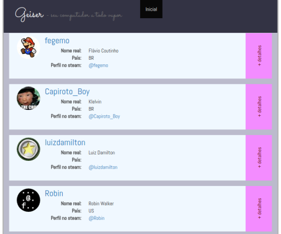
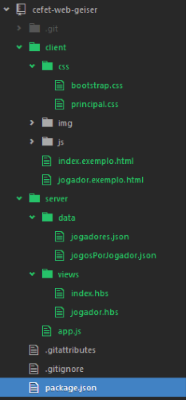
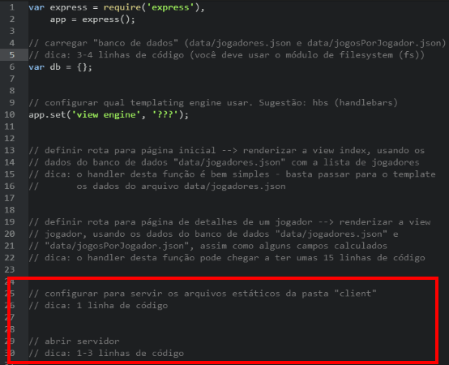
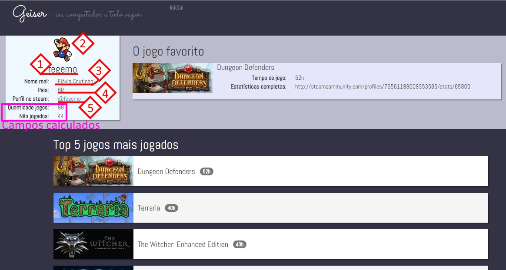
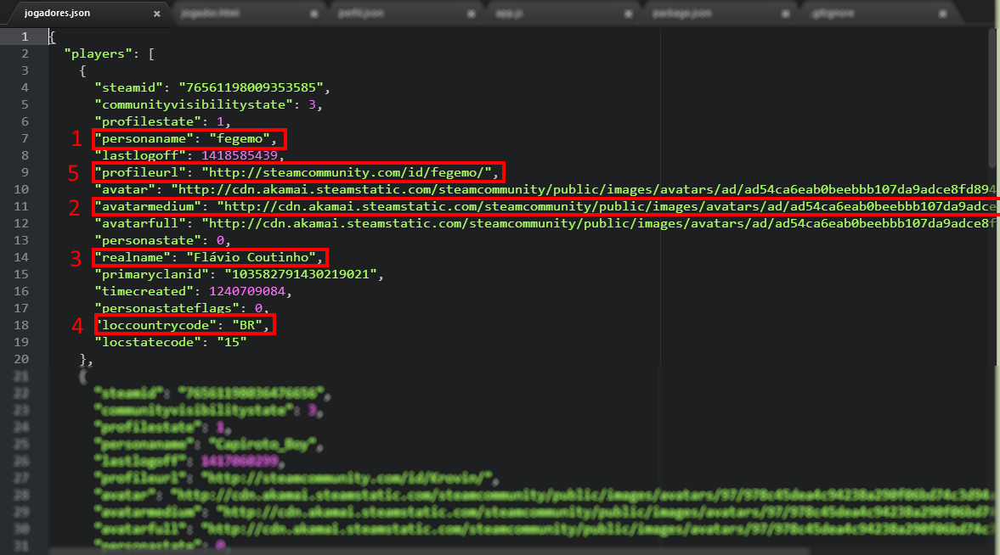
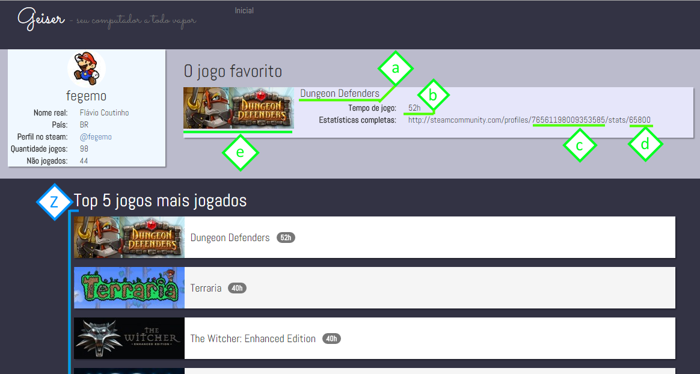

# Server Side - Parte 4

---
# Roteiro

1. Criando o <span style="font-family: Sacramento; font-size:120%">Geiser</span>
  - Parte 1 - configuração e servidor estático
  - Parte 2 - página inicial
  - Parte 3 - página de detalhes do jogador
1. O arquivo `package.json`
1. Renderizando com Handlebars
1. Programação funcional com Underscore

---
# Criando o <span style="font-family: Sacramento; font-size:120%;color:#333">Geiser</span>

---
## <span style="font-family: Sacramento; font-size:120%">Geiser<small> - seu computador a todo vapor</small></span>



- Veja funcionando: [http://geiser.herokuapp.com](http://geiser.herokuapp.com)

---
## <span style="font-family: Sacramento; font-size:120%">Geiser<small> - seu computador a todo vapor</small></span>

- É um pequeno sistema que mostra informações sobre o perfil de jogadores do
  [Steam](http://store.steampowered.com/), uma loja virtual de jogos de
  computador
- Há duas páginas:
  1. Página inicial, mostrando todos os jogadores
  1. Página de detalhes, mostrando os jogos mais jogados de um jogador (e
     outras informações)
- Baixe seu kit (_fork_ de http://github.com/fegemo/cefet-web-geiser) e comece
  já a implementar sua tarefa de hoje

---
# O arquivo **package.json**

- Um projeto em Node.js tipicamente possui um arquivo especial chamado
  `package.json`
  - Ele contém meta-informação sobre o projeto (autor, versão, descrição), bem
    como informação sobre as dependências do projeto de outros pacotes
- Na atividade de hoje, vamos usar:
  1. o [Express](http://expressjs.com) como nosso _web framework_
  1. algum _templating engine_ para renderizar html dinamicamente (e.g.,
    [Handlebars](http://http://handlebarsjs.com/))
  1. o [Underscore.js](http://underscorejs.org), que fornece utilidades típicas
     de linguagens funcionais para o Javascript e vai facilitar nossa vida hoje

---
## O arquivo **package.json** (cont.)

- Podemos criar um arquivo `package.json` em branco, mas vamos pedir auxílio ao
  `npm`. Após clonar seu _fork_, abra o terminal na pasta:
  ```
  $ npm init
  ```
  - O `npm` lhe fará algumas perguntas e você deve respondê-las. Ao final,
    você terá algo como:
    ```json
    {
      "name": "Geiser",
      "version": "0.1.0",
      "description": "Um visualizador de PCs fritando"
      ...
    }
    ```

---
## O arquivo **package.json** (cont.)

- Além das propriedades que o `npm` preencheu, outra bem importante é
  a `dependencies`, que lista que pacotes nosso projeto depende
  - Crie uma dependência do pacote express, última versão:
  ```json
      "dependencies": {
          "express": "latest"
      }
  }
  ```
- Agora, instale as dependências (criar a pasta `node_modules` com as
  dependências dentro). Como você tem um `package.json`, basta:
  ```
  $ npm install
  ```

---
# Parte 1 - configuração e servidor estático


- 
  Repare que o projeto já tem uma estrutura de diretórios e alguns arquivos
  criados:
  1. Pasta **`client`** com arquivos estáticos (css, js, imgs)
     - Os arquivos `.exemplo.html` são aqueles que devem se tornar dinâmicos
  1. Pasta `server` com arquivos dinâmicos do servidor, _views_ etc.
     - O ponto de entrada é **`app.js`**
     - `sever/data/` contém as informações que
       precisamos para tornar as páginas dinâmicas


---
## Parte 1 - configuração e servidor estático (cont.)

- Modifique o arquivo `server/app.js` para ativar um servidor estático
  - O servidor deve servir os arquivos da pasta `client/`
  - Passos:
    1. Use o _middleware_ ([`app.use`](http://expressjs.com/4x/api.html#app.use)) `express.static('caminho')`,
       especificando a pasta onde estão os arquivos estáticos
    1. "Abra" o servidor e o deixe escutando ([`app.listen`](http://expressjs.com/4x/api.html#app.listen)) em alguma porta
       maior que 1024
    1. Teste seu servidor executando:
        ```
        $ node server/app.js
        ```
        - E entrando em http://localhost:PORTA/index.exemplo.html

---
## Parte 1 - configuração e servidor estático (cont.)



---
# Parte 2 - página inicial

- A página inicial deve mostrar uma lista de todos os jogadores que temos no
  "banco de dados" (arquivo `data/jogadores.json`)
- Vamos precisar de um _templating engine_ para gerar html dinamicamente. Você
  pode usar [qualquer um suportado pelo Express](https://www.npmjs.org/package/consolidate).
  Nesta apresentação estamos usando `.hbs`
  1. Instalar o _templating engine_ escolhido via `npm`
     ```
     $ npm install hbs --save
     ```
     - Com o `--save`, o `npm` fará o _download_ do pacote para a
       pasta `node_modules` normalmente, porém também acrescentará o pacote
       instalado ao arquivo `package.json`

---
## Parte 2 - página inicial (cont.)

- Além de instalar, também precisamos configurar o express para usar o formato
  `.hbs`:
  ```js
  app.set('view engine', 'hbs');
  ```
- Vamos também carregar o arquivo `data/jogadores.json` na memória usando o
  módulo `fs` (file system)
  - Lembre-se que o módulo `fs` é da plataforma, então não precisamos
    instalá-lo pelo `npm`
  - Dica: você vai precisar **desserializar** o conteúdo do arquivo ao
    associá-lo a uma variável para poder acessá-lo como um objeto

---
## Parte 2 - página inicial (cont.)

- Configure a pasta onde o Express espera encontrar as _views_:
  ```js
  app.set('views', 'server/views');
  ```
- Crie uma rota ([`app.get`](http://expressjs.com/starter/basic-routing.html))
  para o caminho `"/"` que renderize ([`response.render`](http://expressjs.com/en/4x/api.html#res.render))
  a _view_ que está em `server/views/index.hbs` (nome: apenas `index`)
- Teste no navegador. Você deve conseguir ter o mesmo resultado de
  quando visualiza http://localhost:PORTA/

---
## Parte 2 - página inicial (cont.)

- Agora você deve alterar a _view_ `server/views/index.hbs` para torná-la
  dinâmica
- Use os comentários que estão no arquivo `server/views/index.hbs` para saber
  como mapear os campos do "banco de dados" para a interface
- Do [Handlebars](http://handlebarsjs.com/), você vai precisar:
  1. [Expressões](http://handlebarsjs.com/#getting-started)
  1. [Bloco `each`](http://handlebarsjs.com/builtin_helpers.html#iteration),
    para iterar no _array players_

---
# Parte 3 - página de detalhes do jogador

- Assim como para a página inicial, você deve criar, também, uma rota para a
  página de detalhes do jogador
  - Use o caminho `/jogador/:numero_identificador/`
  - Renderize a _view_ de nome `jogador`
  - Você deve fornecer informações de 3 fontes diferentes para a _view_:
    1. De `jogadores.json`
    1. De `jogosPorJogador.json`
    1. Calculadas

---
<a href="../../images/geiser-jogos1.png">
  
</a>

---
<a href="../../images/geiser-jogos1-json.png">
  
</a>

---
<a href="../../images/geiser-jogos2.png">
  
</a>

---
<a href="../../images/geiser-jogos2-json.png">
  
</a>

---
## Parte 3 - página de detalhes do jogador (cont.)

- Você vai precisar transformar alguns dados:
  1. Converter tempo jogado de minuto para hora
  1. Contabilizar a quantidade de jogos não jogados
  1. Ordenar por ordem decrescente de horas jogadas
- Para auxiliar, você pode usar uma biblioteca Javascript chamada
  underscore.js
  - Ela é apenas uma utilitária que contém diversas funções para se trabalhar
    com _arrays_, objetos e funções de maneira simples
- Para usar o underscore, instale-o via `npm` (lembre-se do `--save`)
- Para usar, tipicamente fazemos o `require` para uma variável com o nome `_`:
  ```js
  var _ = require('underscore');
  ```

---
## Underscore ([documentação](http://underscorejs.org/))

- Métodos úteis para a página de detalhes do jogador:
  1. Busca de elemento em um array ([`_.find`](http://underscorejs.org/#find)):
     ```js
     var jogosDesteJogador = _.find(todos, function(el) {
       return el.steamid === request.params.id;
     });
     ```
  1. Busca de todos elementos que batem um critério ([`_.where`](http://underscorejs.org/#where)):
    ```js
    var naoJogados = _.where(desteJogador,
      { playtime_forever: 0 });
    ```

---
## Underscore (cont.)

1. Ordenação ([`_.sortBy`](http://underscorejs.org/#sortBy)):
  ```js
  var ordenadoDesc = _.sortBy([5,4,6,1], function(el) {
    return -el;
  });
  ```
1. X primeiros ([`_.first`](http://underscorejs.org/#first)):
  ```js
  var primeiros10 = _.first(lista, 10);
  ```

---
## Parte 3 - página de detalhes do jogador (cont.)

- Ao passar o contexto de dados para a renderização da _view_, você deve
  fornecer todos os dados necessários
- Caso eles estejam em objetos diferentes, você vai precisar criar um outro
  objeto para englobá-los. Por exemplo:
  ```js
  response.render('jogador', {
    profile: jogadores[id],
    gameInfo: jogosDesteJogador,
    favorito: jogosDesteJogador[0]
  });
  ```
---
# Referências

1. Site oficial do [underscore.js](http://underscorejs.org)
1. Site oficial do [handlebars](http://http://handlebarsjs.com/)
1. Site oficial do [Express.js](http://expressjs.com)
