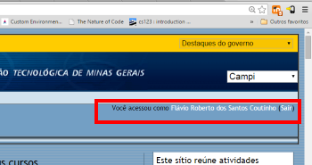
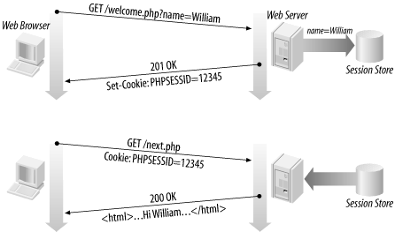
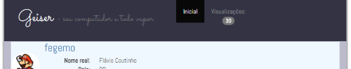

# Server Side - Parte 5

---
# Roteiro

1. _Cookies_
1. Sessões
1. Prática

---
# Motivação
---
## Interação cliente x servidor com estado

- 
  Alguns sites parecem lembrar que você passou por ele. Mas como eles fazem
  isso?
  - HTTP é um protocolo que **não armazena estado** (_stateless_)
    - Cada requisição/resposta **não armazena nenhum tipo de informação** de
      quem solicita
  - Um recurso dos navegadores chamado **_cookies_** possibilita o
    armazenamento de informações quando solicitado pelo servidor
    - Esse recurso é usado para a criação de **sessões de navegação**

---
# _Cookies_
---
## O que é um _cookie_?

- _cookie_: um pequeno objeto de informação enviado pelo servidor para o
  navegador e então enviado de volta para o servidor nas próximas
  requisições de páginas
- _cookies_ possuem várias utilidades:
  1. Autenticação
  1. Rastreamento de usuário
  1. Armazenamento de preferências de usuários, carrinhos de compra etc.
- A informação armazenada consiste de um par nome/valor, enviado no cabeçalho
  da requisição

---
## Como os _cookies_ são enviados

- 
  Quando o navegador solicita uma página, o **servidor pode enviar
  _cookies_** de volta
- Se o servidor já havia enviado _cookies_ para **o navegador**, este os **enviará
  de volta ao servidor** nas requisições seguintes
- Modelo alternativo: também é possível **criar e usar cookies** a partir **do lado
  cliente**, usando Javascript

---
## Mitos sobre _cookies_

- Mitos:
  - _Cookies_ são como vírus que podem apagar dados do disco
  - _Cookies_ são _spyware_ e podem roubar informação pessoal
  - _Cookies_ geram _popups_ e _spam_
  - _Cookies_ são usados apenas para propagandas
- Fatos:
  - _Cookies_ são apenas dados, e não código
  - _Cookies_ não podem apagar ou ler informação do computador
  - _Cookies_ são normalmente anônimos - não contêm informação pessoal
  - _Cookies_ **podem** ser usados para rastrear seus hábitos de visualização
    em um site em particular

---
## Um "_cookie_ de rastreamento"


- Uma empresa de anúncios envia um _cookie_ quando você visita um site e o vê
  novamente quando você visita outro site que também usa esses anúncios
- Assim, eles sabem que a mesma pessoa visitou os dois sites
- Pode ser corrigido dizendo-se ao navegador para não aceitar "_cookies_ de
  terceiros"

---
## Exemplo de uso de _cookie_ (1/5)

- Vamos criar uma página que guarda a informação sobre a língua de exibição
  - Que é inglês por padrão, mas pode ser alterada e deve ser mantida quando
    o usuário voltar
- Passos:
  - (1) Navegador **solicita** a página inicial:
     ```
     GET /index.html HTTP/1.1
     Host: www.ispeakmanymanylanguages.com
     ```

---
## Exemplo de uso de _cookie_ (2/5)

- (2) Servidor **responde**, definindo um _cookie_ com nome "`lang`" com o
   valor (padrão) "`english`":
   ```
   HTTP/1.1 200 OK
   Content-type: text/html
   <strong>Set-Cookie: lang=english</strong>

   (conteúdo da página)
   ```
   - O cabeçalho HTTP `Set-Cookie` serve para o servidor criar _cookies_
   - O servidor instruiu ao navegador a armazenar a propriedade `lang=english`
     em um _cookie_ para uso posterior
     - O navegador costuma salvar isso em um arquivo `.txt`

---
## Exemplo de uso de _cookie_ (3/5)

- (3) Navegador armazenou o _cookie_. Agora, o usuário navega para outra
  página do site e **o _cookie_ é enviado na requisição**:
  ```
  GET /promotions.html HTTP/1.1
  Host: www.ispeakmanymanylanguages.com
  <strong>Cookie: lang=english</strong>
  Accept: */*
  ```
  - Todas as páginas subsequentes serão mostradas em inglês, porque em toda
    nova requisição, **o navegador passa a enviar o cabeçalho `Cookie`**, que
    contém o _cookie_ criado pelo servidor para armazenar a língua selecionada

---
## Exemplo de uso de _cookie_ (4/5)

- (4) Usuário altera a língua para `"portuguese"`. A forma como nosso servidor
  de exemplo possibilita isso é através de uma **requisção** GET para
  `/changeLanguage?l=portuguese`:
  ```
  GET <strong>/changeLanguage?l=portuguese</strong> HTTP/1.1
  Host: www.ispeakmanymanylanguages.com
  Cookie: lang=english
  ```

---
## Exemplo de uso de _cookie_ (5/5)

- (5) Recebendo esta mensagem, o servidor **responde** com a página inicial
  já em português e com um novo `Set-Cookie` para sobrescrever
  o _cookie_ `lang`:
  ```
  HTTP/1.1 200 OK
  Content-type: text/html
  <strong>Set-Cookie: lang=portuguese</strong>

  (conteúdo da página em Português)
  ```

---
## Quanto tempo um _cookie_ vive?

- _Cookie_ de **sessão**: o tipo padrão; um _cookie_ temporário que fica
  gravado apenas na memória do navegador
  - Quando o navegador fecha, os _cookies_ temporários são apagados
  - Mais seguros: nenhum programa (exceto o navegador) pode acessá-los
- _Cookie_ **persistente**: fica armazenado em arquivo no computador do cliente
  - Pode armazenar informação a longo prazo
  - Menos seguro: usuários (ou qualquer programa) podem abrir os arquivos dos
    _cookies_, ver/alterar valores etc.

---
## Consertando nosso exemplo (1/2)

- No nosso exemplo, criamos um _cookie_ de sessão, que é a forma padrão
  - Mas queremos criar um _cookie_ persistente para manter a língua
    selecionada mesmo depois que o navegador seja fechado
  - Para isso, além de `nome=valor`, os _cookies_ possuem **outros atributos
    que podem ser definidos**:
    1. **`Expires`, `Max-Age`**, define até quando o _cookie_ deve persistir
    1. `Domain`, `Path`
    1. `Secure`
    1. `HttpOnly`

---
## Consertando nosso exemplo (2/2)

- Ao incluir o atributo `Expires` ou `Max-Age` no cabeçalho `Set-Cookie`,
  dizemos ao navegador para criar um _cookie_ **persistente**
  - `Expires` define a data em que o navegador deve excluir o _cookie_
  - `Max-Age` define um valor em milissegundos a partir de quando o navegador
    deve excluir o _cookie_
- Para consertar, o servidor deve enviar o `Set-Cookie` do passo 5:
  ```
  HTTP/1.0 200 OK
  Content-type: text/html
  Set-Cookie: lang=portuguese<strong>; Expires=Wed, 01-Jan-2020 00:00:00 GMT</strong>

  (conteúdo da página)
  ```

---
# Cookies no Express.js

---
## Definindo _cookies_ no Express.js (1/2)

- Como vimos, o servidor deve apenas inserir um cabeçalho `Set-Cookie` para
  instruir o navegador a criar um _cookie_. No Express.js:
  ```js
  app.get('/changeLanguage', function(req, res) {
    // pega parâmetro com nome "lang" da querystring
    var desiredLang = req.params.lang;
    // inclui o cabeçalho Set-Cookie "lang=%%%;Expires=Wed..."
    res.cookie('lang', desiredLang, { expires: 'Wed...' });
    // redireciona para a rota index
    res.redirect('index',);
  });
  app.get('/', function(req, res) { // usa cookie ou 'english'
    res.render('index', {lang: req.cookies.lang || 'english'});
  });
  ```

---
## Definindo _cookies_ no Express.js (2/2)

- Como o Express.js é extremamente modular (por meio dos _middlewares_),
  para que um servidor utilize os _cookies_ enviados nas requisições HTTP,
  é necessário usar o _middleware_ [`cookie-parser`](https://github.com/expressjs/cookie-parser):
  ```js
  var express      = require('express');
  var cookieParser = require('cookie-parser');
  var app = express();
  app.use(cookieParser());
  ```
  - Ele processará o cabeçalho `Cookie` das requisições e populará
    `res.cookies` com os _cookies_ presentes
    ```
    $ npm i --save cookie-parser
    ```

---
# Sessões

---
## O que é uma sessão?

- **sessão**: conceito abstrato que representa **uma série de requisições
  e respostas HTTP** entre um navegador e um servidor
- O protocolo HTTP não conhece o conceito de sessão (ele é _stateless_), mas linguagens de
  programação para Web sim (Express.js, PHP, ASP.NET, Java etc.)
- sessões _vs._ _cookies_:
  - Um _cookie_ é um dado armazenado no cliente
  - Os dados de uma sessão são armazenados no servidor
- **Sessões são normalmente criadas usando _cookies_**
  - A única informação guardada pelo cliente é um _cookie_ contendo um
    **identificador único de sessão**
  - A cada requisição, o cliente envia o _cookie_ de sessão e o servidor o
    utiliza para recuperar as informações da sessão do cliente

---
## Como sessões são estabelecidas

1. O navegador faz requisição inicial ao servidor
1. Servidor guarda o endereço IP/navegador do cliente, gera um identificador
   único de sessão e envia um _cookie_ de volta
   - 
     Em PHP, esse _cookie_ tem o nome `PHPSESSID`
   - Em Java, `JSESSIONID`
   - Express.js, **`connect.sid`**
1. O cliente envia o mesmo ID da sessão de volta ao servidor
1. Servidor usa o ID recebido para recuperar os dados da sessão do cliente

---
## Sessões no Express.js (1/2)

- Assim como com _cookies_, é necessário dizer ao Express.js que queremos usar
  sessões
  - Para isso, incluímos o [_middleware_ de sessões](https://github.com/expressjs/session):
    ```js
    var app = require('express')();
    var session = require('express-session');
    app.use(session({
      secret: 'octocats and octodogs'
    }));
    ```
    - A opção `secret` é uma string usada para criar um _hash_ do valor do
      _cookie_ de sessão, como uma medida de segurança
      ```
      $ npm i --save express-session
      ```

---
## Sessões no Express.js (2/2)

- Para **armazenar algum dado** referente a uma sessão, usamos **o objeto
  `req.session`**:
  ```js
  app.get('/', function(req, res) {
    if (req.session.views) {  // contador de vis. nesta sessão
      req.session.views++;
      res.setHeader('Content-Type', 'text/html');
      res.write('<p>views: ' + req.session.views + '</p>');
      res.end();
    } else {
      req.session.views = 1;
      res.end('welcome to the session demo. refresh!');
    }
  });
  ```

---
# Adendos

---
## _web storage_ vs _cookies_

- _local storage_, _session storage_ e _cookies_ servem para armazenar
  informações no navegador
- Contudo, apenas os _cookies_ são enviados nas requisições HTTP para o
  servidor
  - _web storage_ é um recurso puramente do navegador e o protocolo HTTP não
    tem nenhum acesso a ele
- Portanto, para manter uma sessão entre cliente e servidor, **ainda precisamos
  dos _cookies_** ;)
- Ademais, **_cookies_ surgiram 1996-1997** (Netscape) e _Web Storage_ é uma API
  do HTML5 (2009+)
---
# Exercício

---
## Exercício

1. Modifique o programa que você criou na última aula (Geiser) de forma que ele
   faça uma contagem das visualizações de página realizadas durante a sessão
   - Você deve mostrar a contagem no topo da página inicial:

     
   - Caso você não tenha feito ou terminado o exercício da aula passada,
     [clone ele pronto](https://github.com/fegemo/cefet-web-geiser-session)

---
## Exercício

- Enviar via **Moodle** o link do seu repositório até o final **desta aula**

---
# Referências

1. Seções 7.1, 7.2 e 9.1 do livro "Node.js in Action"
