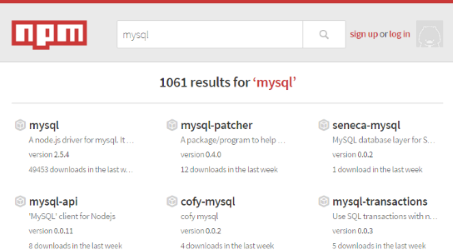
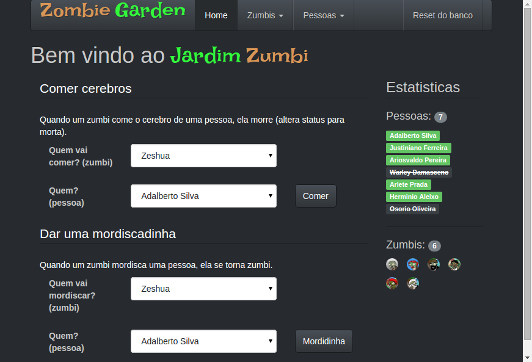

# Server Side - Parte 6

---
# Roteiro

1. SGBDs
  1. MySQL
1. Arquiteturas REST
1. Entrando no 

---
# Sistemas de Gerenciamento de Bancos de Dados

---
## SGBDs relacionais

- Possibilitam o fácil armazenamento e busca de informação complexa
- Tradicionalmente usados para aplicações de alta qualidade como:
  1. Gerenciadores de conteúdo (CMS)
  1. Gerenciadores de relação com cliente (CRM)
  1. Carrinhos de compra
- Requerem o uso de SQL

*[CMS]: Content Management System*
*[CRM]: Customer Relationship Manager*
*[SQL]: Structured Query Language*
---
# MySQL

---
## MySQL

- É o SGBD mais popular
- Há conectores feitos pela comunidade Node.js para o MySQL
  - O pacote mais usado é chamado "mysql":
    

---
## O pacote "mysql"


- Melhor ainda do que `npm install mysql` é:
  ```
  $ npm install mysql --save
  ```
  - Porque ele salva no arquivo `package.json` que o projeto depende
    do pacote `mysql`

---
## Primeiros passos

```js
var mysql = require('mysql');
var connection = mysql.createConnection({
  host: 'localhost',
  user: 'me',
  password: 'secret'
});

connection.connect();

// chamada assíncrona (retorno via callback)
// para conseguirmos non-blocking I/O - woot woot
connection.query('SELECT * FROM meals', function(err, rows) {
  console.log('First meal is: ', rows[0].mealName);
});
connection.end();
```

---
## Fazendo consultas

- As consultas são feitas por meio do método
  **`connection.query(query, callback)`**, em que:
  - `query` é uma `string` contendo uma consulta SQL
  - `callback` é uma função que é invocada quando do término da consulta. Ela
    possui 2 parâmetros:
    1. **`err`**, contendo uma descrição de um eventual erro que possa
      ter ocorrido - ou `null`, caso não haja erro
    1. **`result`**, um `Array` em que cada elemento é um registro do resultado da
       consulta

---
## Fazendo consultas

- Exemplo:
  ```js
  connection.query('SELECT name, time FROM meals',
    function(err, result) { // itera o array 'result'
      result.forEach(function(meal) {
        console.log(meal.time + ' - ' + meal.name);
      });
    }
  );
  ```
- Saída:
  <ul class="multi-column-list-3">
    <li style="font-size: 0.7em">07:00 - Breakfast</li>
    <li style="font-size: 0.7em">09:00 - Snd Breakfast</li>
    <li style="font-size: 0.7em">11:00 - Elevensies</li>
    <li style="font-size: 0.7em">13:00 - Luncheon</li>
    <li style="font-size: 0.7em">16:00 - Afternoon Tea</li>
    <li style="font-size: 0.7em">18:00 - Dinner</li>
    <li style="font-size: 0.7em">20:00 - Supper</li>
  </ul>

---
## Inserindo um registro

- Também é usado o método `connection.query(query, callback)`
- A diferença está no 2º argumento da `callback`: `result.affectedRows` tem
  o número de registros afetados na operação e `result.insertId` o código de
  auto-incremento do registro.
- Exemplo:
  ```js
  db.query('INSERT INTO food (id, name) VALUES (NULL, "Tea")',
    function(err, result) {
      console.log('Number of food added: ' +
                   result.affectedRows +
                   ' with id = ' + result.insertId);
    }
  );
  ```

---
## Excluindo um registro

- Totalmente análogo à inserção de registro.
- Exemplo:
  ```js
  db.query('DELETE FROM food WHERE id = ' selectedFoodId,
    function(err, result) {
      console.log('Number of food deleted: ' +
                   result.affectedRows);
    }
  );
  ```

---
## Atualizando um registro

- Análogo à inserção e exclusão de registro.
- O 2º argumento da `callback` possui `result.changedRows` com o número de
  registros alterados.
- Exemplo:
  ```js
  db.query('UPDATE food SET name="bad"'
    + 'WHERE name LIKE "%elvish%',
    function(err, result) {
      console.log('Number of food items updated: ' +
                   result.changedRows);
    }
  );
  ```

---
# Arquiteturas REST

---
## Propriedades

- Os dados são vistos como um **recurso HTTP** (assim como uma imagem,
  uma página HTML etc.)
  - Cada informação exposta pelo banco de dados tem uma URL
  - Operações (buscar, excluir, atualizar etc.) são realizadas
    na informação usando verbos HTTP (`GET, DELETE, POST` etc.)
- _Stateless_ (sem estado)
  - Nenhum contexto é armazenado após o atendimento
    de uma requisição
- "Cacheável"
  - Clientes podem guardar as respostas, se interessante
- Uniformidade de interface
  - As operações e as URLs são padronizadas e fáceis de infereir

---
## Uma API REST

- <abbr title="Application Programming Interface">API</abbr>:
  Conjunto de métodos públicos de um programa
- API REST: Conjunto de métodos públicos expostos por meio de
  um _web service_ na arquitetura REST
- Como fazer?
  1. **Identifique os recursos** de dados do BD
  1. **Identifique as operações sobre recursos** que são permitidas
  1. **Implemente os métodos** para cada recurso, respondendo
     possivelmente em vários formatos (`.html, .json, .xml`)

---
## Exemplo de API REST (1/5)

- Vamos criar uma API REST de acesso ao banco de dados
  de um **cemitério zumbi <u>fictício</u>**
- Veja o banco de dados:

  

---
## Exemplo de API REST (2/5)

- Recursos:
  1. Zumbi (`/zombies/`)
  1. Pessoa (`/people/`)
- Métodos:
  1. Lista todas as pessoas (e.g., `GET /people/`)
  1. Lista todos os zumbis (e.g., `GET /zombies/`)
  1. Detalhes do zumbi (e.g., `GET /zombies/8`)
  1. Zumbi converte pessoa em zumbi (e.g., `POST /zombies/brains/`)
  1. Pessoa se vai (e.g., `DELETE /people/4`)

---
## Exemplo de API REST (3/5)

- Usando express, podemos definir as rotas usando verbos HTTP:
  Vamos definir o método que **lista todas as pessoas**:
  ```js
  app.get('/people/', function(req, res) {
    connection.query('SELECT * FROM person',
      function(err, result){
        res.render('listOfPeople', { pessoas: result });
    });
  });
  ```

---
## Exemplo de API REST (4/5)

- A rota para listar todos os zumbis é análoga. Vamos agora mostrar
  **o detalhamento de um zumbi**:
  ```js
  app.get('/zombies/:id', function(req, res) {
    var id = connection.escape(req.params.id);
    var query = 'SELECT * FROM zombie WHERE id = ' + id;
    connection.query(query, function(err, result) {
      if (err) { res.send(404, "Zumbi inexistente"); }
      else { res.render('detailOfZombie', { zumbi: result }); }
    });
  });
  ```

---
## Exemplo de API REST (5/5)

- O método para **excluir um Zumbi**:
  ```js
  app.delete('/zombies/:id', function(req, res) {
    var id = connection.escape(req.params.id);
    var query = 'DELETE FROM zombie WHERE id = ' + id;
    connection.query(query, function(err, result) {
      if (err)  { res.send(401, 'Zumbi inexistente'); }
      else      { res.redirect('/zombies/'); }
    });
  });
  ```

---
# Entrando no 

---
## O Zombie Garden



---
## Descrição

- O  é um simulador de jardins-infestados-por-zumbis-de-noite-mas-que-de-dia-as-pessoas-frequentam
- O programa já possui quase todas as funcionalidades implementadas, exceto:
  1. A rota e a lógica de banco para **excluir uma pessoa**
  1. A rota e a lógica de banco para **adicionar uma pessoa**
- Seu trabalho é implementar as duas funcionalidades faltantes

---
## Enunciado

1. Crie um _fork_ do repositório [cefet-web-zombie-garden](https://github.com/fegemo/cefet-web-zombie-garden) no GitHub e clone-o
1. Siga as instruções de execução descritas no `README.md` do projeto
1. Suas alterações devem ser feitas apenas no arquivo `router/people.js`, que
   descreve as rotas que começam com `/people/`
1. Você deve entregar o link do seu repositório completamente implementado
   **via Moodle** até a próxima aula

---
# Referências

1. Documentação do [node-mysql](https://github.com/felixge/node-mysql/)
1. Seções 5.2 do livro "Node.js in Action"
